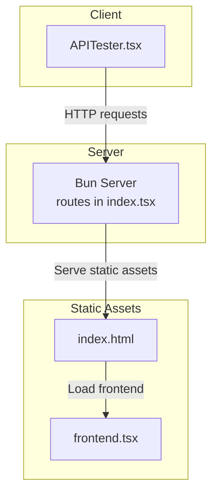
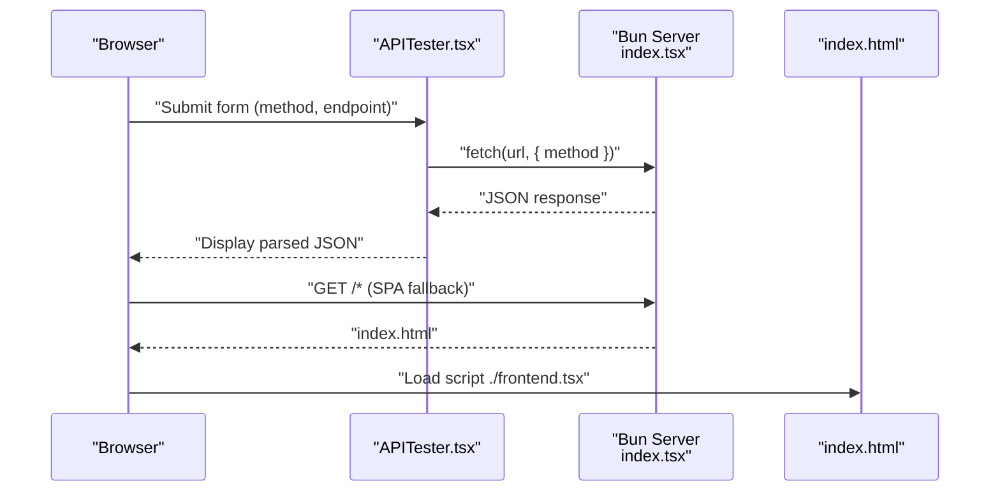
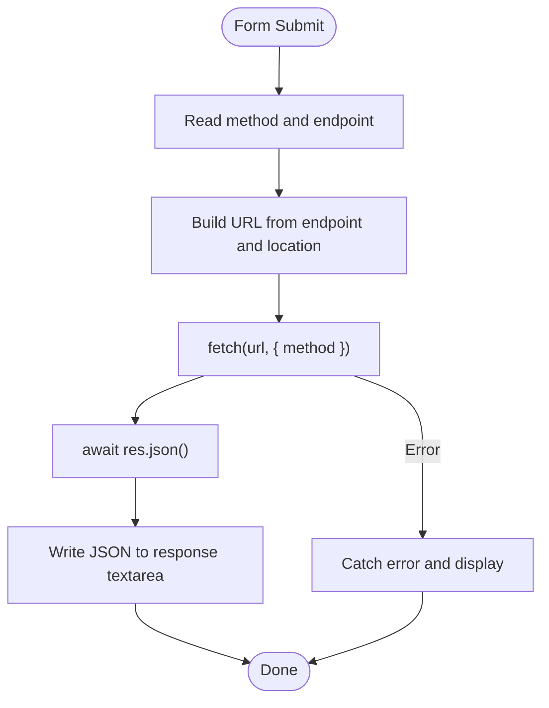
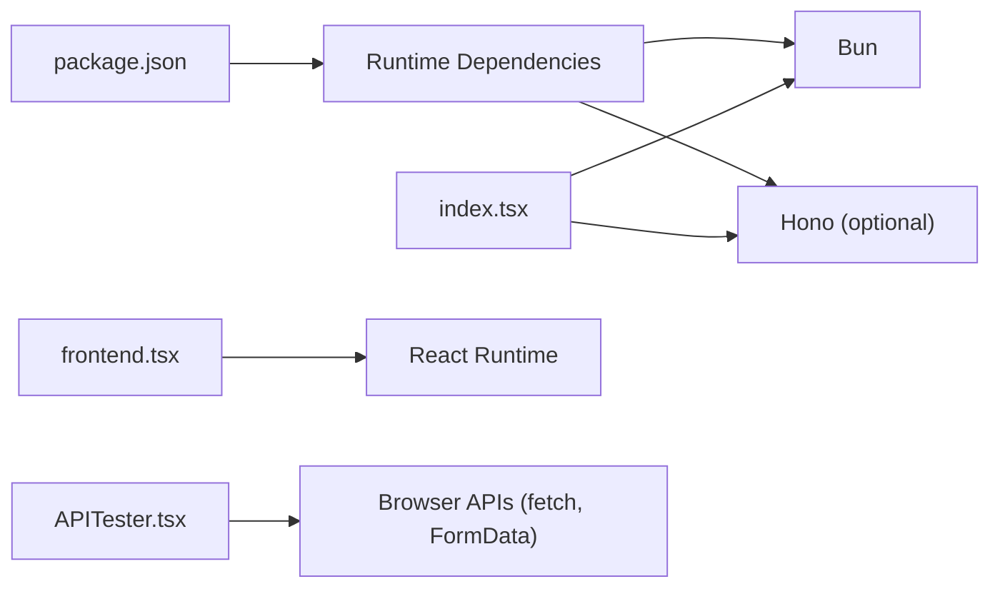

# API Reference

<cite>
**Referenced Files in This Document**
- [index.tsx](file://src/index.tsx)
- [APITester.tsx](file://src/APITester.tsx)
- [index.html](file://src/index.html)
- [frontend.tsx](file://src/frontend.tsx)
- [package.json](file://package.json)
- [bunfig.toml](file://bunfig.toml)
- [README.md](file://README.md)
</cite>

## Table of Contents
1. [Introduction](#introduction)
2. [Project Structure](#project-structure)
3. [Core Components](#core-components)
4. [Architecture Overview](#architecture-overview)
5. [Detailed Component Analysis](#detailed-component-analysis)
6. [Dependency Analysis](#dependency-analysis)
7. [Performance Considerations](#performance-considerations)
8. [Troubleshooting Guide](#troubleshooting-guide)
9. [Conclusion](#conclusion)
10. [Appendices](#appendices)

## Introduction
This document provides a complete API reference for the RESTful endpoints exposed by the Bun server. It covers:
- Endpoint definitions and HTTP methods
- URL patterns and path parameters
- Request and response schemas
- Example requests and responses
- Error handling and status codes
- Client-side consumption via the APITester component
- Client implementation guidelines (curl and JavaScript fetch)
- Security considerations, rate limiting, and versioning strategy

## Project Structure
The API is implemented in a single Bun server file and served alongside a static HTML page and a minimal React frontend. The server exposes three endpoints under the /api/hello namespace.

**Diagram sources**
- [index.tsx](file://src/index.tsx#L1-L42)
- [index.html](file://src/index.html#L1-L14)
- [frontend.tsx](file://src/frontend.tsx#L1-L27)
- [APITester.tsx](file://src/APITester.tsx#L1-L40)

**Section sources**
- [index.tsx](file://src/index.tsx#L1-L42)
- [index.html](file://src/index.html#L1-L14)
- [frontend.tsx](file://src/frontend.tsx#L1-L27)

## Core Components
- Bun server with route handlers for /api/hello and /api/hello/:name
- Static HTML serving for SPA fallback
- Minimal React frontend entry point
- APITester component for client-side API testing

Key implementation references:
- Server routes and handlers: [index.tsx](file://src/index.tsx#L1-L42)
- APITester form submission and fetch: [APITester.tsx](file://src/APITester.tsx#L1-L40)
- Frontend entry point: [frontend.tsx](file://src/frontend.tsx#L1-L27)
- Static HTML: [index.html](file://src/index.html#L1-L14)

**Section sources**
- [index.tsx](file://src/index.tsx#L1-L42)
- [APITester.tsx](file://src/APITester.tsx#L1-L40)
- [frontend.tsx](file://src/frontend.tsx#L1-L27)
- [index.html](file://src/index.html#L1-L14)

## Architecture Overview
The server exposes REST endpoints and serves a static SPA. The APITester component demonstrates client-side consumption by sending HTTP requests and parsing JSON responses.

**Diagram sources**
- [APITester.tsx](file://src/APITester.tsx#L1-L40)
- [index.tsx](file://src/index.tsx#L1-L42)
- [index.html](file://src/index.html#L1-L14)

## Detailed Component Analysis

### Endpoint: GET /api/hello
- Method: GET
- URL Pattern: /api/hello
- Description: Returns a greeting with method metadata
- Response Schema:
  - message: string
  - method: string
- Example Response:
  {
    "message": "Hello, world!",
    "method": "GET"
  }

Status Codes:
- 200 OK on success

Error Handling:
- No explicit error handling shown in the route; typical server errors would return 5xx responses

**Section sources**
- [index.tsx](file://src/index.tsx#L9-L15)

### Endpoint: PUT /api/hello
- Method: PUT
- URL Pattern: /api/hello
- Description: Same response format as GET
- Response Schema:
  - message: string
  - method: string
- Example Response:
  {
    "message": "Hello, world!",
    "method": "PUT"
  }

Status Codes:
- 200 OK on success

Error Handling:
- No explicit error handling shown in the route; typical server errors would return 5xx responses

**Section sources**
- [index.tsx](file://src/index.tsx#L16-L21)

### Endpoint: GET /api/hello/:name
- Method: GET
- URL Pattern: /api/hello/:name
- Path Parameter:
  - name: string (required)
- Description: Returns a personalized greeting using the path parameter
- Response Schema:
  - message: string
- Example Response:
  {
    "message": "Hello, Alice!"
  }

Status Codes:
- 200 OK on success
- 404 Not Found if route does not match (handled by Bun’s routing)

Error Handling:
- Route not matched returns 404
- No explicit error handling shown in the route; typical server errors would return 5xx responses

**Section sources**
- [index.tsx](file://src/index.tsx#L23-L29)

### Client-Side Consumption: APITester.tsx
The APITester component demonstrates how clients consume the API:
- Reads form data for method and endpoint
- Constructs a URL from the endpoint and current location
- Sends an HTTP request using fetch
- Parses the JSON response and displays it in a textarea
- Handles exceptions by displaying error messages

**Diagram sources**
- [APITester.tsx](file://src/APITester.tsx#L1-L40)

**Section sources**
- [APITester.tsx](file://src/APITester.tsx#L1-L40)

## Dependency Analysis
- Bun runtime powers the server and routing
- Static HTML and frontend entry point serve the SPA
- APITester depends on browser fetch and FormData APIs

**Diagram sources**
- [package.json](file://package.json#L1-L31)
- [index.tsx](file://src/index.tsx#L1-L42)
- [frontend.tsx](file://src/frontend.tsx#L1-L27)
- [APITester.tsx](file://src/APITester.tsx#L1-L40)

**Section sources**
- [package.json](file://package.json#L1-L31)
- [index.tsx](file://src/index.tsx#L1-L42)
- [frontend.tsx](file://src/frontend.tsx#L1-L27)
- [APITester.tsx](file://src/APITester.tsx#L1-L40)

## Performance Considerations
- Bun’s native runtime provides fast startup and execution for small servers
- Static asset serving is efficient for SPA fallback
- JSON serialization/deserialization is lightweight for these endpoints

[No sources needed since this section provides general guidance]

## Troubleshooting Guide
Common issues and resolutions:
- 404 Not Found: Ensure the endpoint path matches exactly (/api/hello or /api/hello/:name)
- CORS errors: When consuming from browsers, ensure the server allows cross-origin requests if needed
- JSON parse errors: Verify the response is valid JSON before parsing
- Development vs production: Confirm the server is running in the intended mode

Environment and scripts:
- Development server: [README.md](file://README.md#L9-L13)
- Production run: [README.md](file://README.md#L15-L19)
- Runtime environment: [bunfig.toml](file://bunfig.toml#L15-L17)

**Section sources**
- [README.md](file://README.md#L9-L19)
- [bunfig.toml](file://bunfig.toml#L15-L17)

## Conclusion
The Bun server exposes three simple, consistent REST endpoints under /api/hello. Responses include a message field and, for the base endpoints, a method field. The APITester component demonstrates straightforward client consumption using fetch. The project is configured for quick development and production runs with Bun.

[No sources needed since this section summarizes without analyzing specific files]

## Appendices

### API Definitions

- GET /api/hello
  - Method: GET
  - Response: { message: string, method: string }
  - Example: { "message": "Hello, world!", "method": "GET" }

- PUT /api/hello
  - Method: PUT
  - Response: { message: string, method: string }
  - Example: { "message": "Hello, world!", "method": "PUT" }

- GET /api/hello/:name
  - Method: GET
  - Path Parameter: name (string)
  - Response: { message: string }
  - Example: { "message": "Hello, Alice!" }

Status Codes:
- 200 OK for successful requests
- 404 Not Found for unmatched routes
- 5xx for server errors

**Section sources**
- [index.tsx](file://src/index.tsx#L9-L29)

### Client Implementation Guidelines

- Using curl:
  - GET /api/hello
    curl -X GET http://localhost:PORT/api/hello
  - PUT /api/hello
    curl -X PUT http://localhost:PORT/api/hello
  - GET /api/hello/Alice
    curl -X GET http://localhost:PORT/api/hello/Alice

- Using JavaScript fetch:
  - GET /api/hello
    fetch("/api/hello", { method: "GET" })
      .then(res => res.json())
      .then(data => console.log(data));
  - PUT /api/hello
    fetch("/api/hello", { method: "PUT" })
      .then(res => res.json())
      .then(data => console.log(data));
  - GET /api/hello/:name
    const name = "Alice";
    fetch(`/api/hello/${name}`, { method: "GET" })
      .then(res => res.json())
      .then(data => console.log(data));

Notes:
- Replace PORT with the actual server port
- Add headers if authentication is introduced later

**Section sources**
- [APITester.tsx](file://src/APITester.tsx#L1-L40)
- [index.tsx](file://src/index.tsx#L1-L42)

### Security Considerations
- Authentication: None implemented; consider adding token-based or session-based auth for production
- CORS: Configure allowed origins and methods if serving from different hosts
- Input validation: Validate and sanitize the :name parameter to prevent injection
- HTTPS: Use TLS termination in front of the server for secure transport

[No sources needed since this section provides general guidance]

### Rate Limiting Strategy
- Implement per-IP or per-token limits using middleware or a proxy
- Consider burst control and sliding windows
- Log and alert on unusual spikes

[No sources needed since this section provides general guidance]

### Versioning Strategy
- URL versioning: /api/v1/hello
- Header versioning: Accept: application/vnd.company.v1+json
- Deprecation policy: Announce deprecation timelines and migration guides

[No sources needed since this section provides general guidance]