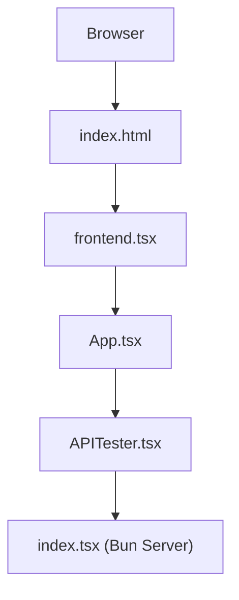
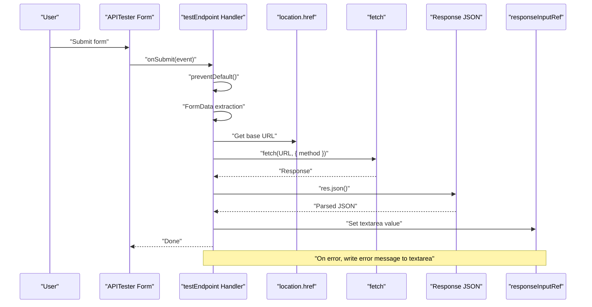
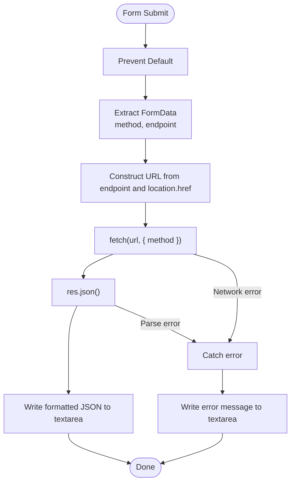
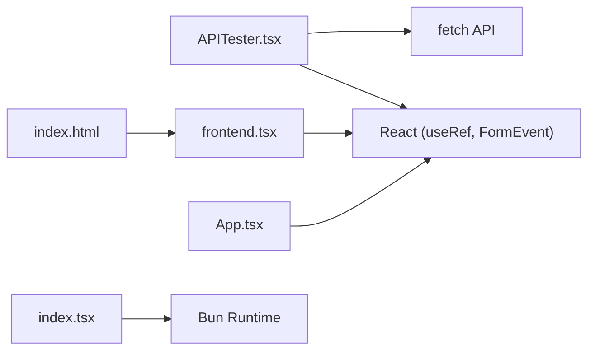

# Client Integration Guide

<cite>
**Referenced Files in This Document**
- [APITester.tsx](file://src/APITester.tsx)
- [index.tsx](file://src/index.tsx)
- [index.html](file://src/index.html)
- [frontend.tsx](file://src/frontend.tsx)
- [index.css](file://src/index.css)
- [README.md](file://README.md)
- [package.json](file://package.json)
</cite>

## Table of Contents
1. [Introduction](#introduction)
2. [Project Structure](#project-structure)
3. [Core Components](#core-components)
4. [Architecture Overview](#architecture-overview)
5. [Detailed Component Analysis](#detailed-component-analysis)
6. [Dependency Analysis](#dependency-analysis)
7. [Performance Considerations](#performance-considerations)
8. [Troubleshooting Guide](#troubleshooting-guide)
9. [Conclusion](#conclusion)
10. [Appendices](#appendices)

## Introduction
This guide documents a reference client-side API integration pattern implemented by the APITester component. It demonstrates how to build a simple UI that allows users to select an HTTP method, enter a target endpoint URL, and view the resulting JSON response. The implementation focuses on:
- Form submission handling with onSubmit
- Extracting form data using FormData
- Constructing a full URL from user input and the current location
- Using the fetch API with method selection
- Managing response display via a ref
- Capturing and displaying errors during network or parsing failures
- Providing guidance for external applications to adopt similar patterns

## Project Structure
The project is a small React application served by a Bun server. The APITester component resides in the frontend code and integrates with a local API route for demonstration.

**Diagram sources**
- [index.html](file://src/index.html#L1-L14)
- [frontend.tsx](file://src/frontend.tsx#L1-L27)
- [App.tsx](file://src/App.tsx#L1-L206)
- [APITester.tsx](file://src/APITester.tsx#L1-L40)
- [index.tsx](file://src/index.tsx#L1-L42)

**Section sources**
- [index.html](file://src/index.html#L1-L14)
- [frontend.tsx](file://src/frontend.tsx#L1-L27)
- [App.tsx](file://src/App.tsx#L1-L206)
- [APITester.tsx](file://src/APITester.tsx#L1-L40)
- [index.tsx](file://src/index.tsx#L1-L42)

## Core Components
- APITester: A React functional component that renders a form with method selection, endpoint input, and a submit button. It manages response display via a ref and performs a fetch request on submit.
- index.tsx (Server): Provides a development server with routes for serving the SPA and a demo API (/api/hello with GET and PUT handlers).
- frontend.tsx: Bootstraps the React app and mounts the root element.
- index.html: Minimal HTML shell that includes the root element and the frontend entry script.

Key responsibilities:
- APITester handles form submission, constructs the URL, performs the fetch, parses JSON, and updates the response textarea.
- The server exposes a simple API for testing and serves the SPA for all routes.

**Section sources**
- [APITester.tsx](file://src/APITester.tsx#L1-L40)
- [index.tsx](file://src/index.tsx#L1-L42)
- [frontend.tsx](file://src/frontend.tsx#L1-L27)
- [index.html](file://src/index.html#L1-L14)

## Architecture Overview
The client-side integration uses a straightforward fetch flow:
- User submits the form
- The handler prevents default, extracts FormData, selects method and endpoint
- Constructs a URL using the endpoint and current location
- Calls fetch with the selected method
- Parses the response as JSON and writes it to a textarea via a ref
- On error, writes the error message to the textarea

**Diagram sources**
- [APITester.tsx](file://src/APITester.tsx#L1-L40)

## Detailed Component Analysis

### APITester Component
The APITester component encapsulates the entire client-side API testing flow. It:
- Declares a ref for the response textarea
- Defines an onSubmit handler that:
  - Prevents the default form submission
  - Extracts FormData from the form
  - Reads the selected method and endpoint input
  - Constructs a URL using the endpoint and current location
  - Performs a fetch with the chosen method
  - Parses the response as JSON and writes it to the textarea
  - Catches errors and writes them to the textarea

Implementation highlights:
- Form handling: The component listens to onSubmit and uses preventDefault to keep the page interactive.
- FormData extraction: Uses FormData to read named inputs (method and endpoint).
- Dynamic URL construction: Uses the URL constructor with endpoint and location.href to resolve relative paths against the current origin.
- Fetch usage: Calls fetch with the method option and awaits the response.
- Response parsing: Calls res.json() and writes formatted JSON to the textarea.
- Error handling: Catches exceptions and writes the error message to the textarea.

**Diagram sources**
- [APITester.tsx](file://src/APITester.tsx#L1-L40)

**Section sources**
- [APITester.tsx](file://src/APITester.tsx#L1-L40)

### Server Routes and API Endpoints
The server defines:
- A catch-all route that serves index.html for all unmatched paths (SPA routing)
- A /api/hello route with GET and PUT handlers returning JSON responses
- A parameterized route /api/hello/:name that returns a JSON greeting

These routes support the APITester by providing endpoints that can be invoked with different methods.

**Section sources**
- [index.tsx](file://src/index.tsx#L1-L42)

### Application Entry and Rendering
- index.html provides the root element and loads the frontend entry script.
- frontend.tsx creates the root and renders the App component.
- App.tsx is the main application shell; APITester is embedded within it.

**Section sources**
- [index.html](file://src/index.html#L1-L14)
- [frontend.tsx](file://src/frontend.tsx#L1-L27)
- [App.tsx](file://src/App.tsx#L1-L206)

### Styling Considerations
The APITester UI relies on styles defined in index.css. These styles define layout, colors, and responsive behavior for the form, inputs, buttons, and the response textarea.

**Section sources**
- [index.css](file://src/index.css#L90-L188)

## Dependency Analysis
External libraries and runtime:
- React: Used for component rendering and hooks (useRef, FormEvent).
- Bun runtime: Provides the server and development features (HMR, console echo).
- No third-party HTTP clients are used; the native fetch API is sufficient for this example.

**Diagram sources**
- [APITester.tsx](file://src/APITester.tsx#L1-L40)
- [index.tsx](file://src/index.tsx#L1-L42)
- [frontend.tsx](file://src/frontend.tsx#L1-L27)
- [index.html](file://src/index.html#L1-L14)

**Section sources**
- [package.json](file://package.json#L1-L31)
- [APITester.tsx](file://src/APITester.tsx#L1-L40)
- [index.tsx](file://src/index.tsx#L1-L42)

## Performance Considerations
- Minimize unnecessary re-renders: The APITester component is lightweight and only updates the textarea via a ref, avoiding state churn.
- Avoid blocking the UI thread: The fetch call is awaited asynchronously, keeping the UI responsive.
- Network efficiency: Responses are parsed as JSON and displayed immediately; consider adding loading indicators for long-running requests.
- URL resolution: Using the URL constructor ensures robust handling of relative and absolute paths.

[No sources needed since this section provides general guidance]

## Troubleshooting Guide
Common issues and resolutions:
- Blank response: Ensure the endpoint returns valid JSON. Non-JSON responses will cause parse errors.
- CORS errors: When testing against external domains, ensure the server includes appropriate CORS headers.
- Invalid URL: Relative endpoints are resolved against the current origin; verify the endpoint path and server route availability.
- Network failures: The handler writes error messages to the textarea; inspect the message for details.

Recommended checks:
- Verify the server route exists and responds to the selected method.
- Confirm the endpoint input resolves to a reachable path.
- Check browser developer tools for network errors or console logs.

**Section sources**
- [APITester.tsx](file://src/APITester.tsx#L1-L40)
- [index.tsx](file://src/index.tsx#L1-L42)

## Conclusion
The APITester component demonstrates a clean, minimal pattern for client-side API integration:
- It uses a form with onSubmit to capture user input
- It builds a URL from user input and the current location
- It performs fetch with a selected method and parses JSON responses
- It displays results and errors directly in the UI via a ref

This pattern is easily adaptable to external applications with proper error handling, loading states, and security validations.

[No sources needed since this section summarizes without analyzing specific files]

## Appendices

### Implementation Checklist for External Applications
- Form handling
  - Attach onSubmit to the form
  - Prevent default submission behavior
- Data extraction
  - Use FormData to read method and endpoint values
- URL construction
  - Resolve relative endpoints against the current origin
- Request execution
  - Call fetch with the selected method
  - Await response and parse JSON
- Response display
  - Update a textarea or dedicated UI element
- Error handling
  - Catch and display meaningful error messages
- Loading states
  - Optionally show a spinner or disabled button while fetching
- Security considerations
  - Validate and sanitize user-provided endpoints
  - Enforce allowed origins or hostnames
  - Consider rate limiting and input length limits

**Section sources**
- [APITester.tsx](file://src/APITester.tsx#L1-L40)
- [index.tsx](file://src/index.tsx#L1-L42)

### Development and Running
- Install dependencies and start the development server as described in the repository’s README.
- The Bun server serves the SPA and exposes the demo API routes used by APITester.

**Section sources**
- [README.md](file://README.md#L1-L22)
- [package.json](file://package.json#L1-L31)