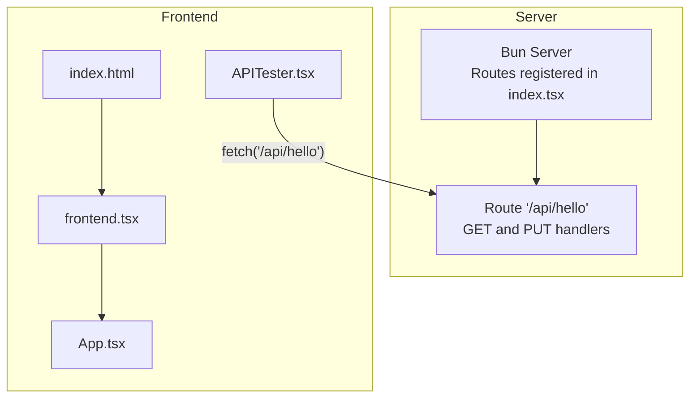
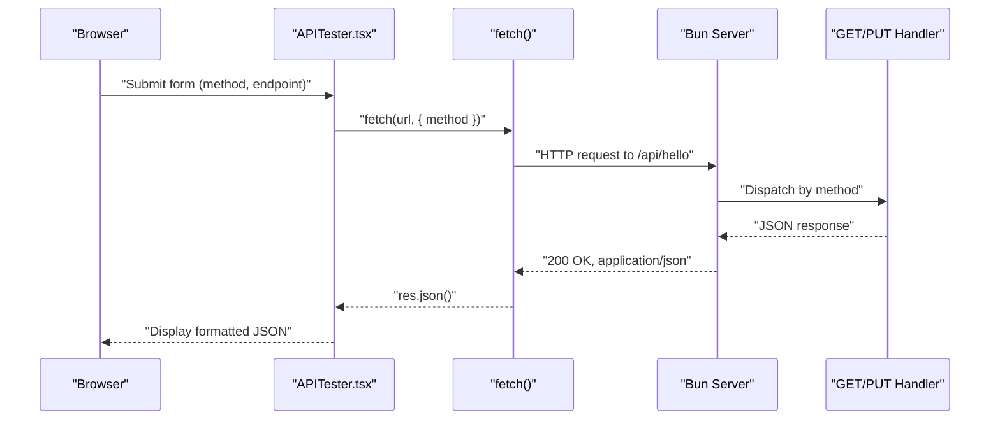
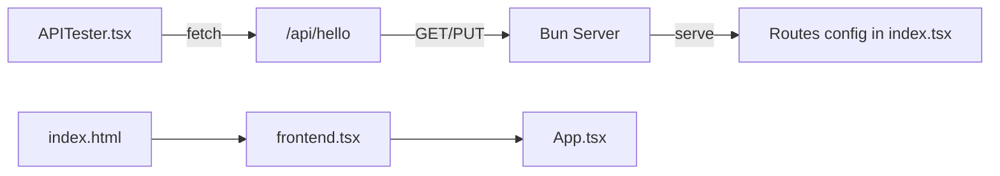

# Hello Endpoint

<cite>
**Referenced Files in This Document**
- [index.tsx](file://src/index.tsx)
- [APITester.tsx](file://src/APITester.tsx)
- [index.html](file://src/index.html)
- [frontend.tsx](file://src/frontend.tsx)
- [README.md](file://README.md)
</cite>

## Table of Contents
1. [Introduction](#introduction)
2. [Project Structure](#project-structure)
3. [Core Components](#core-components)
4. [Architecture Overview](#architecture-overview)
5. [Detailed Component Analysis](#detailed-component-analysis)
6. [Dependency Analysis](#dependency-analysis)
7. [Performance Considerations](#performance-considerations)
8. [Troubleshooting Guide](#troubleshooting-guide)
9. [Conclusion](#conclusion)

## Introduction
This document describes the /api/hello endpoint, a minimal API designed for health checks and method verification. It supports both GET and PUT methods and returns a JSON payload containing a greeting message and the HTTP method used. The endpoint is intentionally simple to facilitate quick client-side testing and service availability checks. It is consumed by the APITester component in the dashboard for interactive testing.

## Project Structure
The API is implemented in a single server file that registers route handlers for /api/hello. The frontend is a React application served by the same server, with the APITester component providing an interactive interface to send requests to /api/hello.

**Diagram sources**
- [index.tsx](file://src/index.tsx#L1-L41)
- [APITester.tsx](file://src/APITester.tsx#L1-L39)
- [index.html](file://src/index.html#L1-L14)
- [frontend.tsx](file://src/frontend.tsx#L1-L27)

**Section sources**
- [index.tsx](file://src/index.tsx#L1-L41)
- [APITester.tsx](file://src/APITester.tsx#L1-L39)
- [index.html](file://src/index.html#L1-L14)
- [frontend.tsx](file://src/frontend.tsx#L1-L27)

## Core Components
- Route registration and handlers for /api/hello:
  - GET handler returns a JSON object with fields message and method.
  - PUT handler returns the same JSON structure with method set to PUT.
- APITester component:
  - Provides a form to select HTTP method (GET or PUT) and enter the endpoint URL (/api/hello).
  - Sends the request using fetch and displays the parsed JSON response in a textarea.

Key characteristics:
- No request body or query parameters are required.
- Response content-type is application/json.
- Expected HTTP status code is 200 OK.

**Section sources**
- [index.tsx](file://src/index.tsx#L9-L21)
- [APITester.tsx](file://src/APITester.tsx#L6-L19)

## Architecture Overview
The server uses Bun’s built-in router to define static routes. Unmatched routes serve the SPA index.html, enabling client-side routing. The /api/hello endpoint is a dedicated route with two HTTP method handlers.

**Diagram sources**
- [APITester.tsx](file://src/APITester.tsx#L6-L19)
- [index.tsx](file://src/index.tsx#L9-L21)

## Detailed Component Analysis

### /api/hello Route Handlers
- Purpose:
  - Health check and method verification.
  - Demonstrates that the server is reachable and responds consistently to different HTTP methods.
- Behavior:
  - Both GET and PUT return the same JSON shape with a greeting message and the invoked method.
  - No request body or query parameters are required.
  - Response is JSON with content-type application/json.
  - Status code is 200 OK.

Implementation highlights:
- Route definition and method handlers are declared in the server routes configuration.
- Response is constructed using a JSON builder that serializes the message and method fields.

**Section sources**
- [index.tsx](file://src/index.tsx#L9-L21)

### APITester Component
- Purpose:
  - Interactive testing of the /api/hello endpoint within the dashboard.
- Behavior:
  - Captures form submission, extracts method and endpoint, constructs a URL relative to the current page, and performs a fetch.
  - Parses the JSON response and writes it into a textarea for inspection.
  - Displays errors if the fetch fails.

Usage:
- Select method from the dropdown (GET or PUT).
- Enter /api/hello in the endpoint input.
- Click Send to submit the request.

**Section sources**
- [APITester.tsx](file://src/APITester.tsx#L6-L19)

### Frontend Integration
- index.html serves as the SPA entry point.
- frontend.tsx creates the React root and renders App.
- The APITester component is part of the dashboard UI and interacts with the /api/hello endpoint.

**Section sources**
- [index.html](file://src/index.html#L1-L14)
- [frontend.tsx](file://src/frontend.tsx#L1-L27)

## Dependency Analysis
- Server runtime: Bun
- Routing: Bun’s serve with route handlers
- Frontend framework: React
- APITester depends on the browser fetch API to communicate with the server

**Diagram sources**
- [APITester.tsx](file://src/APITester.tsx#L6-L19)
- [index.tsx](file://src/index.tsx#L1-L41)
- [index.html](file://src/index.html#L1-L14)
- [frontend.tsx](file://src/frontend.tsx#L1-L27)

**Section sources**
- [index.tsx](file://src/index.tsx#L1-L41)
- [APITester.tsx](file://src/APITester.tsx#L6-L19)
- [index.html](file://src/index.html#L1-L14)
- [frontend.tsx](file://src/frontend.tsx#L1-L27)

## Performance Considerations
- The endpoint is lightweight and suitable for frequent checks.
- Since no body or query parameters are required, request overhead is minimal.
- For high-frequency polling, consider caching or rate limiting on the client to avoid unnecessary load.

## Troubleshooting Guide
Common issues and resolutions:
- 404 Not Found:
  - Ensure the endpoint is /api/hello and the server is running.
  - Verify the current page URL so relative URLs resolve correctly.
- 500 Internal Server Error:
  - Confirm the server is started in development mode and that the route handlers are loaded.
- CORS or network errors:
  - Check that the browser is sending requests to the same origin or that appropriate CORS headers are configured by the server.
- Unexpected response:
  - Verify the selected method (GET vs PUT) matches the intended handler.
  - Use the APITester component to inspect the raw JSON response.

Operational hints:
- Development server startup and usage are documented in the project README.

**Section sources**
- [README.md](file://README.md#L1-L22)

## Conclusion
The /api/hello endpoint provides a simple, reliable mechanism for verifying service availability and confirming HTTP method handling. Its minimal design makes it ideal for client-side testing and integration checks. The APITester component streamlines interactive validation within the dashboard.