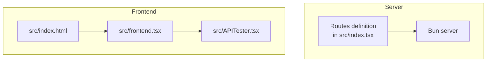
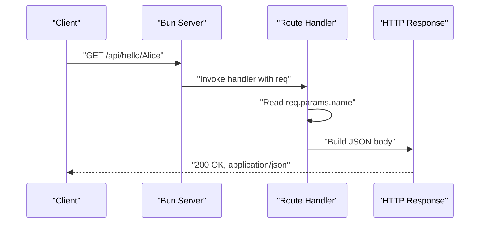
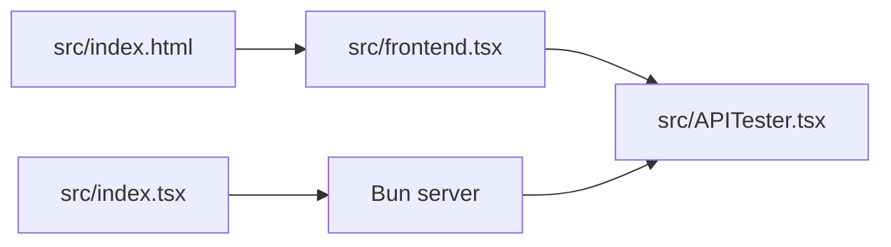

# Personalized Hello Endpoint

<cite>
**Referenced Files in This Document**
- [src/index.tsx](file://src/index.tsx)
- [src/APITester.tsx](file://src/APITester.tsx)
- [src/index.html](file://src/index.html)
- [src/frontend.tsx](file://src/frontend.tsx)
- [README.md](file://README.md)
- [projectinfo.md](file://projectinfo.md)
</cite>

## Table of Contents
1. [Introduction](#introduction)
2. [Project Structure](#project-structure)
3. [Core Components](#core-components)
4. [Architecture Overview](#architecture-overview)
5. [Detailed Component Analysis](#detailed-component-analysis)
6. [Dependency Analysis](#dependency-analysis)
7. [Performance Considerations](#performance-considerations)
8. [Troubleshooting Guide](#troubleshooting-guide)
9. [Conclusion](#conclusion)

## Introduction
This document provides API documentation for the GET endpoint at /api/hello/:name. The endpoint accepts a path parameter named name and returns a JSON greeting with the structure {"message": "Hello, {name}!"}. The implementation uses Bun’s built-in server with dynamic routing to extract the name parameter from the request URL via req.params.name. The document includes example requests using curl and JavaScript fetch, expected responses, HTTP status and content-type expectations, and guidance on handling URL-encoded special characters in the name parameter. It also explains how this endpoint demonstrates dynamic routing in the Hono/Bun framework and notes its absence in the APITester UI while highlighting its extensibility potential for future client integrations.

## Project Structure
The API endpoint is defined in the Bun server configuration alongside other routes. The frontend is a React application served by the same server for unmatched routes, and the APITester UI is part of the frontend.

**Diagram sources**
- [src/index.tsx](file://src/index.tsx#L1-L41)
- [src/index.html](file://src/index.html#L1-L13)
- [src/frontend.tsx](file://src/frontend.tsx#L1-L27)
- [src/APITester.tsx](file://src/APITester.tsx#L1-L40)

**Section sources**
- [src/index.tsx](file://src/index.tsx#L1-L41)
- [src/index.html](file://src/index.html#L1-L13)
- [src/frontend.tsx](file://src/frontend.tsx#L1-L27)
- [src/APITester.tsx](file://src/APITester.tsx#L1-L40)
- [README.md](file://README.md#L1-L22)
- [projectinfo.md](file://projectinfo.md#L1-L91)

## Core Components
- Route definition for /api/hello/:name in the Bun server routes configuration.
- Handler that reads the name parameter from req.params.name and returns a JSON response.
- Frontend React app that serves the SPA for unmatched routes.
- APITester UI component that allows sending requests to endpoints via a simple form.

Key implementation references:
- Dynamic route registration and handler for /api/hello/:name.
- Parameter extraction via req.params.name.
- JSON response construction and automatic content-type header setting by Response.json.

**Section sources**
- [src/index.tsx](file://src/index.tsx#L1-L41)
- [src/APITester.tsx](file://src/APITester.tsx#L1-L40)

## Architecture Overview
The server exposes two related endpoints under /api/hello:
- A parameterless variant that returns a generic greeting.
- A dynamic route variant that personalizes the greeting using the name path parameter.

**Diagram sources**
- [src/index.tsx](file://src/index.tsx#L1-L41)

## Detailed Component Analysis

### Endpoint Definition and Behavior
- Path pattern: /api/hello/:name
- Method: GET
- Request:
  - No request body is required.
  - No query parameters are supported.
  - The name parameter is provided as a path segment.
- Processing:
  - The handler extracts the name parameter from req.params.name.
  - The response body is a JSON object containing a message field with the personalized greeting.
- Response:
  - Status code: 200 OK
  - Content-Type: application/json
  - Body shape: {"message": "Hello, {name}!"}

Example requests:
- curl
  - curl -i https://your-server/api/hello/Alice
  - curl -i https://your-server/api/hello/Bob
- JavaScript fetch
  - fetch("https://your-server/api/hello/Alice").then(r => r.json())
  - fetch("https://your-server/api/hello/Bob").then(r => r.json())

Example responses:
- Input: Alice
  - Output: {"message":"Hello, Alice!"}
- Input: Bob
  - Output: {"message":"Hello, Bob!"}

Edge case handling:
- URL encoding: Special characters in the name parameter should be URL-encoded when constructing the request. For example, a space should be encoded as %20, and a plus sign as %2B. The server will decode the parameter automatically when accessed via req.params.name.

Dynamic routing demonstration:
- The route /api/hello/:name uses a path parameter named name. The Bun server resolves this route dynamically, extracting the value from the URL path and making it available in req.params.name. This illustrates how path parameters are captured and passed to the handler.

Absence in APITester UI:
- The APITester UI defaults to /api/hello and sends a request with a selected method. It does not currently support dynamic path parameters like :name. To test /api/hello/:name, you would need to manually edit the endpoint URL in the APITester input to include a specific name (for example, /api/hello/Alice) and send the request.

Extensibility potential:
- The endpoint is intentionally minimal and demonstrates dynamic routing. It can be extended in the future to:
  - Add query parameters for optional customization.
  - Introduce request body validation or additional headers.
  - Expand to include other HTTP methods with different behaviors.
  - Add logging or rate limiting middleware.

**Section sources**
- [src/index.tsx](file://src/index.tsx#L1-L41)
- [src/APITester.tsx](file://src/APITester.tsx#L1-L40)

### APITester UI Behavior
- The APITester UI provides a form to select an HTTP method and enter an endpoint URL, then performs a fetch and displays the parsed JSON response.
- It defaults to /api/hello and does not include a field for dynamic path parameters.
- To test /api/hello/:name, update the endpoint input to include a concrete name (for example, /api/hello/Alice) and submit the form.

**Section sources**
- [src/APITester.tsx](file://src/APITester.tsx#L1-L40)

## Dependency Analysis
- The server routes are defined in src/index.tsx. The Bun server integrates with the frontend entry and HTML template.
- The frontend is a React application that mounts to the root element and is served for unmatched routes by the server.

**Diagram sources**
- [src/index.tsx](file://src/index.tsx#L1-L41)
- [src/index.html](file://src/index.html#L1-L13)
- [src/frontend.tsx](file://src/frontend.tsx#L1-L27)
- [src/APITester.tsx](file://src/APITester.tsx#L1-L40)

**Section sources**
- [src/index.tsx](file://src/index.tsx#L1-L41)
- [src/index.html](file://src/index.html#L1-L13)
- [src/frontend.tsx](file://src/frontend.tsx#L1-L27)
- [src/APITester.tsx](file://src/APITester.tsx#L1-L40)

## Performance Considerations
- The endpoint performs a constant-time parameter extraction and constructs a small JSON payload. There are no significant computational overheads for typical usage.
- For high-throughput scenarios, consider adding caching headers or middleware to handle rate limiting and compression if needed.

## Troubleshooting Guide
- 404 Not Found: Ensure the URL uses the correct path pattern /api/hello/:name and that the server is running.
- 500 Internal Server Error: Verify that the server is started with the correct command and environment.
- Unexpected characters in the name: If the name contains spaces or special characters, URL-encode them before sending the request.
- APITester limitation: The APITester UI does not support dynamic path parameters. Manually edit the endpoint URL to include a concrete name.

**Section sources**
- [README.md](file://README.md#L1-L22)
- [src/index.tsx](file://src/index.tsx#L1-L41)
- [src/APITester.tsx](file://src/APITester.tsx#L1-L40)

## Conclusion
The /api/hello/:name endpoint is a concise demonstration of dynamic routing in the Bun server. It extracts a path parameter, personalizes a greeting, and returns a JSON response with the expected status and content-type. While the APITester UI does not currently support dynamic path parameters, the endpoint is straightforward to test with curl or JavaScript fetch and can be extended to support additional features in the future.