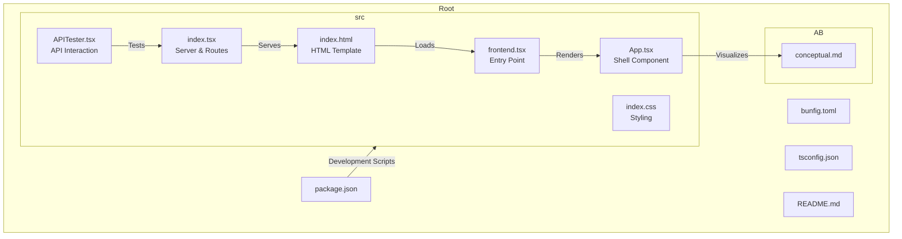
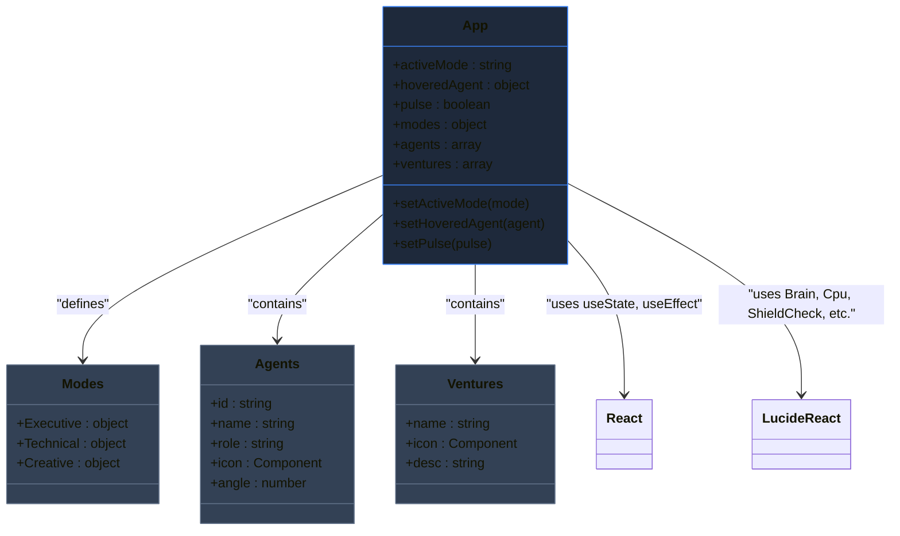
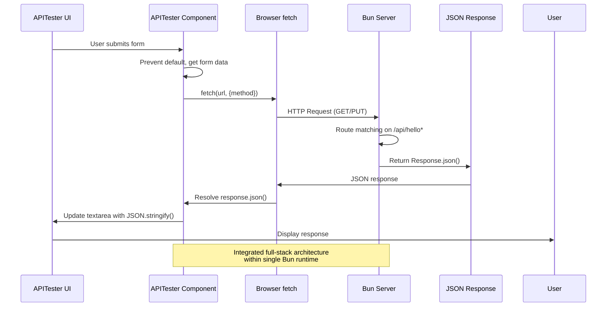

# Architecture Overview

<cite>
**Referenced Files in This Document**   
- [frontend.tsx](file://src/frontend.tsx)
- [App.tsx](file://src/App.tsx)
- [APITester.tsx](file://src/APITester.tsx)
- [index.tsx](file://src/index.tsx)
- [index.html](file://src/index.html)
- [package.json](file://package.json)
- [bunfig.toml](file://bunfig.toml)
- [conceptual.md](file://AB/conceptual.md)
</cite>

## Table of Contents
1. [Introduction](#introduction)
2. [Project Structure](#project-structure)
3. [Core Components](#core-components)
4. [Architecture Overview](#architecture-overview)
5. [Detailed Component Analysis](#detailed-component-analysis)
6. [Dependency Analysis](#dependency-analysis)
7. [Performance Considerations](#performance-considerations)
8. [Troubleshooting Guide](#troubleshooting-guide)
9. [Conclusion](#conclusion)

## Introduction
This document provides a comprehensive architectural overview of the full-stack component architecture in the 371-OS system. The application leverages Bun's integrated server capabilities to create a hybrid frontend-backend pattern, enabling seamless full-stack development within a single codebase. The architecture centers around a cognitive-aware autonomous agent operating system, visualized through an orrery interface that organizes components into three conceptual layers: cognitive interface (inner core), C-suite agents (middle ring), and ventures (outer ring). The system demonstrates modern full-stack patterns with React for frontend rendering, Bun's native `serve` API for backend routing, and Hono-inspired route definitions—all within a unified TypeScript codebase.

## Project Structure

**Diagram sources**
- [package.json](file://package.json#L1-L30)
- [src/frontend.tsx](file://src/frontend.tsx#L1-L26)
- [src/App.tsx](file://src/App.tsx#L1-L205)
- [src/index.tsx](file://src/index.tsx#L1-L41)
- [src/index.html](file://src/index.html#L1-L13)

**Section sources**
- [package.json](file://package.json#L1-L30)
- [src/frontend.tsx](file://src/frontend.tsx#L1-L26)
- [src/index.html](file://src/index.html#L1-L13)

## Core Components

The application architecture follows a layered component hierarchy with clear separation of concerns. The entry point `frontend.tsx` initializes the React application and mounts it to the DOM element defined in `index.html`. The `App.tsx` component serves as the shell, rendering the main orrery visualization that represents the cognitive-aware system. The `APITester.tsx` component provides a UI for testing API endpoints, demonstrating the integrated nature of the full-stack architecture. The `index.tsx` file is particularly significant as it contains both server routing logic and HTML serving capabilities, showcasing Bun's hybrid approach. The `conceptual.md` file contains a duplicate of the App component's visualization logic, suggesting it serves as a standalone conceptual model or documentation artifact.

**Section sources**
- [src/frontend.tsx](file://src/frontend.tsx#L1-L26)
- [src/App.tsx](file://src/App.tsx#L1-L205)
- [src/APITester.tsx](file://src/APITester.tsx#L1-L39)
- [AB/conceptual.md](file://AB/conceptual.md#L1-L204)

## Architecture Overview

```mermaid
graph LR
Client[Client Browser] --> |HTTP Request| BunServer[Bun Integrated Server]
BunServer --> |Route Matching| APIRoutes[API Routes<br>/api/hello*]
BunServer --> |Fallback| StaticFiles[Static Files<br>index.html]
StaticFiles --> |DOM Mount| ReactApp[React Application]
ReactApp --> |User Interaction| State[React State<br>useState/useEffect]
ReactApp --> |API Calls| Fetch[fetch API]
Fetch --> |HTTP Request| BunServer
BunServer --> |JSON Response| ReactApp
ReactApp --> |UI Update| DOM[DOM Update]
subgraph "Frontend Layer"
ReactApp
State
DOM
end
subgraph "Backend Layer"
BunServer
APIRoutes
end
style ReactApp fill:#2a303c,stroke:#60a5fa,stroke-width:2px
style BunServer fill:#2a303c,stroke:#34d399,stroke-width:2px
```

**Diagram sources**
- [src/index.tsx](file://src/index.tsx#L1-L41)
- [src/frontend.tsx](file://src/frontend.tsx#L1-L26)
- [src/App.tsx](file://src/App.tsx#L1-L205)

**Section sources**
- [src/index.tsx](file://src/index.tsx#L1-L41)
- [package.json](file://package.json#L13-L13)

## Detailed Component Analysis

### Frontend Entry Point Analysis

```mermaid
flowchart TD
Start([frontend.tsx Entry]) --> GetRoot["Get root DOM element<br>document.getElementById('root')"]
GetRoot --> CreateApp["Create App component with StrictMode"]
CreateApp --> CheckHMR["Check for Hot Module Reloading<br>import.meta.hot"]
CheckHMR --> |HMR Available| UseHotRoot["Use persisted root from hot.data"]
CheckHMR --> |HMR Not Available| CreateNewRoot["Create new root with createRoot()"]
UseHotRoot --> RenderApp["root.render(app)"]
CreateNewRoot --> RenderApp
RenderApp --> End([Application Mounted])
style Start fill:#1e293b,stroke:#3b82f6
style End fill:#1e293b,stroke:#3b82f6
style GetRoot fill:#334155,stroke:#64748b
style CreateApp fill:#334155,stroke:#64748b
style CheckHMR fill:#334155,stroke:#64748b
style UseHotRoot fill:#334155,stroke:#64748b
style CreateNewRoot fill:#334155,stroke:#64748b
style RenderApp fill:#334155,stroke:#64748b
```

**Diagram sources**
- [src/frontend.tsx](file://src/frontend.tsx#L1-L26)

**Section sources**
- [src/frontend.tsx](file://src/frontend.tsx#L1-L26)
- [src/index.html](file://src/index.html#L10-L10)

### App Component Structure

**Diagram sources**
- [src/App.tsx](file://src/App.tsx#L1-L205)

**Section sources**
- [src/App.tsx](file://src/App.tsx#L1-L205)
- [src/index.css](file://src/index.css#L1-L187)

### API Interaction Flow

**Diagram sources**
- [src/APITester.tsx](file://src/APITester.tsx#L1-L39)
- [src/index.tsx](file://src/index.tsx#L9-L29)

**Section sources**
- [src/APITester.tsx](file://src/APITester.tsx#L1-L39)
- [src/index.tsx](file://src/index.tsx#L9-L29)

### Orrery Visualization Hierarchy

```mermaid
graph TD
InnerCore[Cognitive Interface<br>Inner Core]
MiddleRing[C-Suite Agents<br>Middle Ring]
OuterRing[Ventures<br>Outer Ring]
InnerCore --> |Strategic Direction| MiddleRing
MiddleRing --> |Operational Execution| OuterRing
OuterRing --> |Performance Data| MiddleRing
MiddleRing --> |Cognitive Insights| InnerCore
subgraph "Inner Core"
BrainIcon[Brain Icon]
ModeDisplay[Mode: Executive/Technical/Creative]
PulseAnimation[Pulse Effect via useEffect]
end
subgraph "Middle Ring"
CEO[CEO Mimi - Strategic Leadership]
CTO[CTO Zara - Technical Architecture]
CFO[CFO Maya - Financial Optimization]
CLO[CLO Sage - Legal & Governance]
CAO[CAO Eduardo - Admin Excellence]
end
subgraph "Outer Ring"
LyricLines[LyricLines - AI Creative Content]
Vision2Results[Vision2Results - Strategic Consulting]
ModuMind[ModuMind - Agent OS Core]
Ikidedventures[Ikidedventures - Edutainment]
end
InnerCore --> BrainIcon
InnerCore --> ModeDisplay
InnerCore --> PulseAnimation
MiddleRing --> CEO
MiddleRing --> CTO
MiddleRing --> CFO
MiddleRing --> CLO
MiddleRing --> CAO
OuterRing --> LyricLines
OuterRing --> Vision2Results
OuterRing --> ModuMind
OuterRing --> Ikidedventures
style InnerCore fill:#1e293b,stroke:#3b82f6,stroke-width:2px
style MiddleRing fill:#1e293b,stroke:#10b981,stroke-width:2px
style OuterRing fill:#1e293b,stroke:#8b5cf6,stroke-width:2px
```

**Diagram sources**
- [src/App.tsx](file://src/App.tsx#L19-L205)
- [AB/conceptual.md](file://AB/conceptual.md#L1-L204)

**Section sources**
- [src/App.tsx](file://src/App.tsx#L19-L205)
- [AB/conceptual.md](file://AB/conceptual.md#L1-L204)

## Dependency Analysis

```mermaid
graph LR
Bun[Bun Runtime] --> React[React]
Bun --> Hono[Hono-inspired Routes]
React --> LucideReact[Lucide-React Icons]
Bun --> TypeScript[TypeScript]
Bun --> CSS[CSS-in-JS via Tailwind]
devDependencies["devDependencies<br>@biomejs/biome, tsup, typescript"] --> package_json
dependencies["dependencies<br>hono, zod, lucide-react"] --> package_json
package_json --> Bun
Bun --> |Integrated Server| index_tsx
index_tsx --> |Serves| index_html
index_html --> |Loads| frontend_tsx
frontend_tsx --> |Renders| App_tsx
App_tsx --> |Uses| LucideReact
APITester_tsx --> |Tests| index_tsx
style Bun fill:#1e293b,stroke:#34d399,stroke-width:2px
style React fill:#1e293b,stroke:#60a5fa,stroke-width:2px
style LucideReact fill:#1e293b,stroke:#fbbf24,stroke-width:2px
style Hono fill:#1e293b,stroke:#fb7185,stroke-width:2px
style TypeScript fill:#1e293b,stroke:#3b82f6,stroke-width:2px
style CSS fill:#1e293b,stroke:#8b5cf6,stroke-width:2px
```

**Diagram sources**
- [package.json](file://package.json#L1-L30)
- [bunfig.toml](file://bunfig.toml#L1-L17)
- [tsconfig.json](file://tsconfig.json#L1-L17)

**Section sources**
- [package.json](file://package.json#L1-L30)
- [bunfig.toml](file://bunfig.toml#L1-L17)
- [tsconfig.json](file://tsconfig.json#L1-L17)

## Performance Considerations

The architecture leverages Bun's performance optimizations for both development and production environments. The `bunfig.toml` configuration enables caching and lockfile usage to accelerate dependency installation. The runtime environment variables optimize execution with `NODE_ENV` and `RUNTIME` settings. The integrated server approach eliminates the need for separate frontend and backend processes, reducing overhead and improving latency. The React application uses efficient patterns such as `useEffect` for side effects and `useState` for state management, with minimal re-renders through proper component design. The visualization employs CSS animations and transforms for smooth rendering of the orrery components, while the starfield background uses lightweight DOM elements with native CSS animations. The hybrid full-stack pattern allows API responses to be served directly from the same process that serves the frontend, minimizing network latency in development and production environments.

**Section sources**
- [bunfig.toml](file://bunfig.toml#L1-L17)
- [package.json](file://package.json#L13-L13)
- [src/index.tsx](file://src/index.tsx#L32-L38)

## Troubleshooting Guide

When encountering issues with the application, consider the following common scenarios and their solutions:

1. **Server not starting**: Verify that Bun is properly installed and accessible in the environment path. Check that the `dev` script in `package.json` points to the correct server file (`apps/api-gateway/server.ts`).

2. **Hot Module Reloading not working**: Ensure that the `import.meta.hot` check in `frontend.tsx` is functioning correctly. Verify that the development environment variable `NODE_ENV` is not set to "production".

3. **API endpoints not responding**: Confirm that the routes in `index.tsx` are properly defined and that the server is listening on the expected port. Check that the fetch requests from `APITester.tsx` are using the correct relative URLs.

4. **React component not rendering**: Verify that the `root` element exists in `index.html` and that `frontend.tsx` is properly referenced in the script tag. Check browser console for any JavaScript errors.

5. **Styling issues**: Ensure that Tailwind CSS classes are correctly applied and that there are no conflicting styles. Verify that `index.css` is being properly processed by Bun.

6. **TypeScript errors**: Confirm that `tsconfig.json` is properly configured with `moduleResolution` set to "bundler" and that the paths alias `@/*` is correctly mapped to `./src/*`.

**Section sources**
- [src/frontend.tsx](file://src/frontend.tsx#L19-L26)
- [src/index.tsx](file://src/index.tsx#L32-L38)
- [package.json](file://package.json#L13-L13)
- [tsconfig.json](file://tsconfig.json#L5-L5)

## Conclusion

The 371-OS architecture demonstrates a sophisticated full-stack component design that leverages Bun's integrated server capabilities to create a seamless development experience. The hybrid pattern allows both frontend and backend code to coexist in a single codebase, with `index.tsx` serving as a unified entry point for server routing and HTML serving. The React application follows a clear component hierarchy with `frontend.tsx` as the entry point, `App.tsx` as the shell component, and specialized components like `APITester.tsx` for specific functionality. The orrery visualization effectively organizes the system into three conceptual layers—the cognitive interface (inner core), C-suite agents (middle ring), and ventures (outer ring)—providing an intuitive representation of the autonomous agent operating system. The architecture incorporates modern web development practices including React's useState/useEffect for state management, CSS-in-JS via Tailwind, and real-time updates through useEffect hooks and CSS animations. This integrated approach enables efficient development, fast iteration, and optimal performance across both client and server environments.