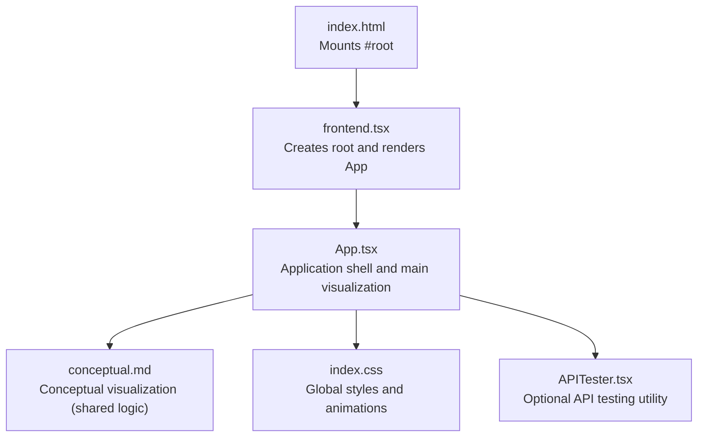
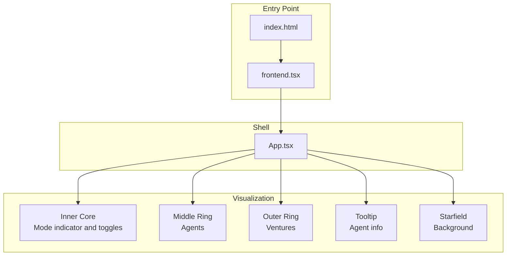
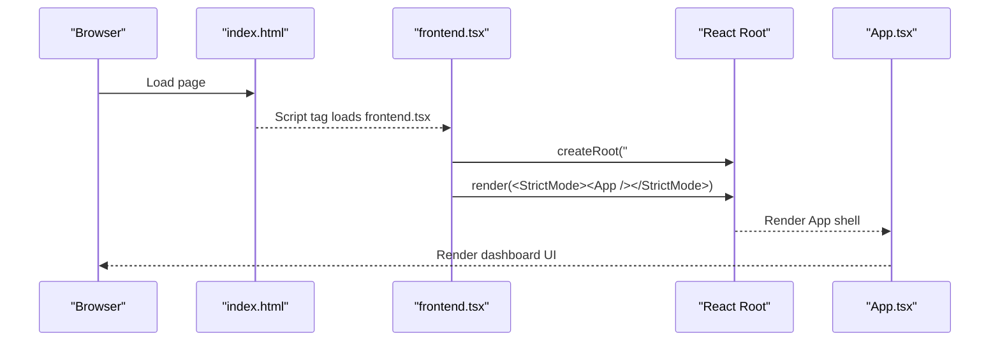
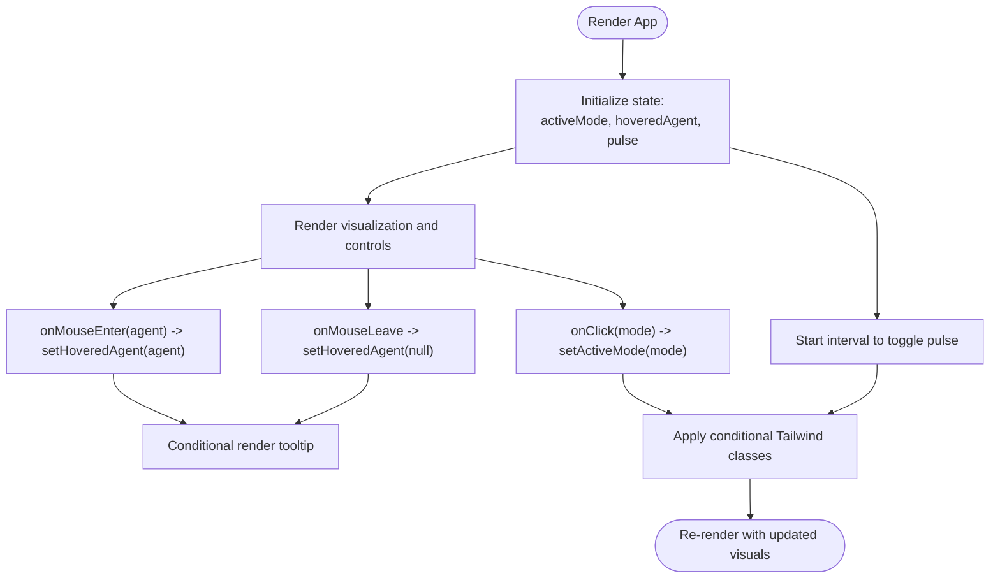
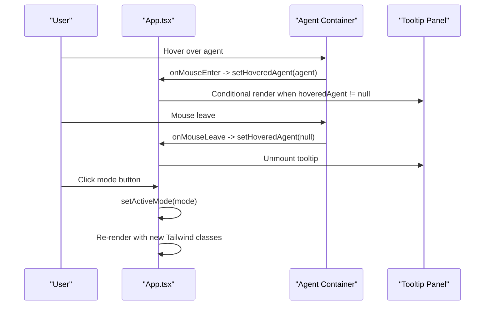
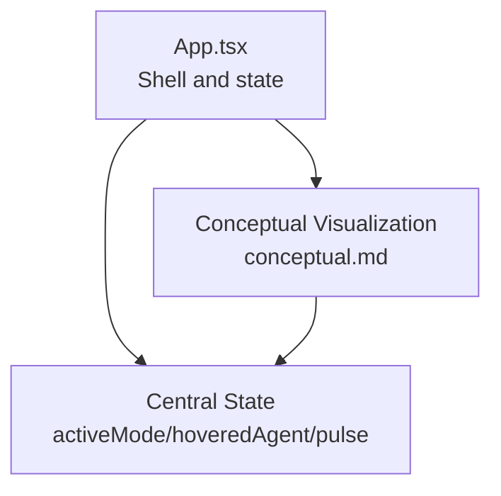
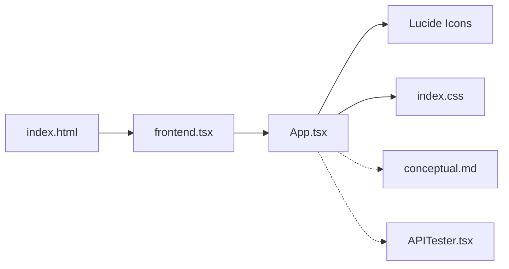

# Component Hierarchy

<cite>
**Referenced Files in This Document**
- [frontend.tsx](file://src/frontend.tsx)
- [App.tsx](file://src/App.tsx)
- [index.html](file://src/index.html)
- [conceptual.md](file://AB/conceptual.md)
- [index.css](file://src/index.css)
- [APITester.tsx](file://src/APITester.tsx)
</cite>

## Table of Contents
1. [Introduction](#introduction)
2. [Project Structure](#project-structure)
3. [Core Components](#core-components)
4. [Architecture Overview](#architecture-overview)
5. [Detailed Component Analysis](#detailed-component-analysis)
6. [Dependency Analysis](#dependency-analysis)
7. [Performance Considerations](#performance-considerations)
8. [Troubleshooting Guide](#troubleshooting-guide)
9. [Conclusion](#conclusion)

## Introduction
This document explains the React component hierarchy that powers the dashboard UI. The entry point initializes the React root and mounts the application shell. The shell component orchestrates central state for mode switching, agent hover states, and pulse animations. The main visualization is a conceptual orrery layout composed of concentric rings and floating UI elements. The document also covers how Tailwind classes are conditionally applied based on active mode and user interactions, and how to address common issues such as state synchronization and performance.

## Project Structure
The dashboard UI is structured around a minimal entry point that creates the React root and mounts the application shell. The shell component defines the main visualization and manages state centrally.

**Diagram sources**
- [index.html](file://src/index.html#L9-L11)
- [frontend.tsx](file://src/frontend.tsx#L12-L26)
- [App.tsx](file://src/App.tsx#L1-L206)
- [conceptual.md](file://AB/conceptual.md#L1-L205)
- [index.css](file://src/index.css#L1-L188)
- [APITester.tsx](file://src/APITester.tsx#L1-L40)

**Section sources**
- [index.html](file://src/index.html#L9-L11)
- [frontend.tsx](file://src/frontend.tsx#L12-L26)
- [App.tsx](file://src/App.tsx#L1-L206)

## Core Components
- frontend.tsx: Creates the React root and renders the App shell. It supports hot module replacement during development.
- App.tsx: Application shell that manages central state and renders the main visualization. It defines modes, agents, and ventures, and composes UI elements such as the orrery, mode toggles, and tooltips.
- conceptual.md: Contains the conceptual visualization logic that mirrors the App.tsx rendering structure, enabling reuse of the visualization pattern.
- index.css: Provides global styles and animations, including starfield effects and reduced motion support.
- APITester.tsx: An optional utility component for testing endpoints, separate from the dashboard UI.

Key responsibilities:
- Central state management: activeMode, hoveredAgent, pulse.
- Composition pattern: UI elements are encapsulated within a single functional component.
- Conditional Tailwind classes: applied based on active mode and hover interactions.

**Section sources**
- [frontend.tsx](file://src/frontend.tsx#L12-L26)
- [App.tsx](file://src/App.tsx#L1-L206)
- [conceptual.md](file://AB/conceptual.md#L1-L205)
- [index.css](file://src/index.css#L1-L188)
- [APITester.tsx](file://src/APITester.tsx#L1-L40)

## Architecture Overview
The architecture follows a unidirectional data flow:
- State is declared in App.tsx and passed down to child UI elements.
- Event handlers update state in response to user interactions (mode toggles, hover).
- Conditional rendering and Tailwind classes reflect state changes.
- The conceptual.md visualization demonstrates the same composition pattern.

**Diagram sources**
- [index.html](file://src/index.html#L9-L11)
- [frontend.tsx](file://src/frontend.tsx#L12-L26)
- [App.tsx](file://src/App.tsx#L50-L201)

## Detailed Component Analysis

### Parent-Child Relationship and Mounting Flow
- The HTML page defines a mount node with an ID used by the React root.
- The entry script creates the root and renders the App shell.
- App.tsx is the root component that composes the entire dashboard UI.

**Diagram sources**
- [index.html](file://src/index.html#L9-L11)
- [frontend.tsx](file://src/frontend.tsx#L12-L26)
- [App.tsx](file://src/App.tsx#L50-L201)

**Section sources**
- [index.html](file://src/index.html#L9-L11)
- [frontend.tsx](file://src/frontend.tsx#L12-L26)
- [App.tsx](file://src/App.tsx#L50-L201)

### Central State Management in App.tsx
App.tsx declares and manages:
- activeMode: Determines the current operational mode and drives conditional Tailwind classes.
- hoveredAgent: Tracks the currently hovered agent to show contextual tooltip.
- pulse: Controls a periodic scaling/opacity animation for the central brain icon.

State updates occur via:
- useEffect: Starts a recurring timer to toggle pulse.
- Mode buttons: onClick handler updates activeMode.
- Agent containers: onMouseEnter/onMouseLeave update hoveredAgent.

**Diagram sources**
- [App.tsx](file://src/App.tsx#L19-L27)
- [App.tsx](file://src/App.tsx#L130-L140)
- [App.tsx](file://src/App.tsx#L102-L114)
- [App.tsx](file://src/App.tsx#L161-L179)

**Section sources**
- [App.tsx](file://src/App.tsx#L19-L27)
- [App.tsx](file://src/App.tsx#L130-L140)
- [App.tsx](file://src/App.tsx#L102-L114)
- [App.tsx](file://src/App.tsx#L161-L179)

### Composition Pattern and Props/Events
The composition pattern encapsulates UI elements within a single functional component:
- Orrery rings: Outer ring (ventures), middle ring (agents), and inner core (mode indicator).
- Mode toggles: Buttons that switch activeMode.
- Tooltips: Floating panel rendered conditionally based on hoveredAgent.
- Event handlers: onClick for toggles, onMouseEnter/onMouseLeave for agents.

Props and events:
- Mode toggles receive an onClick handler that updates activeMode.
- Agent containers receive onMouseEnter/onMouseLeave handlers that update hoveredAgent.
- Conditional rendering: Tooltip appears only when hoveredAgent is truthy.

**Diagram sources**
- [App.tsx](file://src/App.tsx#L102-L114)
- [App.tsx](file://src/App.tsx#L130-L140)
- [App.tsx](file://src/App.tsx#L161-L179)

**Section sources**
- [App.tsx](file://src/App.tsx#L102-L114)
- [App.tsx](file://src/App.tsx#L130-L140)
- [App.tsx](file://src/App.tsx#L161-L179)

### Conditional Tailwind Classes and Visual Feedback
Tailwind classes are dynamically applied based on:
- activeMode: color, background, and border classes change to reflect the selected mode.
- hoveredAgent: Tooltip visibility and hover effects on agent containers.
- pulse: Periodic scaling and opacity changes for the central brain icon.

Examples of conditional class application:
- Mode border/background/color classes on the inner core.
- Hover scale and border changes on agent containers.
- Tooltip opacity transitions and positioning.

**Section sources**
- [App.tsx](file://src/App.tsx#L116-L141)
- [App.tsx](file://src/App.tsx#L102-L114)
- [App.tsx](file://src/App.tsx#L161-L179)

### Conceptual Visualization Alignment
The conceptual.md file mirrors the App.tsx structure, demonstrating the same composition pattern and state-driven rendering. This enables reuse of the visualization logic while keeping the shell component in App.tsx.

**Diagram sources**
- [App.tsx](file://src/App.tsx#L1-L206)
- [conceptual.md](file://AB/conceptual.md#L1-L205)

**Section sources**
- [App.tsx](file://src/App.tsx#L1-L206)
- [conceptual.md](file://AB/conceptual.md#L1-L205)

## Dependency Analysis
- frontend.tsx depends on index.html for the mount node and on App.tsx for the root component.
- App.tsx imports Lucide icons and uses React hooks for state and effects.
- index.css provides global styles and animations used by the visualization.
- APITester.tsx is a separate utility component unrelated to the dashboard UI.

**Diagram sources**
- [index.html](file://src/index.html#L9-L11)
- [frontend.tsx](file://src/frontend.tsx#L12-L26)
- [App.tsx](file://src/App.tsx#L1-L206)
- [index.css](file://src/index.css#L1-L188)
- [APITester.tsx](file://src/APITester.tsx#L1-L40)

**Section sources**
- [index.html](file://src/index.html#L9-L11)
- [frontend.tsx](file://src/frontend.tsx#L12-L26)
- [App.tsx](file://src/App.tsx#L1-L206)
- [index.css](file://src/index.css#L1-L188)
- [APITester.tsx](file://src/APITester.tsx#L1-L40)

## Performance Considerations
- State synchronization: Centralized state ensures consistent UI updates across nested components. Keep state minimal and predictable to reduce unnecessary re-renders.
- Memoization: Consider wrapping frequently reused UI elements with React.memo to prevent re-rendering when props are unchanged. Use useMemo for derived values and useCallback for event handlers to avoid recreating functions on each render.
- Animation performance: The starfield effect and pulse animation rely on inline styles and CSS animations. Keep the number of animated elements reasonable and prefer transform/opacity for GPU-accelerated animations.
- Conditional rendering: The tooltip and hover effects are conditionally rendered, minimizing DOM overhead when not needed.

[No sources needed since this section provides general guidance]

## Troubleshooting Guide
- Hot module replacement: The entry script checks for hot module reloading availability and persists the root instance across edits. If the UI does not update, verify the development server supports HMR.
- Mount node: Ensure the HTML contains a div with the expected ID used by the React root.
- Icon imports: Confirm Lucide icons are correctly imported and sized within components.
- Conditional rendering: Verify that the tooltip appears only when hoveredAgent is set and disappears on mouse leave.
- Tailwind classes: Confirm that mode toggles apply the correct classes and that hover states update accordingly.

**Section sources**
- [frontend.tsx](file://src/frontend.tsx#L19-L26)
- [index.html](file://src/index.html#L9-L11)
- [App.tsx](file://src/App.tsx#L102-L114)
- [App.tsx](file://src/App.tsx#L161-L179)

## Conclusion
The dashboard UI is built around a clear component hierarchy with a single shell component managing central state and composing the main visualization. The conceptual.md file demonstrates a reusable visualization pattern aligned with the shell’s state-driven rendering. Tailwind classes are applied conditionally to reflect mode and interaction states. By following the composition pattern and applying performance best practices, the UI remains responsive and maintainable.