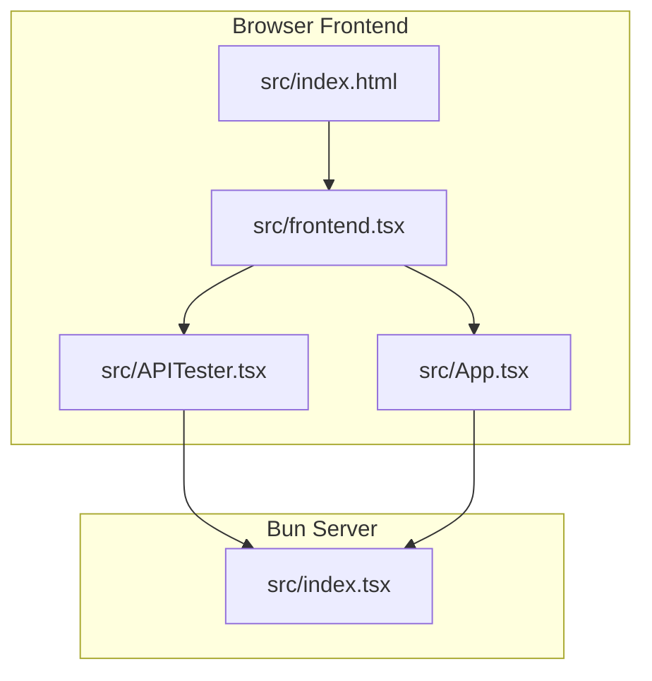
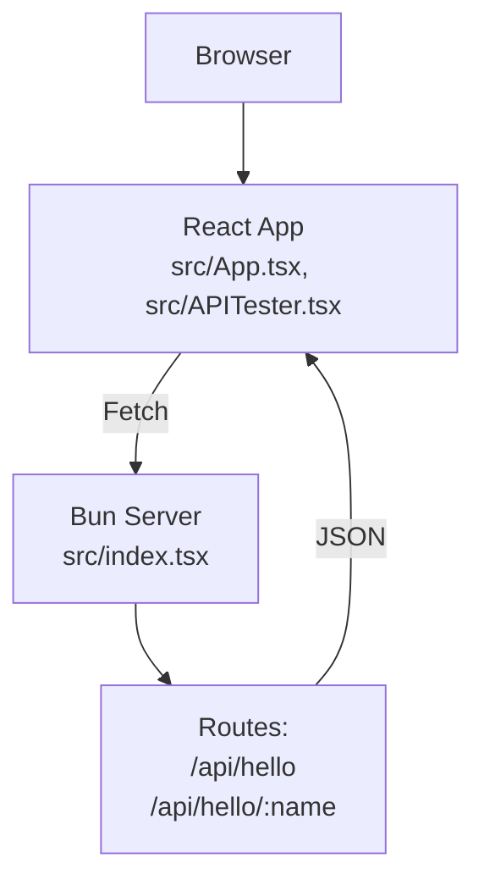
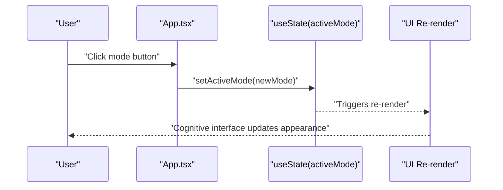
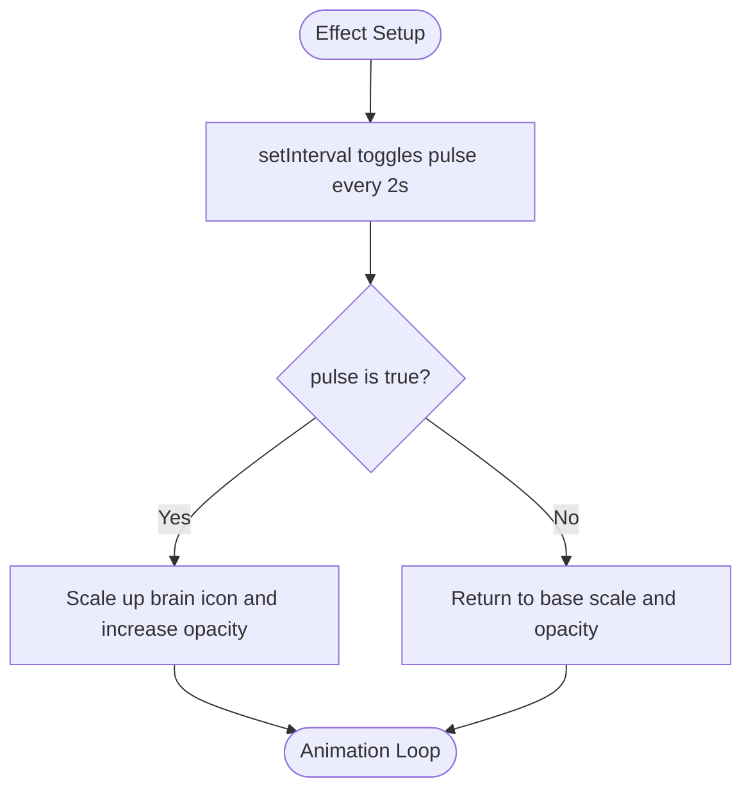
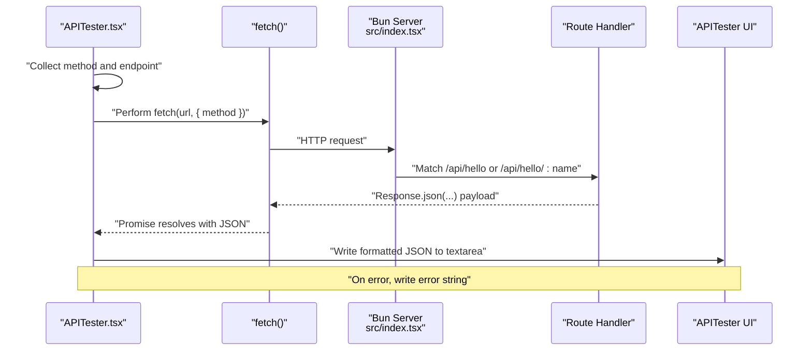
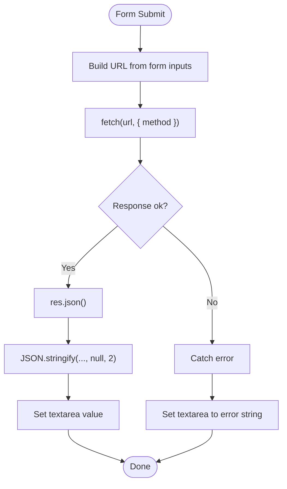
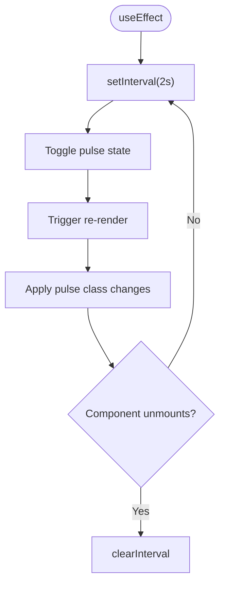
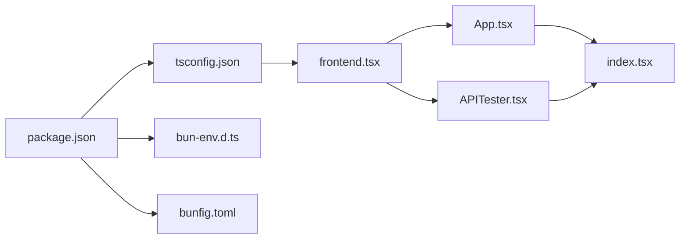

# Data Flow Mechanisms

<cite>
**Referenced Files in This Document**
- [src/App.tsx](file://src/App.tsx)
- [src/APITester.tsx](file://src/APITester.tsx)
- [src/frontend.tsx](file://src/frontend.tsx)
- [src/index.tsx](file://src/index.tsx)
- [src/index.html](file://src/index.html)
- [README.md](file://README.md)
- [package.json](file://package.json)
- [tsconfig.json](file://tsconfig.json)
- [bun-env.d.ts](file://bun-env.d.ts)
- [bunfig.toml](file://bunfig.toml)
</cite>

## Table of Contents
1. [Introduction](#introduction)
2. [Project Structure](#project-structure)
3. [Core Components](#core-components)
4. [Architecture Overview](#architecture-overview)
5. [Detailed Component Analysis](#detailed-component-analysis)
6. [Dependency Analysis](#dependency-analysis)
7. [Performance Considerations](#performance-considerations)
8. [Troubleshooting Guide](#troubleshooting-guide)
9. [Conclusion](#conclusion)
10. [Appendices](#appendices)

## Introduction
This document explains the data flow mechanisms in the application, focusing on two primary pathways:
- User interaction → React component state → UI re-rendering: How mode selection updates the cognitive interface appearance via state in App.tsx.
- API request → Bun server route handler → JSON response → APITester component display: How fetch calls are structured and how responses are consumed.

It also documents the use of React’s useEffect for side effects and setInterval for animation pulsing, and illustrates the lifecycle of an API call with sequence diagrams. Error handling considerations, loading states, and response formatting are covered, along with performance tips for minimizing re-renders and optimizing animation frames.

## Project Structure
The application is a Bun-powered full-stack React project with a Bun server serving static assets and API routes, and a React frontend rendering the UI.

**Diagram sources**
- [src/index.html](file://src/index.html#L1-L14)
- [src/frontend.tsx](file://src/frontend.tsx#L1-L27)
- [src/App.tsx](file://src/App.tsx#L1-L206)
- [src/APITester.tsx](file://src/APITester.tsx#L1-L40)
- [src/index.tsx](file://src/index.tsx#L1-L42)

**Section sources**
- [src/index.html](file://src/index.html#L1-L14)
- [src/frontend.tsx](file://src/frontend.tsx#L1-L27)
- [src/App.tsx](file://src/App.tsx#L1-L206)
- [src/APITester.tsx](file://src/APITester.tsx#L1-L40)
- [src/index.tsx](file://src/index.tsx#L1-L42)

## Core Components
- App.tsx: Central cognitive interface with mode selection, animated pulsing, and interactive agent visualization. Uses React state and useEffect to manage UI state and animations.
- APITester.tsx: A form-driven API tester that constructs a URL from form inputs, performs a fetch, parses JSON, and displays the formatted response.
- frontend.tsx: React root entry point that mounts App and enables hot module replacement in development.
- index.tsx: Bun server that serves static HTML and exposes API routes under /api.

Key data flow highlights:
- Mode selection in App.tsx updates state, which drives dynamic styles and text in the cognitive interface.
- APITester.tsx triggers fetch requests and writes responses to a textarea, enabling quick API verification.

**Section sources**
- [src/App.tsx](file://src/App.tsx#L1-L206)
- [src/APITester.tsx](file://src/APITester.tsx#L1-L40)
- [src/frontend.tsx](file://src/frontend.tsx#L1-L27)
- [src/index.tsx](file://src/index.tsx#L1-L42)

## Architecture Overview
The system comprises a React SPA served by Bun. Requests to /api/* are handled by Bun route handlers, returning JSON responses. The React UI updates either from local state or from API responses.

**Diagram sources**
- [src/index.tsx](file://src/index.tsx#L1-L42)
- [src/App.tsx](file://src/App.tsx#L1-L206)
- [src/APITester.tsx](file://src/APITester.tsx#L1-L40)

## Detailed Component Analysis

### Pathway 1: User Interaction → React State → UI Re-rendering (Mode Selection)
This pathway demonstrates how user actions update component state and drive UI re-rendering. In App.tsx:
- A mode selection state controls the cognitive interface’s color scheme, background, border, and description.
- Clicking a mode button updates the active mode, causing the surrounding UI to re-render with new styles and text.
- An effect sets up a periodic pulse animation using setInterval, toggling a state flag that affects the brain icon scaling and opacity.

**Diagram sources**
- [src/App.tsx](file://src/App.tsx#L1-L206)

Implementation details:
- State initialization and mode metadata are defined near the top of the component.
- Mode buttons call a setter to switch modes.
- The cognitive interface block applies dynamic classes based on the selected mode.
- A useEffect hook starts a timer that toggles a pulse state every 2 seconds, updating the brain icon animation.

**Diagram sources**
- [src/App.tsx](file://src/App.tsx#L1-L206)

**Section sources**
- [src/App.tsx](file://src/App.tsx#L1-L206)

### Pathway 2: API Request → Bun Route Handler → JSON Response → APITester Display
This pathway covers how the APITester component interacts with the Bun server:
- The component builds a URL from form inputs and performs a fetch with the chosen HTTP method.
- The Bun server defines routes under /api that return JSON responses.
- On success, the component parses the JSON and writes a formatted string to a textarea.
- On error, the component writes a string representation of the error.

**Diagram sources**
- [src/APITester.tsx](file://src/APITester.tsx#L1-L40)
- [src/index.tsx](file://src/index.tsx#L1-L42)

Implementation details:
- APITester reads form data, constructs a URL, and performs fetch.
- The server exposes two routes: a parameterless endpoint and a parameterized endpoint.
- The component writes the response into a textarea using a ref.

**Diagram sources**
- [src/APITester.tsx](file://src/APITester.tsx#L1-L40)
- [src/index.tsx](file://src/index.tsx#L1-L42)

**Section sources**
- [src/APITester.tsx](file://src/APITester.tsx#L1-L40)
- [src/index.tsx](file://src/index.tsx#L1-L42)

### Animation Pulsing with useEffect and setInterval
App.tsx uses a cleanup-friendly effect to toggle a pulse state every 2 seconds. This creates a smooth animation loop that updates the brain icon’s scale and opacity during re-renders.

**Diagram sources**
- [src/App.tsx](file://src/App.tsx#L1-L206)

**Section sources**
- [src/App.tsx](file://src/App.tsx#L1-L206)

## Dependency Analysis
- Bun server routes are defined in src/index.tsx and serve static HTML from src/index.html.
- React app entry point mounts App in src/frontend.tsx.
- APITester depends on browser fetch semantics and Bun’s route handlers.
- Package configuration and TypeScript settings define build and runtime behavior.

**Diagram sources**
- [package.json](file://package.json#L1-L31)
- [tsconfig.json](file://tsconfig.json#L1-L18)
- [bun-env.d.ts](file://bun-env.d.ts#L1-L18)
- [bunfig.toml](file://bunfig.toml#L1-L17)
- [src/frontend.tsx](file://src/frontend.tsx#L1-L27)
- [src/App.tsx](file://src/App.tsx#L1-L206)
- [src/APITester.tsx](file://src/APITester.tsx#L1-L40)
- [src/index.tsx](file://src/index.tsx#L1-L42)

**Section sources**
- [package.json](file://package.json#L1-L31)
- [tsconfig.json](file://tsconfig.json#L1-L18)
- [bun-env.d.ts](file://bun-env.d.ts#L1-L18)
- [bunfig.toml](file://bunfig.toml#L1-L17)
- [src/frontend.tsx](file://src/frontend.tsx#L1-L27)
- [src/App.tsx](file://src/App.tsx#L1-L206)
- [src/APITester.tsx](file://src/APITester.tsx#L1-L40)
- [src/index.tsx](file://src/index.tsx#L1-L42)

## Performance Considerations
- Minimizing re-renders:
  - Keep frequently changing animation state scoped to small components (as in App.tsx) to avoid unnecessary parent re-renders.
  - Use memoization for expensive computations derived from props or state.
  - Prefer stable references for event handlers and callbacks passed down to child components.
- Optimizing animation frames:
  - Use CSS transitions and transforms for animations (as seen with the brain icon scaling and opacity changes).
  - Limit the frequency of state updates; the 2-second interval in App.tsx is reasonable for subtle pulsing.
  - Avoid layout thrashing by batching DOM reads/writes.
- API fetch performance:
  - Reuse a single fetch instance with shared headers if needed.
  - Debounce rapid successive requests from UI events.
  - Cache responses when appropriate and invalidate on state changes.

[No sources needed since this section provides general guidance]

## Troubleshooting Guide
- APITester errors:
  - The component writes error messages to the textarea when fetch fails. Verify the endpoint URL and method selection.
  - Ensure the Bun server is running and reachable at the expected host/port.
- Server routes:
  - Confirm that the requested route exists and returns JSON. The server defines /api/hello and /api/hello/:name.
- Hot module replacement:
  - Development relies on Bun’s HMR. If the page does not reload, check the Bun configuration and console logs.

**Section sources**
- [src/APITester.tsx](file://src/APITester.tsx#L1-L40)
- [src/index.tsx](file://src/index.tsx#L1-L42)
- [README.md](file://README.md#L1-L22)

## Conclusion
The application demonstrates two complementary data flow mechanisms:
- Local state-driven UI updates in App.tsx, powered by React state and useEffect, produce responsive and animated visuals.
- Remote API interactions in APITester.tsx integrate seamlessly with Bun server routes, returning JSON responses that are displayed in the UI.

By structuring state updates and side effects carefully, and by leveraging Bun’s efficient runtime, the system achieves a smooth user experience with predictable data flows.

[No sources needed since this section summarizes without analyzing specific files]

## Appendices
- Development and runtime environment:
  - Bun runtime and HMR are configured for development.
  - TypeScript bundler settings and JSX configuration support the React app.

**Section sources**
- [bunfig.toml](file://bunfig.toml#L1-L17)
- [tsconfig.json](file://tsconfig.json#L1-L18)
- [README.md](file://README.md#L1-L22)