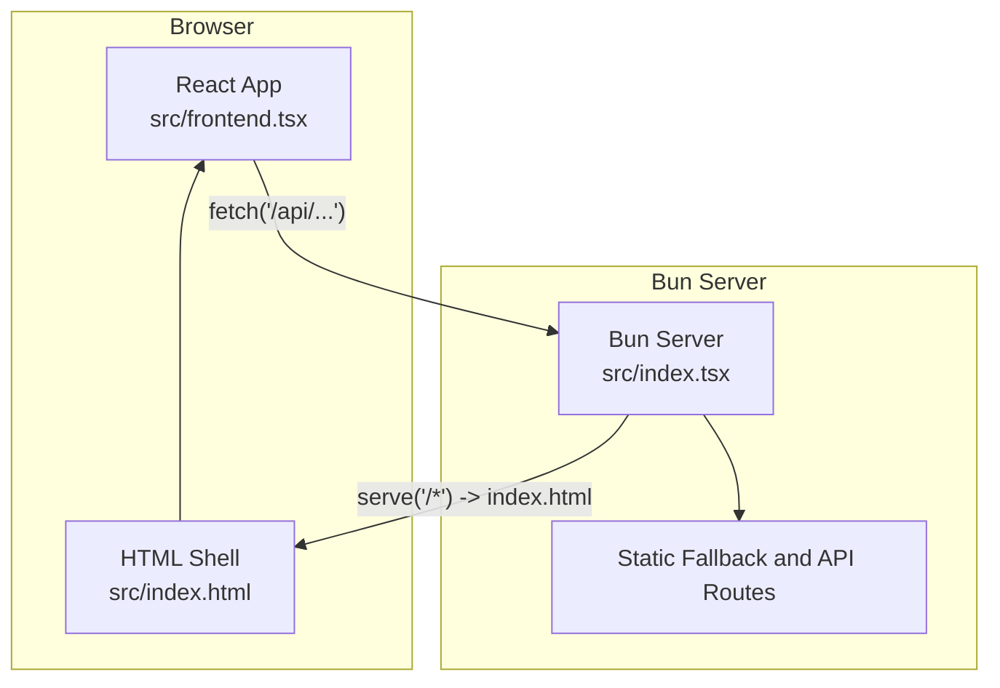
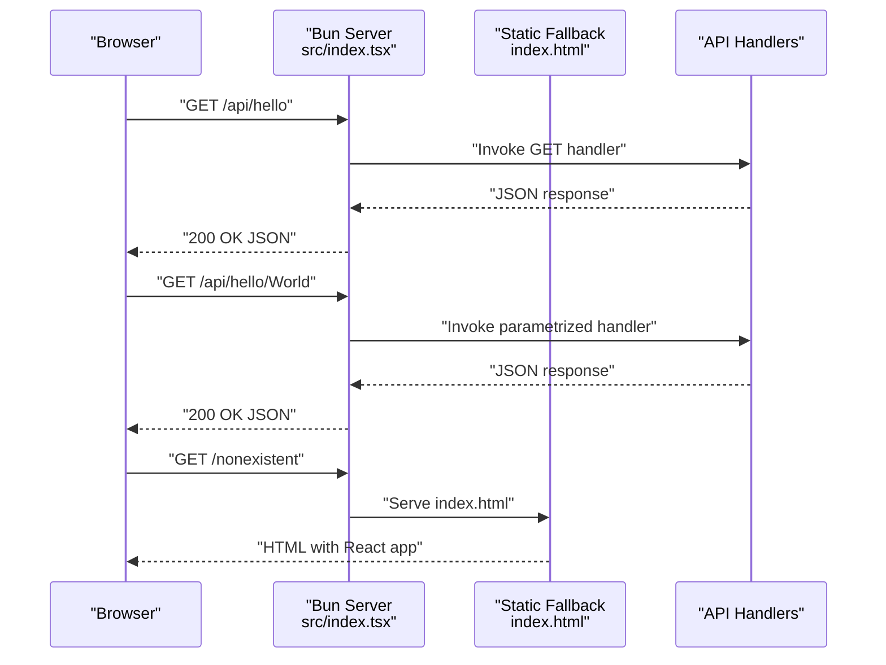
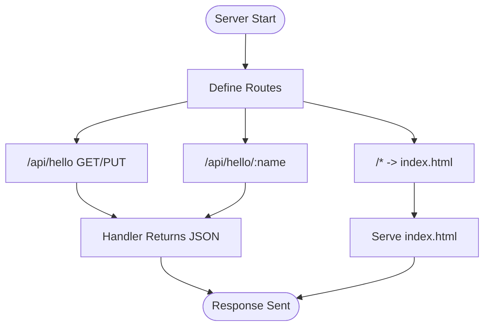
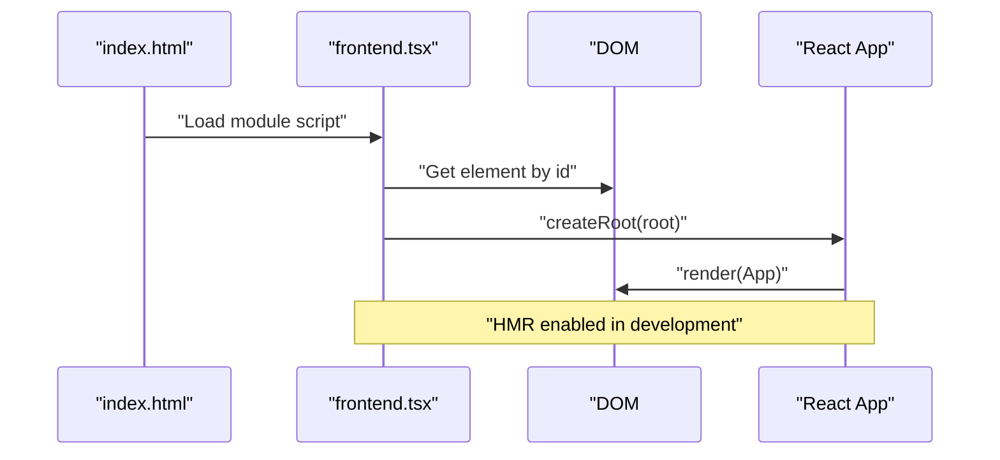
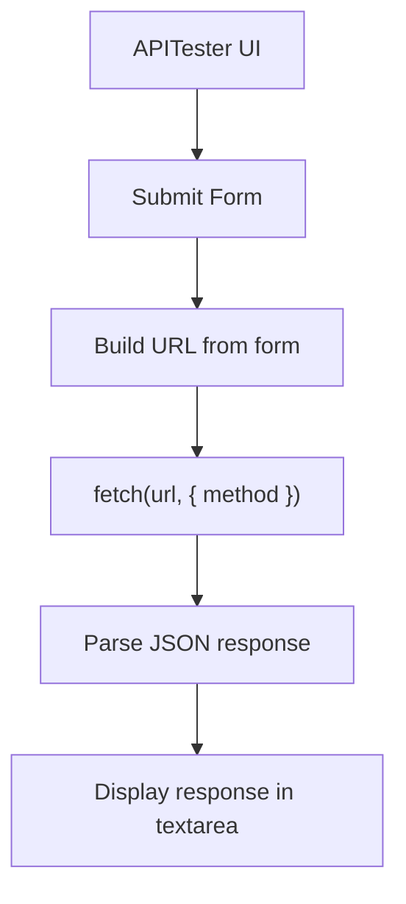
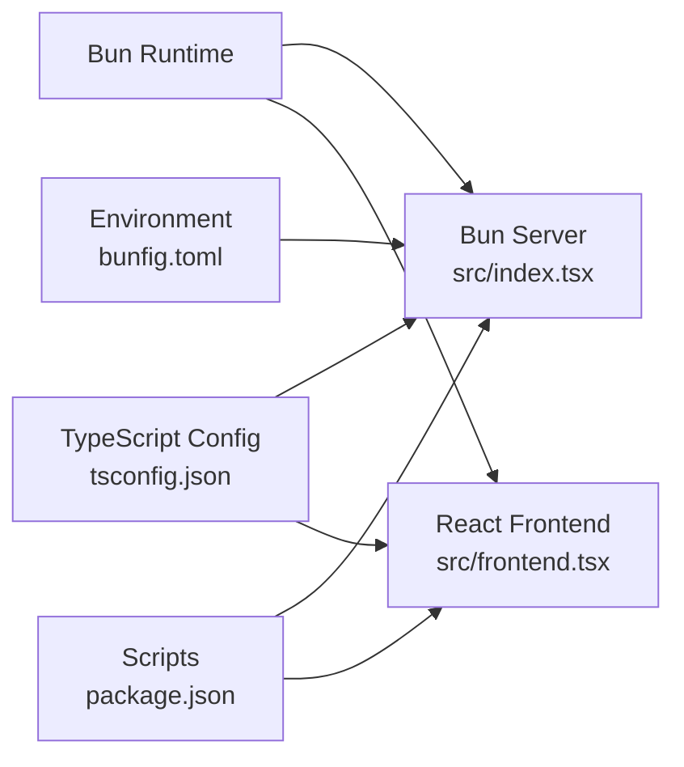

# Full-Stack Architecture

<cite>
**Referenced Files in This Document**
- [src/index.tsx](file://src/index.tsx)
- [src/frontend.tsx](file://src/frontend.tsx)
- [src/index.html](file://src/index.html)
- [src/App.tsx](file://src/App.tsx)
- [src/APITester.tsx](file://src/APITester.tsx)
- [src/index.css](file://src/index.css)
- [bunfig.toml](file://bunfig.toml)
- [package.json](file://package.json)
- [README.md](file://README.md)
- [tsconfig.json](file://tsconfig.json)
- [bun-env.d.ts](file://bun-env.d.ts)
</cite>

## Table of Contents
1. [Introduction](#introduction)
2. [Project Structure](#project-structure)
3. [Core Components](#core-components)
4. [Architecture Overview](#architecture-overview)
5. [Detailed Component Analysis](#detailed-component-analysis)
6. [Dependency Analysis](#dependency-analysis)
7. [Performance Considerations](#performance-considerations)
8. [Troubleshooting Guide](#troubleshooting-guide)
9. [Conclusion](#conclusion)

## Introduction
This document describes the full-stack architecture of the cognitive-aware agent system built with Bun’s embedded server and a React frontend. The system uses a hybrid runtime model where the same Bun process serves both static assets and API endpoints, enabling a unified client-server runtime. The React application initializes in the browser and consumes API endpoints exposed by the Bun server. Development features include Hot Module Replacement (HMR) and console bridging for seamless iteration.

## Project Structure
The project is organized around two primary entry points:
- Frontend entry point: a React application that mounts to a DOM root and renders the App component.
- Backend entry point: a Bun server that serves static HTML and routes API requests.

Key files and roles:
- src/index.tsx: Bootstraps the Bun server, defines static route fallback, and registers API endpoints.
- src/frontend.tsx: Initializes the React DOM and renders the App component; integrates HMR.
- src/index.html: Minimal HTML shell that includes the frontend script and a root container.
- src/App.tsx: The main React component for the cognitive-aware agent interface.
- src/APITester.tsx: A small UI for testing API endpoints from the client.
- bunfig.toml: Development-time runtime configuration including environment variables and HMR settings.
- package.json: Scripts and dependencies for development, build, and runtime.
- tsconfig.json: TypeScript configuration for JSX and bundler resolution.
- bun-env.d.ts: Type declarations for asset modules.

**Diagram sources**
- [src/index.tsx](file://src/index.tsx#L1-L42)
- [src/frontend.tsx](file://src/frontend.tsx#L1-L27)
- [src/index.html](file://src/index.html#L1-L14)

**Section sources**
- [src/index.tsx](file://src/index.tsx#L1-L42)
- [src/frontend.tsx](file://src/frontend.tsx#L1-L27)
- [src/index.html](file://src/index.html#L1-L14)
- [bunfig.toml](file://bunfig.toml#L1-L17)
- [package.json](file://package.json#L1-L31)
- [tsconfig.json](file://tsconfig.json#L1-L18)
- [bun-env.d.ts](file://bun-env.d.ts#L1-L18)

## Core Components
- Bun Embedded Server
  - Serves static HTML for unmatched routes.
  - Exposes API endpoints under /api/hello with GET and PUT handlers.
  - Supports dynamic route parameters for /api/hello/:name.
  - Development mode enables HMR and console bridging.
- React Frontend
  - Initializes the React root and renders the App component.
  - Integrates HMR via import.meta.hot to preserve state during edits.
  - Uses a minimal HTML shell that injects the frontend script.
- API Tester
  - Provides a simple form to send GET/PUT requests to /api/hello and display responses.

**Section sources**
- [src/index.tsx](file://src/index.tsx#L1-L42)
- [src/frontend.tsx](file://src/frontend.tsx#L1-L27)
- [src/index.html](file://src/index.html#L1-L14)
- [src/APITester.tsx](file://src/APITester.tsx#L1-L40)

## Architecture Overview
The system follows a hybrid runtime pattern:
- Single Bun process handles both static asset delivery and API routing.
- Unmatched client-side navigation falls back to serving index.html, enabling SPA-like behavior.
- API endpoints are defined inline with Bun’s route handler syntax.
- Development HMR is enabled so that frontend updates propagate without full reloads.

**Diagram sources**
- [src/index.tsx](file://src/index.tsx#L1-L42)
- [src/index.html](file://src/index.html#L1-L14)

## Detailed Component Analysis

### Bun Server (src/index.tsx)
- Responsibilities
  - Bootstraps the embedded server with route definitions.
  - Serves index.html for all unmatched routes to support client-side routing.
  - Defines API endpoints under /api/hello with GET and PUT handlers.
  - Adds a parametrized route /api/hello/:name to demonstrate dynamic parameters.
  - Enables development features: HMR and console bridging when not in production.
- Request Flow
  - API requests hit the Bun server and are routed to the appropriate handler.
  - Non-API requests fall back to serving index.html, allowing the React app to handle routing.
- Development Features
  - HMR is enabled in development to hot-reload frontend changes.
  - Console bridging echoes browser logs to the server console.

**Diagram sources**
- [src/index.tsx](file://src/index.tsx#L1-L42)
- [src/index.html](file://src/index.html#L1-L14)

**Section sources**
- [src/index.tsx](file://src/index.tsx#L1-L42)

### React Frontend (src/frontend.tsx)
- Responsibilities
  - Creates the React root and renders the App component inside the #root element.
  - Integrates HMR via import.meta.hot to preserve state across edits.
  - Falls back to a standard render in production where HMR is unavailable.
- Integration with Bun
  - The HTML shell includes a module script pointing to frontend.tsx.
  - The server serves index.html for unmatched routes, enabling SPA navigation.

**Diagram sources**
- [src/index.html](file://src/index.html#L1-L14)
- [src/frontend.tsx](file://src/frontend.tsx#L1-L27)

**Section sources**
- [src/frontend.tsx](file://src/frontend.tsx#L1-L27)
- [src/index.html](file://src/index.html#L1-L14)

### API Tester (src/APITester.tsx)
- Responsibilities
  - Provides a simple form to select HTTP method and enter an endpoint path.
  - Sends a fetch request to the selected endpoint and displays the JSON response.
- Integration
  - Uses the current page’s origin to construct URLs for local API calls.
  - Demonstrates consumption of the server’s /api/hello endpoints.

**Diagram sources**
- [src/APITester.tsx](file://src/APITester.tsx#L1-L40)

**Section sources**
- [src/APITester.tsx](file://src/APITester.tsx#L1-L40)

### Application Shell (src/index.html)
- Responsibilities
  - Minimal HTML shell with a #root element for React to mount.
  - Loads the frontend module script to initialize the React app.
- Behavior
  - Served by the Bun server for unmatched routes, enabling SPA navigation.

**Section sources**
- [src/index.html](file://src/index.html#L1-L14)

### Application UI (src/App.tsx)
- Responsibilities
  - Renders the cognitive-aware agent interface with interactive elements.
  - Manages state for modes, agents, and UI effects.
- Integration
  - Consumes API endpoints via the APITester component.

**Section sources**
- [src/App.tsx](file://src/App.tsx#L1-L206)

## Dependency Analysis
- Runtime and Tooling
  - Bun runtime powers both the server and the frontend development experience.
  - TypeScript configuration enables JSX and bundler module resolution.
  - Asset module declarations support importing SVGs and CSS modules.
- Scripts and Environment
  - Development scripts leverage Bun’s hot mode for rapid iteration.
  - Environment variables configured for development runtime behavior.

**Diagram sources**
- [src/index.tsx](file://src/index.tsx#L1-L42)
- [src/frontend.tsx](file://src/frontend.tsx#L1-L27)
- [tsconfig.json](file://tsconfig.json#L1-L18)
- [bunfig.toml](file://bunfig.toml#L1-L17)
- [package.json](file://package.json#L1-L31)

**Section sources**
- [package.json](file://package.json#L1-L31)
- [bunfig.toml](file://bunfig.toml#L1-L17)
- [tsconfig.json](file://tsconfig.json#L1-L18)
- [bun-env.d.ts](file://bun-env.d.ts#L1-L18)

## Performance Considerations
- Unified Runtime Benefits
  - Running the server and client in the same Bun process reduces overhead and simplifies deployment.
  - Static asset delivery and API handling share the same event loop, minimizing context switching.
- Development Optimizations
  - HMR in development accelerates iteration by updating only changed modules.
  - Console bridging helps diagnose frontend issues quickly.
- Production Implications
  - In production, HMR is disabled, and the server runs with minimal overhead.
  - The hybrid model keeps latency low for both static and dynamic requests.

[No sources needed since this section provides general guidance]

## Troubleshooting Guide
- Server Not Starting
  - Verify the Bun server entry point and ensure the port is free.
  - Confirm environment variables and development flags are set appropriately.
- API Endpoint Issues
  - Test endpoints using the APITester component to confirm handler responses.
  - Check route definitions and parameter extraction logic.
- Frontend Not Updating
  - Ensure HMR is enabled in development and that import.meta.hot is available.
  - Confirm the HTML script tag points to the correct frontend entry.
- Static Assets Not Loading
  - Verify the static fallback route serves index.html for unmatched paths.
  - Check that the #root element exists in the HTML shell.

**Section sources**
- [src/index.tsx](file://src/index.tsx#L1-L42)
- [src/frontend.tsx](file://src/frontend.tsx#L1-L27)
- [src/index.html](file://src/index.html#L1-L14)
- [src/APITester.tsx](file://src/APITester.tsx#L1-L40)
- [README.md](file://README.md#L1-L22)

## Conclusion
The system employs a tight, unified runtime architecture where Bun’s embedded server and the React frontend coexist in a single process. This hybrid pattern streamlines development and deployment while maintaining a clean separation between static asset delivery and API handling. The documented entry points and request flows illustrate how client interactions reach API responses via Hono-style routes, with development features like HMR enhancing productivity. The architecture’s simplicity and performance characteristics make it suitable for rapid iteration and scalable deployment.