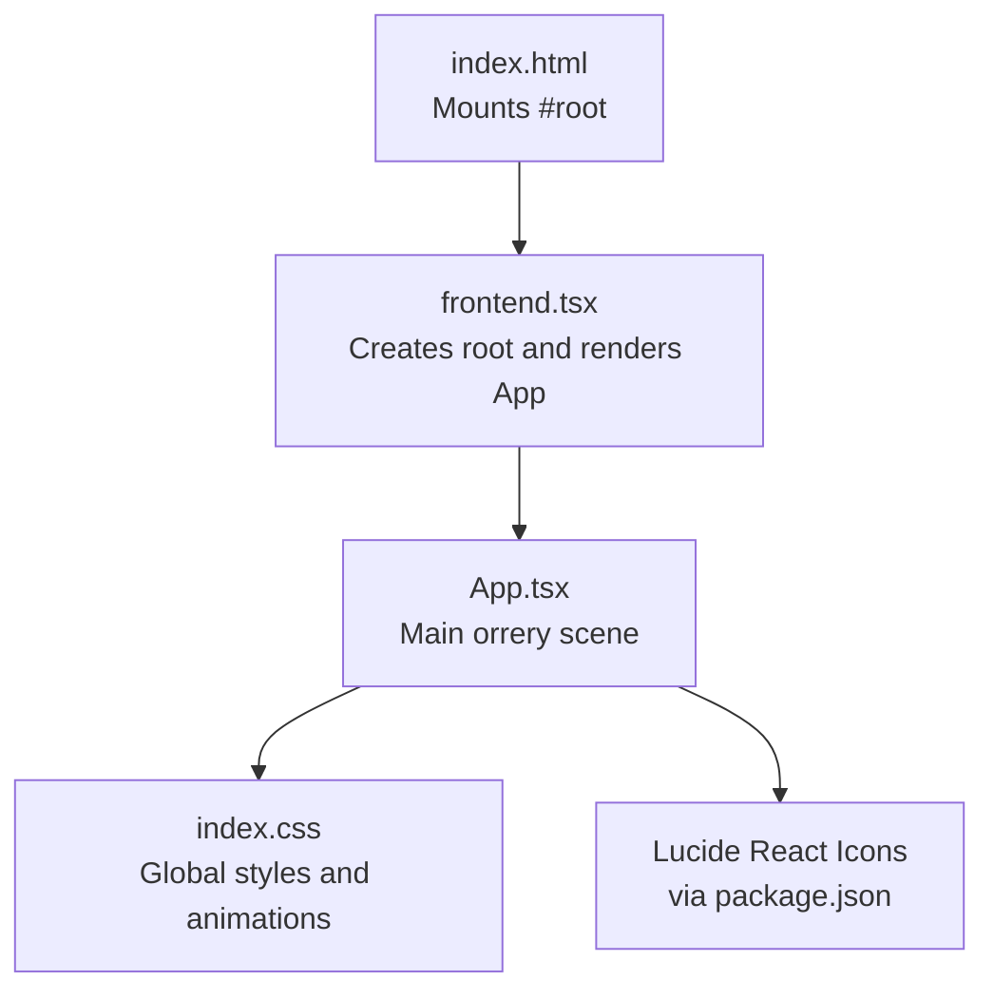
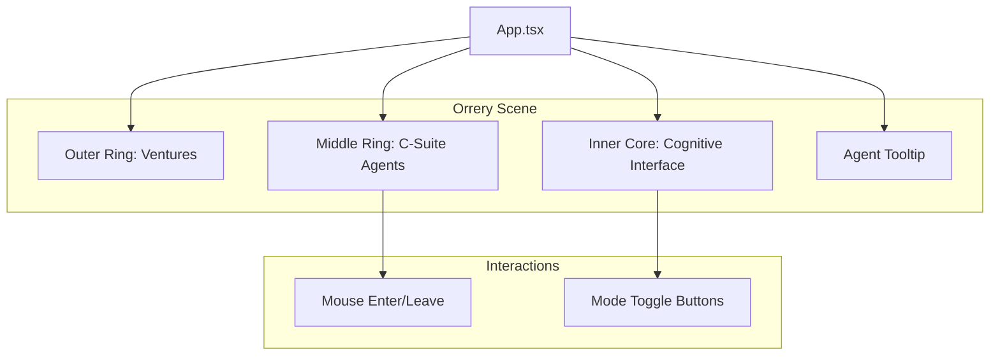
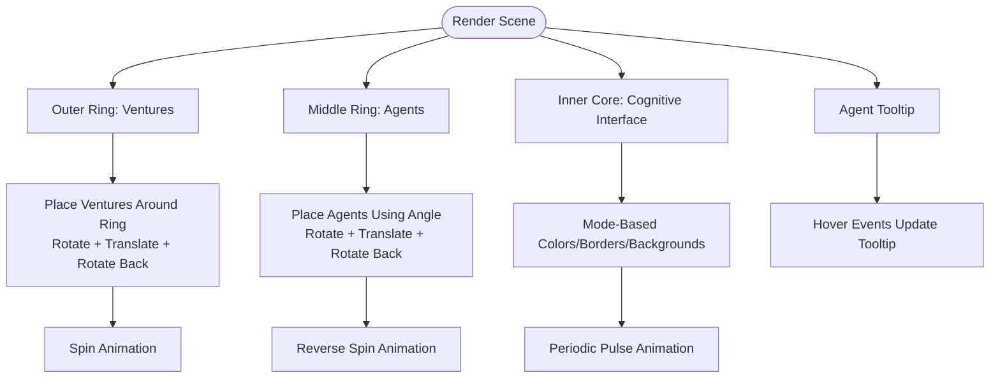
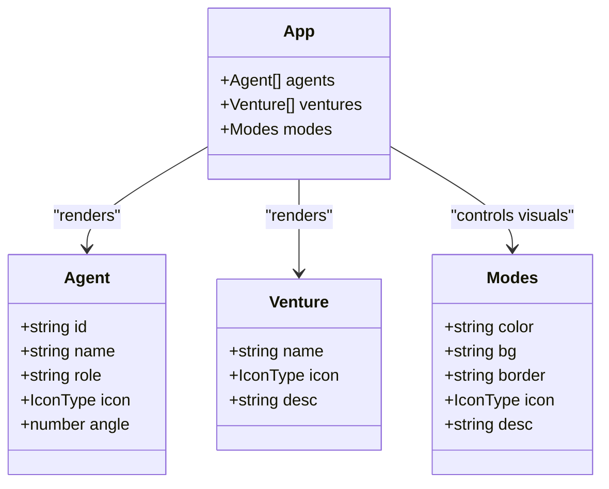
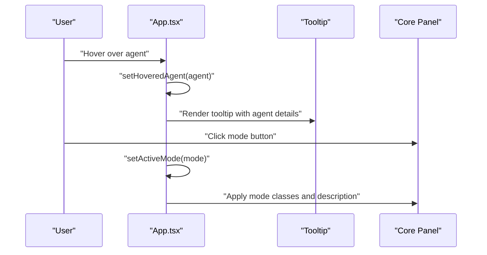
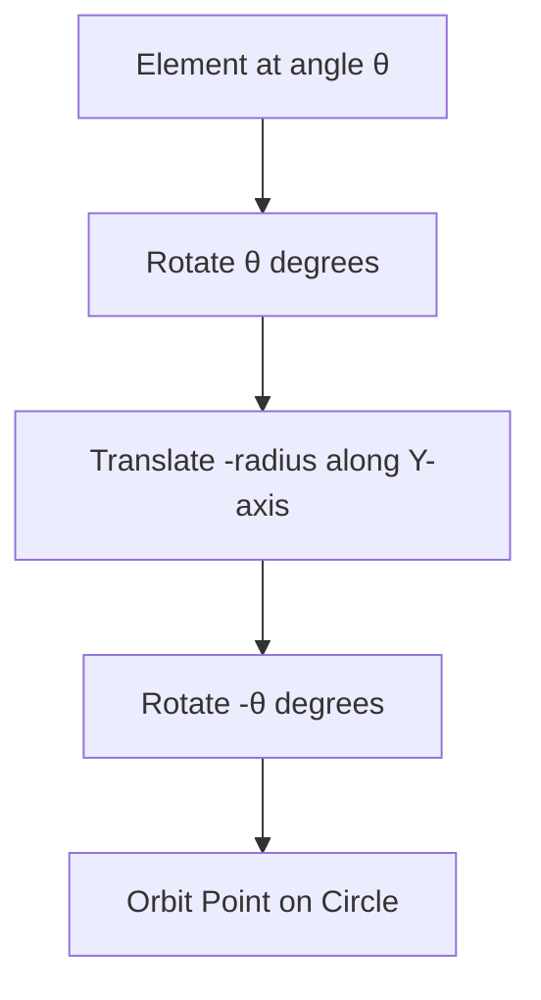
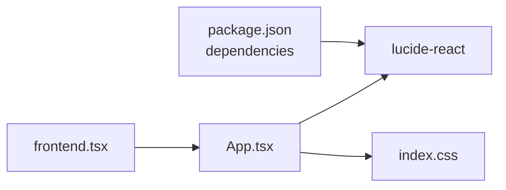

# Orrery Visualization Structure

<cite>
**Referenced Files in This Document**
- [App.tsx](file://src/App.tsx)
- [frontend.tsx](file://src/frontend.tsx)
- [index.html](file://src/index.html)
- [index.css](file://src/index.css)
- [package.json](file://package.json)
- [tsconfig.json](file://tsconfig.json)
- [README.md](file://README.md)
</cite>

## Table of Contents
1. [Introduction](#introduction)
2. [Project Structure](#project-structure)
3. [Core Components](#core-components)
4. [Architecture Overview](#architecture-overview)
5. [Detailed Component Analysis](#detailed-component-analysis)
6. [Dependency Analysis](#dependency-analysis)
7. [Performance Considerations](#performance-considerations)
8. [Accessibility Considerations](#accessibility-considerations)
9. [Extensibility Guide](#extensibility-guide)
10. [Troubleshooting Guide](#troubleshooting-guide)
11. [Conclusion](#conclusion)

## Introduction
This document describes the orrery visualization component that renders a concentric, orbiting system representing an autonomous agent operating system. The visualization consists of:
- An outer ring for ventures
- A middle ring for C-suite agents
- An inner core for the cognitive interface

It uses CSS transforms to position elements in circular orbits and CSS keyframe animations to achieve continuous spinning. Interactive features include hover tooltips for agent performance and mode toggle buttons that change the central brain’s appearance. Accessibility and extensibility guidance is also provided.

## Project Structure
The visualization is implemented as a single-page React application with minimal external dependencies. The entry point mounts the App component into the DOM, which renders the orrery scene and related UI.

**Diagram sources**
- [index.html](file://src/index.html#L1-L14)
- [frontend.tsx](file://src/frontend.tsx#L1-L27)
- [App.tsx](file://src/App.tsx#L1-L206)
- [index.css](file://src/index.css#L1-L188)
- [package.json](file://package.json#L1-L31)

**Section sources**
- [index.html](file://src/index.html#L1-L14)
- [frontend.tsx](file://src/frontend.tsx#L1-L27)
- [App.tsx](file://src/App.tsx#L1-L206)
- [index.css](file://src/index.css#L1-L188)
- [package.json](file://package.json#L1-L31)
- [tsconfig.json](file://tsconfig.json#L1-L18)
- [README.md](file://README.md#L1-L22)

## Core Components
- App.tsx: Hosts the orrery scene, manages modes and hover state, and renders:
  - Outer ring of ventures
  - Middle ring of C-suite agents
  - Inner core cognitive interface with mode toggles
  - Floating tooltip for agent details
  - Background starfield and connection lines
- frontend.tsx: React root bootstrap that renders the App component.
- index.css: Global styles and reduced-motion support.
- package.json: Declares Lucide React icons as a dependency.

Key data models:
- Agent model: id, name, role, icon, angle
- Venture model: name, icon, description
- Modes model: mode key, color classes, background classes, border classes, icon, description

**Section sources**
- [App.tsx](file://src/App.tsx#L1-L206)
- [frontend.tsx](file://src/frontend.tsx#L1-L27)
- [index.css](file://src/index.css#L1-L188)
- [package.json](file://package.json#L1-L31)

## Architecture Overview
The orrery is composed of three concentric rings and a central core. Each ring rotates independently to simulate orbital motion. Elements are positioned using CSS transforms with rotation and translation around the center. Hover interactions update the floating tooltip. Mode toggles change the central core’s visual theme.

**Diagram sources**
- [App.tsx](file://src/App.tsx#L1-L206)

## Detailed Component Analysis

### Concentric Rings and Orbital Mechanics
- Outer ring (ventures):
  - A circular border animates continuously to simulate orbital motion.
  - Ventures are positioned around the ring using rotate and translateY transforms, then rotated back to face outward.
  - Tooltips show venture name and description on hover.
- Middle ring (C-suite agents):
  - A smaller circular border rotates in the opposite direction for parallax effect.
  - Agents are positioned using angle-based transforms around the ring.
  - Hover updates a floating tooltip with agent name, role, and a performance metric bar.
- Inner core (cognitive interface):
  - A central panel with mode-dependent colors, borders, and backgrounds.
  - The brain icon pulses gently using a periodic state toggle.

**Diagram sources**
- [App.tsx](file://src/App.tsx#L1-L206)

**Section sources**
- [App.tsx](file://src/App.tsx#L1-L206)

### Data Models and Icon Mappings
- Agent model
  - Properties: id, name, role, icon, angle
  - Example entries define roles and angles for five agents.
- Venture model
  - Properties: name, icon, description
  - Example entries define four ventures.
- Modes model
  - Keys: Executive, Technical, Creative
  - Values: color classes, background classes, border classes, icon, description

Icon mappings come from Lucide React and are imported at the top of the file.

**Diagram sources**
- [App.tsx](file://src/App.tsx#L1-L206)
- [package.json](file://package.json#L1-L31)

**Section sources**
- [App.tsx](file://src/App.tsx#L1-L206)
- [package.json](file://package.json#L1-L31)

### Interactive Features
- Hover tooltips for agents:
  - Mouse enter/leave handlers update hovered agent state.
  - A floating tooltip displays agent name, role, and a performance indicator.
- Mode toggle buttons:
  - Buttons switch the active mode, changing the core’s color scheme, border, background, and description.
  - The brain icon pulses periodically while the mode remains active.

**Diagram sources**
- [App.tsx](file://src/App.tsx#L1-L206)

**Section sources**
- [App.tsx](file://src/App.tsx#L1-L206)

### CSS Transforms and Animations
- Positioning:
  - Each element is placed using rotate(angle), translateY(radius), and rotate(-angle) to orient outward along the ring.
- Rotation:
  - Outer ring spins slowly in one direction.
  - Middle ring spins faster in the opposite direction.
- Pulsing:
  - The brain icon scales and fades slightly on a timer to convey activity.

**Diagram sources**
- [App.tsx](file://src/App.tsx#L1-L206)

**Section sources**
- [App.tsx](file://src/App.tsx#L1-L206)
- [index.css](file://src/index.css#L1-L188)

## Dependency Analysis
External dependencies:
- lucide-react: Provides icons used for agents, ventures, and decorative elements.
- Tailwind-like utility classes: Used for layout, colors, shadows, transitions, and responsive behavior.

Internal relationships:
- frontend.tsx creates the React root and renders App.
- App.tsx composes the orrery scene and manages state for interactions.

**Diagram sources**
- [package.json](file://package.json#L1-L31)
- [frontend.tsx](file://src/frontend.tsx#L1-L27)
- [App.tsx](file://src/App.tsx#L1-L206)
- [index.css](file://src/index.css#L1-L188)

**Section sources**
- [package.json](file://package.json#L1-L31)
- [frontend.tsx](file://src/frontend.tsx#L1-L27)
- [App.tsx](file://src/App.tsx#L1-L206)
- [index.css](file://src/index.css#L1-L188)

## Performance Considerations
- CSS transforms and animations are GPU-friendly and suitable for smooth orbital motion.
- Reduced motion support is enabled globally; users who prefer reduced motion will have animations disabled.
- The tooltip and core panel use lightweight transitions; keep future additions minimal to preserve frame rates.

[No sources needed since this section provides general guidance]

## Accessibility Considerations
- Reduced motion:
  - The global reduced-motion media query disables animations for users who prefer less motion.
- Keyboard navigation:
  - Mode toggle buttons are native buttons and can receive focus and be activated via Enter/Space.
  - No additional keyboard handlers are present; ensure future enhancements provide explicit focus management and ARIA attributes if needed.
- Screen readers:
  - Tooltips are visually oriented; consider adding aria-live regions or ARIA attributes to convey dynamic content to assistive technologies if tooltips become essential for accessibility.

**Section sources**
- [index.css](file://src/index.css#L181-L188)
- [App.tsx](file://src/App.tsx#L1-L206)

## Extensibility Guide
Adding new agents:
- Extend the agents array with a new object containing id, name, role, icon, and angle.
- Ensure angle spacing avoids overlap with existing agents.
- Adjust middle ring radius or animation speed if necessary.

Adding new ventures:
- Extend the ventures array with a new object containing name, icon, and description.
- The outer ring automatically distributes items evenly; adjust count or spacing if needed.

Customizing modes:
- Add a new mode to the modes object with color, background, border, icon, and description classes.
- Ensure the mode classes match the core panel’s class composition.

Changing orbital dynamics:
- Modify the animation durations on the outer and middle rings to alter orbital speeds.
- Adjust translateY radii to change ring sizes.

Changing visuals:
- Replace icons from lucide-react by importing new icons and assigning them to agents or ventures.
- Update core panel classes to reflect new color themes.

**Section sources**
- [App.tsx](file://src/App.tsx#L1-L206)
- [package.json](file://package.json#L1-L31)

## Troubleshooting Guide
- Icons not rendering:
  - Verify lucide-react is installed and available in dependencies.
- Styles not applying:
  - Confirm Tailwind-style class names are valid and not overridden by conflicting styles.
- Animations not playing:
  - Check for reduced-motion preferences disabling animations.
- Tooltip not appearing:
  - Ensure mouse events are not blocked by parent containers and that the hoveredAgent state updates correctly.

**Section sources**
- [package.json](file://package.json#L1-L31)
- [index.css](file://src/index.css#L1-L188)
- [App.tsx](file://src/App.tsx#L1-L206)

## Conclusion
The orrery visualization presents a clean, modular structure using CSS transforms and keyframe animations to simulate orbital motion. Its concentric design communicates hierarchy and relationships among agents, ventures, and the cognitive core. With Lucide React icons and mode-driven theming, the component is both visually engaging and extensible. Following the guidance here ensures maintainability and accessibility as the system evolves.