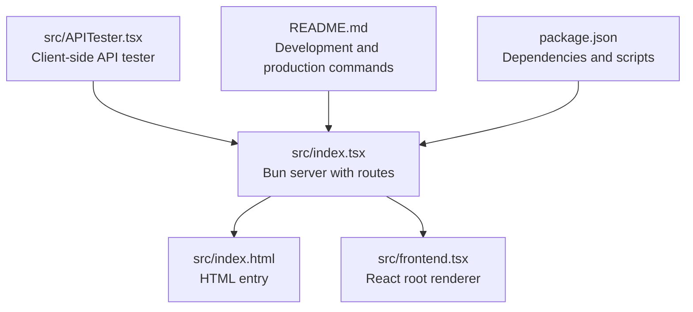
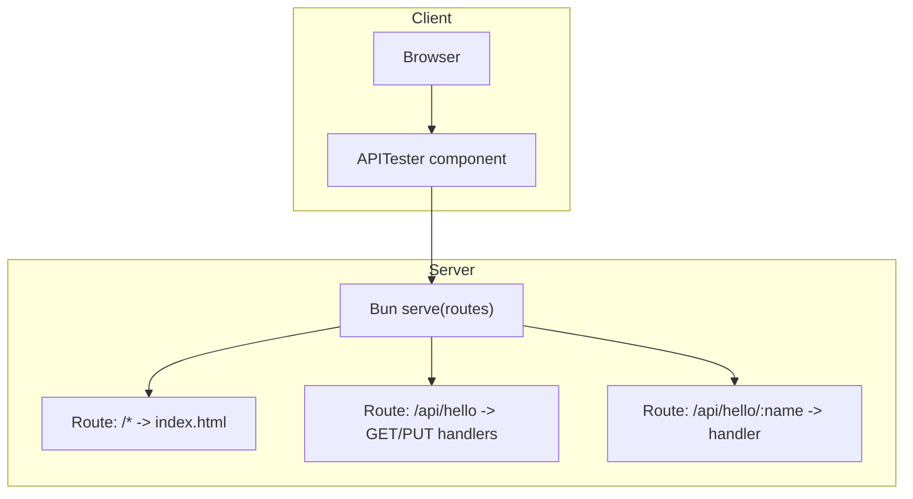
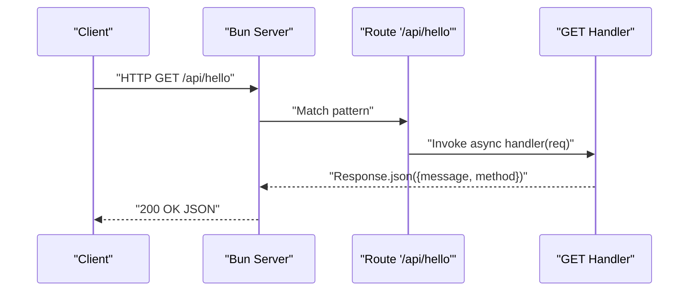
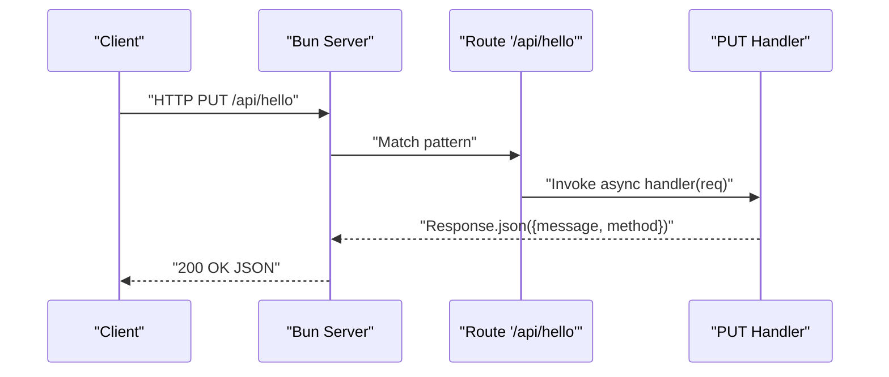
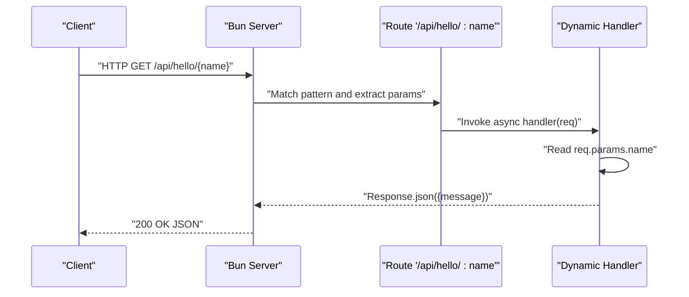
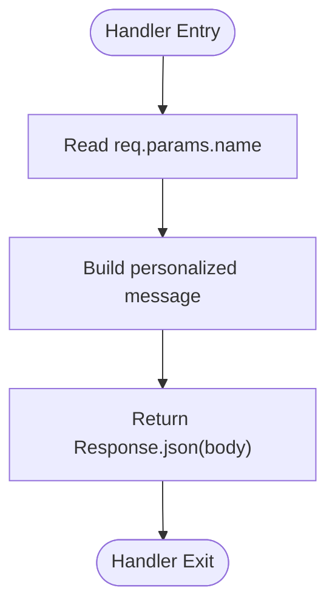
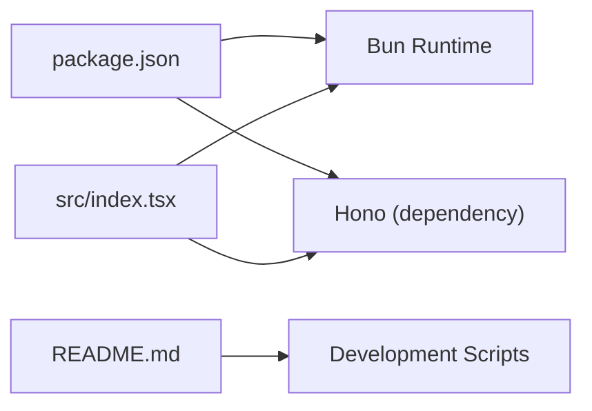

# API Routing Mechanism

<cite>
**Referenced Files in This Document**
- [src/index.tsx](file://src/index.tsx)
- [src/index.html](file://src/index.html)
- [src/frontend.tsx](file://src/frontend.tsx)
- [src/APITester.tsx](file://src/APITester.tsx)
- [README.md](file://README.md)
- [package.json](file://package.json)
</cite>

## Table of Contents
1. [Introduction](#introduction)
2. [Project Structure](#project-structure)
3. [Core Components](#core-components)
4. [Architecture Overview](#architecture-overview)
5. [Detailed Component Analysis](#detailed-component-analysis)
6. [Dependency Analysis](#dependency-analysis)
7. [Performance Considerations](#performance-considerations)
8. [Troubleshooting Guide](#troubleshooting-guide)
9. [Conclusion](#conclusion)
10. [Appendices](#appendices)

## Introduction
This document explains the API routing mechanism implemented with Bun’s built-in server and Hono-like routing syntax. The routing is defined declaratively inside the routes object in src/index.tsx. It covers:
- Static routes and dynamic parameterized routes
- Handler signatures for GET and PUT
- Async request handling and JSON response formatting using Response.json()
- Route parameter extraction via req.params
- Middleware-free, minimalistic routing approach and its benefits
- Extension patterns for adding new routes, validation, and error handling

## Project Structure
The routing is implemented in a single file that bootstraps a Bun server with a routes object. Supporting files include the HTML entry and a small React frontend renderer. An API tester component demonstrates client-side consumption of the endpoints.

**Diagram sources**
- [src/index.tsx](file://src/index.tsx#L1-L41)
- [src/index.html](file://src/index.html#L1-L14)
- [src/frontend.tsx](file://src/frontend.tsx#L1-L27)
- [src/APITester.tsx](file://src/APITester.tsx#L1-L39)
- [README.md](file://README.md#L1-L22)
- [package.json](file://package.json#L1-L31)

**Section sources**
- [src/index.tsx](file://src/index.tsx#L1-L41)
- [src/index.html](file://src/index.html#L1-L14)
- [src/frontend.tsx](file://src/frontend.tsx#L1-L27)
- [README.md](file://README.md#L1-L22)
- [package.json](file://package.json#L1-L31)

## Core Components
- Bun server bootstrap with routes object
- Static route for “/api/hello” with GET and PUT handlers
- Dynamic parameterized route “/api/hello/:name”
- Frontend entry and React root rendering
- API tester component for manual testing

Key implementation highlights:
- Routes are defined as a plain object keyed by URL patterns.
- Handlers are async functions receiving a request object and returning Response.json() for JSON responses.
- Route parameters are accessed via req.params.
- A fallback route serves index.html for unmatched paths.

**Section sources**
- [src/index.tsx](file://src/index.tsx#L1-L41)
- [src/APITester.tsx](file://src/APITester.tsx#L1-L39)

## Architecture Overview
The server uses Bun’s serve() with a routes object. Requests are matched against declared patterns. Unmatched routes fall back to serving the SPA entry page. API endpoints return structured JSON responses.

**Diagram sources**
- [src/index.tsx](file://src/index.tsx#L1-L41)
- [src/APITester.tsx](file://src/APITester.tsx#L1-L39)

## Detailed Component Analysis

### Static Route: /api/hello
- Pattern: "/api/hello"
- Handlers:
  - GET(req): returns Response.json() with a message and method field
  - PUT(req): returns Response.json() with a message and method field
- Behavior: Both handlers are async and return JSON responses.

Handler signature and response structure:
- Signature: async function receiving a request object
- Response: Response.json() returning a JSON body

Parameter usage:
- Not applicable for this route; the handlers do not extract parameters.

**Section sources**
- [src/index.tsx](file://src/index.tsx#L9-L22)

### Dynamic Parameterized Route: /api/hello/:name
- Pattern: "/api/hello/:name"
- Handler:
  - Extracts the route parameter via req.params.name
  - Returns Response.json() with a personalized message
- Behavior: The handler is async and returns JSON.

Parameter extraction and usage:
- Access: req.params.name
- Usage: Construct a personalized greeting in the response body

**Section sources**
- [src/index.tsx](file://src/index.tsx#L24-L29)

### Fallback Route: /* -> index.html
- Pattern: "/*"
- Behavior: Serves the SPA entry page for all unmatched routes, enabling client-side routing.

**Section sources**
- [src/index.tsx](file://src/index.tsx#L6-L8)
- [src/index.html](file://src/index.html#L1-L14)

### Frontend Entry and Root Renderer
- index.html includes a script tag pointing to frontend.tsx
- frontend.tsx creates a React root and renders the App component
- This setup ensures the SPA is served for unmatched routes while API routes are handled by Bun’s router

**Section sources**
- [src/index.html](file://src/index.html#L1-L14)
- [src/frontend.tsx](file://src/frontend.tsx#L1-L27)

### API Tester Component
- Demonstrates manual testing of endpoints
- Supports GET and PUT methods
- Uses fetch to call endpoints and displays parsed JSON responses

**Section sources**
- [src/APITester.tsx](file://src/APITester.tsx#L1-L39)

### Sequence Diagram: GET /api/hello

**Diagram sources**
- [src/index.tsx](file://src/index.tsx#L9-L15)

### Sequence Diagram: PUT /api/hello

**Diagram sources**
- [src/index.tsx](file://src/index.tsx#L16-L21)

### Sequence Diagram: GET /api/hello/:name

**Diagram sources**
- [src/index.tsx](file://src/index.tsx#L24-L29)

### Flowchart: Parameter Extraction and Response Building

**Diagram sources**
- [src/index.tsx](file://src/index.tsx#L24-L29)

## Dependency Analysis
- Bun runtime provides the serve() function and the routes object
- The project includes Hono as a dependency, though the current implementation uses Bun’s native routing syntax
- Development scripts and environment are configured in package.json and README

**Diagram sources**
- [package.json](file://package.json#L1-L31)
- [src/index.tsx](file://src/index.tsx#L1-L41)
- [README.md](file://README.md#L1-L22)

**Section sources**
- [package.json](file://package.json#L1-L31)
- [README.md](file://README.md#L1-L22)
- [src/index.tsx](file://src/index.tsx#L1-L41)

## Performance Considerations
- Minimal routing: The routes object is a plain object with no middleware layers, reducing overhead and improving startup and request latency.
- Built-in async handlers: Using async handlers avoids blocking the event loop and enables efficient I/O.
- JSON responses: Response.json() provides a concise way to send structured data with appropriate headers.
- Hot module replacement: Development mode enables HMR and console logging for rapid iteration.

[No sources needed since this section provides general guidance]

## Troubleshooting Guide
Common issues and resolutions:
- Endpoint not found:
  - Verify the route pattern matches the request path exactly.
  - Confirm the method is supported (GET/PUT for /api/hello).
- Parameter not extracted:
  - Ensure the route pattern includes the parameter placeholder (:name).
  - Access the parameter via req.params.name in the handler.
- Unexpected response format:
  - Ensure the handler returns Response.json() with a plain object.
- CORS or preflight issues:
  - Add explicit headers if cross-origin requests are needed.
- Development vs production:
  - Development mode enables HMR and console echoing; production mode disables these features.

**Section sources**
- [src/index.tsx](file://src/index.tsx#L6-L39)
- [src/APITester.tsx](file://src/APITester.tsx#L1-L39)

## Conclusion
The API routing mechanism leverages Bun’s built-in server with a Hono-like, declarative routes object. It provides:
- Clean, minimal routing without middleware
- Easy-to-read handlers with async support
- Straightforward parameter extraction via req.params
- Efficient JSON responses using Response.json()

This approach improves developer experience and performance while remaining extensible for future enhancements.

[No sources needed since this section summarizes without analyzing specific files]

## Appendices

### Extension Patterns
- Adding new static routes:
  - Define a new key under routes with the desired path and handler(s).
- Adding new dynamic routes:
  - Use parameter placeholders in the path and access via req.params in the handler.
- Validation:
  - Validate req.params and request bodies inside handlers before responding.
- Error handling:
  - Wrap handler logic in try/catch blocks and return appropriate JSON error responses with status codes.
- Middleware-free approach:
  - Keep handlers self-contained; avoid external middleware layers to reduce overhead.

[No sources needed since this section provides general guidance]