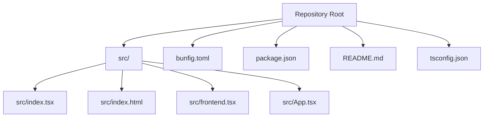
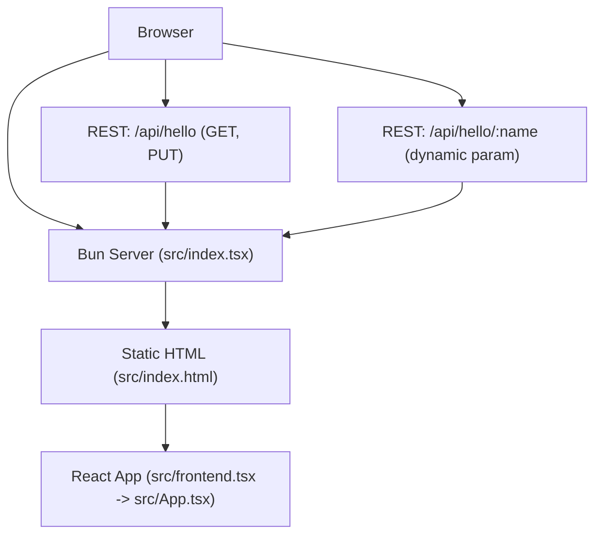
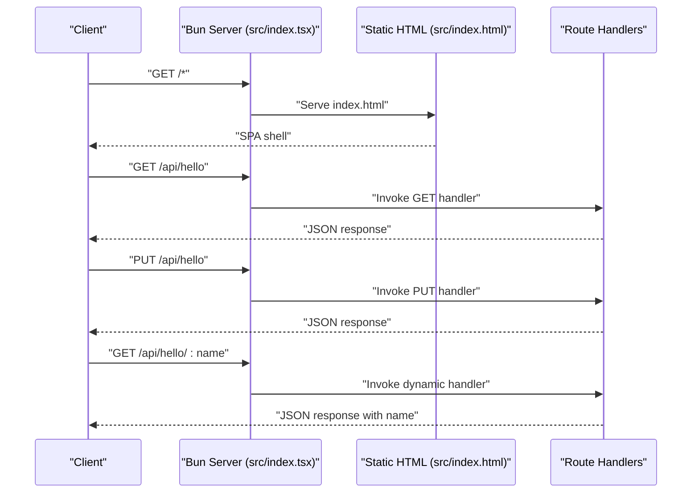
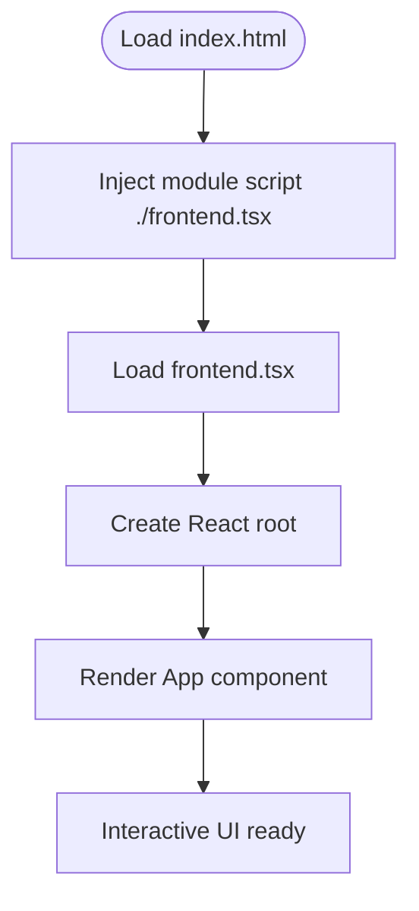
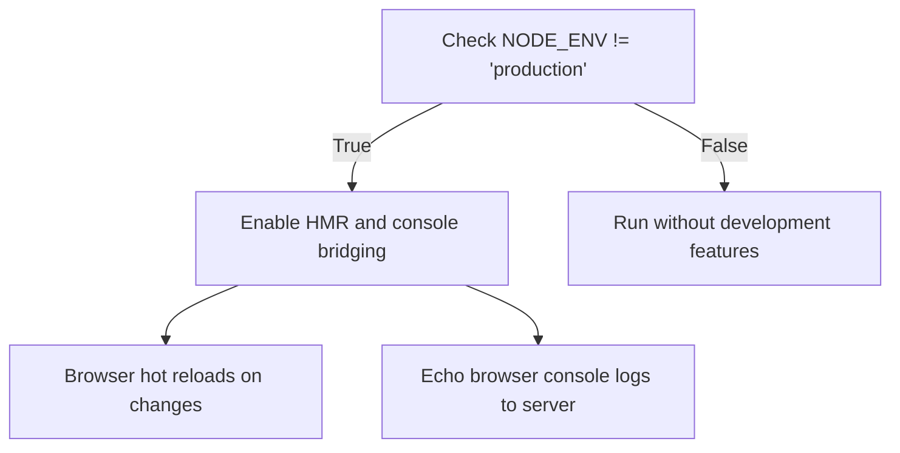
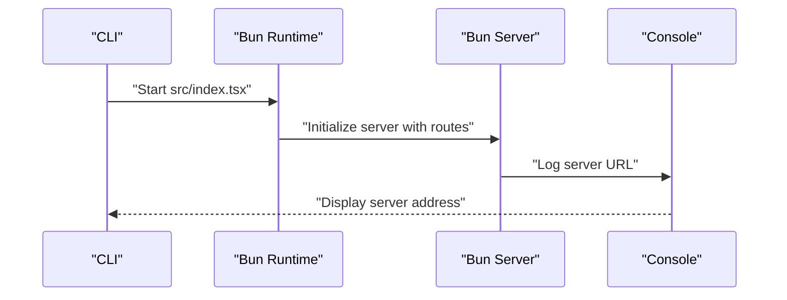
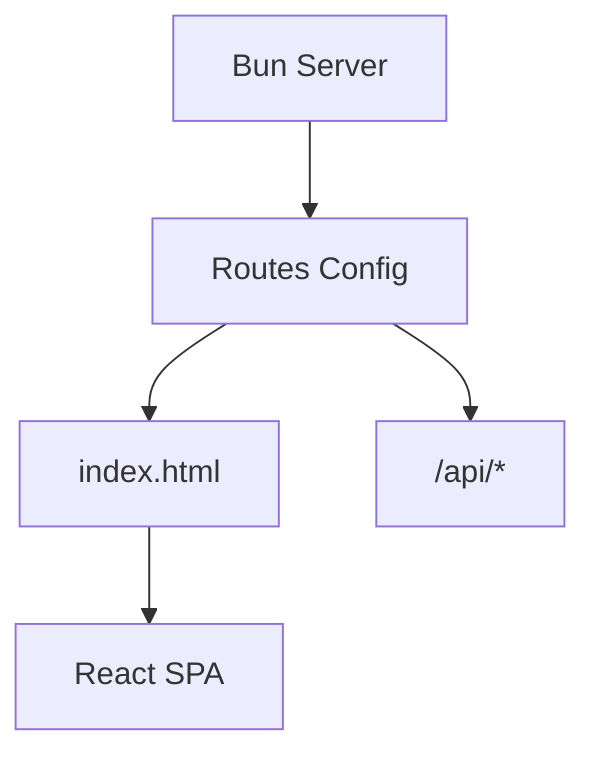
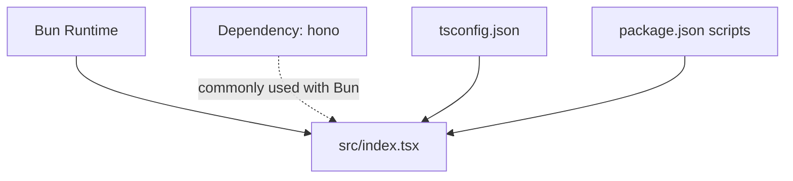

# Backend Architecture

<cite>
**Referenced Files in This Document**
- [src/index.tsx](file://src/index.tsx)
- [src/index.html](file://src/index.html)
- [src/frontend.tsx](file://src/frontend.tsx)
- [src/App.tsx](file://src/App.tsx)
- [bunfig.toml](file://bunfig.toml)
- [package.json](file://package.json)
- [README.md](file://README.md)
- [tsconfig.json](file://tsconfig.json)
</cite>

## Table of Contents
1. [Introduction](#introduction)
2. [Project Structure](#project-structure)
3. [Core Components](#core-components)
4. [Architecture Overview](#architecture-overview)
5. [Detailed Component Analysis](#detailed-component-analysis)
6. [Dependency Analysis](#dependency-analysis)
7. [Performance Considerations](#performance-considerations)
8. [Troubleshooting Guide](#troubleshooting-guide)
9. [Conclusion](#conclusion)

## Introduction
This document describes the Bun server backend architecture for serving both the HTTP server and static frontend assets from a single entry point. It explains how the embedded server architecture eliminates the need for separate frontend and backend servers, documents the Bun runtime’s built-in server capabilities, and outlines development and production considerations. It also covers the route definitions for RESTful endpoints under /api/hello and how they return JSON responses.

## Project Structure
The project is organized around a single entry point that initializes the Bun server, serves static HTML and React assets, and defines RESTful routes. The frontend is bundled and served inline with the server, enabling an embedded architecture.



**Diagram sources**
- [src/index.tsx](file://src/index.tsx#L1-L42)
- [src/index.html](file://src/index.html#L1-L14)
- [src/frontend.tsx](file://src/frontend.tsx#L1-L27)
- [src/App.tsx](file://src/App.tsx#L1-L206)
- [bunfig.toml](file://bunfig.toml#L1-L17)
- [package.json](file://package.json#L1-L31)
- [README.md](file://README.md#L1-L22)
- [tsconfig.json](file://tsconfig.json#L1-L18)

**Section sources**
- [src/index.tsx](file://src/index.tsx#L1-L42)
- [src/index.html](file://src/index.html#L1-L14)
- [src/frontend.tsx](file://src/frontend.tsx#L1-L27)
- [src/App.tsx](file://src/App.tsx#L1-L206)
- [bunfig.toml](file://bunfig.toml#L1-L17)
- [package.json](file://package.json#L1-L31)
- [README.md](file://README.md#L1-L22)
- [tsconfig.json](file://tsconfig.json#L1-L18)

## Core Components
- Embedded HTTP server entry point: Initializes the Bun server and mounts routes for both static HTML and REST endpoints.
- Static asset serving: Serves the prebuilt HTML and React application bundle.
- REST API routes: Defines GET and PUT handlers for /api/hello and a dynamic route for /api/hello/:name returning JSON.
- Development features: Hot module replacement and console bridging enabled in non-production environments.
- Build and runtime configuration: Bun configuration and environment variables for runtime behavior.

**Section sources**
- [src/index.tsx](file://src/index.tsx#L1-L42)
- [bunfig.toml](file://bunfig.toml#L1-L17)
- [package.json](file://package.json#L1-L31)

## Architecture Overview
The embedded server architecture combines a single Bun server instance that:
- Serves the SPA shell (index.html) for all unmatched routes.
- Exposes REST endpoints under /api/hello.
- Runs the React application bundled inside the HTML via a module script tag.



**Diagram sources**
- [src/index.tsx](file://src/index.tsx#L1-L42)
- [src/index.html](file://src/index.html#L1-L14)
- [src/frontend.tsx](file://src/frontend.tsx#L1-L27)
- [src/App.tsx](file://src/App.tsx#L1-L206)

## Detailed Component Analysis

### Embedded HTTP Server Entry Point
- Purpose: Creates a Bun server instance and mounts routes for static HTML and REST endpoints.
- Behavior:
  - Serves the SPA shell for all unmatched routes.
  - Defines REST endpoints under /api/hello with GET and PUT handlers.
  - Defines a dynamic route /api/hello/:name that reads a path parameter and returns JSON.
  - Enables development features (hot module replacement and console bridging) when not in production.
  - Logs the server URL upon startup.



**Diagram sources**
- [src/index.tsx](file://src/index.tsx#L1-L42)

**Section sources**
- [src/index.tsx](file://src/index.tsx#L1-L42)

### Static Asset Serving and SPA Shell
- Purpose: Provides the SPA shell that loads the React application.
- Behavior:
  - index.html includes a module script pointing to frontend.tsx.
  - frontend.tsx creates the React root and renders App.
  - App renders the interactive UI.



**Diagram sources**
- [src/index.html](file://src/index.html#L1-L14)
- [src/frontend.tsx](file://src/frontend.tsx#L1-L27)
- [src/App.tsx](file://src/App.tsx#L1-L206)

**Section sources**
- [src/index.html](file://src/index.html#L1-L14)
- [src/frontend.tsx](file://src/frontend.tsx#L1-L27)
- [src/App.tsx](file://src/App.tsx#L1-L206)

### RESTful Routes and JSON Responses
- Route: /api/hello
  - Method: GET
  - Response: JSON object containing a greeting and the method used.
  - Method: PUT
  - Response: JSON object containing a greeting and the method used.
- Route: /api/hello/:name
  - Parameter: name (from path)
  - Response: JSON object containing a greeting that includes the name.

```mermaid
flowchart TD
Entry(["Incoming Request"]) --> MatchRoute{"Matched Route?"}
MatchRoute --> |"/api/hello" (GET)| HandlerGet["Invoke GET handler"]
MatchRoute --> |"/api/hello" (PUT)| HandlerPut["Invoke PUT handler"]
MatchRoute --> |"/api/hello/:name"| HandlerName["Extract name param<br/>Invoke dynamic handler"]
HandlerGet --> BuildJSONGet["Build JSON payload"]
HandlerPut --> BuildJSONPut["Build JSON payload"]
HandlerName --> BuildJSONName["Build JSON payload with name"]
BuildJSONGet --> Respond["Return JSON response"]
BuildJSONPut --> Respond
BuildJSONName --> Respond
```

**Diagram sources**
- [src/index.tsx](file://src/index.tsx#L1-L42)

**Section sources**
- [src/index.tsx](file://src/index.tsx#L1-L42)

### Development Features: Hot Module Replacement and Console Bridging
- Purpose: Improve developer productivity during local development.
- Behavior:
  - Hot module replacement (HMR) enabled in development mode.
  - Console logs from the browser are echoed to the server console.
  - Development mode is active when NODE_ENV is not set to production.



**Diagram sources**
- [src/index.tsx](file://src/index.tsx#L1-L42)
- [bunfig.toml](file://bunfig.toml#L1-L17)

**Section sources**
- [src/index.tsx](file://src/index.tsx#L1-L42)
- [bunfig.toml](file://bunfig.toml#L1-L17)

### Server Startup Sequence and Port Binding
- Startup:
  - Bun server is initialized with a routes configuration.
  - The server logs its URL upon successful initialization.
- Port binding:
  - The server URL is logged to the console; the actual port selection follows Bun’s default behavior unless overridden by environment configuration.



**Diagram sources**
- [src/index.tsx](file://src/index.tsx#L1-L42)

**Section sources**
- [src/index.tsx](file://src/index.tsx#L1-L42)

### Embedded Server Architecture: Single Entry Point
- Purpose: Eliminate the need for separate frontend and backend servers by serving both HTML and API from one Bun server.
- Benefits:
  - Simplified deployment and reduced operational overhead.
  - Consistent routing and asset delivery.
  - Seamless SPA navigation with server-side fallback to index.html.



**Diagram sources**
- [src/index.tsx](file://src/index.tsx#L1-L42)
- [src/index.html](file://src/index.html#L1-L14)

**Section sources**
- [src/index.tsx](file://src/index.tsx#L1-L42)
- [src/index.html](file://src/index.html#L1-L14)

## Dependency Analysis
- Bun runtime:
  - Provides the serve API for building the embedded HTTP server.
- Hono:
  - Declared as a dependency; although not directly imported in the shown entry point, it is commonly used with Bun for routing and middleware.
- TypeScript configuration:
  - JSX and bundler module resolution tailored for Bun’s runtime.
- Package scripts:
  - Development and build commands leverage Bun’s native capabilities.



**Diagram sources**
- [src/index.tsx](file://src/index.tsx#L1-L42)
- [package.json](file://package.json#L1-L31)
- [tsconfig.json](file://tsconfig.json#L1-L18)

**Section sources**
- [src/index.tsx](file://src/index.tsx#L1-L42)
- [package.json](file://package.json#L1-L31)
- [tsconfig.json](file://tsconfig.json#L1-L18)

## Performance Considerations
- Bun runtime:
  - The project targets Bun as the runtime, leveraging its performance characteristics for server-side rendering and asset serving.
- Development vs production:
  - Development features (HMR and console bridging) are enabled when NODE_ENV is not production, optimizing DX.
  - Production runs without development overhead.
- Build pipeline:
  - TypeScript and bundling are configured for Bun’s module resolution and JSX support.

[No sources needed since this section provides general guidance]

## Troubleshooting Guide
- Server URL logging:
  - Confirm the server URL is printed to the console after startup.
- Route availability:
  - Verify that /api/hello responds with JSON for GET and PUT requests.
  - Verify that /api/hello/:name responds with JSON including the name parameter.
- Development mode:
  - Ensure NODE_ENV is not set to production to enable HMR and console bridging.
- SPA fallback:
  - Unmatched routes should serve index.html; confirm the SPA shell loads and React renders.

**Section sources**
- [src/index.tsx](file://src/index.tsx#L1-L42)
- [bunfig.toml](file://bunfig.toml#L1-L17)
- [README.md](file://README.md#L1-L22)

## Conclusion
The Bun server backend uses a single entry point to host both static frontend assets and REST endpoints, forming an embedded architecture that simplifies deployment and improves developer experience. The server initializes routes for SPA fallback and API endpoints, enables development features in non-production environments, and logs its URL for easy access. The provided route handlers demonstrate how to return JSON responses for different HTTP methods and dynamic parameters.