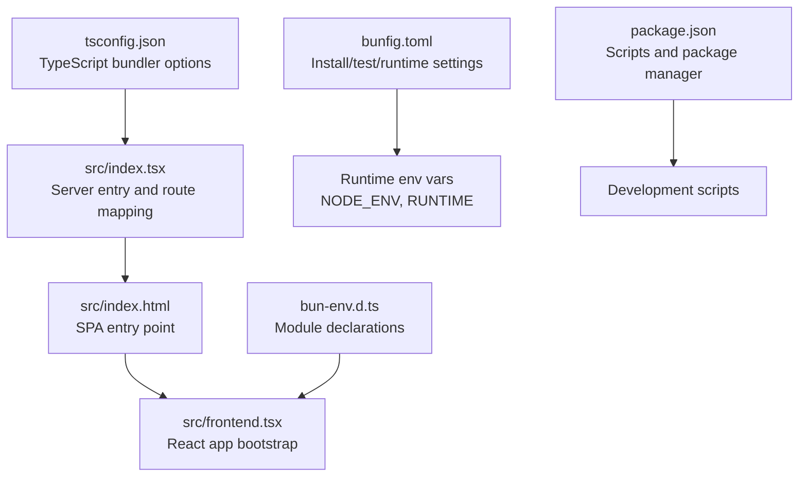
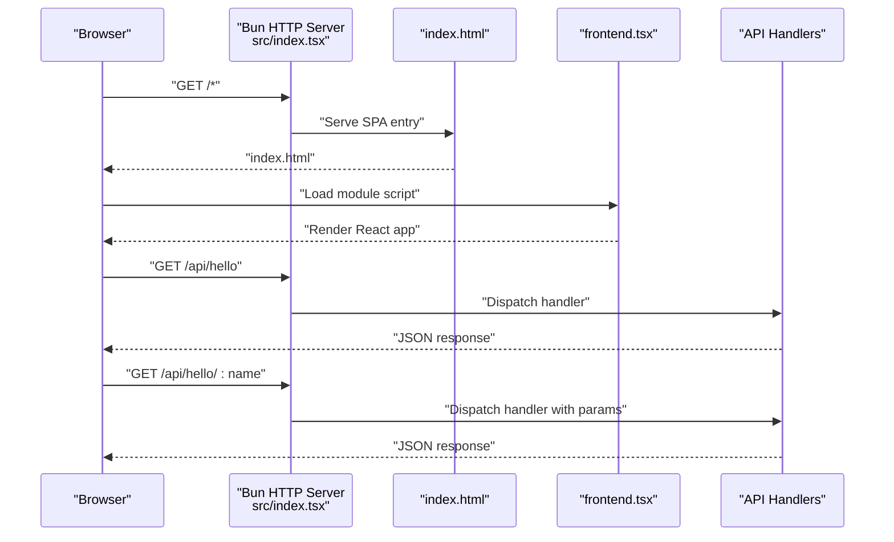
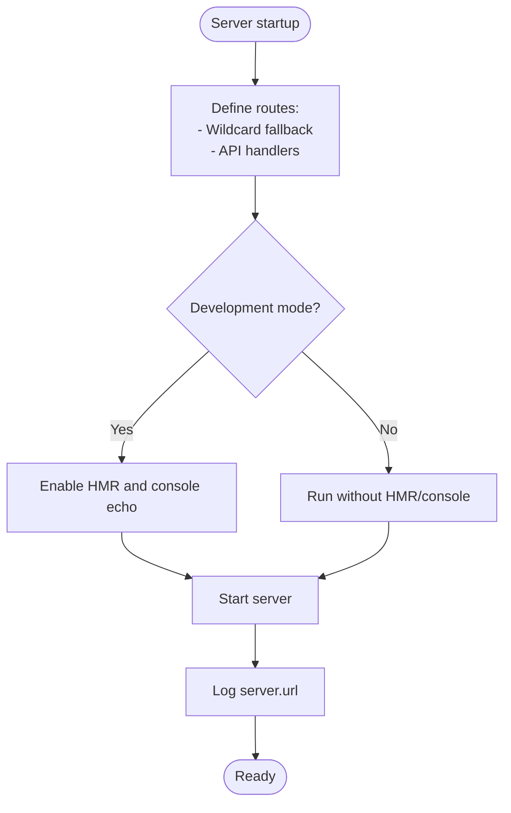
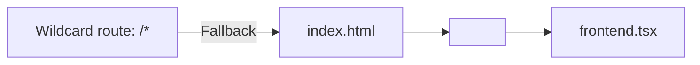
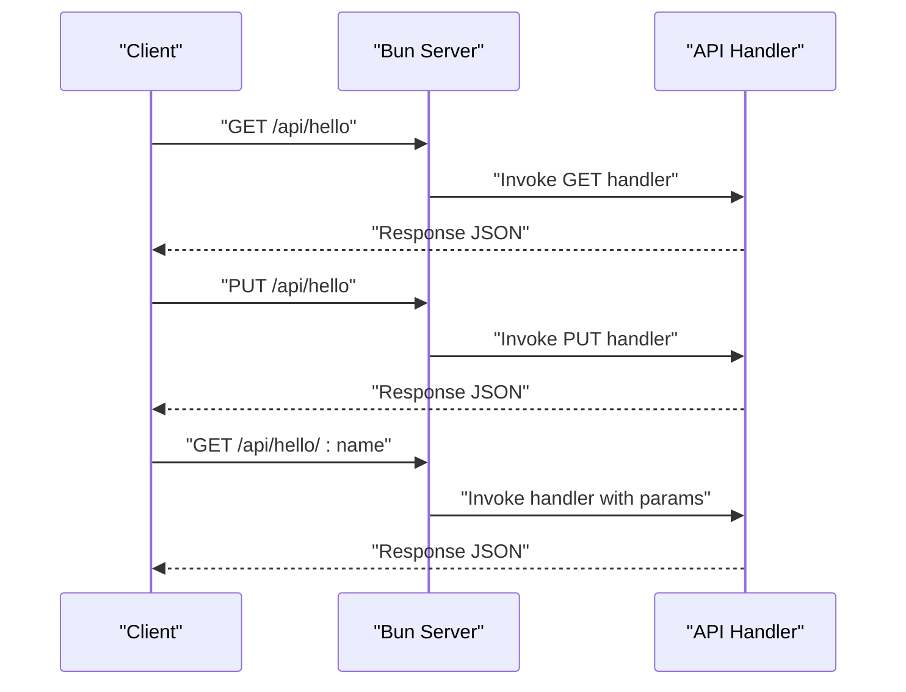
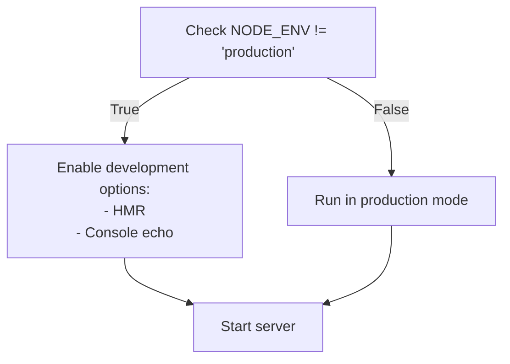
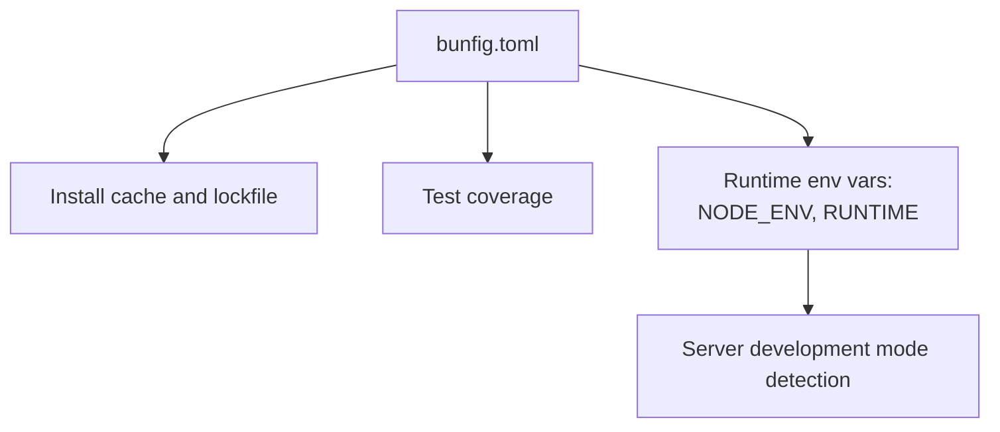
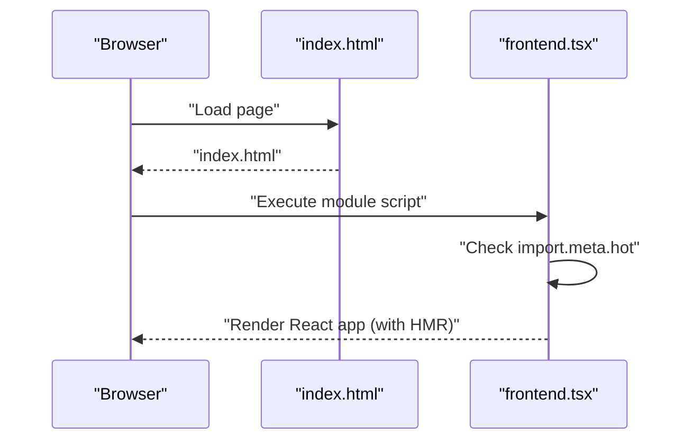
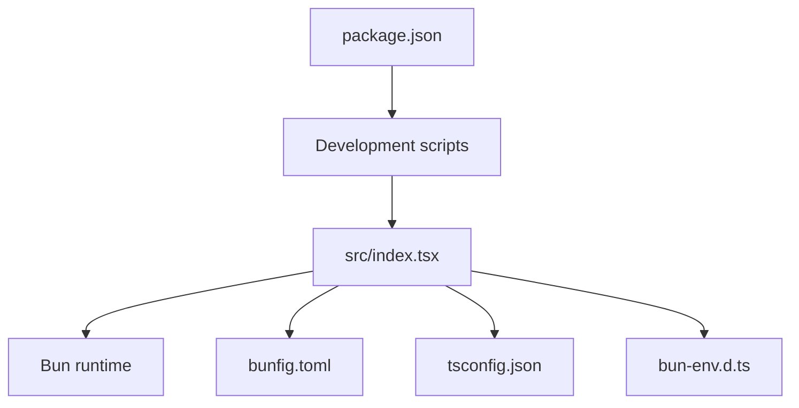

# Bun Server Configuration

<cite>
**Referenced Files in This Document**
- [src/index.tsx](file://src/index.tsx)
- [src/index.html](file://src/index.html)
- [src/frontend.tsx](file://src/frontend.tsx)
- [bunfig.toml](file://bunfig.toml)
- [package.json](file://package.json)
- [README.md](file://README.md)
- [bun-env.d.ts](file://bun-env.d.ts)
- [tsconfig.json](file://tsconfig.json)
</cite>

## Table of Contents
1. [Introduction](#introduction)
2. [Project Structure](#project-structure)
3. [Core Components](#core-components)
4. [Architecture Overview](#architecture-overview)
5. [Detailed Component Analysis](#detailed-component-analysis)
6. [Dependency Analysis](#dependency-analysis)
7. [Performance Considerations](#performance-considerations)
8. [Troubleshooting Guide](#troubleshooting-guide)
9. [Conclusion](#conclusion)

## Introduction
This document explains the Bun server configuration used to create a unified development server that serves both static assets and API endpoints. It focuses on how the serve function from Bun is configured in src/index.tsx to handle wildcard routing for frontend assets and specific API routes, how bunfig.toml influences installation caching, lockfile usage, test coverage, and runtime environment variables, and how development mode detection enables Hot Module Replacement (HMR) and console echoing. It also outlines performance implications of Bun’s native runtime and how configuration contributes to faster dependency resolution and testing cycles.

## Project Structure
The server is defined in a single entry file that configures Bun’s built-in HTTP server. Static assets are served from the src directory, with index.html acting as the SPA entry point. The frontend is a React application bootstrapped from a script tag inside index.html.

**Diagram sources**
- [src/index.tsx](file://src/index.tsx#L1-L42)
- [src/index.html](file://src/index.html#L1-L14)
- [src/frontend.tsx](file://src/frontend.tsx#L1-L27)
- [bunfig.toml](file://bunfig.toml#L1-L17)
- [package.json](file://package.json#L1-L31)
- [tsconfig.json](file://tsconfig.json#L1-L18)
- [bun-env.d.ts](file://bun-env.d.ts#L1-L18)

**Section sources**
- [src/index.tsx](file://src/index.tsx#L1-L42)
- [src/index.html](file://src/index.html#L1-L14)
- [src/frontend.tsx](file://src/frontend.tsx#L1-L27)
- [bunfig.toml](file://bunfig.toml#L1-L17)
- [package.json](file://package.json#L1-L31)
- [tsconfig.json](file://tsconfig.json#L1-L18)
- [bun-env.d.ts](file://bun-env.d.ts#L1-L18)

## Core Components
- Unified server via Bun’s serve function:
  - Wildcard route mapping for frontend asset fallback.
  - Specific API endpoints with dynamic route parameters.
  - Development-only HMR and console echo toggles.
- bunfig.toml configuration:
  - Install cache and lockfile usage.
  - Test coverage enablement.
  - Runtime environment variables for NODE_ENV and RUNTIME.
- Frontend entry and React bootstrap:
  - index.html includes a module script pointing to frontend.tsx.
  - frontend.tsx conditionally enables HMR rendering.

**Section sources**
- [src/index.tsx](file://src/index.tsx#L1-L42)
- [bunfig.toml](file://bunfig.toml#L1-L17)
- [src/index.html](file://src/index.html#L1-L14)
- [src/frontend.tsx](file://src/frontend.tsx#L1-L27)

## Architecture Overview
The server architecture combines a single Bun HTTP server that:
- Serves index.html for all unmatched routes (SPA fallback).
- Exposes API endpoints under /api/hello with support for GET and PUT, plus a dynamic route parameterized endpoint.
- Conditionally enables HMR and console echoing during development.
- Logs the runtime URL for easy access.

**Diagram sources**
- [src/index.tsx](file://src/index.tsx#L1-L42)
- [src/index.html](file://src/index.html#L1-L14)
- [src/frontend.tsx](file://src/frontend.tsx#L1-L27)

## Detailed Component Analysis

### Server Instantiation and Route Mapping
- Wildcard fallback:
  - The wildcard route ensures that unmatched requests return index.html, enabling client-side routing for single-page applications.
- API endpoints:
  - Static endpoint with multiple HTTP methods mapped to handlers.
  - Dynamic parameterized endpoint demonstrates route parameter extraction and response construction.
- Development mode toggles:
  - HMR and console echo are enabled only when NODE_ENV is not production.
- Logging runtime URL:
  - The server instance exposes a url property that is logged to the console.

**Diagram sources**
- [src/index.tsx](file://src/index.tsx#L1-L42)

**Section sources**
- [src/index.tsx](file://src/index.tsx#L1-L42)

### Frontend Asset Serving and SPA Fallback
- index.html acts as the SPA entry point and includes a module script that loads the React application.
- The wildcard route in the server serves index.html for all unmatched routes, delegating routing to the frontend.

**Diagram sources**
- [src/index.tsx](file://src/index.tsx#L1-L42)
- [src/index.html](file://src/index.html#L1-L14)
- [src/frontend.tsx](file://src/frontend.tsx#L1-L27)

**Section sources**
- [src/index.tsx](file://src/index.tsx#L1-L42)
- [src/index.html](file://src/index.html#L1-L14)
- [src/frontend.tsx](file://src/frontend.tsx#L1-L27)

### API Endpoint Handlers
- Static API endpoint:
  - Supports multiple HTTP methods with JSON responses.
- Parameterized endpoint:
  - Demonstrates extracting a route parameter and returning a JSON payload.

**Diagram sources**
- [src/index.tsx](file://src/index.tsx#L1-L42)

**Section sources**
- [src/index.tsx](file://src/index.tsx#L1-L42)

### Development Mode Detection and HMR/Console Echo
- Development mode is determined by checking whether NODE_ENV is not equal to production.
- When development mode is active:
  - HMR is enabled for the browser.
  - Console logs from the browser are echoed to the server console.
- These toggles are configured in the server options passed to serve.

**Diagram sources**
- [src/index.tsx](file://src/index.tsx#L1-L42)

**Section sources**
- [src/index.tsx](file://src/index.tsx#L1-L42)

### bunfig.toml Configuration Impact
- Install settings:
  - Enables installation caching and lockfile usage to speed up dependency resolution and ensure reproducible installs.
- Test settings:
  - Enables coverage collection during test runs to improve feedback on test quality.
- Runtime environment:
  - Sets NODE_ENV to development and RUNTIME to bun, aligning with the server’s development mode detection and logging.

**Diagram sources**
- [bunfig.toml](file://bunfig.toml#L1-L17)
- [src/index.tsx](file://src/index.tsx#L1-L42)

**Section sources**
- [bunfig.toml](file://bunfig.toml#L1-L17)
- [src/index.tsx](file://src/index.tsx#L1-L42)

### Frontend Bootstrap and HMR Integration
- index.html includes a module script that loads frontend.tsx.
- frontend.tsx conditionally uses HMR when available, persisting hot data across updates.

**Diagram sources**
- [src/index.html](file://src/index.html#L1-L14)
- [src/frontend.tsx](file://src/frontend.tsx#L1-L27)

**Section sources**
- [src/index.html](file://src/index.html#L1-L14)
- [src/frontend.tsx](file://src/frontend.tsx#L1-L27)

## Dependency Analysis
- Bun server configuration depends on:
  - Bun runtime for the serve function and development options.
  - bunfig.toml for environment and test settings.
  - package.json scripts for development and testing commands.
  - TypeScript configuration for module resolution and JSX handling.
  - Module declaration files for asset imports.

**Diagram sources**
- [src/index.tsx](file://src/index.tsx#L1-L42)
- [bunfig.toml](file://bunfig.toml#L1-L17)
- [package.json](file://package.json#L1-L31)
- [tsconfig.json](file://tsconfig.json#L1-L18)
- [bun-env.d.ts](file://bun-env.d.ts#L1-L18)

**Section sources**
- [src/index.tsx](file://src/index.tsx#L1-L42)
- [bunfig.toml](file://bunfig.toml#L1-L17)
- [package.json](file://package.json#L1-L31)
- [tsconfig.json](file://tsconfig.json#L1-L18)
- [bun-env.d.ts](file://bun-env.d.ts#L1-L18)

## Performance Considerations
- Bun’s native runtime:
  - Provides faster startup and execution compared to Node.js, reducing cold starts and improving developer ergonomics.
- Installation caching and lockfiles:
  - Enabling install cache and lockfile reduces network overhead and ensures deterministic installs, speeding up dependency resolution.
- Test coverage:
  - Running tests with coverage enabled helps catch regressions quickly, shortening feedback loops.
- Development-only HMR and console echo:
  - These features improve iteration speed during development without impacting production performance.

[No sources needed since this section provides general guidance]

## Troubleshooting Guide
- Server URL not printed:
  - Verify that the server instance is started and that the url property is logged after server creation.
  - Confirm that the server initialization completes without throwing errors.
- API endpoints not responding:
  - Ensure the route keys match the incoming requests and that handlers return appropriate responses.
  - Check for typos in route paths or missing HTTP method handlers.
- SPA fallback not working:
  - Confirm that the wildcard route is defined and that index.html is served for unmatched routes.
  - Verify that the frontend script tag in index.html points to the correct module entry.
- HMR not activating:
  - Ensure NODE_ENV is not set to production, as development options are only enabled when NODE_ENV is not equal to production.
  - Confirm that the frontend module uses HMR checks and that the server is running in development mode.

**Section sources**
- [src/index.tsx](file://src/index.tsx#L1-L42)
- [src/index.html](file://src/index.html#L1-L14)
- [src/frontend.tsx](file://src/frontend.tsx#L1-L27)
- [bunfig.toml](file://bunfig.toml#L1-L17)

## Conclusion
The Bun server configuration in this project consolidates static asset serving and API handling into a single, efficient server. The wildcard route ensures SPA fallback, while specific API endpoints provide backend functionality. bunfig.toml enhances developer productivity by enabling install caching, lockfiles, and test coverage, and by setting runtime environment variables that align with development mode detection. Together, these configurations leverage Bun’s native runtime to deliver faster dependency resolution and shorter testing cycles, while HMR and console echoing streamline the development experience.