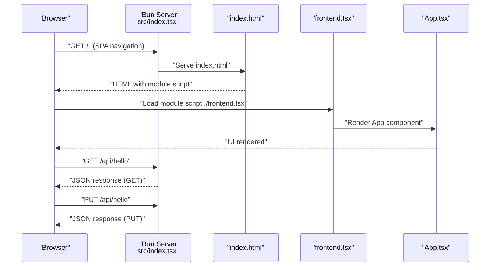
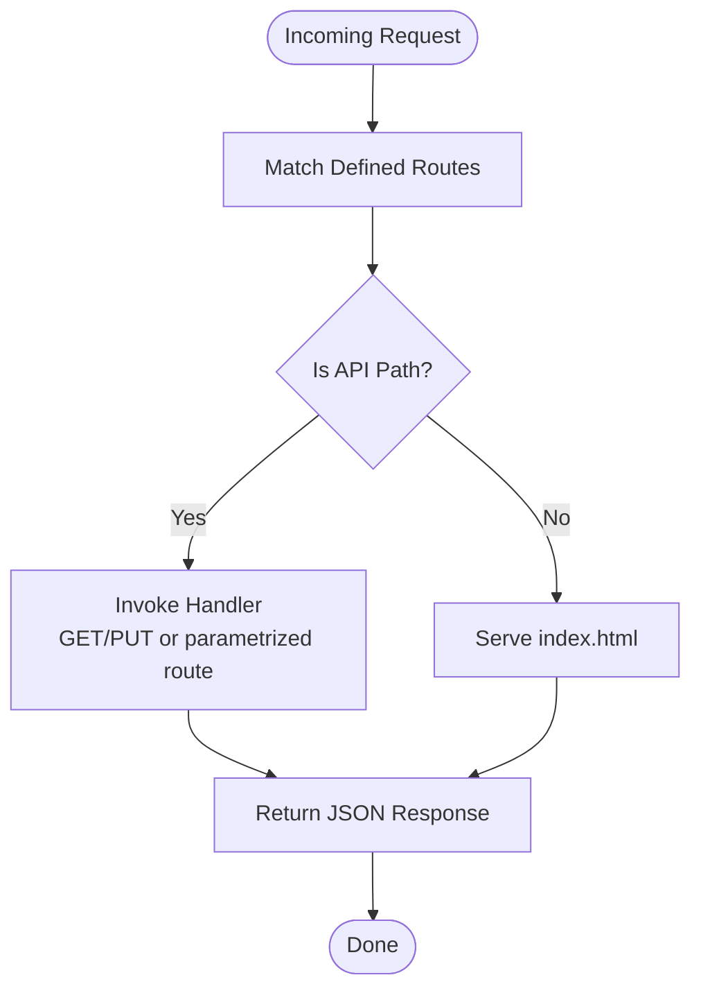
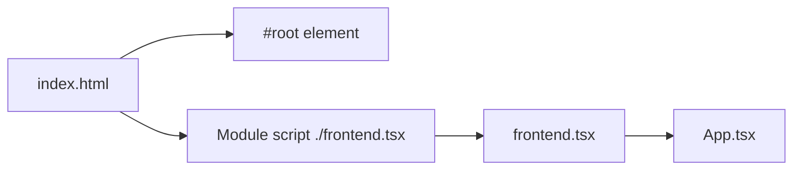
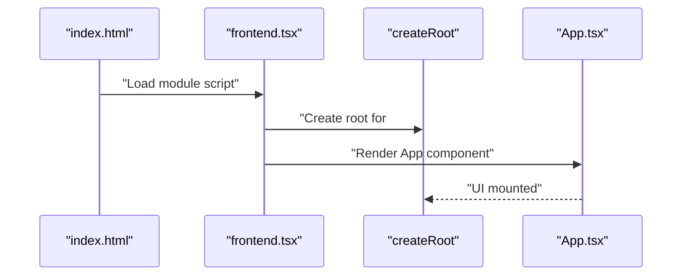
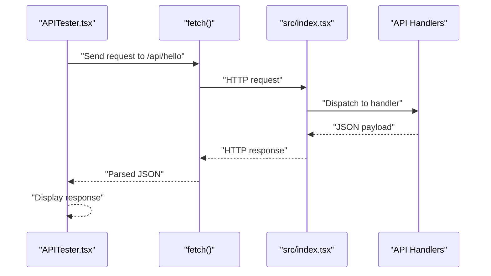
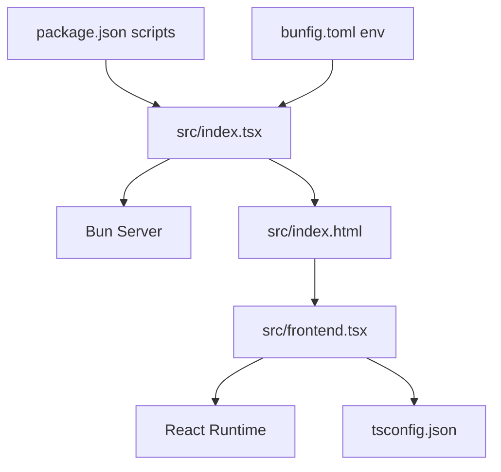

# Embedded Server Architecture

<cite>
**Referenced Files in This Document**
- [src/index.tsx](file://src/index.tsx)
- [src/frontend.tsx](file://src/frontend.tsx)
- [src/index.html](file://src/index.html)
- [src/App.tsx](file://src/App.tsx)
- [src/APITester.tsx](file://src/APITester.tsx)
- [package.json](file://package.json)
- [bunfig.toml](file://bunfig.toml)
- [tsconfig.json](file://tsconfig.json)
- [README.md](file://README.md)
</cite>

## Table of Contents
1. [Introduction](#introduction)
2. [Project Structure](#project-structure)
3. [Core Components](#core-components)
4. [Architecture Overview](#architecture-overview)
5. [Detailed Component Analysis](#detailed-component-analysis)
6. [Dependency Analysis](#dependency-analysis)
7. [Performance Considerations](#performance-considerations)
8. [Troubleshooting Guide](#troubleshooting-guide)
9. [Conclusion](#conclusion)
10. [Appendices](#appendices)

## Introduction
This document explains the embedded server architecture that unifies the frontend and backend into a single Bun process. The React application is served directly from the Bun server, which eliminates the need for a separate frontend server or a traditional build step. The server routes all unmatched requests to the static index.html, enabling client-side routing and hot module replacement during development. API endpoints are defined alongside the HTML route, ensuring same-origin behavior and automatic CORS resolution. The architecture reduces latency, simplifies deployment, and improves developer productivity with instant feedback loops.

## Project Structure
The project centers around a minimal Bun server that serves both static assets and API endpoints. The React application is embedded inside the HTML and loaded as a module script. Development-time hot reloading is enabled, and the server acts as a reverse proxy for frontend routes via a catch-all rule.

```mermaid
graph TB
subgraph "Bun Server"
S["Server Definition<br/>src/index.tsx"]
R["Routes"]
H["Static HTML Route<br/>\"/*\" -> index.html"]
A1["API Route<br/>/api/hello"]
A2["API Route<br/>/api/hello/:name"]
end
subgraph "Frontend"
I["HTML Template<br/>src/index.html"]
F["React Entry<br/>src/frontend.tsx"]
APP["App Component<br/>src/App.tsx"]
end
subgraph "Runtime Config"
P["package.json scripts"]
B["bunfig.toml env"]
T["tsconfig.json bundler"]
end
S --> R
R --> H
R --> A1
R --> A2
I --> F
F --> APP
P --> S
B --> S
T --> F
```

**Diagram sources**
- [src/index.tsx](file://src/index.tsx#L1-L42)
- [src/index.html](file://src/index.html#L1-L14)
- [src/frontend.tsx](file://src/frontend.tsx#L1-L27)
- [src/App.tsx](file://src/App.tsx#L1-L206)
- [package.json](file://package.json#L1-L31)
- [bunfig.toml](file://bunfig.toml#L1-L17)
- [tsconfig.json](file://tsconfig.json#L1-L18)

**Section sources**
- [src/index.tsx](file://src/index.tsx#L1-L42)
- [src/index.html](file://src/index.html#L1-L14)
- [src/frontend.tsx](file://src/frontend.tsx#L1-L27)
- [package.json](file://package.json#L1-L31)
- [bunfig.toml](file://bunfig.toml#L1-L17)
- [tsconfig.json](file://tsconfig.json#L1-L18)

## Core Components
- Bun Server with Routes
  - Defines a catch-all route that serves the static index.html for all unmatched paths, enabling SPA-style navigation.
  - Exposes two API endpoints under /api/hello with GET and PUT handlers and a parameterized route /api/hello/:name.
  - Enables development features such as hot module replacement and console logging bridging.
- Static HTML Template
  - Provides the root div and loads the React entrypoint as a module script.
- React Frontend
  - Renders the App component into the root element and integrates hot reloading when available.
- API Tester
  - Demonstrates same-origin API consumption using the browser’s fetch API against local endpoints.

**Section sources**
- [src/index.tsx](file://src/index.tsx#L1-L42)
- [src/index.html](file://src/index.html#L1-L14)
- [src/frontend.tsx](file://src/frontend.tsx#L1-L27)
- [src/APITester.tsx](file://src/APITester.tsx#L1-L40)

## Architecture Overview
The embedded architecture combines a Bun server and a React application in a single process. The server serves index.html for all routes, allowing the browser to load the React app and handle client-side routing. API requests are handled by the Bun server, keeping all traffic on the same origin. Development benefits include hot reloading and console bridging. Production considerations include asset caching and scalability on platforms like Akash Network.



**Diagram sources**
- [src/index.tsx](file://src/index.tsx#L1-L42)
- [src/index.html](file://src/index.html#L1-L14)
- [src/frontend.tsx](file://src/frontend.tsx#L1-L27)
- [src/App.tsx](file://src/App.tsx#L1-L206)

## Detailed Component Analysis

### Bun Server and Routing
- Catch-all Route
  - The server defines a “/*” route that serves the static index.html. This ensures that all client-side routes are handled by the SPA, while still allowing API endpoints to be reached.
- API Endpoints
  - /api/hello: Handles GET and PUT requests and returns JSON responses.
  - /api/hello/:name: Extracts a name parameter and returns a JSON greeting.
- Development Features
  - Hot Module Replacement (HMR) is enabled when not in production, improving iteration speed.
  - Console logging bridging echoes browser logs to the server console for easier debugging.



**Diagram sources**
- [src/index.tsx](file://src/index.tsx#L1-L42)

**Section sources**
- [src/index.tsx](file://src/index.tsx#L1-L42)

### Static HTML Template and Asset Delivery
- index.html
  - Declares the root element and includes a module script that loads the React entrypoint.
  - Provides metadata and favicon references for the application.
- Asset Delivery
  - Because the server serves index.html for all routes, static assets referenced from the HTML template are delivered by the same server process. This maintains same-origin semantics and avoids cross-origin concerns.



**Diagram sources**
- [src/index.html](file://src/index.html#L1-L14)
- [src/frontend.tsx](file://src/frontend.tsx#L1-L27)
- [src/App.tsx](file://src/App.tsx#L1-L206)

**Section sources**
- [src/index.html](file://src/index.html#L1-L14)

### React Frontend Integration
- frontend.tsx
  - Creates the React root and renders the App component into the #root element.
  - Integrates hot module replacement when available, persisting the root instance across updates.
- App.tsx
  - Implements the application UI, including interactive elements and informational content.
- APITester.tsx
  - Demonstrates same-origin API consumption using the browser’s fetch API against local endpoints.



**Diagram sources**
- [src/index.html](file://src/index.html#L1-L14)
- [src/frontend.tsx](file://src/frontend.tsx#L1-L27)
- [src/App.tsx](file://src/App.tsx#L1-L206)

**Section sources**
- [src/frontend.tsx](file://src/frontend.tsx#L1-L27)
- [src/App.tsx](file://src/App.tsx#L1-L206)
- [src/APITester.tsx](file://src/APITester.tsx#L1-L40)

### API Request Handling Within Same Origin
- Same-Origin Behavior
  - API endpoints are hosted on the same origin as the SPA, eliminating CORS concerns.
- Client Consumption
  - The APITester component demonstrates fetching endpoints and displaying responses, illustrating seamless integration.



**Diagram sources**
- [src/APITester.tsx](file://src/APITester.tsx#L1-L40)
- [src/index.tsx](file://src/index.tsx#L1-L42)

**Section sources**
- [src/APITester.tsx](file://src/APITester.tsx#L1-L40)
- [src/index.tsx](file://src/index.tsx#L1-L42)

### Development Benefits and Production Considerations
- Development Benefits
  - Hot Module Replacement: Enabled via server configuration, reducing reload cycles and improving feedback speed.
  - Console Bridging: Browser console logs are echoed to the server console for unified debugging.
- Production Considerations
  - Asset Caching: Configure cache headers for static assets to improve performance on Akash Network.
  - Scalability: The single-process model simplifies deployment; ensure resource limits and health checks are configured appropriately on Akash.

**Section sources**
- [src/index.tsx](file://src/index.tsx#L1-L42)
- [bunfig.toml](file://bunfig.toml#L1-L17)

## Dependency Analysis
The server depends on Bun’s built-in server capabilities and routes. The frontend depends on React and the module resolution configured in tsconfig.json. The project’s scripts in package.json define how to run the server in development and production contexts.



**Diagram sources**
- [src/index.tsx](file://src/index.tsx#L1-L42)
- [src/index.html](file://src/index.html#L1-L14)
- [src/frontend.tsx](file://src/frontend.tsx#L1-L27)
- [tsconfig.json](file://tsconfig.json#L1-L18)
- [package.json](file://package.json#L1-L31)
- [bunfig.toml](file://bunfig.toml#L1-L17)

**Section sources**
- [src/index.tsx](file://src/index.tsx#L1-L42)
- [package.json](file://package.json#L1-L31)
- [bunfig.toml](file://bunfig.toml#L1-L17)
- [tsconfig.json](file://tsconfig.json#L1-L18)

## Performance Considerations
- Reduced Latency
  - Serving the SPA and API from the same origin minimizes network overhead and avoids cross-origin restrictions.
- Simplified Deployment
  - Single binary process simplifies scaling and orchestration on platforms like Akash Network.
- Asset Caching
  - Configure long-term caching for static assets and use cache-busting strategies for immutable resources.
- Hot Reloading
  - Development HMR reduces iteration time; disable in production to avoid unnecessary overhead.

[No sources needed since this section provides general guidance]

## Troubleshooting Guide
- API Not Found
  - Verify that the requested path matches the defined API routes and that the server is running on the expected port.
- CORS Errors
  - Since API endpoints share the same origin as the SPA, CORS errors are unlikely. Confirm that the frontend is making requests to the same host and port as the server.
- Hot Reload Issues
  - Ensure development mode is active and that HMR is enabled. Check that the browser console displays logs bridged from the server.
- Build and Run Commands
  - Use the development command to start the server locally and the production command for deployment.

**Section sources**
- [src/index.tsx](file://src/index.tsx#L1-L42)
- [README.md](file://README.md#L1-L22)

## Conclusion
This embedded server architecture consolidates the frontend and backend into a single Bun process. By serving index.html for all routes and hosting API endpoints on the same origin, the system achieves reduced latency, simplified deployment, and automatic CORS resolution. Development benefits include hot reloading and console bridging, while production considerations focus on asset caching and platform-specific scalability.

[No sources needed since this section summarizes without analyzing specific files]

## Appendices
- Development and Production Scripts
  - Development: Starts the Bun server with hot reloading and console bridging.
  - Production: Runs the server in production mode with caching and minimal overhead.
- Environment Configuration
  - Bun runtime configuration sets environment variables and enables performance-oriented defaults.

**Section sources**
- [package.json](file://package.json#L1-L31)
- [bunfig.toml](file://bunfig.toml#L1-L17)
- [README.md](file://README.md#L1-L22)