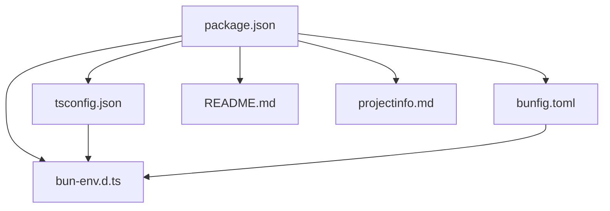
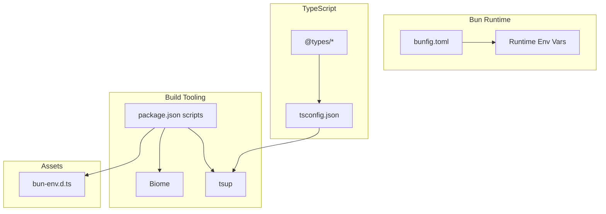
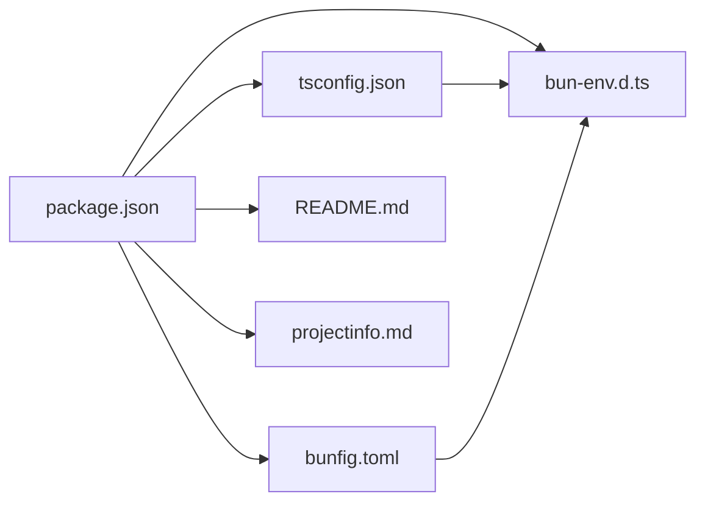

# Configuration

<cite>
**Referenced Files in This Document**
- [package.json](file://package.json)
- [tsconfig.json](file://tsconfig.json)
- [bunfig.toml](file://bunfig.toml)
- [bun-env.d.ts](file://bun-env.d.ts)
- [README.md](file://README.md)
- [projectinfo.md](file://projectinfo.md)
</cite>

## Table of Contents
1. [Introduction](#introduction)
2. [Project Structure](#project-structure)
3. [Core Components](#core-components)
4. [Architecture Overview](#architecture-overview)
5. [Detailed Component Analysis](#detailed-component-analysis)
6. [Dependency Analysis](#dependency-analysis)
7. [Performance Considerations](#performance-considerations)
8. [Troubleshooting Guide](#troubleshooting-guide)
9. [Conclusion](#conclusion)
10. [Appendices](#appendices)

## Introduction
This section documents the project’s configuration files that define how the application is built, run, tested, and deployed. It focuses on:
- package.json scripts and dependencies
- TypeScript configuration via tsconfig.json
- Bun runtime and build optimization via bunfig.toml
- Environment variable handling and public variable exposure
- Practical customization examples and troubleshooting guidance

These configurations collectively enable a modern, fast, and scalable development and deployment pipeline powered by Bun.

## Project Structure
The configuration files are centralized at the repository root and complement the monorepo layout defined in the project metadata. The key files are:
- package.json: defines scripts, dependencies, and workspace configuration
- tsconfig.json: sets TypeScript compiler options and path aliases
- bunfig.toml: controls Bun installation, runtime, and test behaviors
- bun-env.d.ts: declares module augmentations for asset imports
- README.md and projectinfo.md: provide high-level usage and workflow guidance

**Diagram sources**
- [package.json](file://package.json#L1-L31)
- [tsconfig.json](file://tsconfig.json#L1-L18)
- [bunfig.toml](file://bunfig.toml#L1-L17)
- [bun-env.d.ts](file://bun-env.d.ts#L1-L18)
- [README.md](file://README.md#L1-L22)
- [projectinfo.md](file://projectinfo.md#L1-L91)

**Section sources**
- [package.json](file://package.json#L1-L31)
- [tsconfig.json](file://tsconfig.json#L1-L18)
- [bunfig.toml](file://bunfig.toml#L1-L17)
- [bun-env.d.ts](file://bun-env.d.ts#L1-L18)
- [README.md](file://README.md#L1-L22)
- [projectinfo.md](file://projectinfo.md#L1-L91)

## Core Components
This section explains the purpose and key settings of each configuration file.

- package.json
  - Module type: set to module to enable ES modules and modern bundler behavior.
  - Workspaces: configured for packages and apps directories to support a monorepo.
  - Scripts:
    - dev: hot-reloading development server for the API gateway app.
    - test: runs tests using Bun’s test runner.
    - build: compiles the project using tsup.
    - lint and lint:apply: static analysis with Biome.
  - Dependencies: includes Hono (web framework), Zod (schema validation), and Lucide React (icons).
  - DevDependencies: Biome, tsup, TypeScript, and @types/node.

- tsconfig.json
  - Compiler options:
    - target: ESNext for latest language features.
    - module: Preserve to defer module handling to downstream bundlers.
    - moduleResolution: bundler for compatibility with Bun and modern bundlers.
    - jsx: react-jsx for JSX transformation.
    - baseUrl and paths: alias @/* to src for clean imports.
  - Strictness: strict, skipLibCheck, forceConsistentCasingInFileNames enabled for safer builds.
  - Exclude: dist and node_modules to avoid unnecessary scanning.

- bunfig.toml
  - install: cache and lockfile enabled for reproducible installs.
  - run: cross-sudo disabled by default.
  - test: coverage enabled for faster feedback.
  - runtime: sets default environment variables for development.

- bun-env.d.ts
  - Declares module augmentations for importing SVG files and CSS modules, enabling type-safe asset imports.

- README.md and projectinfo.md
  - Provide high-level commands and workflow guidance, including production build and environment variable usage.

**Section sources**
- [package.json](file://package.json#L1-L31)
- [tsconfig.json](file://tsconfig.json#L1-L18)
- [bunfig.toml](file://bunfig.toml#L1-L17)
- [bun-env.d.ts](file://bun-env.d.ts#L1-L18)
- [README.md](file://README.md#L1-L22)
- [projectinfo.md](file://projectinfo.md#L1-L91)

## Architecture Overview
The configuration architecture ties together Bun runtime, TypeScript compilation, and build tooling to deliver a streamlined developer experience and efficient production builds.

**Diagram sources**
- [bunfig.toml](file://bunfig.toml#L1-L17)
- [tsconfig.json](file://tsconfig.json#L1-L18)
- [package.json](file://package.json#L1-L31)
- [bun-env.d.ts](file://bun-env.d.ts#L1-L18)

## Detailed Component Analysis

### package.json: Scripts, Dependencies, and Module Type
- Purpose
  - Defines the project’s module type, workspace layout, and command-line scripts for development, testing, building, and linting.
- Key settings
  - type: module enables ES modules and aligns with modern bundlers.
  - workspaces: ["packages/*", "apps/*"] supports a monorepo structure.
  - scripts:
    - dev: starts a hot-reloading server for the API gateway app.
    - test: executes Bun’s test runner.
    - build: invokes tsup for compilation.
    - lint and lint:apply: run Biome checks and auto-fix.
  - dependencies and devDependencies: include core libraries and tooling.
- Practical examples
  - Adding a new build script: extend the scripts section with a new key-value pair for custom tasks.
  - Changing output directory for builds: configure tsup to emit to a different directory and update scripts accordingly.
  - Introducing a new dev server: add a script that launches a new app with Bun’s run command and hot reloading.

**Section sources**
- [package.json](file://package.json#L1-L31)
- [projectinfo.md](file://projectinfo.md#L66-L70)

### tsconfig.json: TypeScript Compilation Settings
- Purpose
  - Establishes TypeScript compiler behavior for the project, including target language level, module handling, JSX transformation, and path aliases.
- Key settings
  - target: ESNext for cutting-edge language features.
  - module: Preserve to defer module resolution to bundlers.
  - moduleResolution: bundler for compatibility with Bun and modern bundlers.
  - jsx: react-jsx for transforming JSX.
  - baseUrl and paths: alias @/* to src for ergonomic imports.
  - strictness: strict, skipLibCheck, forceConsistentCasingInFileNames for robust type checking.
  - exclude: dist and node_modules to optimize build performance.
- Practical examples
  - Adjusting target or module: change compiler options to match your deployment target or bundler preferences.
  - Adding path aliases: extend baseUrl and paths for additional shortcuts.
  - Enabling experimental decorators or JSX attributes: add or modify compiler options as needed.

**Section sources**
- [tsconfig.json](file://tsconfig.json#L1-L18)

### bunfig.toml: Bun Runtime Optimization and Development Server Settings
- Purpose
  - Controls Bun’s installation, runtime, and test behaviors to improve performance and developer experience.
- Key settings
  - install.cache and install.lockfile: enable caching and lockfiles for reproducible installs.
  - run.enableCrossSudo: disabled by default for safety.
  - test.coverage: enabled for faster testing feedback.
  - runtime.env: sets default environment variables for development.
- Practical examples
  - Tuning install behavior: enable or disable cache and lockfile depending on CI or local workflows.
  - Adjusting runtime env: add or modify environment variables for different environments.
  - Optimizing test runs: toggle coverage and other test flags to balance speed and insight.

**Section sources**
- [bunfig.toml](file://bunfig.toml#L1-L17)

### bun-env.d.ts: Environment Variable Handling and Asset Imports
- Purpose
  - Declares module augmentations for importing assets like SVGs and CSS modules, enabling type-safe usage in TypeScript.
- Key settings
  - Module augmentation for "*.svg" and "*.module.css" to provide type-safe imports.
- Practical examples
  - Importing SVGs: use the declared module to import SVGs as paths.
  - Using CSS modules: leverage the declared module to access class names as a record.

**Section sources**
- [bun-env.d.ts](file://bun-env.d.ts#L1-L18)

### README.md and projectinfo.md: Commands and Workflow Guidance
- Purpose
  - Provide high-level commands for installing dependencies, starting development, and running in production.
  - Outline the development workflow and environment variable usage.
- Key settings
  - Development command: bun dev.
  - Production command: bun start.
  - Build command: includes sourcemap, minification, and environment variable injection.
  - Environment variable handling: BUN_PUBLIC_* prefixing for public variables.
- Practical examples
  - Running production: set NODE_ENV and run the compiled entrypoint.
  - Public variables: expose variables prefixed with BUN_PUBLIC_* for client-side consumption.

**Section sources**
- [README.md](file://README.md#L1-L22)
- [projectinfo.md](file://projectinfo.md#L66-L70)

## Dependency Analysis
This section maps how configuration files depend on each other and influence the build and runtime pipeline.

**Diagram sources**
- [package.json](file://package.json#L1-L31)
- [tsconfig.json](file://tsconfig.json#L1-L18)
- [bunfig.toml](file://bunfig.toml#L1-L17)
- [bun-env.d.ts](file://bun-env.d.ts#L1-L18)
- [README.md](file://README.md#L1-L22)
- [projectinfo.md](file://projectinfo.md#L1-L91)

**Section sources**
- [package.json](file://package.json#L1-L31)
- [tsconfig.json](file://tsconfig.json#L1-L18)
- [bunfig.toml](file://bunfig.toml#L1-L17)
- [bun-env.d.ts](file://bun-env.d.ts#L1-L18)
- [README.md](file://README.md#L1-L22)
- [projectinfo.md](file://projectinfo.md#L1-L91)

## Performance Considerations
Optimizations derived from configuration:
- Enable Bun install cache and lockfile to reduce install times and ensure reproducibility.
- Use moduleResolution bundler and preserve module semantics to align with modern bundlers and minimize transform overhead.
- Keep strictness enabled for earlier detection of type-related issues, reducing runtime errors.
- Leverage tsup for efficient builds and consider minimizing bundler transforms by aligning tsconfig.module with downstream tooling.
- Use environment variable prefixes (BUN_PUBLIC_*) to expose only necessary variables to the client, reducing bundle size and improving security.

[No sources needed since this section provides general guidance]

## Troubleshooting Guide
Common configuration-related issues and resolutions:
- Type resolution errors
  - Cause: mismatched moduleResolution or missing path aliases.
  - Resolution: ensure moduleResolution is bundler and baseUrl/paths are correctly configured in tsconfig.json. Verify bun-env.d.ts declarations for asset imports.
- Build failures
  - Cause: incompatible target/module settings or missing devDependencies.
  - Resolution: align tsconfig.target and tsconfig.module with your bundler. Install devDependencies and ensure tsup is configured to emit to the expected output directory.
- Hot reload not working
  - Cause: incorrect dev script or missing Bun runtime flags.
  - Resolution: confirm the dev script targets the correct entrypoint and uses Bun’s hot-reload flag.
- Environment variable visibility
  - Cause: variables not prefixed with BUN_PUBLIC_* or not exposed to the client.
  - Resolution: prefix public variables with BUN_PUBLIC_* and ensure they are included in the build process as documented in projectinfo.md.

**Section sources**
- [tsconfig.json](file://tsconfig.json#L1-L18)
- [bun-env.d.ts](file://bun-env.d.ts#L1-L18)
- [package.json](file://package.json#L1-L31)
- [projectinfo.md](file://projectinfo.md#L66-L70)

## Conclusion
The configuration files collectively define a fast, modern, and scalable development and deployment pipeline. By aligning package.json scripts, tsconfig.json compiler options, bunfig.toml runtime settings, and asset typing via bun-env.d.ts, teams can achieve efficient builds, reliable type checking, and smooth development workflows. Adhering to the environment variable prefixing guidelines ensures secure and predictable runtime behavior.

[No sources needed since this section summarizes without analyzing specific files]

## Appendices
- Example customizations
  - Adding a new build script: extend package.json scripts with a new key-value pair for custom tasks.
  - Changing output directory: configure tsup to emit to a different directory and update scripts accordingly.
  - Introducing a new dev server: add a script that launches a new app with Bun’s run command and hot reloading.
  - Adjusting TypeScript settings: modify tsconfig.json compiler options to match deployment targets or bundler preferences.
  - Tuning Bun install behavior: enable or disable cache and lockfile in bunfig.toml depending on CI or local workflows.

[No sources needed since this section provides general guidance]