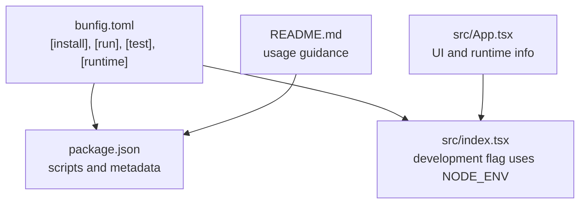
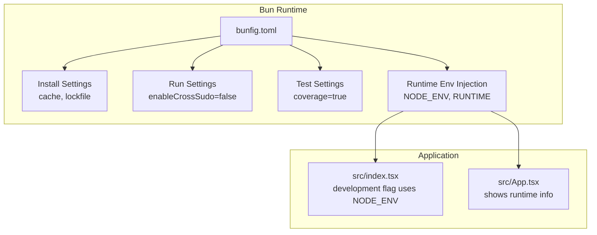
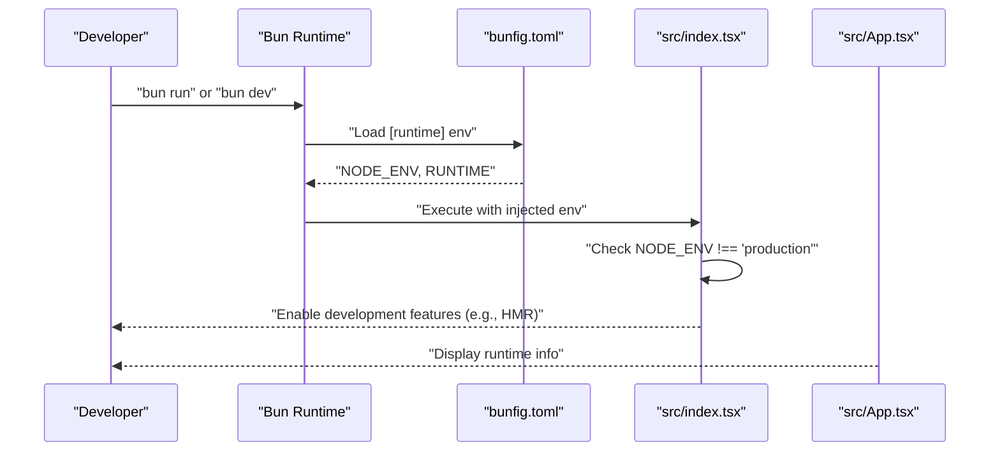
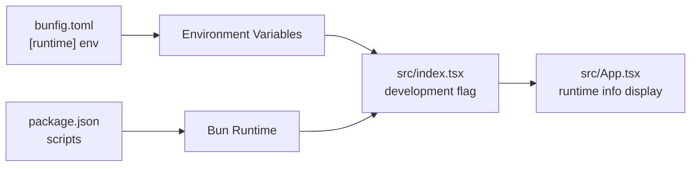

# bunfig.toml Configuration

<cite>
**Referenced Files in This Document**
- [bunfig.toml](file://bunfig.toml)
- [package.json](file://package.json)
- [README.md](file://README.md)
- [src/index.tsx](file://src/index.tsx)
- [src/App.tsx](file://src/App.tsx)
</cite>

## Table of Contents
1. [Introduction](#introduction)
2. [Project Structure](#project-structure)
3. [Core Components](#core-components)
4. [Architecture Overview](#architecture-overview)
5. [Detailed Component Analysis](#detailed-component-analysis)
6. [Dependency Analysis](#dependency-analysis)
7. [Performance Considerations](#performance-considerations)
8. [Troubleshooting Guide](#troubleshooting-guide)
9. [Conclusion](#conclusion)

## Introduction
This section documents the bunfig.toml configuration file and its role in optimizing the Bun runtime for high-performance AI agent orchestration. It explains how the configuration affects installation, runtime environment injection, testing coverage, and development-time behavior. It also provides guidance for production customization and troubleshooting.

## Project Structure
The bunfig.toml file sits alongside the project’s package manifest and scripts. Together with the Bun runtime and the application entrypoint, it defines the build and runtime behavior for development and production.

**Diagram sources**
- [bunfig.toml](file://bunfig.toml#L1-L17)
- [package.json](file://package.json#L1-L31)
- [README.md](file://README.md#L1-L22)
- [src/index.tsx](file://src/index.tsx#L1-L42)
- [src/App.tsx](file://src/App.tsx#L1-L206)

**Section sources**
- [bunfig.toml](file://bunfig.toml#L1-L17)
- [package.json](file://package.json#L1-L31)
- [README.md](file://README.md#L1-L22)

## Core Components
- [install] section
  - cache = true: Enables Bun’s installation cache for faster dependency resolution during development and CI.
  - lockfile = true: Ensures deterministic installs using the lockfile, improving reproducibility across environments.
- [run] section
  - enableCrossSudo = false: Disables cross-sudo behavior for security by default in the runtime.
- [test] section
  - coverage = true: Enables coverage reporting for tests, improving observability of test effectiveness.
- [runtime] section
  - env = { NODE_ENV = "...", RUNTIME = "..." }: Injects environment variables into the runtime for conditional logic in the cognitive engine and application behavior.

These settings collectively streamline dependency acquisition, enforce secure defaults, improve test visibility, and provide environment-aware behavior for the application.

**Section sources**
- [bunfig.toml](file://bunfig.toml#L1-L17)

## Architecture Overview
The Bun runtime reads bunfig.toml to configure installation, test, and runtime behavior. The application entrypoint conditionally enables development features based on NODE_ENV. The configuration ensures consistent behavior across local and CI environments while preserving security defaults.

**Diagram sources**
- [bunfig.toml](file://bunfig.toml#L1-L17)
- [src/index.tsx](file://src/index.tsx#L1-L42)
- [src/App.tsx](file://src/App.tsx#L1-L206)

## Detailed Component Analysis

### Install Section
- cache = true
  - Purpose: Speed up dependency resolution by reusing previously installed packages.
  - Impact: Reduces cold-start times and CI job durations.
- lockfile = true
  - Purpose: Enforce deterministic installs using the lockfile.
  - Impact: Prevents drift across machines and CI runners.

Best practices:
- Keep cache enabled for local development and CI.
- Ensure lockfile updates are committed to maintain reproducibility.

**Section sources**
- [bunfig.toml](file://bunfig.toml#L4-L7)

### Run Section
- enableCrossSudo = false
  - Purpose: Security hardening by disabling cross-sudo behavior in the runtime.
  - Impact: Reduces risk of unintended privilege escalation during development or CI runs.

Operational notes:
- Leave disabled unless there is a specific need and strong justification.
- Combine with least-privilege practices in CI and local environments.

**Section sources**
- [bunfig.toml](file://bunfig.toml#L8-L10)

### Test Section
- coverage = true
  - Purpose: Enable coverage reporting for tests.
  - Impact: Improves insight into test coverage and helps identify untested paths.

Integration tips:
- Pair with a coverage tool configured in your test runner.
- Use coverage thresholds in CI to guard quality.

**Section sources**
- [bunfig.toml](file://bunfig.toml#L11-L14)

### Runtime Environment Injection
- env = { NODE_ENV = "...", RUNTIME = "..." }
  - Purpose: Inject environment variables into the runtime for conditional logic.
  - Example usage: The application checks NODE_ENV to enable development features such as hot module replacement and console mirroring.

**Diagram sources**
- [bunfig.toml](file://bunfig.toml#L15-L17)
- [src/index.tsx](file://src/index.tsx#L1-L42)
- [src/App.tsx](file://src/App.tsx#L1-L206)

**Section sources**
- [bunfig.toml](file://bunfig.toml#L15-L17)
- [src/index.tsx](file://src/index.tsx#L32-L39)
- [src/App.tsx](file://src/App.tsx#L194-L201)

### Production Customization Examples
- Switch NODE_ENV to "production" to disable development features and optimize runtime behavior.
- Override RUNTIME to reflect production runtime identifiers if needed.
- Disable coverage in production builds to reduce overhead.
- Keep cache enabled for faster startup in production containers or VMs.

Reference paths:
- [bunfig.toml](file://bunfig.toml#L15-L17)
- [src/index.tsx](file://src/index.tsx#L32-L39)

**Section sources**
- [bunfig.toml](file://bunfig.toml#L11-L17)
- [src/index.tsx](file://src/index.tsx#L32-L39)

### Experimental Features
- Investigate Bun-native bundling and caching for performance gains.
- Consider enabling experimental flags cautiously and pinning Bun versions for stability.
- Validate changes in staging before promoting to production.

[No sources needed since this section provides general guidance]

## Dependency Analysis
The Bun runtime configuration influences how the application behaves at runtime. The development flag in the application entrypoint depends on NODE_ENV, which is injected by bunfig.toml. The package manifest defines scripts that drive the runtime lifecycle.

**Diagram sources**
- [bunfig.toml](file://bunfig.toml#L15-L17)
- [src/index.tsx](file://src/index.tsx#L32-L39)
- [src/App.tsx](file://src/App.tsx#L194-L201)
- [package.json](file://package.json#L12-L18)

**Section sources**
- [bunfig.toml](file://bunfig.toml#L15-L17)
- [src/index.tsx](file://src/index.tsx#L32-L39)
- [src/App.tsx](file://src/App.tsx#L194-L201)
- [package.json](file://package.json#L12-L18)

## Performance Considerations
- Leverage Bun’s native bundler and cache mechanisms to achieve significant speedups.
- Keep cache enabled for faster cold starts and CI iterations.
- Use deterministic installs via lockfile to avoid rebuilds caused by version drift.
- In production, prefer compiled bundles and disable development-only features to minimize overhead.

[No sources needed since this section provides general guidance]

## Troubleshooting Guide
- Runtime environment mismatches
  - Symptom: Development features unexpectedly enabled or disabled.
  - Action: Verify NODE_ENV injection in bunfig.toml and confirm the application checks align with expectations.
  - Reference: [bunfig.toml](file://bunfig.toml#L15-L17), [src/index.tsx](file://src/index.tsx#L32-L39)
- Caching issues
  - Symptom: Stale dependencies or inconsistent installs.
  - Action: Clear Bun’s cache and re-run installation; ensure lockfile is present and committed.
  - References: [bunfig.toml](file://bunfig.toml#L4-L7), [package.json](file://package.json#L1-L31)
- Coverage reporting problems
  - Symptom: Missing coverage metrics.
  - Action: Confirm coverage setting is enabled and integrate a compatible coverage tool in your test runner.
  - Reference: [bunfig.toml](file://bunfig.toml#L11-L14)
- Security hardening
  - Symptom: Concerns about elevated privileges during runtime.
  - Action: Keep enableCrossSudo disabled unless absolutely necessary.
  - Reference: [bunfig.toml](file://bunfig.toml#L8-L10)

**Section sources**
- [bunfig.toml](file://bunfig.toml#L4-L17)
- [src/index.tsx](file://src/index.tsx#L32-L39)
- [package.json](file://package.json#L1-L31)

## Conclusion
The bunfig.toml configuration centralizes Bun runtime behavior for this project. By enabling caching, deterministic installs, secure defaults, and coverage reporting, it streamlines development and CI while providing environment-aware behavior for the application. For production, adjust environment variables and disable development-only features to maximize performance and reliability.