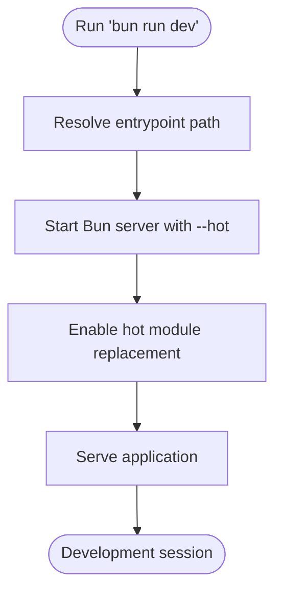

# package.json Configuration

<cite>
**Referenced Files in This Document**
- [package.json](file://package.json)
- [README.md](file://README.md)
- [bunfig.toml](file://bunfig.toml)
- [tsconfig.json](file://tsconfig.json)
- [src/frontend.tsx](file://src/frontend.tsx)
</cite>

## Table of Contents
1. [Introduction](#introduction)
2. [Project Structure](#project-structure)
3. [Core Components](#core-components)
4. [Architecture Overview](#architecture-overview)
5. [Detailed Component Analysis](#detailed-component-analysis)
6. [Dependency Analysis](#dependency-analysis)
7. [Performance Considerations](#performance-considerations)
8. [Troubleshooting Guide](#troubleshooting-guide)
9. [Conclusion](#conclusion)

## Introduction
This section documents the package.json configuration that defines project metadata, dependencies, and execution scripts. It explains how the scripts enable development, testing, building, and linting workflows with Bun, and how the configuration integrates with Bun’s runtime and toolchain. It also covers the monorepo workspaces configuration, ES modules mode, and Bun version pinning.

## Project Structure
The repository is organized around a Bun-based project with a clear separation of concerns:
- Application entrypoints and frontend assets live under src/.
- The package.json defines scripts and dependencies.
- Bun configuration is centralized in bunfig.toml.
- TypeScript configuration is defined in tsconfig.json.

**Diagram sources**
- [package.json](file://package.json#L1-L31)
- [README.md](file://README.md#L1-L22)
- [bunfig.toml](file://bunfig.toml#L1-L17)
- [tsconfig.json](file://tsconfig.json#L1-L18)
- [src/frontend.tsx](file://src/frontend.tsx#L1-L26)

**Section sources**
- [package.json](file://package.json#L1-L31)
- [README.md](file://README.md#L1-L22)
- [bunfig.toml](file://bunfig.toml#L1-L17)
- [tsconfig.json](file://tsconfig.json#L1-L18)
- [src/frontend.tsx](file://src/frontend.tsx#L1-L26)

## Core Components
- Project metadata and runtime mode
  - name, version, description, private flag, and type: "module" define the package identity and module system.
  - packageManager pins the project to a specific Bun version for reproducibility.
- Workspaces configuration
  - workspaces enables a monorepo layout targeting packages/* and apps/*.
- Scripts
  - dev: starts a hot-reload development server using Bun.
  - test: runs tests via Bun.
  - build: bundles the project using tsup.
  - lint and lint:apply: enforce code quality with Biome.
- Dependencies
  - Production dependencies include routing/web framework, schema validation, and UI icons.
  - Dev dependencies include Biome, tsup, TypeScript, and Node types.

Practical examples
- Adding a new build script: append a new key-value pair to the scripts object in package.json.
- Modifying the dev command: update the value of the dev script to change the entrypoint or flags.

**Section sources**
- [package.json](file://package.json#L1-L31)

## Architecture Overview
The scripts orchestrate a streamlined Bun-first workflow:
- Development: hot reload with Bun for rapid iteration.
- Testing: Bun-native test runner with coverage enabled.
- Building: tsup produces optimized bundles.
- Linting: Biome enforces style and correctness rules.

**Diagram sources**
- [package.json](file://package.json#L12-L18)
- [bunfig.toml](file://bunfig.toml#L11-L14)

## Detailed Component Analysis

### Scripts: dev
Purpose
- Starts a hot-reload development server using Bun with the --hot flag.

Key behaviors
- Hot module replacement is supported in the frontend entrypoint via import.meta.hot.
- The script targets a server entry under apps/api-gateway/server.ts.

Practical example
- To switch to a different server entry, modify the dev script value to point to another file.

**Diagram sources**
- [package.json](file://package.json#L12-L14)
- [src/frontend.tsx](file://src/frontend.tsx#L19-L25)

**Section sources**
- [package.json](file://package.json#L12-L14)
- [src/frontend.tsx](file://src/frontend.tsx#L19-L25)

### Scripts: test
Purpose
- Executes the project’s test suite using Bun’s built-in test runner.

Key behaviors
- Coverage is enabled via bunfig.toml [test] configuration.
- The test runner is invoked directly by the test script.

Practical example
- To add a filter or change test behavior, adjust the test script value or Bun configuration.

**Section sources**
- [package.json](file://package.json#L14-L14)
- [bunfig.toml](file://bunfig.toml#L11-L14)

### Scripts: build
Purpose
- Bundles the project using tsup.

Key behaviors
- tsup reads tsconfig.json for module resolution and output settings.
- The build script is the primary way to produce distributable artifacts.

Practical example
- To add watch mode during development, extend the build script value to include appropriate flags.

**Section sources**
- [package.json](file://package.json#L14-L16)
- [tsconfig.json](file://tsconfig.json#L1-L18)

### Scripts: lint and lint:apply
Purpose
- Enforce code quality with Biome.

Key behaviors
- lint reports diagnostics across the project.
- lint:apply automatically applies safe fixes.

Practical example
- To include additional directories or exclude files, adjust the lint command arguments.

**Section sources**
- [package.json](file://package.json#L16-L18)

### Metadata and Module System
- type: "module"
  - Enables ES modules semantics for the project.
  - Aligns with Bun’s native support for modern JavaScript/TypeScript.
- packageManager
  - Locks the project to a specific Bun version for deterministic installs and behavior.

Practical example
- To upgrade Bun, update the packageManager field to the desired version.

**Section sources**
- [package.json](file://package.json#L6-L8)

### Workspaces Configuration
- workspaces
  - Defines monorepo boundaries for packages/* and apps/*.
  - Supports organizing multiple packages and applications within a single repository.

Practical example
- To add a new workspace, extend the workspaces array with a new glob pattern.

**Section sources**
- [package.json](file://package.json#L8-L11)

### Dependencies Overview
- Production dependencies
  - Web framework, schema validation, and UI icons.
- Dev dependencies
  - Biome for linting, tsup for bundling, TypeScript, and Node types.

Practical example
- To add a new dependency, use Bun’s package manager to install and update package.json accordingly.

**Section sources**
- [package.json](file://package.json#L19-L30)

## Dependency Analysis
The scripts depend on Bun’s runtime and associated tooling. The following diagram shows how the scripts relate to external tools and configuration:

**Diagram sources**
- [package.json](file://package.json#L12-L18)
- [tsconfig.json](file://tsconfig.json#L1-L18)
- [bunfig.toml](file://bunfig.toml#L1-L17)

**Section sources**
- [package.json](file://package.json#L12-L18)
- [tsconfig.json](file://tsconfig.json#L1-L18)
- [bunfig.toml](file://bunfig.toml#L1-L17)

## Performance Considerations
- Hot reload development
  - The dev script leverages Bun’s hot module replacement for fast feedback loops.
- Test coverage
  - Coverage is enabled in bunfig.toml, which can increase test runtime; consider disabling for quick iterations.
- Bundling
  - tsup produces optimized bundles; ensure output settings align with deployment targets.
- Linting
  - Biome is fast by design; keep lint checks incremental and scoped to changed files when possible.

[No sources needed since this section provides general guidance]

## Troubleshooting Guide
Common issues and resolutions
- Missing dependencies
  - Symptom: Script fails with “command not found” or module resolution errors.
  - Resolution: Install dependencies using Bun’s package manager and ensure packageManager alignment.
- Script execution errors
  - Symptom: Unexpected exit codes or runtime failures.
  - Resolution: Verify script paths and flags; confirm Bun version and configuration files are present.
- Hot reload not working
  - Symptom: Changes do not trigger updates.
  - Resolution: Confirm the entrypoint supports hot module replacement and the dev script targets the correct file.
- Lint failures
  - Symptom: Diagnostics reported by Biome.
  - Resolution: Run the apply script to fix safe issues, or adjust Biome configuration.

Practical steps
- Reinstall dependencies and re-run scripts to ensure a clean state.
- Validate Bun version matches the pinned packageManager.
- Review tsconfig.json for module resolution and output settings if bundling fails.
- Check bunfig.toml for test and runtime settings if tests or environment behave unexpectedly.

**Section sources**
- [package.json](file://package.json#L6-L8)
- [package.json](file://package.json#L12-L18)
- [bunfig.toml](file://bunfig.toml#L1-L17)
- [tsconfig.json](file://tsconfig.json#L1-L18)
- [README.md](file://README.md#L1-L22)

## Conclusion
The package.json configuration centralizes the project’s metadata, dependencies, and scripts for a Bun-first workflow. The dev, test, build, and lint scripts integrate tightly with Bun’s runtime and toolchain, while workspaces and ES modules support a scalable monorepo structure. By understanding and leveraging these configurations, developers can optimize their development experience and maintain high-quality code.