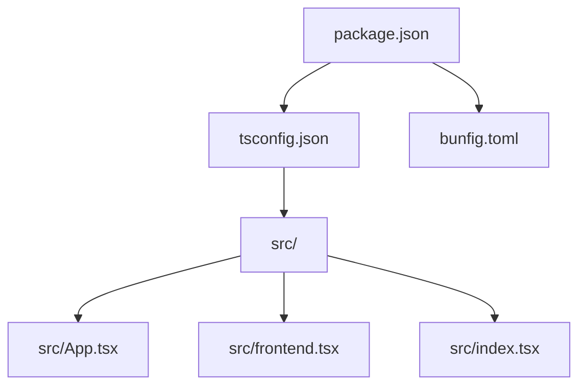
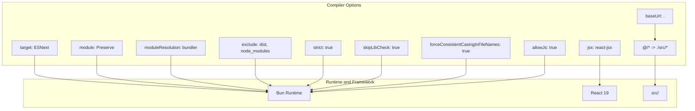
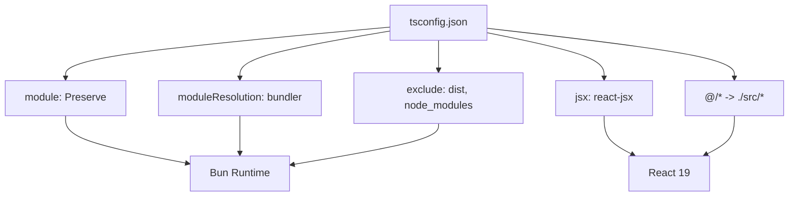

# tsconfig.json Configuration

<cite>
**Referenced Files in This Document**
- [tsconfig.json](file://tsconfig.json)
- [package.json](file://package.json)
- [README.md](file://README.md)
- [projectinfo.md](file://projectinfo.md)
- [src/index.tsx](file://src/index.tsx)
- [src/App.tsx](file://src/App.tsx)
- [src/frontend.tsx](file://src/frontend.tsx)
- [bunfig.toml](file://bunfig.toml)
</cite>

## Table of Contents
1. [Introduction](#introduction)
2. [Project Structure](#project-structure)
3. [Core Components](#core-components)
4. [Architecture Overview](#architecture-overview)
5. [Detailed Component Analysis](#detailed-component-analysis)
6. [Dependency Analysis](#dependency-analysis)
7. [Performance Considerations](#performance-considerations)
8. [Troubleshooting Guide](#troubleshooting-guide)
9. [Conclusion](#conclusion)

## Introduction
This section documents the tsconfig.json configuration for the cognitive-aware agent system. It explains how compiler options shape TypeScript compilation behavior, how module resolution and JSX settings integrate with Bun and React 19, and how absolute imports via @/* improve maintainability. It also covers the impact of strict type checking, excluded directories, and practical guidance for extending the configuration for production builds or enabling experimental features like decorators. Finally, it provides troubleshooting advice for common type resolution errors and build failures, along with performance tips for development.

## Project Structure
The project is a Bun-based React application with a monorepo layout. The TypeScript configuration sits at the repository root and applies to the frontend source under src/. The Bun runtime and build toolchain are configured via package scripts and bunfig.toml.

**Diagram sources**
- [tsconfig.json](file://tsconfig.json#L1-L17)
- [src/App.tsx](file://src/App.tsx#L1-L206)
- [src/frontend.tsx](file://src/frontend.tsx#L1-L27)
- [src/index.tsx](file://src/index.tsx#L1-L42)
- [package.json](file://package.json#L1-L31)
- [bunfig.toml](file://bunfig.toml#L1-L17)

**Section sources**
- [tsconfig.json](file://tsconfig.json#L1-L17)
- [package.json](file://package.json#L1-L31)
- [projectinfo.md](file://projectinfo.md#L1-L91)

## Core Components
This section breaks down the key compiler options in tsconfig.json and their roles in the cognitive-aware agent system.

- target: ESNext
  - Purpose: Enables the latest JavaScript language features during compilation. This aligns with Bun’s modern runtime and ensures compatibility with cutting-edge language constructs.
  - Impact: Allows developers to use upcoming ECMAScript features without transpiling to older targets, reducing bundle size and preserving native performance characteristics.

- module: Preserve
  - Purpose: Delegates module handling to Bun’s runtime and bundler. This avoids redundant module transformations and lets Bun manage module semantics directly.
  - Impact: Streamlines the build pipeline and reduces overhead by deferring module resolution to Bun.

- moduleResolution: bundler
  - Purpose: Uses modern bundler-style resolution semantics. This is essential for frameworks and runtimes that rely on bundler-like import resolution.
  - Impact: Improves compatibility with modern module systems and reduces ambiguity in resolving imports.

- jsx: react-jsx
  - Purpose: Activates React 19’s new JSX transform. This enables concise JSX syntax and integrates with React’s modern runtime.
  - Impact: Aligns the TypeScript compiler with React 19’s expectations and improves developer ergonomics.

- allowJs: true
  - Purpose: Permits JavaScript files to be included in the project. This is useful for gradual migration or mixed-type projects.
  - Impact: Broadens compatibility with existing JS code while still leveraging TypeScript for type checking.

- strict: true
  - Purpose: Enables comprehensive strictness checks across the codebase.
  - Impact: Catches subtle bugs early, improves code reliability, and enforces safer typing practices.

- skipLibCheck: true
  - Purpose: Skips type checking of declaration files (libraries).
  - Impact: Speeds up incremental type-checking and reduces noise from third-party typings.

- forceConsistentCasingInFileNames: true
  - Purpose: Prevents inconsistent casing in file names, avoiding platform-specific issues.
  - Impact: Ensures predictable module resolution across operating systems.

- baseUrl: .
  - Purpose: Sets the base directory for resolving non-relative module names.
  - Impact: Establishes a consistent root for path mapping and absolute imports.

- paths: { "@/*": ["./src/*"] }
  - Purpose: Defines an absolute import alias from @/* to src/*.
  - Impact: Improves code readability and maintainability by eliminating deep relative paths and making imports easier to refactor.

- exclude: ["dist", "node_modules"]
  - Purpose: Excludes commonly generated or vendored directories from compilation.
  - Impact: Reduces type-checking overhead and avoids unnecessary processing of external artifacts.

**Section sources**
- [tsconfig.json](file://tsconfig.json#L1-L17)

## Architecture Overview
The TypeScript configuration integrates with Bun’s runtime and React 19 to deliver a streamlined development and build experience. The compiler options are chosen to minimize transformation overhead, leverage modern module semantics, and support React’s new JSX transform.

**Diagram sources**
- [tsconfig.json](file://tsconfig.json#L1-L17)
- [src/App.tsx](file://src/App.tsx#L1-L206)
- [src/frontend.tsx](file://src/frontend.tsx#L1-L27)
- [src/index.tsx](file://src/index.tsx#L1-L42)

## Detailed Component Analysis

### Absolute Import Strategy with @/*
- Purpose: The baseUrl and paths settings enable absolute imports using @/*, mapping to src/*.
- Benefits:
  - Cleaner imports reduce visual clutter and improve readability.
  - Easier refactoring when moving files around because relative paths remain stable.
  - Consistent import style across the codebase.
- Practical usage:
  - Example import patterns would resolve from @/App to src/App and from @/frontend to src/frontend.
  - This pattern scales well in larger projects and monorepos.

**Section sources**
- [tsconfig.json](file://tsconfig.json#L1-L17)
- [src/App.tsx](file://src/App.tsx#L1-L206)
- [src/frontend.tsx](file://src/frontend.tsx#L1-L27)

### JSX Transform and React 19 Support
- Purpose: The jsx option is set to react-jsx to align with React 19’s new transform.
- Impact:
  - Simplifies JSX compilation and reduces boilerplate.
  - Integrates seamlessly with React 19’s runtime and development tooling.

**Section sources**
- [tsconfig.json](file://tsconfig.json#L1-L17)
- [projectinfo.md](file://projectinfo.md#L35-L42)
- [src/App.tsx](file://src/App.tsx#L1-L206)

### Module Resolution Semantics
- Purpose: moduleResolution: bundler ensures modern bundler-style resolution.
- Interaction:
  - Works alongside module: Preserve to keep module handling in Bun’s bundler.
  - Complements baseUrl and paths for predictable import resolution.

**Section sources**
- [tsconfig.json](file://tsconfig.json#L1-L17)

### Strict Type Checking and Library Checks
- Purpose: strict: true and skipLibCheck: true balance safety and performance.
- Effects:
  - strict: true catches potential logical errors early.
  - skipLibCheck: true accelerates incremental type-checking by skipping library typings.

**Section sources**
- [tsconfig.json](file://tsconfig.json#L1-L17)

### Excluded Directories
- Purpose: exclude: ["dist", "node_modules"] prevents unnecessary processing.
- Impact:
  - Reduces type-checking time during development.
  - Avoids interference from generated or vendored artifacts.

**Section sources**
- [tsconfig.json](file://tsconfig.json#L1-L17)

### Extending for Production Builds
- Build toolchain:
  - The project uses Bun and a bundler (tsup) for building. While tsconfig.json defines compile-time behavior, production builds are orchestrated by Bun scripts and tsup.
- Recommendations:
  - Keep target: ESNext for modern output.
  - Consider adding a separate tsconfig for production if you need different compiler flags (e.g., stricter diagnostics).
  - Ensure module: Preserve remains to leverage Bun’s bundler.

**Section sources**
- [package.json](file://package.json#L12-L18)
- [projectinfo.md](file://projectinfo.md#L66-L70)

### Enabling Experimental Features (Decorators)
- Current state:
  - The provided tsconfig.json does not include decorator-related options.
- Guidance:
  - If decorators are needed, add the appropriate compiler options in a dedicated tsconfig for that purpose.
  - Keep module: Preserve and moduleResolution: bundler aligned with Bun’s expectations.
  - Validate compatibility with React 19 and Bun’s runtime.

**Section sources**
- [tsconfig.json](file://tsconfig.json#L1-L17)

## Dependency Analysis
The TypeScript configuration influences how modules are resolved and transformed, which in turn affects the Bun runtime and React 19 integration.

**Diagram sources**
- [tsconfig.json](file://tsconfig.json#L1-L17)
- [src/App.tsx](file://src/App.tsx#L1-L206)
- [src/frontend.tsx](file://src/frontend.tsx#L1-L27)

**Section sources**
- [tsconfig.json](file://tsconfig.json#L1-L17)

## Performance Considerations
- Development speed:
  - skipLibCheck: true reduces type-checking overhead.
  - strict: true helps catch issues early, potentially saving time later.
  - module: Preserve and moduleResolution: bundler minimize redundant transformations.
- Incremental builds:
  - exclude: ["dist", "node_modules"] keeps type-checking focused on source files.
- Hot reload and runtime:
  - Bun’s runtime and React 19 JSX transform work together to provide a responsive development experience.

**Section sources**
- [tsconfig.json](file://tsconfig.json#L1-L17)
- [bunfig.toml](file://bunfig.toml#L1-L17)
- [src/index.tsx](file://src/index.tsx#L1-L42)

## Troubleshooting Guide
Common issues and solutions:

- Module not found errors
  - Symptom: Errors indicating missing modules or incorrect module resolution.
  - Solutions:
    - Verify baseUrl and paths are correctly set to resolve @/* to src/*.
    - Ensure moduleResolution is bundler and module is Preserve for Bun compatibility.
    - Confirm that imports using @/* match actual file locations under src/.

- JSX transform issues
  - Symptom: Errors related to JSX syntax or React runtime.
  - Solutions:
    - Ensure jsx is set to react-jsx.
    - Confirm React 19 is installed and compatible with the JSX transform.

- Type checking slowdowns
  - Symptom: Slow incremental type-checking during development.
  - Solutions:
    - Keep skipLibCheck: true enabled.
    - Maintain exclude: ["dist", "node_modules"] to limit scope.
    - Consider splitting tsconfigs for different environments if necessary.

- Decorators or experimental features
  - Symptom: Errors when using decorators or other experimental syntax.
  - Solutions:
    - Add appropriate compiler options in a separate tsconfig for that purpose.
    - Keep module: Preserve and moduleResolution: bundler aligned with Bun.

**Section sources**
- [tsconfig.json](file://tsconfig.json#L1-L17)
- [src/App.tsx](file://src/App.tsx#L1-L206)
- [src/frontend.tsx](file://src/frontend.tsx#L1-L27)

## Conclusion
The tsconfig.json configuration for the cognitive-aware agent system is tuned for Bun and React 19. It prioritizes modern language features, efficient module handling, and clean absolute imports via @/* to enhance maintainability. Strict type checking and targeted exclusions help keep development fast and reliable. For production builds, the configuration complements Bun and tsup, while extensions like decorators can be introduced through environment-specific tsconfig files when needed.