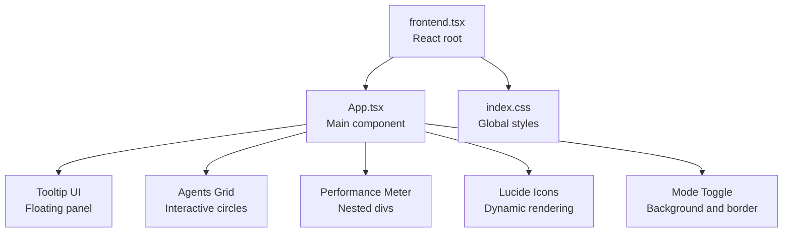
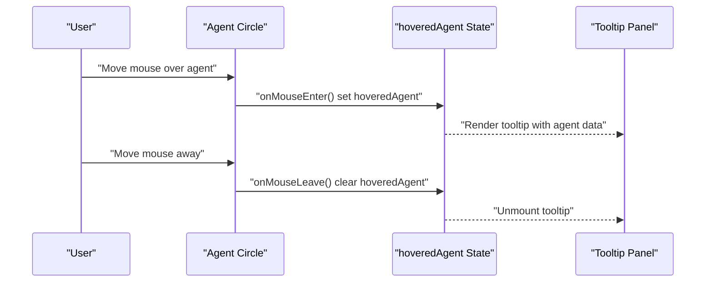
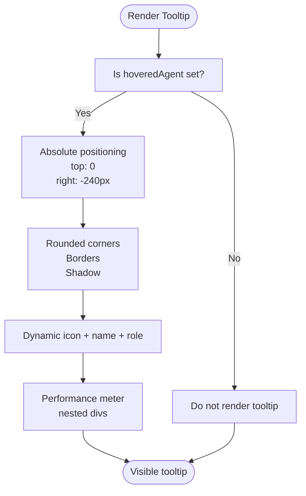
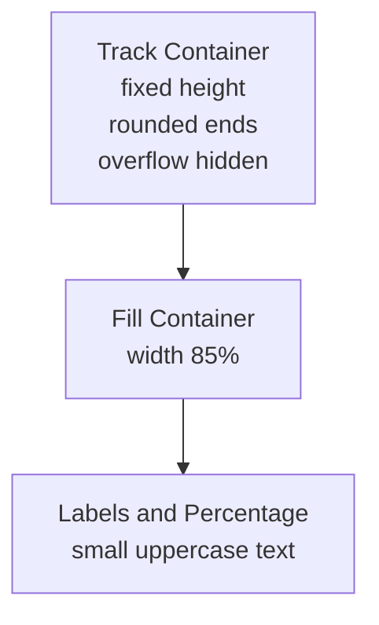
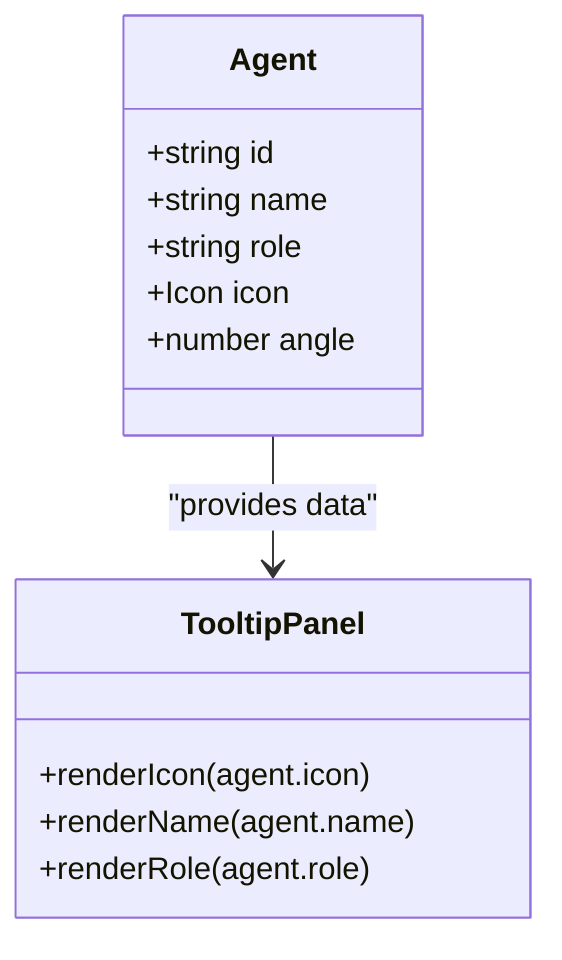
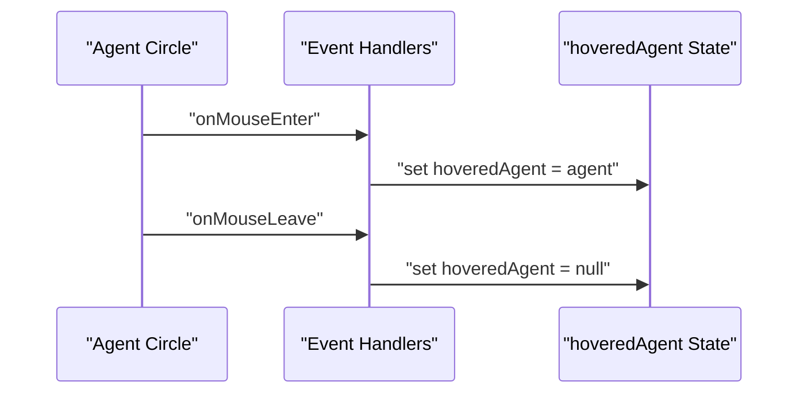
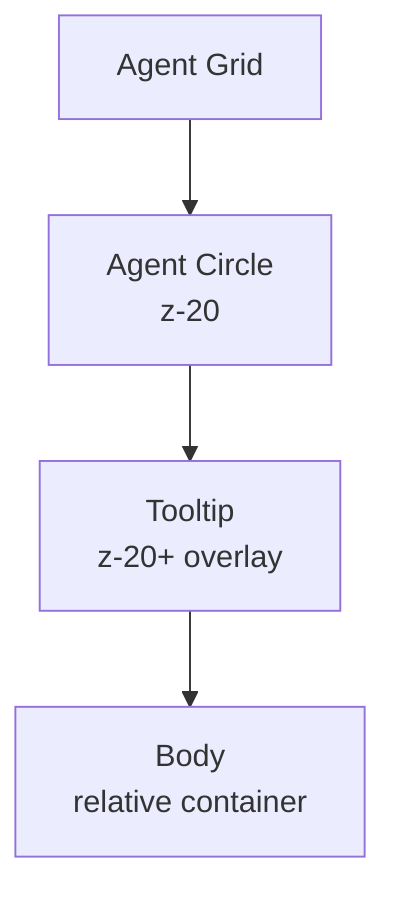
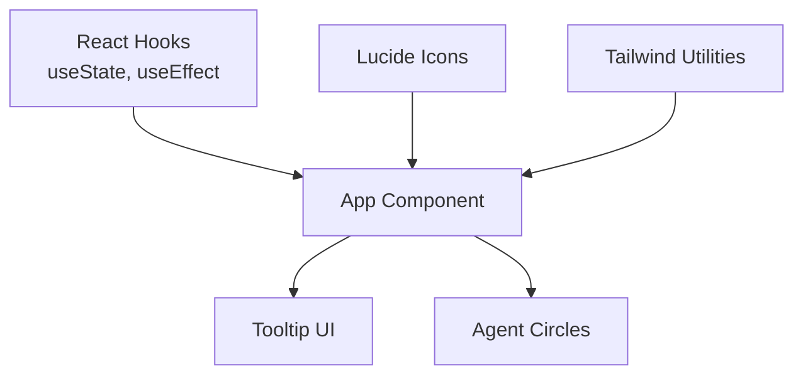

# Agent Interactions

<cite>
**Referenced Files in This Document**
- [App.tsx](file://src/App.tsx)
- [frontend.tsx](file://src/frontend.tsx)
- [index.css](file://src/index.css)
- [conceptual.md](file://AB/conceptual.md)
</cite>

## Table of Contents
1. [Introduction](#introduction)
2. [Project Structure](#project-structure)
3. [Core Components](#core-components)
4. [Architecture Overview](#architecture-overview)
5. [Detailed Component Analysis](#detailed-component-analysis)
6. [Dependency Analysis](#dependency-analysis)
7. [Performance Considerations](#performance-considerations)
8. [Troubleshooting Guide](#troubleshooting-guide)
9. [Conclusion](#conclusion)
10. [Appendices](#appendices)

## Introduction
This document explains the agent interaction features centered around hover tooltips and performance metrics display. It details how mouse events control the hovered agent state, how the tooltip is positioned absolutely and styled, how the performance meter is visualized, and how Lucide React icons are dynamically rendered based on agent data. It also covers common issues such as tooltip clipping and positioning conflicts, along with solutions using z-index stacking and responsive positioning. Finally, it provides customization guidelines for adding new agent types and extending tooltip content.

## Project Structure
The agent interactions live in the main application component and are rendered by the React root entry point. Styling and layout are handled via Tailwind-like utility classes and a minimal global stylesheet.

**Diagram sources**
- [frontend.tsx](file://src/frontend.tsx#L8-L26)
- [App.tsx](file://src/App.tsx#L50-L180)
- [index.css](file://src/index.css#L1-L40)

**Section sources**
- [frontend.tsx](file://src/frontend.tsx#L8-L26)
- [App.tsx](file://src/App.tsx#L50-L180)
- [index.css](file://src/index.css#L1-L40)

## Core Components
- Hovered agent state: A React state tracks the currently hovered agent to drive tooltip visibility and content.
- Mouse event handlers: onMouseEnter and onMouseLeave update the hovered agent state.
- Tooltip: An absolutely positioned floating panel displaying agent name, role, and a performance meter.
- Performance meter: Nested divs with fixed width backgrounds visually represent an 85% optimization metric.
- Dynamic icons: Lucide React icons are rendered based on agent data.
- Z-index stacking: Ensures the tooltip appears above other elements.

Key implementation references:
- State and event handlers: [App.tsx](file://src/App.tsx#L20-L23), [App.tsx](file://src/App.tsx#L102-L105)
- Tooltip rendering and positioning: [App.tsx](file://src/App.tsx#L161-L179)
- Performance meter visualization: [App.tsx](file://src/App.tsx#L169-L177)
- Dynamic icon rendering: [App.tsx](file://src/App.tsx#L164-L166), [App.tsx](file://src/App.tsx#L110-L113)
- Z-index stacking: [App.tsx](file://src/App.tsx#L106-L106), [App.tsx](file://src/App.tsx#L116-L116), [App.tsx](file://src/App.tsx#L163-L163)

**Section sources**
- [App.tsx](file://src/App.tsx#L20-L23)
- [App.tsx](file://src/App.tsx#L102-L105)
- [App.tsx](file://src/App.tsx#L161-L179)
- [App.tsx](file://src/App.tsx#L169-L177)
- [App.tsx](file://src/App.tsx#L110-L113)

## Architecture Overview
The tooltip is a floating overlay controlled by the hovered agent state. The agent circles emit mouse events that update this state, triggering conditional rendering of the tooltip. The tooltip’s absolute positioning and z-index ensure it overlays the agent grid without interfering with other page elements.

**Diagram sources**
- [App.tsx](file://src/App.tsx#L102-L105)
- [App.tsx](file://src/App.tsx#L161-L179)

## Detailed Component Analysis

### Tooltip Floating Panel
- Absolute positioning: The tooltip uses absolute coordinates to appear to the right of the agent grid. Its horizontal offset is achieved via a negative right spacing utility.
- Styling: Rounded corners, borders, and shadow effects are applied for visual prominence.
- Visibility: Conditionally rendered when hoveredAgent is truthy.
- Dynamic content: Uses the hovered agent’s icon, name, and role.

**Diagram sources**
- [App.tsx](file://src/App.tsx#L161-L179)
- [App.tsx](file://src/App.tsx#L169-L177)

**Section sources**
- [App.tsx](file://src/App.tsx#L161-L179)
- [App.tsx](file://src/App.tsx#L169-L177)

### Performance Meter Visualization
- Structure: A container div with a fixed height and rounded ends, acting as the track. Inside it, a child div represents the filled portion.
- Width-based representation: The filled portion uses a percentage width to reflect the 85% optimization value.
- Typography: Labels and percentages are small, uppercase, and muted for readability.

**Diagram sources**
- [App.tsx](file://src/App.tsx#L169-L177)

**Section sources**
- [App.tsx](file://src/App.tsx#L169-L177)

### Dynamic Icon Rendering
- Icon selection: Each agent defines an icon property. At runtime, the component renders the corresponding Lucide icon component.
- Placement: The icon is shown alongside the agent’s name inside the tooltip.

**Diagram sources**
- [App.tsx](file://src/App.tsx#L35-L41)
- [App.tsx](file://src/App.tsx#L164-L166)

**Section sources**
- [App.tsx](file://src/App.tsx#L35-L41)
- [App.tsx](file://src/App.tsx#L164-L166)

### Mouse Event Handlers and State Control
- onMouseEnter: Sets hoveredAgent to the current agent.
- onMouseLeave: Clears hoveredAgent.
- Conditional rendering: The tooltip mounts/unmounts based on hoveredAgent.

**Diagram sources**
- [App.tsx](file://src/App.tsx#L102-L105)

**Section sources**
- [App.tsx](file://src/App.tsx#L102-L105)

### Z-Index Stacking and Responsive Positioning
- Stacking order: Agent circles use a higher z-index than surrounding elements to ensure the tooltip can overlay them without interference.
- Tooltip placement: The tooltip is absolutely positioned with a negative right offset to place it to the right of the agent grid.
- Responsiveness: The tooltip remains fixed relative to the viewport; adjust the negative offset if the grid size or layout changes.

**Diagram sources**
- [App.tsx](file://src/App.tsx#L106-L106)
- [App.tsx](file://src/App.tsx#L163-L163)

**Section sources**
- [App.tsx](file://src/App.tsx#L106-L106)
- [App.tsx](file://src/App.tsx#L163-L163)

## Dependency Analysis
- React state and effects: The component uses React hooks to manage hovered agent state and a pulse effect.
- Lucide React icons: Imported and used for dynamic rendering.
- Tailwind utilities: Used for positioning, borders, shadows, and z-index stacking.

**Diagram sources**
- [App.tsx](file://src/App.tsx#L1-L18)
- [App.tsx](file://src/App.tsx#L20-L27)
- [App.tsx](file://src/App.tsx#L102-L105)
- [App.tsx](file://src/App.tsx#L161-L179)

**Section sources**
- [App.tsx](file://src/App.tsx#L1-L18)
- [App.tsx](file://src/App.tsx#L20-L27)
- [App.tsx](file://src/App.tsx#L102-L105)
- [App.tsx](file://src/App.tsx#L161-L179)

## Performance Considerations
- Tooltip mounting/unmounting: Rendering the tooltip conditionally reduces unnecessary DOM nodes when not hovering.
- Fixed width backgrounds: Using percentage widths for the performance meter avoids expensive recalculations.
- Minimal reflows: Absolute positioning keeps the tooltip out of the normal document flow, minimizing layout thrashing.

[No sources needed since this section provides general guidance]

## Troubleshooting Guide
Common issues and solutions:
- Tooltip clipped by container boundaries:
  - Cause: The tooltip is absolutely positioned; if the grid is near the viewport edge, the negative right offset may push it off-screen.
  - Solution: Adjust the negative right offset or switch to a left offset when near the right edge. Alternatively, compute dynamic offsets based on agent position.
- Tooltip overlapping interactive elements:
  - Cause: Other interactive elements may overlap the tooltip.
  - Solution: Increase the tooltip’s z-index relative to interactive elements.
- Tooltip not visible on mobile:
  - Cause: Absolute positioning and fixed offsets may not account for smaller screens.
  - Solution: Add responsive adjustments (e.g., media queries) to change the tooltip offset or switch to a centered overlay on small screens.
- Tooltip content misalignment:
  - Cause: Dynamic icon sizing or varying text lengths.
  - Solution: Use consistent icon sizes and wrap text to prevent overflow; consider a max-width and ellipsis for long roles.

**Section sources**
- [App.tsx](file://src/App.tsx#L161-L179)

## Conclusion
The agent interaction feature combines simple mouse event handlers with a floating tooltip and a straightforward performance meter. Absolute positioning and z-index stacking ensure the tooltip appears clearly above the agent grid. Lucide React icons are dynamically rendered based on agent data, and the performance meter uses nested divs to visualize an 85% optimization score. With minor adjustments to offsets and responsive behavior, the tooltip can remain robust across different screen sizes and layouts.

[No sources needed since this section summarizes without analyzing specific files]

## Appendices

### Customization Guidelines
- Adding a new agent type:
  - Extend the agents array with a new agent object containing id, name, role, icon, and angle.
  - Reference: [App.tsx](file://src/App.tsx#L35-L41)
- Extending tooltip content:
  - Modify the tooltip JSX to include additional fields from the agent object.
  - Reference: [App.tsx](file://src/App.tsx#L161-L179)
- Changing tooltip position:
  - Adjust the absolute positioning classes (top/right) to move the tooltip relative to the grid.
  - Reference: [App.tsx](file://src/App.tsx#L163-L163)
- Updating performance meter:
  - Change the width percentage of the filled bar to reflect new metrics.
  - Reference: [App.tsx](file://src/App.tsx#L171-L171)
- Adjusting z-index stacking:
  - Ensure the tooltip’s z-index is higher than surrounding elements.
  - Reference: [App.tsx](file://src/App.tsx#L106-L106), [App.tsx](file://src/App.tsx#L116-L116), [App.tsx](file://src/App.tsx#L163-L163)

**Section sources**
- [App.tsx](file://src/App.tsx#L35-L41)
- [App.tsx](file://src/App.tsx#L161-L179)
- [App.tsx](file://src/App.tsx#L163-L163)
- [App.tsx](file://src/App.tsx#L171-L171)
- [App.tsx](file://src/App.tsx#L106-L106)
- [App.tsx](file://src/App.tsx#L116-L116)