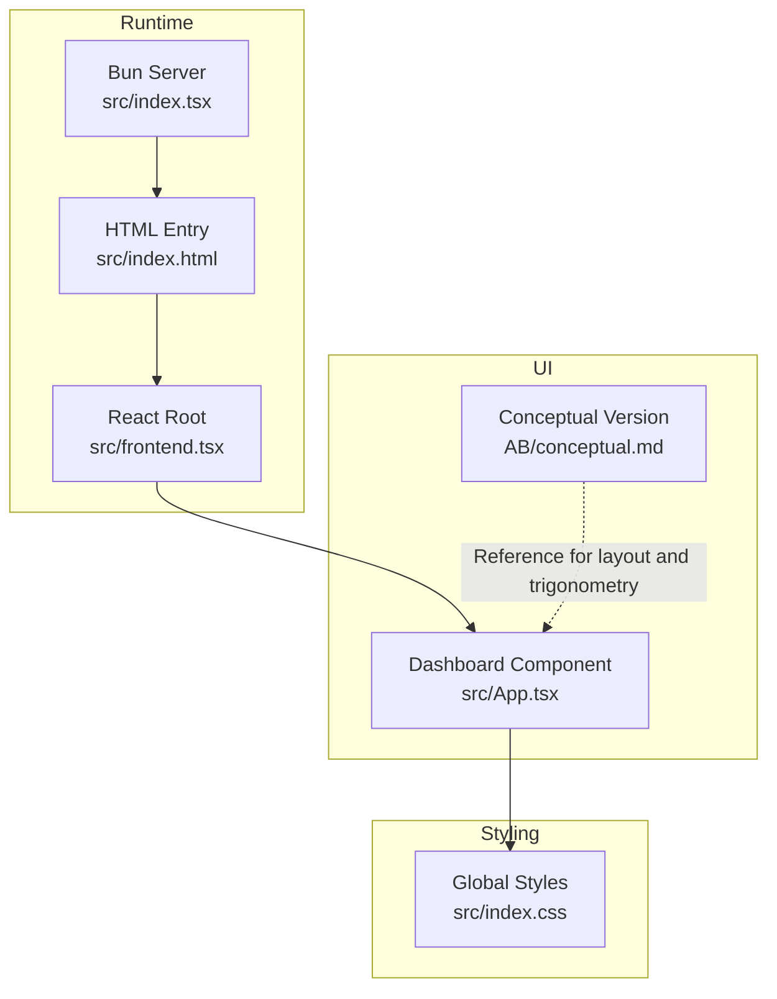
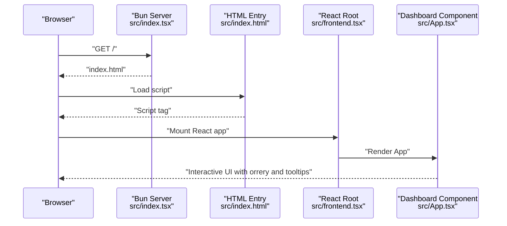
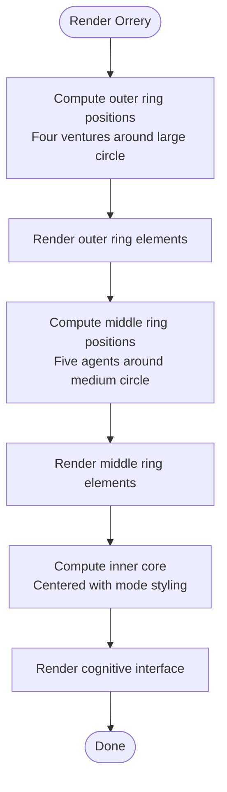
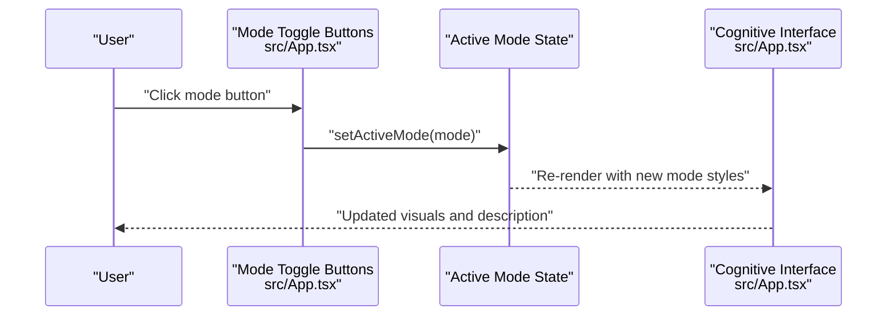
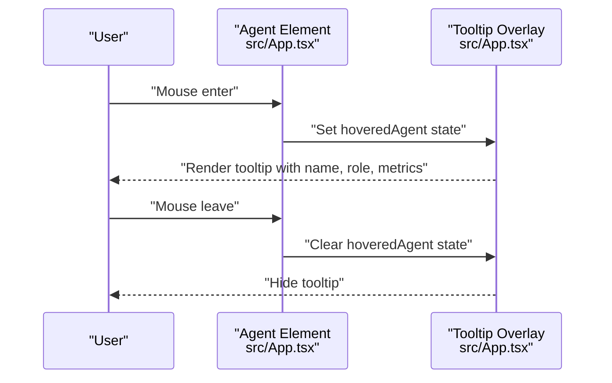
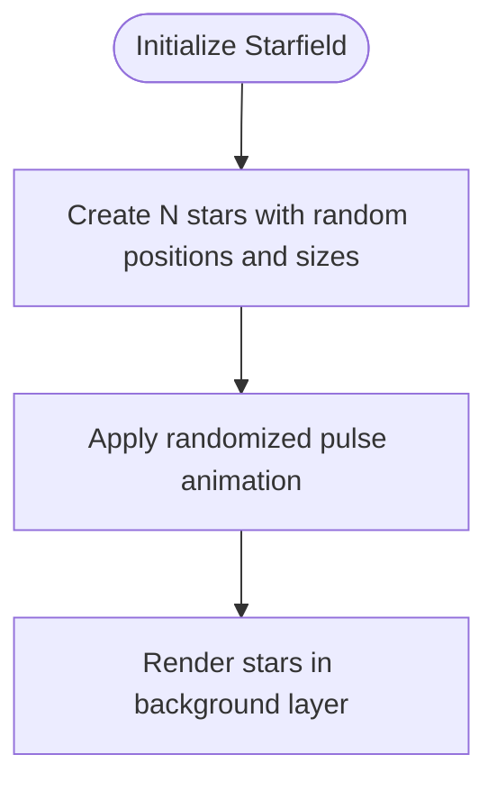
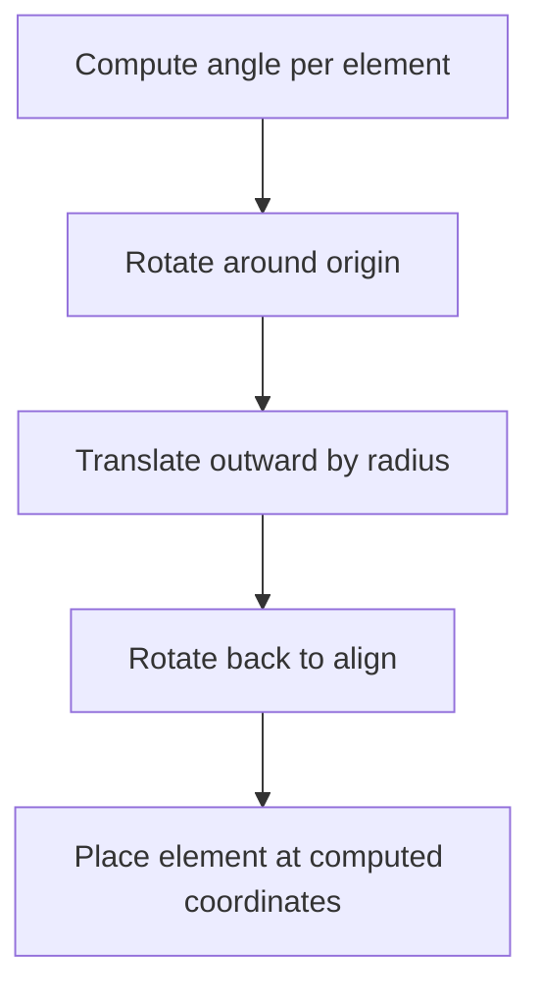
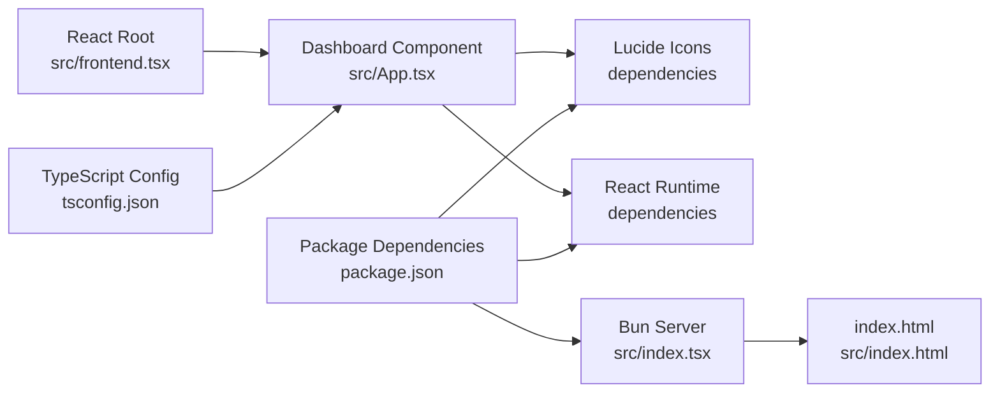

# Core Features

<cite>
**Referenced Files in This Document**
- [AB/conceptual.md](file://AB/conceptual.md)
- [src/App.tsx](file://src/App.tsx)
- [src/frontend.tsx](file://src/frontend.tsx)
- [src/index.html](file://src/index.html)
- [src/index.css](file://src/index.css)
- [src/index.tsx](file://src/index.tsx)
- [package.json](file://package.json)
- [tsconfig.json](file://tsconfig.json)
</cite>

## Table of Contents
1. [Introduction](#introduction)
2. [Project Structure](#project-structure)
3. [Core Components](#core-components)
4. [Architecture Overview](#architecture-overview)
5. [Detailed Component Analysis](#detailed-component-analysis)
6. [Dependency Analysis](#dependency-analysis)
7. [Performance Considerations](#performance-considerations)
8. [Troubleshooting Guide](#troubleshooting-guide)
9. [Conclusion](#conclusion)
10. [Appendices](#appendices)

## Introduction
This document explains the core dashboard features implemented in the project, focusing on the interactive orrery visualization, mode switching mechanics, agent hover tooltips, wallet economics footnote, and the background starfield effect. It also provides guidance for customizing the dashboard by adding new agents or ventures, and outlines solutions for common issues such as tooltip positioning glitches and animation performance.

## Project Structure
The dashboard is a React application served by a lightweight Bun server. The UI is defined in a single component that renders the orrery visualization, mode toggles, tooltips, and supporting elements. Styling and animations are handled via Tailwind-like CSS classes and CSS animations.

**Diagram sources**
- [src/index.tsx](file://src/index.tsx#L1-L42)
- [src/index.html](file://src/index.html#L1-L14)
- [src/frontend.tsx](file://src/frontend.tsx#L1-L27)
- [src/App.tsx](file://src/App.tsx#L1-L206)
- [AB/conceptual.md](file://AB/conceptual.md#L1-L205)
- [src/index.css](file://src/index.css#L1-L188)

**Section sources**
- [src/index.tsx](file://src/index.tsx#L1-L42)
- [src/index.html](file://src/index.html#L1-L14)
- [src/frontend.tsx](file://src/frontend.tsx#L1-L27)
- [src/App.tsx](file://src/App.tsx#L1-L206)
- [AB/conceptual.md](file://AB/conceptual.md#L1-L205)
- [src/index.css](file://src/index.css#L1-L188)

## Core Components
- Interactive orrery visualization with three concentric rings:
  - Outer ring: Ventures
  - Middle ring: C-suite agents
  - Inner core: Cognitive interface with mode indicators
- Mode switching between Executive, Technical, and Creative modes with state-driven visual transitions
- Agent hover tooltips displaying role and performance metrics
- Background starfield effect implemented with randomly positioned animated dots
- Wallet economics footnote and conceptual connection lines overlay

**Section sources**
- [src/App.tsx](file://src/App.tsx#L50-L201)
- [AB/conceptual.md](file://AB/conceptual.md#L50-L202)

## Architecture Overview
The dashboard is a single-page React application rendered by a Bun server. The server serves the HTML entry point and enables hot module replacement during development. The React component manages state for active mode and hovered agent, and composes the orrery visualization using CSS transforms and animations.

**Diagram sources**
- [src/index.tsx](file://src/index.tsx#L1-L42)
- [src/index.html](file://src/index.html#L1-L14)
- [src/frontend.tsx](file://src/frontend.tsx#L1-L27)
- [src/App.tsx](file://src/App.tsx#L1-L206)

## Detailed Component Analysis

### Interactive Orrery Visualization
The orrery visualization is composed of three concentric rings:
- Outer ring (Ventures): Four venture nodes arranged around a large circle, spinning independently.
- Middle ring (C-suite agents): Five agents placed around a medium circle, spinning in the opposite direction.
- Inner core (Cognitive interface): A central hub representing the current mode, with animated pulsing and mode-specific styling.

Positioning logic:
- Each ring uses CSS transforms to compute positions around a circle. The conceptual reference demonstrates trigonometric placement by rotating elements along a radius and translating them outward, then rotating back to align with the ring.
- The outer ring places four ventures evenly spaced around the outer circle. The middle ring places five agents around the middle circle. The inner core is centered.

Visual transitions:
- The central cognitive interface updates its border, background, and text color based on the active mode. An internal pulse animation scales and fades the brain icon.

**Diagram sources**
- [AB/conceptual.md](file://AB/conceptual.md#L82-L115)
- [src/App.tsx](file://src/App.tsx#L82-L116)

**Section sources**
- [AB/conceptual.md](file://AB/conceptual.md#L82-L115)
- [src/App.tsx](file://src/App.tsx#L82-L116)

### Mode Switching Mechanism
The dashboard supports three modes: Executive, Technical, and Creative. The active mode controls the central cognitive interface’s color scheme, border, background, and description text. Mode toggles are buttons located below the central core.

State management:
- A single state variable tracks the active mode.
- Clicking a toggle button updates the active mode, triggering re-render and visual transitions.

Visual transitions:
- The central core applies mode-specific Tailwind classes and a transition duration for smooth updates.
- A periodic pulse animation affects the brain icon inside the core.

**Diagram sources**
- [src/App.tsx](file://src/App.tsx#L116-L141)

**Section sources**
- [src/App.tsx](file://src/App.tsx#L116-L141)

### Agent Hover Tooltips
Each agent in the middle ring exposes a floating tooltip on hover. The tooltip displays the agent’s name, role, and a small progress indicator. The tooltip is absolutely positioned to the right of the mouse and slides in smoothly.

Positioning logic:
- The tooltip appears adjacent to the hovered agent and animates in from the left. The conceptual reference demonstrates a floating tooltip anchored to the right of the orrery area.

**Diagram sources**
- [src/App.tsx](file://src/App.tsx#L101-L114)
- [src/App.tsx](file://src/App.tsx#L161-L179)

**Section sources**
- [src/App.tsx](file://src/App.tsx#L101-L114)
- [src/App.tsx](file://src/App.tsx#L161-L179)

### Wallet Economics Footnote and Background Starfield Effect
Wallet economics footnote:
- A subtle footnote at the bottom of the page displays runtime and wallet information, with hover-enhanced visibility.

Background starfield effect:
- A collection of small white dots is generated dynamically and positioned randomly across the screen. Each dot has a random size and a pulsing animation with randomized durations.

**Diagram sources**
- [src/App.tsx](file://src/App.tsx#L52-L67)
- [src/App.tsx](file://src/App.tsx#L194-L201)

**Section sources**
- [src/App.tsx](file://src/App.tsx#L52-L67)
- [src/App.tsx](file://src/App.tsx#L194-L201)

### Conceptual Trigonometric Layout Reference
The conceptual reference in AB/conceptual.md illustrates how the circular layout is computed using trigonometric transforms:
- Each element is rotated around the origin, translated outward along the radius, then rotated back to align with the ring.
- This approach ensures even spacing and consistent alignment across rings.

**Diagram sources**
- [AB/conceptual.md](file://AB/conceptual.md#L88-L90)

**Section sources**
- [AB/conceptual.md](file://AB/conceptual.md#L88-L90)

## Dependency Analysis
External dependencies and build/runtime configuration:
- React and Lucide icons power the UI and icons.
- Bun server serves static assets and enables hot module replacement in development.
- TypeScript configuration supports bundler module resolution and JSX.

**Diagram sources**
- [src/App.tsx](file://src/App.tsx#L1-L206)
- [src/index.tsx](file://src/index.tsx#L1-L42)
- [src/index.html](file://src/index.html#L1-L14)
- [src/frontend.tsx](file://src/frontend.tsx#L1-L27)
- [tsconfig.json](file://tsconfig.json#L1-L18)
- [package.json](file://package.json#L1-L31)

**Section sources**
- [package.json](file://package.json#L1-L31)
- [tsconfig.json](file://tsconfig.json#L1-L18)
- [src/index.tsx](file://src/index.tsx#L1-L42)

## Performance Considerations
- Animation performance:
  - Prefer CSS transforms and opacity for animations to leverage GPU acceleration.
  - Limit the number of animated elements; the starfield uses a small fixed count.
  - Avoid layout thrashing by batching DOM reads/writes and using transforms for movement.
- Tooltip rendering:
  - Floating tooltips are conditionally rendered only when an agent is hovered, minimizing unnecessary DOM overhead.
- Mode transitions:
  - Transitions on the central core use short durations and simple property changes to keep updates smooth.

[No sources needed since this section provides general guidance]

## Troubleshooting Guide
Common issues and solutions derived from the codebase:

- Tooltip positioning glitches:
  - Symptom: Tooltip appears offset or clipped.
  - Cause: Absolute positioning relative to the orrery container and fixed offsets.
  - Solution: Adjust the tooltip’s absolute positioning and ensure it remains within viewport bounds. Consider anchoring to the mouse position or using a portal-like approach if needed.

- Animation performance problems:
  - Symptom: Jank during rotation or pulsing.
  - Cause: Excessive DOM nodes or heavy repaints.
  - Solution: Reduce the number of animated starfield dots, simplify gradients, and avoid expensive filters. Keep transforms and opacity changes minimal.

- Tooltip flickering on hover:
  - Symptom: Tooltip rapidly appears/disappears near edges.
  - Cause: Mouse enter/leave events firing while moving between agent and tooltip.
  - Solution: Add a small delay or use a wrapper with hover containment to stabilize the hover area.

- Mode toggle responsiveness:
  - Symptom: Visual updates feel sluggish.
  - Cause: Long transition durations or heavy styles.
  - Solution: Keep transitions short and limit complex shadows or blurs on the central core.

**Section sources**
- [src/App.tsx](file://src/App.tsx#L101-L114)
- [src/App.tsx](file://src/App.tsx#L161-L179)
- [src/App.tsx](file://src/App.tsx#L116-L141)
- [src/App.tsx](file://src/App.tsx#L52-L67)

## Conclusion
The dashboard delivers a visually cohesive and interactive orrery visualization with three concentric rings, smooth mode transitions, and contextual tooltips. The starfield background and wallet footnote enhance the immersive experience. By following the customization guidelines and applying the troubleshooting tips, developers can extend the dashboard with new agents or ventures while maintaining performance and reliability.

[No sources needed since this section summarizes without analyzing specific files]

## Appendices

### Customization Guidelines
- Adding a new venture:
  - Extend the ventures list with a new object containing name, icon, and description.
  - Ensure the outer ring’s angular spacing accommodates the increased count (four currently; five would require recalculating angles).
  - Verify the outer ring’s rotation speed and spacing remain visually balanced.

- Adding a new C-suite agent:
  - Extend the agents list with a new object containing id, name, role, icon, and angle.
  - Choose an angle that avoids overlap with existing agents.
  - Confirm the middle ring’s rotation and hover behavior accommodate the new agent.

- Updating mode visuals:
  - Modify the modes object to add new entries with color, background, border, icon, and description.
  - Ensure the central core’s mode toggles reflect the new mode and that transitions remain smooth.

- Adjusting tooltip content:
  - Update the tooltip rendering to include additional metrics or role details.
  - Keep the tooltip lightweight and responsive to hover events.

**Section sources**
- [src/App.tsx](file://src/App.tsx#L35-L48)
- [src/App.tsx](file://src/App.tsx#L116-L141)
- [AB/conceptual.md](file://AB/conceptual.md#L43-L48)