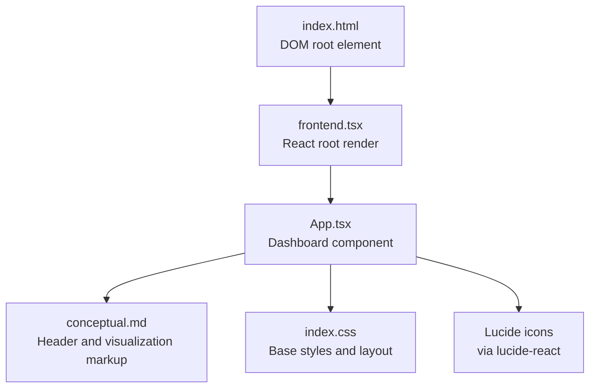
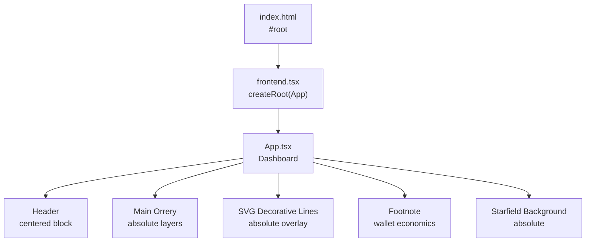
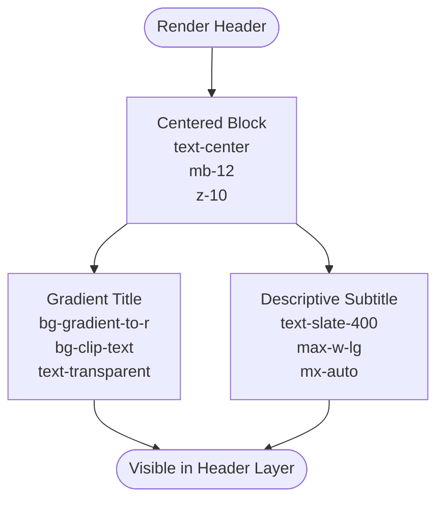
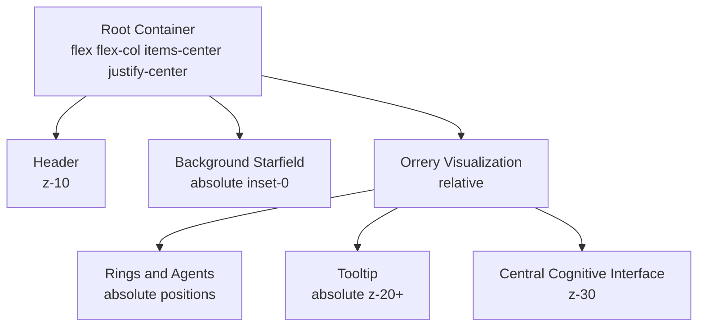
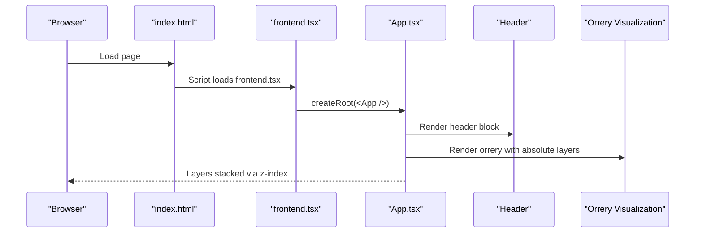
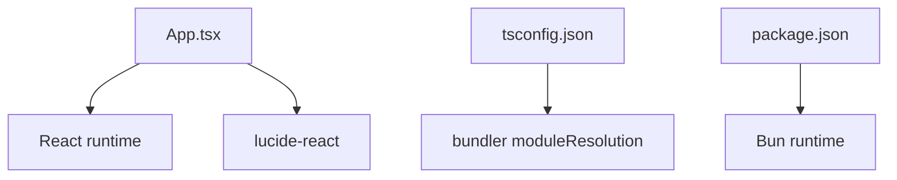

# Dashboard Interface

<cite>
**Referenced Files in This Document**
- [App.tsx](file://src/App.tsx)
- [conceptual.md](file://AB/conceptual.md)
- [frontend.tsx](file://src/frontend.tsx)
- [index.html](file://src/index.html)
- [index.css](file://src/index.css)
- [package.json](file://package.json)
- [tsconfig.json](file://tsconfig.json)
</cite>

## Table of Contents
1. [Introduction](#introduction)
2. [Project Structure](#project-structure)
3. [Core Components](#core-components)
4. [Architecture Overview](#architecture-overview)
5. [Detailed Component Analysis](#detailed-component-analysis)
6. [Dependency Analysis](#dependency-analysis)
7. [Performance Considerations](#performance-considerations)
8. [Troubleshooting Guide](#troubleshooting-guide)
9. [Conclusion](#conclusion)

## Introduction
This document explains the dashboard interface component that hosts the “371-OS Universe” header and the main orrery visualization. It focuses on:
- The header’s gradient-styled title and descriptive subtitle
- The Flexbox-centered layout and z-index stacking for layered elements
- Responsive design considerations and overflow handling
- Integration points with the main orrery visualization and how the header maintains visual hierarchy
- Practical guidance for avoiding text clipping on small screens using Tailwind CSS classes

## Project Structure
The dashboard is implemented as a single-page React application rendered into the DOM via a minimal HTML template. The primary React component defines the layout, header, and visualization layers.

**Diagram sources**
- [index.html](file://src/index.html#L1-L14)
- [frontend.tsx](file://src/frontend.tsx#L1-L27)
- [App.tsx](file://src/App.tsx#L1-L206)
- [conceptual.md](file://AB/conceptual.md#L1-L205)
- [index.css](file://src/index.css#L1-L188)
- [package.json](file://package.json#L1-L31)

**Section sources**
- [index.html](file://src/index.html#L1-L14)
- [frontend.tsx](file://src/frontend.tsx#L1-L27)
- [App.tsx](file://src/App.tsx#L1-L206)
- [conceptual.md](file://AB/conceptual.md#L1-L205)
- [index.css](file://src/index.css#L1-L188)
- [package.json](file://package.json#L1-L31)
- [tsconfig.json](file://tsconfig.json#L1-L18)

## Core Components
- Dashboard container: A flex-col-centered layout with a starfield background and absolute-positioned layers for the header, visualization, and decorative SVG.
- Header: A centered block containing a gradient-styled title and a descriptive subtitle.
- Main orrery visualization: A rotating, layered system with ventures, agents, and a central cognitive interface.

Key implementation references:
- Centered Flexbox container and background starfield: [App.tsx](file://src/App.tsx#L50-L67)
- Header block with gradient title and subtitle: [App.tsx](file://src/App.tsx#L69-L77)
- Main orrery area and layered elements: [App.tsx](file://src/App.tsx#L80-L181)
- Conceptual header and visualization markup: [conceptual.md](file://AB/conceptual.md#L69-L181)

**Section sources**
- [App.tsx](file://src/App.tsx#L50-L181)
- [conceptual.md](file://AB/conceptual.md#L69-L181)

## Architecture Overview
The dashboard composes the header and visualization inside a single-page React component. The header appears above the orrery, while the orrery uses absolute positioning and z-index to layer its rings and floating tooltips.

**Diagram sources**
- [index.html](file://src/index.html#L1-L14)
- [frontend.tsx](file://src/frontend.tsx#L1-L27)
- [App.tsx](file://src/App.tsx#L50-L201)

## Detailed Component Analysis

### Header Information
The header is a centered block that establishes the brand identity and mission statement. It uses:
- A gradient-styled title with a text-clip technique to reveal the gradient fill
- A descriptive subtitle with constrained width and horizontal centering
- A z-index to keep it above the background but below the visualization layers

Implementation highlights:
- Centered container with bottom margin and z-index: [App.tsx](file://src/App.tsx#L69-L77)
- Gradient title using text-clip technique: [App.tsx](file://src/App.tsx#L71-L73)
- Subtitle with max-width and auto margins: [App.tsx](file://src/App.tsx#L74-L76)
- Conceptual header markup: [conceptual.md](file://AB/conceptual.md#L69-L77)

**Diagram sources**
- [App.tsx](file://src/App.tsx#L69-L77)

**Section sources**
- [App.tsx](file://src/App.tsx#L69-L77)
- [conceptual.md](file://AB/conceptual.md#L69-L77)

### Layout Structure: Flexbox, Centering, and Stacking
The dashboard uses a flex-col-centered container to vertically and horizontally center the content. Absolute positioning and z-index are used to layer the background, header, orrery, and decorative elements.

Key points:
- Flexbox centering on the root container: [App.tsx](file://src/App.tsx#L50-L51)
- Header block positioned above background but below visualization layers: [App.tsx](file://src/App.tsx#L69-L77)
- Orrery area uses absolute positioning and z-index for rings and tooltips: [App.tsx](file://src/App.tsx#L80-L181)

**Diagram sources**
- [App.tsx](file://src/App.tsx#L50-L181)

**Section sources**
- [App.tsx](file://src/App.tsx#L50-L181)

### Responsive Design Considerations
Responsive behavior is achieved primarily through:
- Using relative units and constraints for the orrery container
- Limiting text widths with max-width utilities
- Ensuring the subtitle remains readable on narrow screens
- Preventing overflow by setting overflow-hidden on the root container

Practical guidance:
- Use max-width utilities on the subtitle to prevent wrapping on small screens: [App.tsx](file://src/App.tsx#L74-L76)
- Keep the orrery container size relative to viewport constraints; consider adding responsive modifiers for smaller screens if needed: [App.tsx](file://src/App.tsx#L80-L81)
- Ensure the header container remains centered and spaced appropriately across breakpoints: [App.tsx](file://src/App.tsx#L69-L77)

Common issues and solutions:
- Text clipping on small screens: Use max-width utilities and responsive text sizes to keep content readable. Prefer concise subtitles and avoid long single words without hyphens. Reference: [App.tsx](file://src/App.tsx#L74-L76)
- Overflow on mobile: The root container sets overflow-hidden to prevent scrollbars during animations: [App.tsx](file://src/App.tsx#L50-L51)

**Section sources**
- [App.tsx](file://src/App.tsx#L50-L81)

### Integration with the Main Orrery Visualization
The header sits above the orrery visualization and maintains visual hierarchy through z-index stacking. The orrery itself is composed of:
- An outer ring representing ventures
- A middle ring for C-suite agents
- A central cognitive interface with mode toggles
- Floating tooltips and decorative SVG lines

Integration points:
- The header’s z-index keeps it above the starfield background but below the orrery layers: [App.tsx](file://src/App.tsx#L69-L77)
- The orrery container uses absolute positioning and z-index to layer rings and tooltips: [App.tsx](file://src/App.tsx#L80-L181)
- Conceptual orrery structure and tooltip placement: [conceptual.md](file://AB/conceptual.md#L80-L181)

**Diagram sources**
- [index.html](file://src/index.html#L1-L14)
- [frontend.tsx](file://src/frontend.tsx#L1-L27)
- [App.tsx](file://src/App.tsx#L50-L181)

**Section sources**
- [App.tsx](file://src/App.tsx#L50-L181)
- [conceptual.md](file://AB/conceptual.md#L80-L181)

### Tailwind CSS Usage in AB/conceptual.md
The conceptual file demonstrates Tailwind classes for:
- Typography: text sizes, weights, and letter-spacing
- Color gradients: text gradients and background gradients
- Spacing: margins, paddings, and max-width constraints
- Positioning: absolute overlays and z-index stacking

Examples to review:
- Gradient title and subtitle: [conceptual.md](file://AB/conceptual.md#L69-L77)
- Max-width and centering for the subtitle: [conceptual.md](file://AB/conceptual.md#L74-L76)
- Absolute overlays and z-index stacking for tooltip and rings: [conceptual.md](file://AB/conceptual.md#L80-L181)

**Section sources**
- [conceptual.md](file://AB/conceptual.md#L69-L181)

## Dependency Analysis
External dependencies and integrations:
- React runtime and JSX runtime are configured for bundler resolution: [tsconfig.json](file://tsconfig.json#L1-L18)
- Lucide icons are imported for visualization elements: [App.tsx](file://src/App.tsx#L1-L18)
- Bun runtime and package manager metadata: [package.json](file://package.json#L1-L31)

**Diagram sources**
- [App.tsx](file://src/App.tsx#L1-L18)
- [tsconfig.json](file://tsconfig.json#L1-L18)
- [package.json](file://package.json#L1-L31)

**Section sources**
- [App.tsx](file://src/App.tsx#L1-L18)
- [tsconfig.json](file://tsconfig.json#L1-L18)
- [package.json](file://package.json#L1-L31)

## Performance Considerations
- Minimize layout thrashing by keeping heavy animations on offscreen elements (e.g., starfield background) and limiting reflows to necessary components.
- Use z-index strategically to reduce repaint areas; the header and orrery are already separated via absolute positioning.
- Keep subtitle text concise to reduce text wrapping and layout recalculations on small screens.

[No sources needed since this section provides general guidance]

## Troubleshooting Guide
Common issues and resolutions:
- Text clipping on small screens:
  - Ensure the subtitle uses a max-width utility and auto margins to constrain width: [App.tsx](file://src/App.tsx#L74-L76)
  - Consider responsive text utilities to adjust font sizes for smaller viewports if needed.
- Overflow causing scrollbars:
  - The root container sets overflow-hidden to prevent scrolling during animations: [App.tsx](file://src/App.tsx#L50-L51)
- Tooltip overlaps or gets clipped:
  - Verify the tooltip’s absolute positioning and sufficient z-index relative to orrery layers: [App.tsx](file://src/App.tsx#L161-L179)

**Section sources**
- [App.tsx](file://src/App.tsx#L50-L76)
- [App.tsx](file://src/App.tsx#L161-L179)

## Conclusion
The dashboard interface centers the “371-OS Universe” header above a layered orrery visualization. The header uses a gradient-styled title and a descriptive subtitle, both constrained for readability. The layout relies on Flexbox centering and absolute positioning with z-index to manage layering. Responsive behavior is handled through constrained widths and careful spacing, with overflow controlled at the root level. Integration with the orrery visualization is seamless, preserving visual hierarchy and enabling interactive tooltips and animated rings.