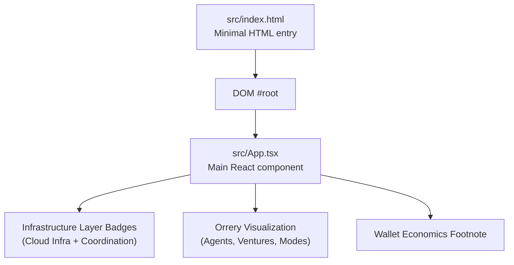
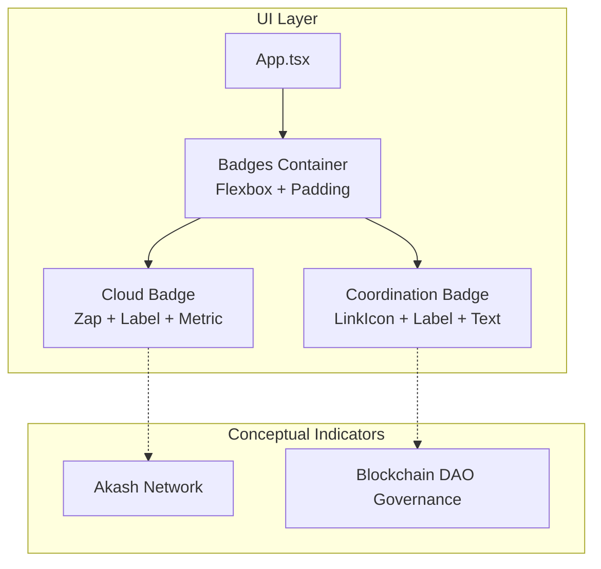
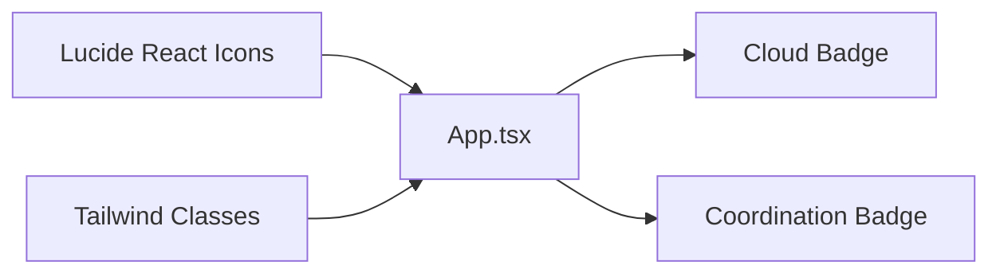

# Infrastructure Layer

<cite>
**Referenced Files in This Document**
- [App.tsx](file://src/App.tsx)
- [index.html](file://src/index.html)
- [index.css](file://src/index.css)
- [projectinfo.md](file://projectinfo.md)
- [conceptual.md](file://AB/conceptual.md)
</cite>

## Table of Contents
1. [Introduction](#introduction)
2. [Project Structure](#project-structure)
3. [Core Components](#core-components)
4. [Architecture Overview](#architecture-overview)
5. [Detailed Component Analysis](#detailed-component-analysis)
6. [Dependency Analysis](#dependency-analysis)
7. [Performance Considerations](#performance-considerations)
8. [Troubleshooting Guide](#troubleshooting-guide)
9. [Conclusion](#conclusion)

## Introduction
This document explains the infrastructure layer components displayed at the bottom of the orrery visualization. It focuses on the two informational badges:
- Cloud Infrastructure (Akash Network)
- Coordination (Blockchain DAO Governance)

It documents how Flexbox is used for horizontal layout with space-between alignment and padding for edge spacing, how Lucide React icons are used with custom coloring, and how typography is structured with uppercase labels in muted colors and monospace font for technical details. It also covers responsive behavior and stacking considerations, and clarifies that these components are conceptual indicators rather than interactive elements.

## Project Structure
The infrastructure layer badges are rendered within the main application component and styled with Tailwind classes. The page is bootstrapped via a minimal HTML entry point.

**Diagram sources**
- [index.html](file://src/index.html#L1-L14)
- [App.tsx](file://src/App.tsx#L143-L159)

**Section sources**
- [index.html](file://src/index.html#L1-L14)
- [App.tsx](file://src/App.tsx#L143-L159)

## Core Components
The infrastructure layer consists of two horizontally aligned badges at the bottom of the orrery area. Each badge:
- Uses a Lucide React icon with custom color
- Has a small vertical stack of text:
  - Uppercase label in muted color
  - Monospace technical detail in a slightly lighter color
- Is padded and bordered for edge spacing and visual separation
- Is positioned absolutely below the orrery container

Implementation highlights:
- Horizontal layout uses Flexbox with space-between alignment on the parent container
- Edge spacing is achieved via horizontal padding on the parent container
- Iconography uses Zap and LinkIcon from Lucide React with explicit color classes
- Typography hierarchy:
  - Uppercase labels with muted color and bold weight
  - Monospace technical details with a slightly lighter color
- Responsiveness:
  - The parent container is full-width and uses horizontal padding for edge spacing
  - On narrow screens, the badges remain side-by-side; stacking behavior is not explicitly defined in code

**Section sources**
- [App.tsx](file://src/App.tsx#L143-L159)

## Architecture Overview
The badges are conceptual indicators that reflect the project’s infrastructure and governance choices. They are not interactive and do not trigger external integrations in the UI. Instead, they serve as persistent labels that communicate:
- Cloud Infrastructure: Akash Network with a stated cost reduction metric
- Coordination: Blockchain DAO Governance

**Diagram sources**
- [App.tsx](file://src/App.tsx#L143-L159)
- [projectinfo.md](file://projectinfo.md#L44-L46)

## Detailed Component Analysis

### Cloud Infrastructure Badge
- Purpose: Conveys cloud hosting platform and cost optimization metric
- Implementation:
  - Uses the Zap icon from Lucide React
  - Label: uppercase, muted color, bold weight
  - Metric: monospace, slightly lighter color, includes percentage reduction
  - Layout: flex row with icon and text stack, with internal spacing
  - Background and borders: subtle background, border, and padding for edge spacing

Responsibilities:
- Present conceptual information about cloud infrastructure
- Do not accept user interaction

Accessibility and semantics:
- No interactive roles or handlers
- Uses semantic text and iconography to convey meaning

**Section sources**
- [App.tsx](file://src/App.tsx#L143-L151)

### Coordination Badge
- Purpose: Conveys governance model and coordination mechanism
- Implementation:
  - Uses the LinkIcon from Lucide React
  - Label: uppercase, muted color, bold weight
  - Text: monospace, slightly lighter color
  - Layout: flex row mirroring the Cloud badge

Responsibilities:
- Present conceptual information about governance
- Do not accept user interaction

**Section sources**
- [App.tsx](file://src/App.tsx#L152-L158)

### Layout and Spacing (Flexbox + Padding)
- Parent container:
  - Full-width container with horizontal padding for edge spacing
  - Flexbox with space-between alignment to push badges to edges
- Child badges:
  - Flex row with internal spacing between icon and text
  - Padded containers with subtle borders and backgrounds for readability

Responsive behavior:
- The container is full-width and applies horizontal padding
- No explicit media queries are present for stacking; badges remain side-by-side by default

Stacking considerations:
- Not explicitly defined in code; badges are intended to stay side-by-side
- If stacking becomes necessary, consider adding a media query to switch to a single-column layout

**Section sources**
- [App.tsx](file://src/App.tsx#L143-L159)

### Iconography and Color
- Icons:
  - Zap (Cloud badge)
  - LinkIcon (Coordination badge)
- Colors:
  - Explicit color classes are applied to each icon
  - Labels use muted colors; metrics use a slightly lighter color

Integration note:
- Icons are imported from Lucide React and rendered directly in the UI
- No runtime fetching or external rendering is performed

**Section sources**
- [App.tsx](file://src/App.tsx#L1-L18)
- [App.tsx](file://src/App.tsx#L143-L159)

### Typography Hierarchy
- Labels:
  - Uppercase, bold, muted color
- Technical details:
  - Monospace font, slightly lighter color
- Font family:
  - The base page uses a sans-serif stack; badges inherit text styles from the surrounding context

**Section sources**
- [App.tsx](file://src/App.tsx#L143-L159)
- [index.css](file://src/index.css#L1-L20)

### Responsive Behavior and Stacking
- Current behavior:
  - Full-width container with horizontal padding
  - Side-by-side badges with space-between alignment
- Stacking:
  - Not defined in code; badges remain side-by-side
- Recommendations:
  - Add a media query to stack badges vertically on narrow screens if desired
  - Consider adjusting font sizes and spacing for smaller viewports

**Section sources**
- [App.tsx](file://src/App.tsx#L143-L159)

### External Systems Integration
- These badges are conceptual indicators and do not integrate with external systems in the UI.
- They reflect project-level information documented elsewhere:
  - Cloud Infrastructure: Akash Network (97.6% cost reduction)
  - Coordination: Blockchain DAO Governance

**Section sources**
- [projectinfo.md](file://projectinfo.md#L44-L46)
- [conceptual.md](file://AB/conceptual.md#L143-L158)

## Dependency Analysis
The badges depend on:
- Lucide React for iconography
- Tailwind classes for layout, spacing, and colors
- The main application component for positioning and context

**Diagram sources**
- [App.tsx](file://src/App.tsx#L1-L18)
- [App.tsx](file://src/App.tsx#L143-L159)

**Section sources**
- [App.tsx](file://src/App.tsx#L1-L18)
- [App.tsx](file://src/App.tsx#L143-L159)

## Performance Considerations
- The badges are static, non-interactive elements; they do not introduce layout thrashing or heavy computations.
- Using Tailwind utility classes keeps rendering lightweight.
- If stacking is introduced later, keep media queries simple to avoid layout shifts.

## Troubleshooting Guide
- Icons not visible:
  - Verify Lucide React is installed and icons are imported correctly
- Colors not applying:
  - Confirm Tailwind color classes are valid and not overridden by other styles
- Misaligned badges:
  - Ensure the parent container uses Flexbox with space-between alignment and appropriate padding
- Text not readable:
  - Adjust contrast between label and metric colors if needed

**Section sources**
- [App.tsx](file://src/App.tsx#L1-L18)
- [App.tsx](file://src/App.tsx#L143-L159)

## Conclusion
The infrastructure layer badges provide clear, conceptual indicators of the system’s cloud hosting and governance model. They are implemented with Flexbox for layout, Lucide React icons with custom coloring, and a consistent typographic hierarchy. As non-interactive elements, they serve as persistent labels that communicate key infrastructure facts without requiring user interaction or external integrations.