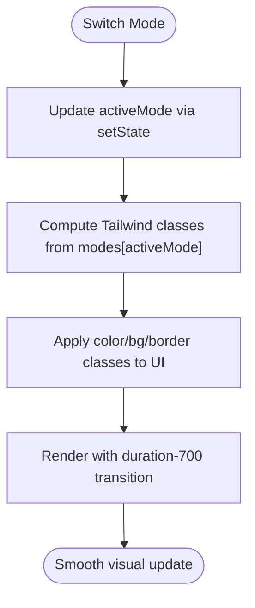

# Mode Switching

<cite>
**Referenced Files in This Document**
- [App.tsx](file://src/App.tsx)
- [conceptual.md](file://AB/conceptual.md)
- [frontend.tsx](file://src/frontend.tsx)
- [index.css](file://src/index.css)
</cite>

## Table of Contents
1. [Introduction](#introduction)
2. [Project Structure](#project-structure)
3. [Core Components](#core-components)
4. [Architecture Overview](#architecture-overview)
5. [Detailed Component Analysis](#detailed-component-analysis)
6. [Dependency Analysis](#dependency-analysis)
7. [Performance Considerations](#performance-considerations)
8. [Troubleshooting Guide](#troubleshooting-guide)
9. [Conclusion](#conclusion)

## Introduction
This document explains the mode switching mechanism between Executive, Technical, and Creative modes. It covers how React’s useState manages the activeMode state, how button clicks update this state, how Tailwind CSS classes are dynamically applied based on the active mode, and how visual transitions with duration-700 provide smooth state changes. It also documents the Brain icon’s pulse animation independent of mode state and addresses common issues such as delayed visual updates.

## Project Structure
The mode switching logic resides in a single React component that serves as the application entry point. The component defines the modes configuration object and binds Tailwind classes conditionally to reflect the active mode. Buttons trigger state updates, and a separate useEffect controls the Brain icon’s pulse animation.

**Diagram sources**
- [frontend.tsx](file://src/frontend.tsx#L1-L27)
- [App.tsx](file://src/App.tsx#L1-L206)
- [index.css](file://src/index.css#L1-L188)

**Section sources**
- [frontend.tsx](file://src/frontend.tsx#L1-L27)
- [App.tsx](file://src/App.tsx#L1-L206)
- [index.css](file://src/index.css#L1-L188)

## Core Components
- Active mode state: managed by React’s useState hook initialized to “Executive”.
- Modes configuration object: maps each mode to Tailwind class keys for color, background, border, and description.
- Mode toggle buttons: iterate over the modes keys and set the active mode on click.
- Dynamic Tailwind class binding: applies color, background, and border classes based on the active mode.
- Smooth transitions: a duration-700 transition ensures gradual visual updates.
- Pulse animation: a separate useEffect-driven interval toggles a pulse state for the Brain icon.

**Section sources**
- [App.tsx](file://src/App.tsx#L19-L27)
- [App.tsx](file://src/App.tsx#L29-L33)
- [App.tsx](file://src/App.tsx#L116-L141)
- [App.tsx](file://src/App.tsx#L24-L27)

## Architecture Overview
The mode switching architecture centers on a single component that:
- Declares the activeMode state and modes configuration.
- Renders a central cognitive interface whose visual attributes change based on activeMode.
- Provides buttons to switch modes.
- Applies Tailwind classes dynamically for color, background, and borders.
- Uses a duration-700 transition for smooth visual changes.
- Runs an independent pulse animation for the Brain icon via useEffect.

**Diagram sources**
- [App.tsx](file://src/App.tsx#L19-L27)
- [App.tsx](file://src/App.tsx#L29-L33)
- [App.tsx](file://src/App.tsx#L116-L141)
- [App.tsx](file://src/App.tsx#L24-L27)

## Detailed Component Analysis

### React useState Hook for activeMode
- The activeMode state is declared with useState and initialized to “Executive”.
- The modes configuration object defines color, background, border, and description for each mode.
- The component reads the active mode to compute Tailwind class strings for the cognitive interface and buttons.

Key implementation references:
- State declaration and initial value: [App.tsx](file://src/App.tsx#L19-L21)
- Modes configuration object: [App.tsx](file://src/App.tsx#L29-L33)

**Section sources**
- [App.tsx](file://src/App.tsx#L19-L21)
- [App.tsx](file://src/App.tsx#L29-L33)

### Button Clicks and State Updates
- The component renders a row of buttons for each mode.
- Each button’s click handler invokes setActiveMode with the target mode.
- Conditional class binding highlights the active mode button and de-emphasizes inactive ones.

Key implementation references:
- Mode toggle rendering and click handler: [App.tsx](file://src/App.tsx#L130-L141)

**Section sources**
- [App.tsx](file://src/App.tsx#L130-L141)

### Dynamic Tailwind Classes Based on activeMode
- The cognitive interface container receives dynamic Tailwind classes for border and background derived from the active mode.
- Text color classes are applied to the mode label and description.
- Buttons apply background, border, and text color classes based on whether they represent the active mode.

Key implementation references:
- Cognitive interface container classes: [App.tsx](file://src/App.tsx#L116-L127)
- Mode toggle button classes: [App.tsx](file://src/App.tsx#L130-L141)

**Section sources**
- [App.tsx](file://src/App.tsx#L116-L127)
- [App.tsx](file://src/App.tsx#L130-L141)

### Visual Transitions with duration-700
- The cognitive interface container includes a duration-700 transition to smooth color, background, and border changes when activeMode switches.
- The Brain icon’s pulse animation uses transition-all for smooth scaling and opacity changes.

Key implementation references:
- Duration-700 transition on the cognitive interface: [App.tsx](file://src/App.tsx#L116-L127)
- Pulse transition on the Brain icon: [App.tsx](file://src/App.tsx#L118-L121)

**Section sources**
- [App.tsx](file://src/App.tsx#L116-L127)
- [App.tsx](file://src/App.tsx#L118-L121)

### Conditional Class Binding and Icon Rendering (from conceptual.md)
- The conceptual.md file demonstrates the same pattern for conditional class binding and icon rendering, confirming the approach used in the primary App component.
- It shows how the active mode affects the Brain icon’s color and the mode label text.

Key implementation references:
- Conditional class binding and icon rendering: [conceptual.md](file://AB/conceptual.md#L116-L127)

**Section sources**
- [conceptual.md](file://AB/conceptual.md#L116-L127)

### Pulse Animation Controlled by setInterval
- A useEffect runs a setInterval that toggles a pulse state every 2 seconds.
- The Brain icon’s class includes pulse-dependent scale and opacity classes, enabling independent visual feedback from the mode state.

Key implementation references:
- useEffect for pulse interval: [App.tsx](file://src/App.tsx#L24-L27)
- Pulse-dependent Brain icon classes: [App.tsx](file://src/App.tsx#L118-L121)

**Section sources**
- [App.tsx](file://src/App.tsx#L24-L27)
- [App.tsx](file://src/App.tsx#L118-L121)

### Visual Transitions Flowchart

**Diagram sources**
- [App.tsx](file://src/App.tsx#L19-L27)
- [App.tsx](file://src/App.tsx#L29-L33)
- [App.tsx](file://src/App.tsx#L116-L127)

## Dependency Analysis
- Component dependencies:
  - React hooks: useState and useEffect.
  - Lucide icons imported for rendering.
  - Tailwind CSS classes for styling and transitions.
- External runtime:
  - Bun server for development and hot module replacement.

**Diagram sources**
- [App.tsx](file://src/App.tsx#L1-L206)
- [frontend.tsx](file://src/frontend.tsx#L1-L27)

**Section sources**
- [App.tsx](file://src/App.tsx#L1-L206)
- [frontend.tsx](file://src/frontend.tsx#L1-L27)

## Performance Considerations
- State updates are atomic and batched by React during event handlers, minimizing unnecessary re-renders.
- The useEffect for pulse runs only once and cleans up on unmount, avoiding memory leaks.
- duration-700 transitions are efficient for modest DOM updates; keep the number of animated elements reasonable for smoothness.
- Global CSS animations and transitions are defined in index.css and do not interfere with component-level transitions.

[No sources needed since this section provides general guidance]

## Troubleshooting Guide
Common issues and solutions:
- Delayed visual updates after clicking a mode button:
  - Ensure the component re-renders after setState completes. React batches state updates within event handlers automatically.
  - Verify Tailwind classes are computed from the modes object and applied to the container and buttons.
  - Confirm the duration-700 transition is present on the container to smooth changes.
- Pulse animation not syncing with mode changes:
  - The pulse effect is independent of activeMode and controlled by a separate useEffect interval. If it appears out of sync, confirm the interval timing and the pulse class application on the Brain icon.
- Unexpected flicker or class conflicts:
  - Check that only one mode is highlighted at a time and that the active mode classes are applied consistently across the container and buttons.
  - Validate Tailwind JIT compilation and that the classes exist in the build.

**Section sources**
- [App.tsx](file://src/App.tsx#L19-L27)
- [App.tsx](file://src/App.tsx#L29-L33)
- [App.tsx](file://src/App.tsx#L116-L141)
- [App.tsx](file://src/App.tsx#L24-L27)

## Conclusion
The mode switching mechanism cleanly separates concerns: state management via useState, dynamic Tailwind class binding, and smooth visual transitions. The Brain icon’s pulse animation adds a distinct, independent feedback loop. By following the patterns shown here—atomic state updates, consistent class computation, and careful use of transitions—you can implement reliable and visually pleasing mode switching experiences.