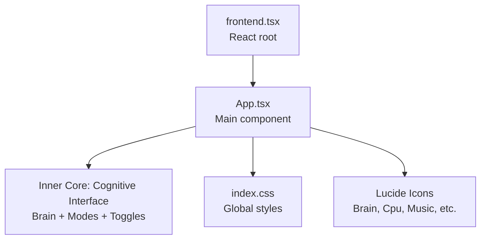
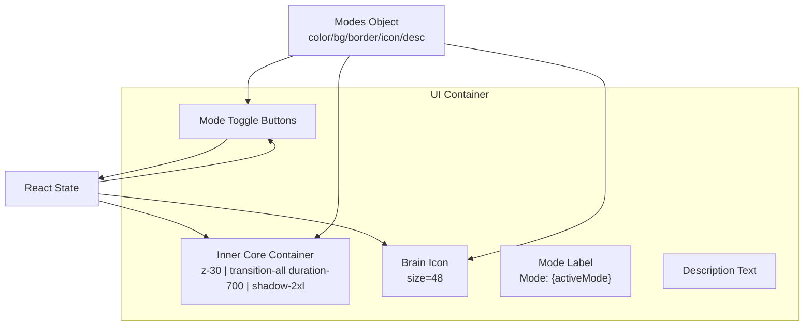
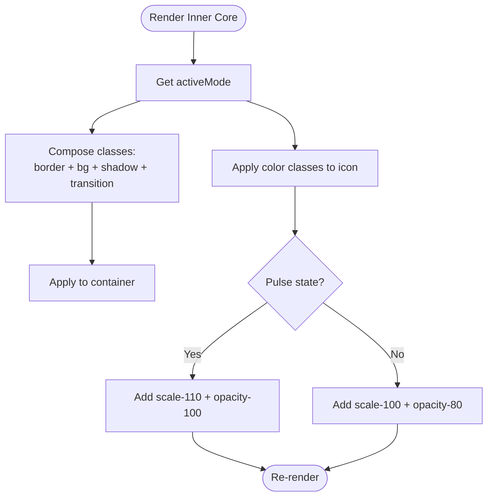
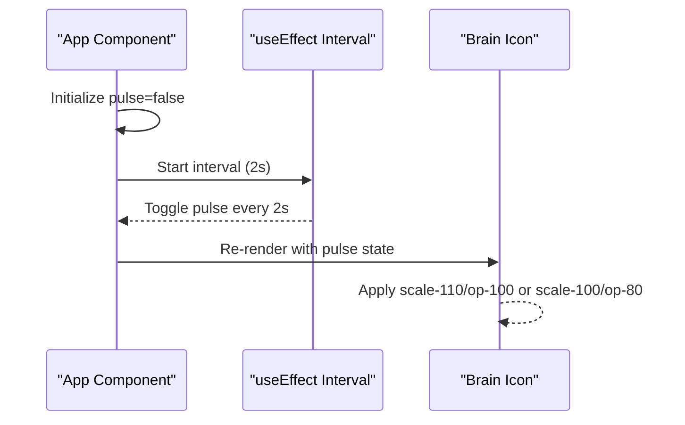
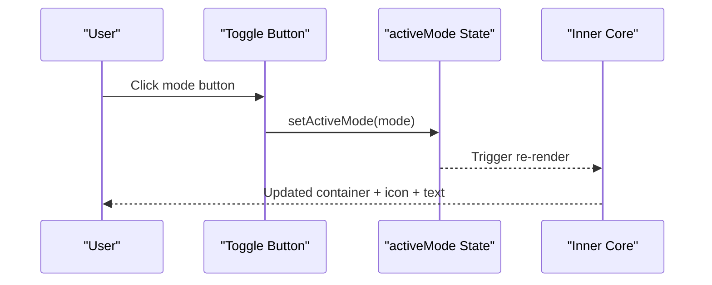
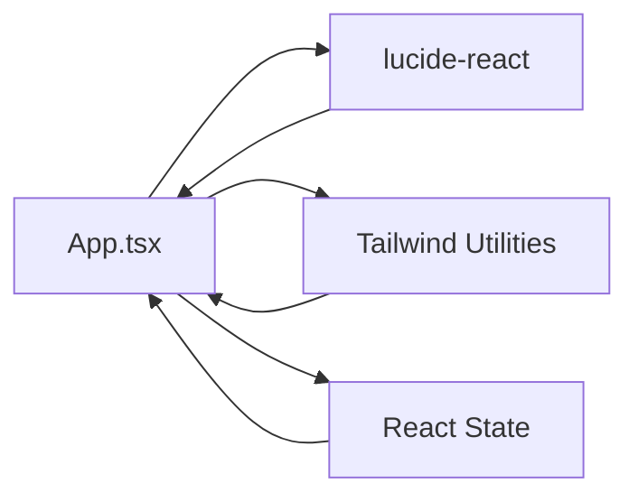

# Inner Core: Cognitive Interface

<cite>
**Referenced Files in This Document**
- [App.tsx](file://src/App.tsx)
- [frontend.tsx](file://src/frontend.tsx)
- [index.css](file://src/index.css)
- [README.md](file://README.md)
- [package.json](file://package.json)
</cite>

## Table of Contents
1. [Introduction](#introduction)
2. [Project Structure](#project-structure)
3. [Core Components](#core-components)
4. [Architecture Overview](#architecture-overview)
5. [Detailed Component Analysis](#detailed-component-analysis)
6. [Dependency Analysis](#dependency-analysis)
7. [Performance Considerations](#performance-considerations)
8. [Troubleshooting Guide](#troubleshooting-guide)
9. [Conclusion](#conclusion)
10. [Appendices](#appendices)

## Introduction
This document explains the inner core cognitive interface that visualizes the active cognitive mode (Executive, Technical, Creative) with dynamic styling driven by React state. It covers:
- Central brain visualization and its dynamic styling using a modes object
- Pulsing animation on the Brain icon via useState and useEffect with a 2-second interval
- Mode toggle buttons enabling users to switch modes with immediate visual feedback
- Tailwind-based class composition using template literals
- Stacking context and transitions for smooth depth and motion
- State persistence considerations and enhancement ideas such as localStorage integration

## Project Structure
The cognitive interface lives within the main application component and is rendered by the React root entry point. Supporting styles are defined in the global stylesheet.

**Diagram sources**
- [frontend.tsx](file://src/frontend.tsx#L8-L26)
- [App.tsx](file://src/App.tsx#L1-L206)
- [index.css](file://src/index.css#L1-L188)

**Section sources**
- [frontend.tsx](file://src/frontend.tsx#L8-L26)
- [App.tsx](file://src/App.tsx#L1-L206)
- [index.css](file://src/index.css#L1-L188)

## Core Components
- Active mode state: Tracks the currently selected cognitive mode.
- Modes object: Encapsulates color, background, border, icon, and description per mode.
- Pulse state: Controls the pulsing animation on the Brain icon.
- Mode toggle buttons: Allow switching modes with visual feedback.

Key implementation references:
- State initialization and effects: [App.tsx](file://src/App.tsx#L19-L27)
- Modes object definition: [App.tsx](file://src/App.tsx#L29-L33)
- Inner core rendering and dynamic classes: [App.tsx](file://src/App.tsx#L116-L141)
- Toggle button rendering and click handler: [App.tsx](file://src/App.tsx#L130-L140)
- Pulse animation effect: [App.tsx](file://src/App.tsx#L24-L27)

**Section sources**
- [App.tsx](file://src/App.tsx#L19-L27)
- [App.tsx](file://src/App.tsx#L29-L33)
- [App.tsx](file://src/App.tsx#L116-L141)
- [App.tsx](file://src/App.tsx#L130-L140)

## Architecture Overview
The cognitive interface is a self-contained visual hub centered within the layout. It reacts to state changes to update colors, borders, backgrounds, icons, and animations. The toggle buttons update the active mode, which cascades into dynamic class composition for the container and icon.

**Diagram sources**
- [App.tsx](file://src/App.tsx#L116-L141)
- [App.tsx](file://src/App.tsx#L29-L33)
- [App.tsx](file://src/App.tsx#L130-L140)

## Detailed Component Analysis

### Modes Object and Dynamic Styling
The modes object defines a compact set of visual attributes per mode:
- Color classes for text and icon
- Background classes for the container
- Border classes for the container
- Description text
- Icon component for the mode

Dynamic styling is applied by composing class names using template literals and the active mode key. This ensures the container’s border, background, and the icon/text color reflect the current mode.

Implementation references:
- Modes object: [App.tsx](file://src/App.tsx#L29-L33)
- Container classes (border, background, shadow, transition): [App.tsx](file://src/App.tsx#L116-L117)
- Icon classes (color, transition, pulse): [App.tsx](file://src/App.tsx#L118-L121)
- Mode label and description: [App.tsx](file://src/App.tsx#L122-L127)

**Diagram sources**
- [App.tsx](file://src/App.tsx#L116-L121)
- [App.tsx](file://src/App.tsx#L29-L33)

**Section sources**
- [App.tsx](file://src/App.tsx#L29-L33)
- [App.tsx](file://src/App.tsx#L116-L127)

### Pulsing Animation on the Brain Icon
The pulsing effect is implemented with:
- useState to track the pulse state
- useEffect to set up a 2-second interval that toggles the pulse state
- Conditional class application to the icon based on pulse state

Behavior:
- Every 2 seconds, the pulse state flips, switching between two visual states for the icon (scale and opacity).
- The container also uses a transition duration for smooth visual changes.

Implementation references:
- Pulse state and interval: [App.tsx](file://src/App.tsx#L20-L27)
- Pulse-driven icon classes: [App.tsx](file://src/App.tsx#L118-L121)
- Container transition duration: [App.tsx](file://src/App.tsx#L116-L117)

**Diagram sources**
- [App.tsx](file://src/App.tsx#L20-L27)
- [App.tsx](file://src/App.tsx#L118-L121)

**Section sources**
- [App.tsx](file://src/App.tsx#L20-L27)
- [App.tsx](file://src/App.tsx#L118-L121)

### Mode Toggle Buttons and Visual Feedback
The toggle buttons:
- Render one button per mode
- Switch the active mode on click
- Provide visual feedback based on whether the button corresponds to the active mode

Feedback mechanism:
- When a button matches the active mode, it receives the mode’s background, border, and color classes
- Otherwise, it uses neutral defaults with hover effects

Implementation references:
- Button rendering and click handler: [App.tsx](file://src/App.tsx#L130-L140)
- Modes object used for button styling: [App.tsx](file://src/App.tsx#L29-L33)

**Diagram sources**
- [App.tsx](file://src/App.tsx#L130-L140)
- [App.tsx](file://src/App.tsx#L29-L33)

**Section sources**
- [App.tsx](file://src/App.tsx#L130-L140)
- [App.tsx](file://src/App.tsx#L29-L33)

### Stacking Context, Transitions, and Depth
- Stacking context: The inner core container uses z-30 to ensure it appears above surrounding elements.
- Smooth transitions: The container applies transition-all with duration-700 for seamless updates.
- Depth: shadow-2xl adds visual depth to the container.

References:
- Stacking and transitions: [App.tsx](file://src/App.tsx#L116-L117)
- Depth/shadow: [App.tsx](file://src/App.tsx#L116-L117)

**Section sources**
- [App.tsx](file://src/App.tsx#L116-L117)

### State Persistence and Enhancements
Current behavior:
- The active mode is stored in React state and resets on reload.

Enhancement ideas:
- Persist the active mode in localStorage so the selection survives page refresh.
- On mount, read the stored mode and initialize state accordingly.
- Optionally persist the pulse state if desired, though it is typically ephemeral.

References for state management:
- Initial state and effects: [App.tsx](file://src/App.tsx#L19-L27)

Potential integration points:
- Initialize state from localStorage on mount
- Update localStorage whenever the active mode changes

**Section sources**
- [App.tsx](file://src/App.tsx#L19-L27)

## Dependency Analysis
External dependencies relevant to the cognitive interface:
- lucide-react icons are used for the Brain, Cpu, Music, and others
- Tailwind utility classes drive dynamic styling and transitions

References:
- Icon imports: [App.tsx](file://src/App.tsx#L2-L17)
- Tailwind classes in component: [App.tsx](file://src/App.tsx#L116-L141)
- Global styles: [index.css](file://src/index.css#L1-L188)

**Diagram sources**
- [App.tsx](file://src/App.tsx#L2-L17)
- [App.tsx](file://src/App.tsx#L116-L141)
- [index.css](file://src/index.css#L1-L188)

**Section sources**
- [App.tsx](file://src/App.tsx#L2-L17)
- [App.tsx](file://src/App.tsx#L116-L141)
- [index.css](file://src/index.css#L1-L188)

## Performance Considerations
- The pulsing interval runs continuously; ensure it is cleaned up on unmount (already handled).
- Transition durations are moderate; keep them aligned with user expectations.
- Avoid unnecessary re-renders by keeping the modes object static and passing only the active mode key to the container and buttons.

[No sources needed since this section provides general guidance]

## Troubleshooting Guide
Common issues and resolutions:
- Pulsing not working:
  - Verify the interval is started and cleared on unmount.
  - Confirm the pulse class is applied conditionally based on state.
  - References: [App.tsx](file://src/App.tsx#L20-L27), [App.tsx](file://src/App.tsx#L118-L121)

- Mode toggle not changing visuals:
  - Ensure the active mode state updates and triggers re-render.
  - Confirm the modes object keys match the button keys.
  - References: [App.tsx](file://src/App.tsx#L130-L140), [App.tsx](file://src/App.tsx#L29-L33)

- Visual mismatch (colors, borders):
  - Check that the modes object entries are correct and class composition is applied to the container and icon.
  - References: [App.tsx](file://src/App.tsx#L116-L121), [App.tsx](file://src/App.tsx#L29-L33)

- Stacking order issues:
  - Ensure the container uses z-30 and sibling elements use appropriate stacking contexts.
  - References: [App.tsx](file://src/App.tsx#L116-L117)

**Section sources**
- [App.tsx](file://src/App.tsx#L20-L27)
- [App.tsx](file://src/App.tsx#L116-L121)
- [App.tsx](file://src/App.tsx#L130-L140)
- [App.tsx](file://src/App.tsx#L29-L33)
- [App.tsx](file://src/App.tsx#L116-L117)

## Conclusion
The inner core cognitive interface demonstrates a clean separation of concerns:
- The modes object encapsulates visual semantics per mode
- React state drives dynamic styling and animations
- Tailwind utilities enable rapid composition of responsive, animated UI
- Toggle buttons provide immediate feedback and control

With optional persistence via localStorage, the interface can become more resilient to reloads while maintaining its dynamic, mode-driven aesthetic.

[No sources needed since this section summarizes without analyzing specific files]

## Appendices

### Appendix A: How to Add LocalStorage Persistence
- On mount, read the stored mode and initialize state
- On mode change, update localStorage
- Example references for state management:
  - [App.tsx](file://src/App.tsx#L19-L27)
  - [App.tsx](file://src/App.tsx#L130-L140)

[No sources needed since this section provides general guidance]

### Appendix B: Development and Build Notes
- Development server and scripts are configured in the project metadata.
- References:
  - [README.md](file://README.md#L1-L22)
  - [package.json](file://package.json#L1-L31)

**Section sources**
- [README.md](file://README.md#L1-L22)
- [package.json](file://package.json#L1-L31)