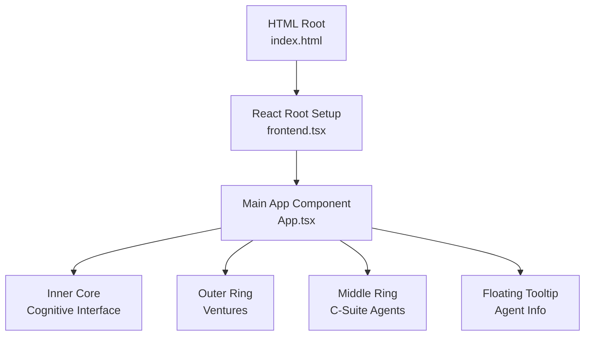
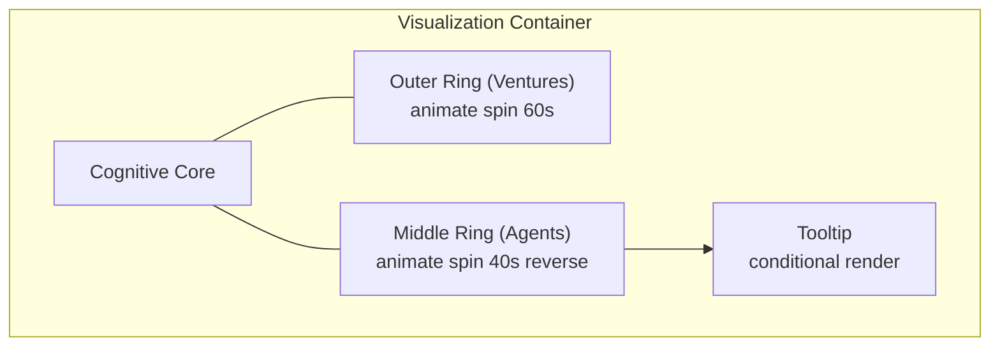
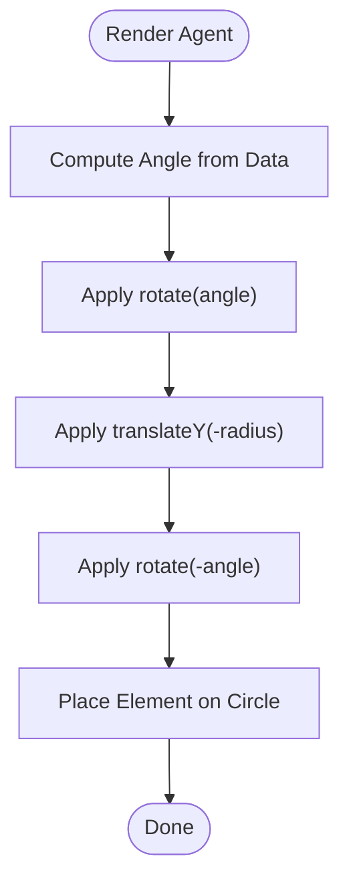
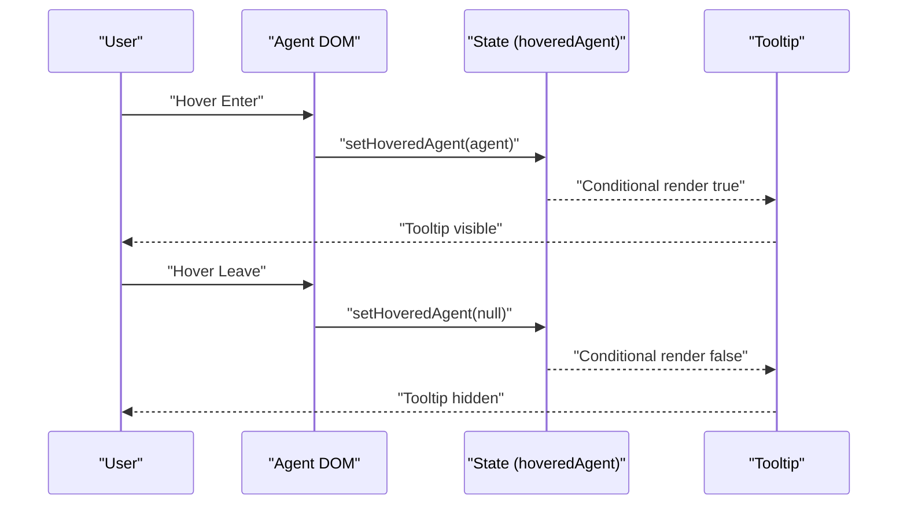
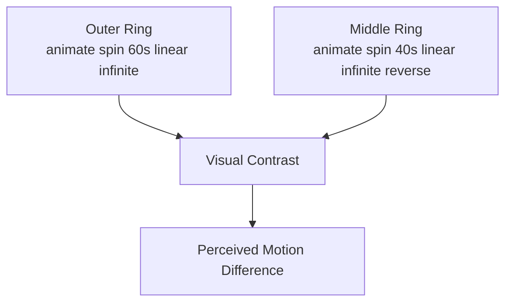
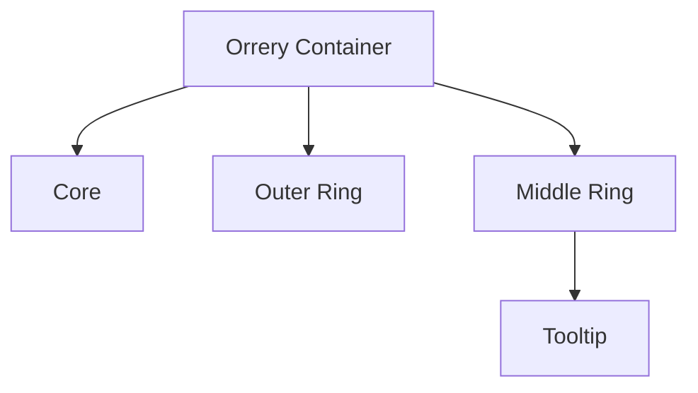
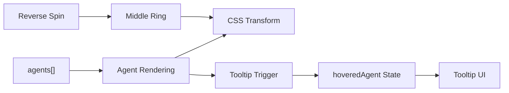

# Middle Ring: C-Suite Agents

<cite>
**Referenced Files in This Document**
- [App.tsx](file://src/App.tsx)
- [index.css](file://src/index.css)
- [index.html](file://src/index.html)
- [frontend.tsx](file://src/frontend.tsx)
- [conceptual.md](file://AB/conceptual.md)
</cite>

## Table of Contents
1. [Introduction](#introduction)
2. [Project Structure](#project-structure)
3. [Core Components](#core-components)
4. [Architecture Overview](#architecture-overview)
5. [Detailed Component Analysis](#detailed-component-analysis)
6. [Dependency Analysis](#dependency-analysis)
7. [Performance Considerations](#performance-considerations)
8. [Accessibility Considerations](#accessibility-considerations)
9. [Troubleshooting Guide](#troubleshooting-guide)
10. [Conclusion](#conclusion)

## Introduction
This document explains the middle ring visualization of C-suite agents in the application. It covers how five agents (CEO Mimi, CTO Zara, CFO Maya, CLO Sage, CAO Eduardo) are radially positioned using trigonometric CSS transforms, how their data model maps to DOM elements, the interactive hover behavior that reveals a floating tooltip, and the animation technique that creates dynamic motion contrast with the outer ring. It also outlines accessibility considerations for screen readers and keyboard navigation.

## Project Structure
The middle ring is implemented within the main application component. The visualization consists of:
- A central cognitive core
- An outer ring of ventures rotating at a different speed
- A middle ring of five C-suite agents rotating in reverse
- A floating tooltip that appears on hover

**Diagram sources**
- [index.html](file://src/index.html#L1-L14)
- [frontend.tsx](file://src/frontend.tsx#L8-L27)
- [App.tsx](file://src/App.tsx#L79-L180)

**Section sources**
- [index.html](file://src/index.html#L1-L14)
- [frontend.tsx](file://src/frontend.tsx#L8-L27)
- [App.tsx](file://src/App.tsx#L79-L180)

## Core Components
- C-suite agents data model: Each agent has an id, name, role, icon, and angle. These values are used to render the middle ring and to populate the tooltip.
- Radial positioning: Agents are placed around a circle using CSS transforms with rotation and translation, then rotated back to keep text upright.
- Hover interaction: Mouse enter/leave handlers update a hovered agent state, enabling conditional rendering of the tooltip.
- Animation: The middle ring rotates in reverse compared to the outer ring to create visual contrast.

**Section sources**
- [App.tsx](file://src/App.tsx#L35-L41)
- [App.tsx](file://src/App.tsx#L100-L114)
- [App.tsx](file://src/App.tsx#L103-L105)
- [App.tsx](file://src/App.tsx#L161-L179)

## Architecture Overview
The middle ring is part of a layered visualization centered on the cognitive core. The outer ring spins at a different rate than the middle ring, and the tooltip floats to the right of the visualization area when an agent is hovered.

**Diagram sources**
- [App.tsx](file://src/App.tsx#L82-L114)
- [App.tsx](file://src/App.tsx#L161-L179)

## Detailed Component Analysis

### Data Model and DOM Mapping
- Data model: The agents array defines each agent’s identity and layout parameters.
- DOM mapping: Each agent is rendered as a DOM element whose style applies a rotation around the center, a vertical translation outward, and a counter-rotation to keep the label readable.

Key implementation points:
- Agent list with id, name, role, icon, and angle
- Conditional rendering of the tooltip based on hovered agent state
- CSS transform sequence to position and orient each agent

**Section sources**
- [App.tsx](file://src/App.tsx#L35-L41)
- [App.tsx](file://src/App.tsx#L100-L114)
- [App.tsx](file://src/App.tsx#L161-L179)

### Trigonometric Radial Positioning with CSS Transforms
The middle ring positions agents using a two-stage transform:
- Rotate by the agent’s angle around the center
- Translate along the Y-axis by a radius value
- Rotate back by the negative of the agent’s angle

This keeps the agent’s label upright while placing it on the circle.

**Diagram sources**
- [App.tsx](file://src/App.tsx#L107-L109)

**Section sources**
- [App.tsx](file://src/App.tsx#L107-L109)

### Interactive Hover Behavior and Tooltip Rendering
- Event handlers: onMouseEnter and onMouseLeave update the hovered agent state.
- Conditional rendering: The tooltip is shown only when a hovered agent exists.
- Tooltip content: Displays agent name, role, and a simple metric bar.

**Diagram sources**
- [App.tsx](file://src/App.tsx#L103-L105)
- [App.tsx](file://src/App.tsx#L161-L179)

**Section sources**
- [App.tsx](file://src/App.tsx#L103-L105)
- [App.tsx](file://src/App.tsx#L161-L179)

### Animation Technique: Reverse Spinning Contrast
- Outer ring: Rotates forward at a slower period.
- Middle ring: Rotates backward (reverse) at a faster period.
- Visual effect: Creates dynamic contrast and emphasizes the middle ring’s activity.

**Diagram sources**
- [App.tsx](file://src/App.tsx#L83-L83)
- [App.tsx](file://src/App.tsx#L100-L100)

**Section sources**
- [App.tsx](file://src/App.tsx#L83-L83)
- [App.tsx](file://src/App.tsx#L100-L100)

### Conceptual Overview
The middle ring visualization is part of a larger orrery-style layout with concentric rings representing different organizational layers. The tooltip provides contextual information without cluttering the main visualization.

[No sources needed since this diagram shows conceptual workflow, not actual code structure]

## Dependency Analysis
- The middle ring depends on:
  - The agents data model for geometry and content
  - React state for hover handling
  - Tailwind classes for styling and transitions
  - CSS animations for spinning motion

**Diagram sources**
- [App.tsx](file://src/App.tsx#L35-L41)
- [App.tsx](file://src/App.tsx#L100-L114)
- [App.tsx](file://src/App.tsx#L161-L179)

**Section sources**
- [App.tsx](file://src/App.tsx#L35-L41)
- [App.tsx](file://src/App.tsx#L100-L114)
- [App.tsx](file://src/App.tsx#L161-L179)

## Performance Considerations
- CSS transforms and animations are GPU-accelerated and generally performant.
- The tooltip uses conditional rendering, minimizing DOM overhead when not visible.
- Consider reducing animation intensity for users who prefer reduced motion.

[No sources needed since this section provides general guidance]

## Accessibility Considerations
Current implementation highlights:
- No explicit aria attributes or keyboard navigation targets are present on the agent elements.
- The tooltip is triggered by hover, which may not be usable for keyboard-only or touch users.
- Screen readers will not receive structured announcements for agent roles or metrics.

Recommendations:
- Add keyboard navigation support:
  - Make agent elements focusable and navigable via Tab.
  - Add key handlers (e.g., Enter/Space) to trigger the same hover behavior.
- Improve screen reader announcements:
  - Announce agent name and role when focused.
  - Provide live regions for metric updates.
- Respect reduced motion preferences:
  - Use prefers-reduced-motion media queries to disable or simplify animations.

[No sources needed since this section provides general guidance]

## Troubleshooting Guide
Common issues and checks:
- Tooltip not appearing:
  - Verify mouse events are attached and hovered agent state toggles correctly.
  - Confirm conditional rendering condition is met.
- Agents misaligned:
  - Ensure the radius and angle values match the intended circle.
  - Confirm the transform order: rotate -> translate -> rotate back.
- Animation conflicts:
  - Check that reverse spin is applied to the middle ring container.
  - Ensure periods differ from outer ring to achieve contrast.

**Section sources**
- [App.tsx](file://src/App.tsx#L103-L105)
- [App.tsx](file://src/App.tsx#L107-L109)
- [App.tsx](file://src/App.tsx#L161-L179)

## Conclusion
The middle ring C-suite agents visualization combines a clean data model, precise trigonometric positioning via CSS transforms, responsive hover interactions, and contrasting animations to create an engaging and informative UI layer. Enhancing accessibility and keyboard support would broaden usability while preserving the visual appeal.