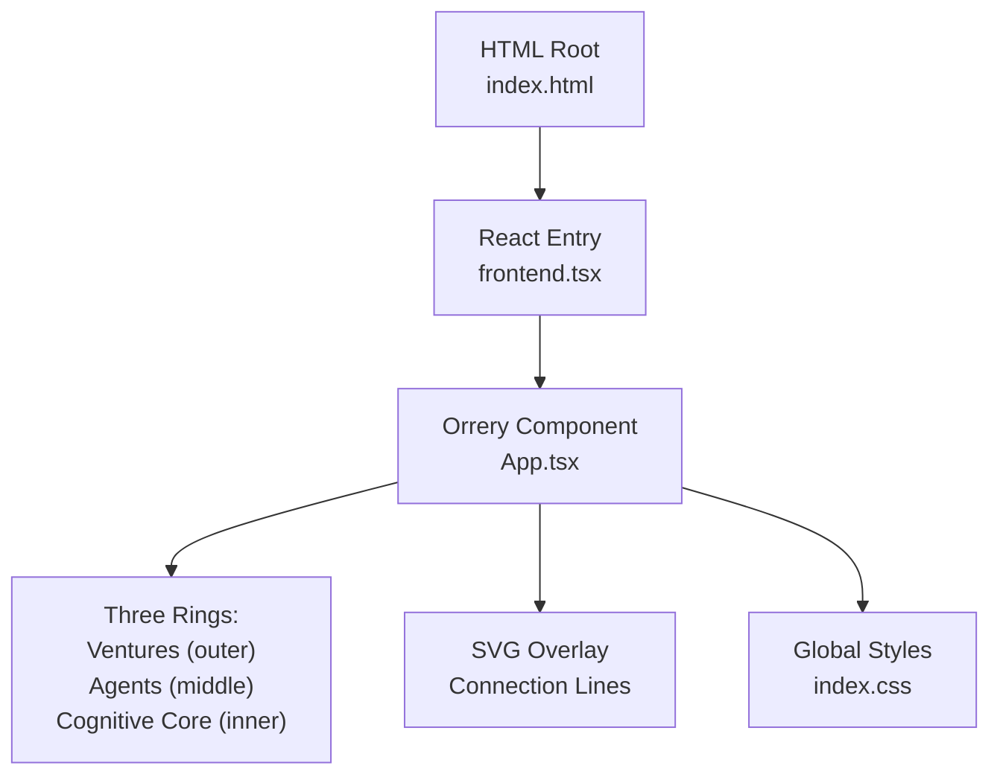
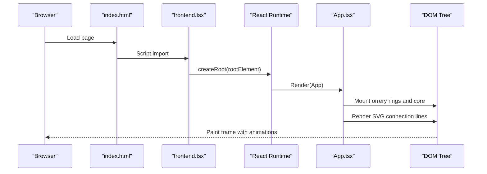
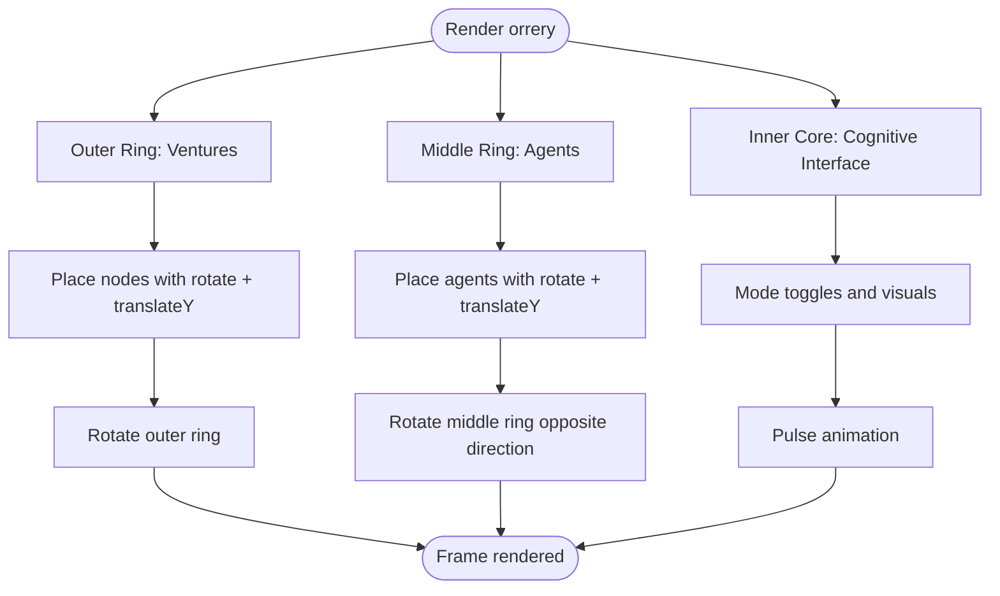
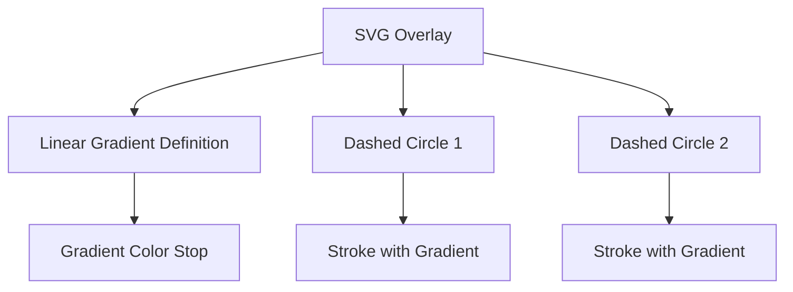
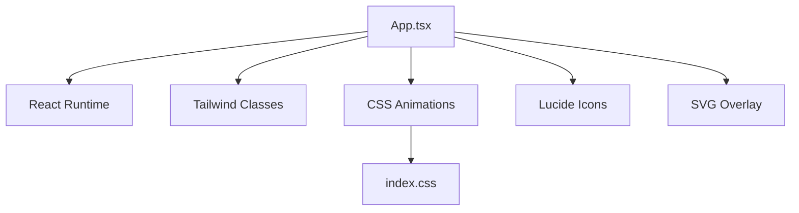

# Orrery Visualization

<cite>
**Referenced Files in This Document**
- [App.tsx](file://src/App.tsx)
- [conceptual.md](file://AB/conceptual.md)
- [index.css](file://src/index.css)
- [index.html](file://src/index.html)
- [frontend.tsx](file://src/frontend.tsx)
</cite>

## Table of Contents
1. [Introduction](#introduction)
2. [Project Structure](#project-structure)
3. [Core Components](#core-components)
4. [Architecture Overview](#architecture-overview)
5. [Detailed Component Analysis](#detailed-component-analysis)
6. [Dependency Analysis](#dependency-analysis)
7. [Performance Considerations](#performance-considerations)
8. [Troubleshooting Guide](#troubleshooting-guide)
9. [Conclusion](#conclusion)

## Introduction
This document explains the interactive orrery visualization implemented in the project. The orrery consists of three concentric rings:
- Outer ring: Ventures
- Middle ring: C-suite agents
- Inner core: Cognitive interface

It also documents the CSS transform techniques used to position elements in circular layouts, the animation effects for continuous spinning, the use of absolute positioning and coordinate calculations to maintain radial symmetry, and the SVG connection lines with gradient strokes and dashed patterns. Finally, it provides performance considerations and optimization tips for rendering multiple animated elements.

## Project Structure
The orrery lives in a React component that renders a central orbital layout with three rings and an inner core. The component uses Tailwind classes for styling and CSS animations for rotation. An SVG overlay draws conceptual connection lines with gradients and dashed patterns.

**Diagram sources**
- [index.html](file://src/index.html#L1-L14)
- [frontend.tsx](file://src/frontend.tsx#L1-L27)
- [App.tsx](file://src/App.tsx#L50-L205)
- [index.css](file://src/index.css#L1-L188)

**Section sources**
- [index.html](file://src/index.html#L1-L14)
- [frontend.tsx](file://src/frontend.tsx#L1-L27)
- [App.tsx](file://src/App.tsx#L50-L205)
- [index.css](file://src/index.css#L1-L188)

## Core Components
- Outer ring (Ventures): A circular ring of venture nodes rotating independently around the center.
- Middle ring (C-suite agents): A circular ring of agent nodes rotating at a different speed than the outer ring.
- Inner core (Cognitive interface): A central hub that displays the active mode and allows switching modes.
- SVG connection lines: Conceptual gradient-stroked, dashed circles indicating orbital relationships.

Key implementation references:
- Outer ring construction and rotation: [App.tsx](file://src/App.tsx#L82-L97)
- Middle ring construction and rotation: [App.tsx](file://src/App.tsx#L99-L114)
- Inner core with mode toggles: [App.tsx](file://src/App.tsx#L116-L141)
- SVG gradient and dashed lines: [App.tsx](file://src/App.tsx#L182-L192)

**Section sources**
- [App.tsx](file://src/App.tsx#L82-L141)
- [App.tsx](file://src/App.tsx#L182-L192)

## Architecture Overview
The orrery is built as a single-page React application. The entry point mounts the App component into the DOM. The App component renders:
- A starfield background effect
- The orrery container with three concentric rings
- The inner cognitive core with mode controls
- An SVG overlay for connection lines

**Diagram sources**
- [index.html](file://src/index.html#L1-L14)
- [frontend.tsx](file://src/frontend.tsx#L1-L27)
- [App.tsx](file://src/App.tsx#L50-L205)

## Detailed Component Analysis

### Three Concentric Rings: Ventures, Agents, Cognitive Core
- Outer ring (Ventures):
  - A circular ring with four evenly spaced nodes.
  - Uses a CSS animation to continuously rotate the ring.
  - Each node is positioned using a combination of rotate and translateY transforms around the center.
- Middle ring (C-suite agents):
  - A circular ring with five agents placed at specific angles.
  - Rotates at a different speed than the outer ring.
  - Nodes are positioned similarly with rotate and translateY transforms.
- Inner core (Cognitive interface):
  - A central hub displaying the active mode, color-coded visuals, and mode toggle buttons.
  - Hover and pulse effects enhance interactivity.

Implementation references:
- Outer ring rotation and node placement: [App.tsx](file://src/App.tsx#L82-L97)
- Middle ring rotation and node placement: [App.tsx](file://src/App.tsx#L99-L114)
- Inner core with mode toggles: [App.tsx](file://src/App.tsx#L116-L141)

**Diagram sources**
- [App.tsx](file://src/App.tsx#L82-L141)

**Section sources**
- [App.tsx](file://src/App.tsx#L82-L141)

### CSS Transform Techniques: rotate and translateY for Circular Layouts
The positions of orbital nodes are computed using CSS transforms:
- A rotate around the center places the element at a specific angle.
- A translateY moves the element along the radius to reach the orbit circle.
- A counter-rotate restores the element’s orientation so it remains upright.

Examples from the code:
- Outer ring node placement: [App.tsx](file://src/App.tsx#L88-L90)
- Middle ring agent placement: [App.tsx](file://src/App.tsx#L107-L109)

These transforms ensure radial symmetry and precise angular spacing while maintaining readable text and icons.

**Section sources**
- [App.tsx](file://src/App.tsx#L88-L90)
- [App.tsx](file://src/App.tsx#L107-L109)

### Animation Effects: Continuous Spinning
Two distinct continuous spinning animations are used:
- Outer ring spins at a slower rate.
- Middle ring spins at a faster rate and in the reverse direction.

Implementation references:
- Outer ring animation: [App.tsx](file://src/App.tsx#L82-L83)
- Middle ring animation: [App.tsx](file://src/App.tsx#L99-L100)

Additional global animations exist in the stylesheet:
- Global background slide animation: [index.css](file://src/index.css#L27-L35)
- Logo spin animation: [index.css](file://src/index.css#L66-L79)

**Section sources**
- [App.tsx](file://src/App.tsx#L82-L100)
- [index.css](file://src/index.css#L27-L35)
- [index.css](file://src/index.css#L66-L79)

### Absolute Positioning and Coordinate Calculations
- All orbital elements are absolutely positioned within a relatively positioned container to anchor rotations around the center.
- The container establishes a fixed viewport for the orrery (e.g., 600x600).
- Coordinate calculations rely on:
  - Angular spacing for evenly distributed nodes.
  - Radius offsets for each ring.
  - Counter-rotation to keep node orientation upright.

Implementation references:
- Container sizing and absolute layout: [App.tsx](file://src/App.tsx#L80-L115)
- Angular offsets and radii: [App.tsx](file://src/App.tsx#L88-L90), [App.tsx](file://src/App.tsx#L107-L109)

**Section sources**
- [App.tsx](file://src/App.tsx#L80-L115)
- [App.tsx](file://src/App.tsx#L88-L90)
- [App.tsx](file://src/App.tsx#L107-L109)

### SVG Connection Lines: Gradient Strokes and Dashed Patterns
The SVG overlay draws conceptual orbital connections:
- A linear gradient defines a blue-to-green color transition.
- Two dashed circles represent orbital paths with different dash patterns.
- The overlay is positioned absolutely to align with the orrery container.

Implementation references:
- SVG gradient definition: [App.tsx](file://src/App.tsx#L183-L189)
- Dashed orbital circles: [App.tsx](file://src/App.tsx#L190-L192)

**Diagram sources**
- [App.tsx](file://src/App.tsx#L183-L192)

**Section sources**
- [App.tsx](file://src/App.tsx#L183-L192)

### Trigonometric Positioning Logic (from conceptual.md)
The conceptual document outlines a trigonometric approach for computing Cartesian coordinates on a circle:
- x = cos(angle) × radius
- y = sin(angle) × radius

This logic underpins the circular layout and can be used to compute positions programmatically when dynamic angles or radii are required.

Implementation references:
- Conceptual trigonometry: [conceptual.md](file://AB/conceptual.md#L1-L205)

**Section sources**
- [conceptual.md](file://AB/conceptual.md#L1-L205)

## Dependency Analysis
The orrery component depends on:
- React runtime for rendering
- Tailwind utility classes for styling
- CSS animations for rotation
- Lucide icons for visual elements
- An SVG overlay for conceptual lines

**Diagram sources**
- [App.tsx](file://src/App.tsx#L50-L205)
- [index.css](file://src/index.css#L1-L188)

**Section sources**
- [App.tsx](file://src/App.tsx#L50-L205)
- [index.css](file://src/index.css#L1-L188)

## Performance Considerations
Rendering multiple animated elements requires attention to performance:
- Prefer transform and opacity for animations to leverage GPU acceleration.
- Use will-change on frequently animated elements to hint the browser to optimize.
- Minimize layout thrashing by batching DOM reads/writes.
- Reduce the number of animated properties per element.
- Use hardware-accelerated properties (transform, opacity) over expensive ones (layout, paint).
- Limit the number of animated elements if performance degrades on lower-end devices.

Practical tips from the codebase:
- The logo uses a will-change hint for filter transitions: [index.css](file://src/index.css#L52-L56)
- The orrery uses transform-based animations (rotate, translateY) and CSS keyframe animations for smooth motion: [App.tsx](file://src/App.tsx#L82-L100)

**Section sources**
- [index.css](file://src/index.css#L52-L56)
- [App.tsx](file://src/App.tsx#L82-L100)

## Troubleshooting Guide
Common issues and resolutions:
- Elements not rotating around the center:
  - Ensure the container is relatively positioned and the elements are absolutely positioned.
  - Verify the transform order: rotate around center, translateY to radius, counter-rotate.
  - References: [App.tsx](file://src/App.tsx#L80-L115), [App.tsx](file://src/App.tsx#L88-L90), [App.tsx](file://src/App.tsx#L107-L109)
- Animation conflicts or stutter:
  - Use transform and opacity only for animations.
  - Reduce the number of animated elements or simplify styles.
  - Reference: [index.css](file://src/index.css#L52-L56), [App.tsx](file://src/App.tsx#L82-L100)
- SVG lines not visible:
  - Confirm the overlay is absolutely positioned and spans the container.
  - Verify the gradient ID and strokeDasharray values.
  - Reference: [App.tsx](file://src/App.tsx#L182-L192)

**Section sources**
- [App.tsx](file://src/App.tsx#L80-L115)
- [App.tsx](file://src/App.tsx#L88-L90)
- [App.tsx](file://src/App.tsx#L107-L109)
- [App.tsx](file://src/App.tsx#L182-L192)
- [index.css](file://src/index.css#L52-L56)

## Conclusion
The orrery visualization combines three concentric rings with distinct rotational behaviors, absolute positioning, and CSS transforms to achieve precise radial symmetry. The SVG overlay adds conceptual orbital connections with gradient strokes and dashed patterns. By leveraging transform-based animations and performance-conscious practices, the visualization remains smooth and responsive across devices.