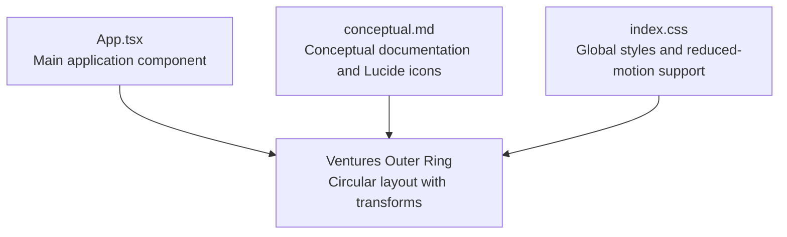
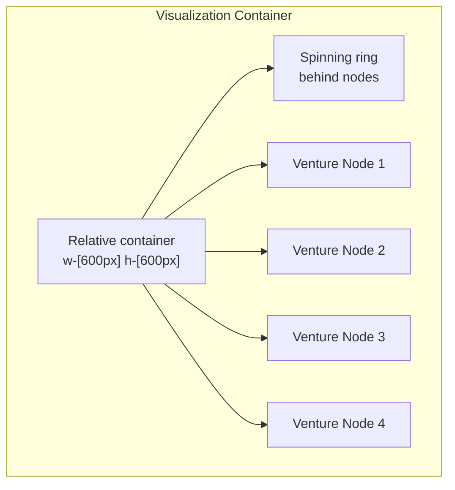
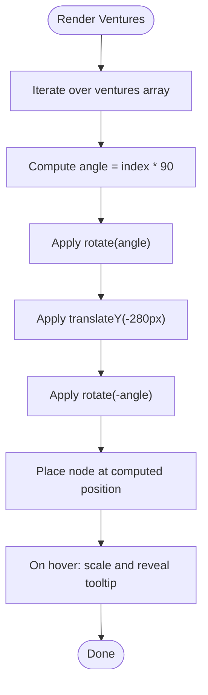
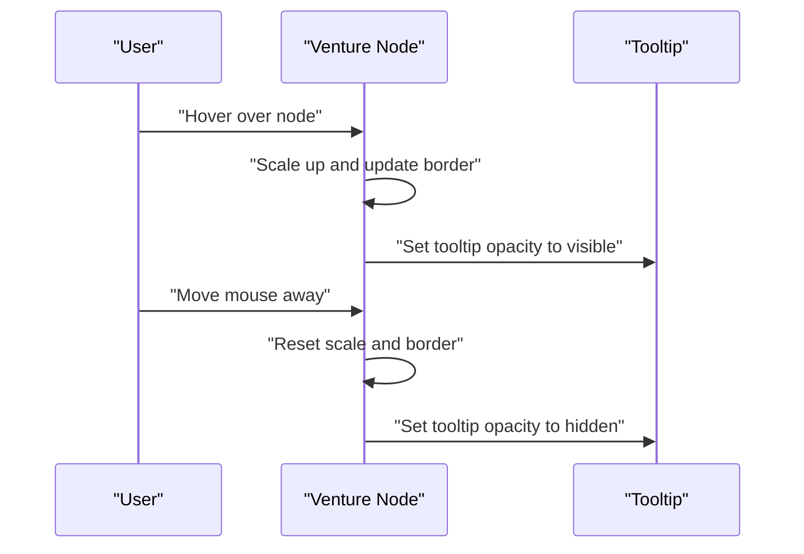
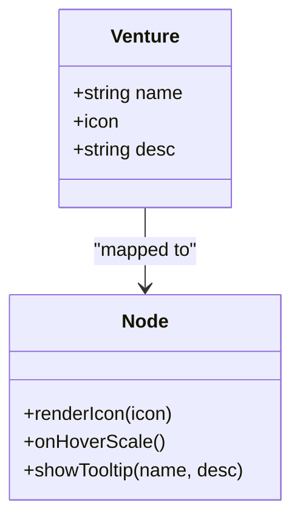
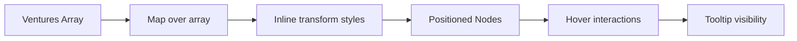

# Outer Ring: Ventures

<cite>
**Referenced Files in This Document**
- [App.tsx](file://src/App.tsx)
- [conceptual.md](file://AB/conceptual.md)
- [index.css](file://src/index.css)
</cite>

## Table of Contents
1. [Introduction](#introduction)
2. [Project Structure](#project-structure)
3. [Core Components](#core-components)
4. [Architecture Overview](#architecture-overview)
5. [Detailed Component Analysis](#detailed-component-analysis)
6. [Dependency Analysis](#dependency-analysis)
7. [Performance Considerations](#performance-considerations)
8. [Troubleshooting Guide](#troubleshooting-guide)
9. [Conclusion](#conclusion)

## Introduction
This document explains the outer ring ventures visualization, focusing on how four ventures (LyricLines, Vision2Results, ModuMind, Ikidedventures) are arranged in a circular layout using CSS transforms. It details the 90-degree incremental rotation via index multiplication, the radial placement achieved with a negative translateY, and the hover interaction that scales the element and reveals a tooltip containing the venture’s name and description. It also references the Lucide icons used for visual representation and discusses performance considerations around GPU acceleration and animation costs.

## Project Structure
The outer ring visualization is implemented within the main application component. The relevant code resides in:
- The main application component that renders the visualization
- A conceptual markdown file that documents the same visualization and includes the Lucide icon usage

**Diagram sources**
- [App.tsx](file://src/App.tsx#L79-L114)
- [conceptual.md](file://AB/conceptual.md#L82-L97)
- [index.css](file://src/index.css#L181-L188)

**Section sources**
- [App.tsx](file://src/App.tsx#L79-L114)
- [conceptual.md](file://AB/conceptual.md#L43-L97)
- [index.css](file://src/index.css#L181-L188)

## Core Components
- Ventures data model: An array of four ventures, each with a name, Lucide icon, and description.
- Rendering loop: A map over the ventures array to render each venture as a circular node.
- Transform positioning: Uses rotate and translateY to place nodes evenly around a circle.
- Hover interaction: Scales the node and reveals a tooltip with the venture’s name and description.
- Iconography: Lucide icons are used to visually represent each venture.

Key implementation references:
- Ventures array and Lucide icons: [App.tsx](file://src/App.tsx#L43-L48)
- Circular layout with transforms: [App.tsx](file://src/App.tsx#L84-L96)
- Tooltip reveal on hover: [App.tsx](file://src/App.tsx#L87-L96)
- Conceptual documentation and Lucide usage: [conceptual.md](file://AB/conceptual.md#L43-L97)

**Section sources**
- [App.tsx](file://src/App.tsx#L43-L48)
- [App.tsx](file://src/App.tsx#L84-L96)
- [conceptual.md](file://AB/conceptual.md#L43-L97)

## Architecture Overview
The outer ring visualization is composed of:
- A central container sized to hold the visualization
- A decorative spinning ring behind the nodes
- Four venture nodes placed radially around the center
- Hover-triggered tooltip overlay

**Diagram sources**
- [App.tsx](file://src/App.tsx#L79-L114)

## Detailed Component Analysis

### Circular Layout with Rotate and TranslateY
The four ventures are positioned using CSS transforms to form a circle:
- Incremental rotation: Each node applies a rotation of index times 90 degrees.
- Radial placement: A negative translateY moves the node outward along the local Y-axis, placing it at a radius of approximately 280px from the center.
- Reversal rotation: Each node rotates back by the same angle to keep the icon upright.

Implementation details:
- Rotation and radial placement: [App.tsx](file://src/App.tsx#L88-L90)
- Node container and hover scaling: [App.tsx](file://src/App.tsx#L87-L90)
- Tooltip container and opacity transition: [App.tsx](file://src/App.tsx#L93-L95)

**Diagram sources**
- [App.tsx](file://src/App.tsx#L84-L96)

**Section sources**
- [App.tsx](file://src/App.tsx#L84-L96)

### Hover Interaction and Tooltip Behavior
On hover:
- The node scales slightly and updates its border color.
- A tooltip appears below the node with the venture’s name and description.
- The tooltip uses opacity transitions and pointer-events are disabled to prevent interfering with hover.

Implementation details:
- Hover scaling and border change: [App.tsx](file://src/App.tsx#L87-L90)
- Tooltip container and opacity transition: [App.tsx](file://src/App.tsx#L93-L95)

**Diagram sources**
- [App.tsx](file://src/App.tsx#L87-L96)

**Section sources**
- [App.tsx](file://src/App.tsx#L87-L96)

### Lucide Icons and Visual Representation
Each venture is represented by a Lucide icon. The icon is rendered inside the node and changes color on hover. The conceptual documentation lists the ventures and their icons.

References:
- Ventures array with icons: [App.tsx](file://src/App.tsx#L43-L48)
- Icon rendering inside nodes: [App.tsx](file://src/App.tsx#L91-L92)
- Conceptual documentation with icons: [conceptual.md](file://AB/conceptual.md#L43-L48)

**Diagram sources**
- [App.tsx](file://src/App.tsx#L43-L48)
- [App.tsx](file://src/App.tsx#L87-L96)

**Section sources**
- [App.tsx](file://src/App.tsx#L43-L48)
- [App.tsx](file://src/App.tsx#L91-L92)
- [conceptual.md](file://AB/conceptual.md#L43-L48)

## Dependency Analysis
- The outer ring depends on:
  - The ventures array for data and Lucide icons
  - Tailwind-like classes for sizing, borders, and hover effects
  - Inline transform styles for precise positioning
  - Group-hover selectors to reveal tooltips

**Diagram sources**
- [App.tsx](file://src/App.tsx#L43-L48)
- [App.tsx](file://src/App.tsx#L84-L96)

**Section sources**
- [App.tsx](file://src/App.tsx#L43-L48)
- [App.tsx](file://src/App.tsx#L84-L96)

## Performance Considerations
- GPU acceleration: Transforms and opacity changes are generally accelerated by the browser’s compositor, minimizing layout thrashing.
- Animation cost: The visualization includes a background spinning ring and subtle hover transitions. While efficient, multiple simultaneous animations can increase rendering load.
- Reduced motion: The global stylesheet respects reduced motion preferences, which can disable animations for accessibility.

References:
- Global reduced-motion support: [index.css](file://src/index.css#L181-L188)
- Transform usage for hover scaling: [App.tsx](file://src/App.tsx#L87-L90)
- Tooltip opacity transitions: [App.tsx](file://src/App.tsx#L93-L95)

**Section sources**
- [index.css](file://src/index.css#L181-L188)
- [App.tsx](file://src/App.tsx#L87-L90)
- [App.tsx](file://src/App.tsx#L93-L95)

## Troubleshooting Guide
- Tooltip not appearing:
  - Ensure the parent container uses a group utility so child hover states can trigger.
  - Verify the tooltip container has opacity transitions and is positioned absolutely below the node.
  - Confirm pointer-events are disabled on the tooltip to avoid blocking hover.
  - References: [App.tsx](file://src/App.tsx#L87-L96)

- Icons not visible:
  - Confirm Lucide icons are imported and passed into the node rendering.
  - Verify the icon size and color classes are applied.
  - References: [App.tsx](file://src/App.tsx#L43-L48), [App.tsx](file://src/App.tsx#L91-L92)

- Incorrect spacing or rotation:
  - Check that the index-based rotation increments by 90 degrees for four nodes.
  - Ensure the negative translateY places nodes at the intended radius.
  - References: [App.tsx](file://src/App.tsx#L88-L90)

**Section sources**
- [App.tsx](file://src/App.tsx#L87-L96)
- [App.tsx](file://src/App.tsx#L43-L48)
- [App.tsx](file://src/App.tsx#L88-L90)

## Conclusion
The outer ring ventures visualization achieves a clean, circular layout using CSS transforms with 90-degree increments and a negative translateY for radial placement. Hover interactions enhance usability by scaling nodes and revealing contextual tooltips. The implementation leverages Lucide icons for visual clarity and benefits from GPU-accelerated transforms and opacity transitions. For optimal performance, consider the reduced-motion preference and monitor the cumulative effect of multiple simultaneous animations.