# Visual Effects

<cite>
**Referenced Files in This Document**
- [App.tsx](file://src/App.tsx)
- [index.css](file://src/index.css)
- [index.html](file://src/index.html)
- [frontend.tsx](file://src/frontend.tsx)
- [package.json](file://package.json)
</cite>

## Table of Contents
1. [Introduction](#introduction)
2. [Project Structure](#project-structure)
3. [Core Components](#core-components)
4. [Architecture Overview](#architecture-overview)
5. [Detailed Component Analysis](#detailed-component-analysis)
6. [Dependency Analysis](#dependency-analysis)
7. [Performance Considerations](#performance-considerations)
8. [Troubleshooting Guide](#troubleshooting-guide)
9. [Conclusion](#conclusion)

## Introduction
This document explains the visual effects implemented in the project, focusing on:
- The starfield background using 50 randomly positioned divs with varying sizes and animation durations to create a twinkling effect
- The wallet economics footnote with hover-triggered opacity transition and monospace font styling
- The use of Lucide React icons (Activity and Database) to represent system metrics
- Non-interference with interactive elements via CSS opacity and pointer-events-none
- Performance considerations for rendering numerous animated elements and recommended optimization strategies

## Project Structure
The visual effects are implemented primarily in the main application component and styled with global CSS. The runtime environment and dependencies are configured in package metadata.

```mermaid
graph TB
HTML["index.html<br/>Mounts root element"] --> Frontend["frontend.tsx<br/>Creates root and renders App"]
Frontend --> App["App.tsx<br/>Renders UI and visual effects"]
App --> CSS["index.css<br/>Global styles and animations"]
App --> Icons["Lucide React Icons<br/>Activity, Database, others"]
App --> Runtime["Bun Runtime<br/>v1.2.18"]
```

**Diagram sources**
- [index.html](file://src/index.html#L1-L14)
- [frontend.tsx](file://src/frontend.tsx#L1-L27)
- [App.tsx](file://src/App.tsx#L1-L206)
- [index.css](file://src/index.css#L1-L188)
- [package.json](file://package.json#L1-L31)

**Section sources**
- [index.html](file://src/index.html#L1-L14)
- [frontend.tsx](file://src/frontend.tsx#L1-L27)
- [App.tsx](file://src/App.tsx#L1-L206)
- [index.css](file://src/index.css#L1-L188)
- [package.json](file://package.json#L1-L31)

## Core Components
- Starfield background: A container with 50 absolutely positioned white circles, each with randomized top/left coordinates, width/height, and animation duration to simulate twinkling. The container uses opacity and pointer-events-none to remain visually present without interfering with interactive elements.
- Wallet economics footnote: A small informational bar with monospace text and hover-triggered opacity transition to reveal details. Lucide React icons (Activity and Database) are used to visually represent internal wallet and runtime metrics.
- SVG decorative elements: Conceptual connection lines rendered via SVG with pointer-events-none to keep them non-interactive.

Key implementation references:
- Starfield container and animation: [Starfield container](file://src/App.tsx#L52-L67)
- Wallet economics footnote: [Footnote container and icons](file://src/App.tsx#L194-L201)
- SVG decorative elements: [SVG background lines](file://src/App.tsx#L182-L192)
- Global styles and reduced motion: [Global CSS](file://src/index.css#L1-L188)

**Section sources**
- [App.tsx](file://src/App.tsx#L52-L67)
- [App.tsx](file://src/App.tsx#L182-L201)
- [index.css](file://src/index.css#L1-L188)

## Architecture Overview
The visual effects are composed of:
- Static DOM structure with layered containers
- Randomized inline styles for star positions and sizes
- CSS animations for twinkling
- Hover-driven transitions for footnotes
- Non-interactive overlays via pointer-events-none

**Diagram sources**
- [App.tsx](file://src/App.tsx#L50-L201)
- [index.css](file://src/index.css#L1-L188)

## Detailed Component Analysis

### Starfield Background
The starfield is implemented as a container that:
- Renders 50 child divs
- Assigns random positions (top/left percentages)
- Sets random sizes (width/height)
- Applies a randomized animation duration to each star
- Uses opacity and pointer-events-none to avoid blocking interactions

Implementation highlights:
- Container attributes: [Starfield container](file://src/App.tsx#L52-L67)
- Randomized styles per star: [Randomized styles](file://src/App.tsx#L58-L63)
- Non-interference settings: [Opacity and pointer-events-none](file://src/App.tsx#L52-L53)

**Diagram sources**
- [App.tsx](file://src/App.tsx#L52-L67)

**Section sources**
- [App.tsx](file://src/App.tsx#L52-L67)

### Wallet Economics Footnote
The footnote displays system metrics with:
- Monospace font styling for technical authenticity
- Hover-triggered opacity transition to reveal details
- Lucide React icons (Activity and Database) to visually represent internal wallet and runtime

Implementation highlights:
- Footnote container and transition: [Footnote container](file://src/App.tsx#L194-L201)
- Monospace text styling: [Monospace class usage](file://src/App.tsx#L196-L199)
- Icons: [Activity and Database usage](file://src/App.tsx#L196-L199)
- Lucide React dependency: [Lucide React in package.json](file://package.json#L25-L30)

**Diagram sources**
- [App.tsx](file://src/App.tsx#L194-L201)
- [package.json](file://package.json#L25-L30)

**Section sources**
- [App.tsx](file://src/App.tsx#L194-L201)
- [package.json](file://package.json#L25-L30)

### SVG Decorative Elements
The page includes conceptual connection lines rendered via SVG:
- Absolute positioning overlay
- Pointer-events-none to keep lines non-interactive
- Low opacity for subtlety

Implementation highlights:
- SVG container and attributes: [SVG container](file://src/App.tsx#L182-L192)
- Gradient and dashed strokes: [SVG gradients and lines](file://src/App.tsx#L183-L191)

**Diagram sources**
- [App.tsx](file://src/App.tsx#L182-L192)

**Section sources**
- [App.tsx](file://src/App.tsx#L182-L192)

## Dependency Analysis
- Starfield relies on inline styles and CSS classes for positioning and opacity.
- Footnote depends on hover states and CSS transitions.
- SVG elements are purely decorative and use pointer-events-none.
- Lucide React icons are imported and used directly in JSX.

**Diagram sources**
- [App.tsx](file://src/App.tsx#L50-L201)
- [package.json](file://package.json#L25-L30)

**Section sources**
- [App.tsx](file://src/App.tsx#L50-L201)
- [package.json](file://package.json#L25-L30)

## Performance Considerations
Rendering 50 animated elements requires attention to performance. The current implementation already applies several best practices:
- Using opacity for transitions avoids layout and paint changes compared to visibility toggles.
- Applying pointer-events-none ensures stars and decorative SVG do not interfere with interactions, reducing event overhead.
- Animations are lightweight and rely on CSS transforms and opacity.

Recommended optimization strategies:
- Limit animation complexity: Prefer opacity and transform over expensive properties like width/height changes during animations.
- Reduce DOM nodes: Keep the star count reasonable; 50 is acceptable for modern browsers but consider dynamic creation/removal if the viewport changes frequently.
- Use will-change sparingly: The existing code does not rely on will-change; avoid adding it unless profiling shows benefit.
- Minimize reflows: Inline styles are computed once per star; avoid frequent re-layouts by keeping star positions static after mount.
- Consider reduced motion: The global CSS already disables animations for users who prefer reduced motion, improving accessibility and performance.

[No sources needed since this section provides general guidance]

## Troubleshooting Guide
Common issues and resolutions:
- Interactive elements blocked by stars: Verify pointer-events-none is applied to the starfield container and any tooltip overlays. See: [Starfield container](file://src/App.tsx#L52-L53)
- Footnote not revealing on hover: Confirm hover:opacity-100 and transition-opacity classes are present. See: [Footnote container](file://src/App.tsx#L194-L201)
- Icons missing: Ensure Lucide React is installed and imported. See: [Lucide React dependency](file://package.json#L25-L30)
- Reduced motion preference: Global CSS disables animations for users who prefer reduced motion. See: [Reduced motion media query](file://src/index.css#L181-L188)

**Section sources**
- [App.tsx](file://src/App.tsx#L52-L53)
- [App.tsx](file://src/App.tsx#L194-L201)
- [package.json](file://package.json#L25-L30)
- [index.css](file://src/index.css#L181-L188)

## Conclusion
The visual effects combine a subtle, non-intrusive starfield with a hover-enhanced wallet economics footnote. The implementation leverages CSS opacity and pointer-events-none to preserve interactivity while maintaining a polished aesthetic. Lucide React icons add clarity and visual cues for system metrics. With careful attention to animation complexity and accessibility preferences, the effects deliver a responsive and performant user experience.