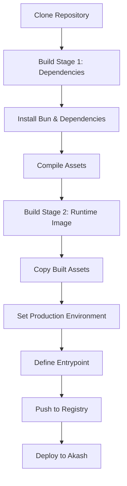
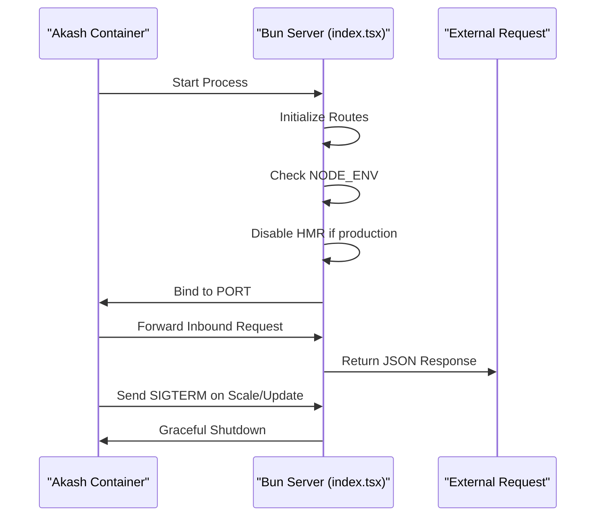

# Akash Network Deployment

<cite>
**Referenced Files in This Document**   
- [bunfig.toml](file://bunfig.toml)
- [src/index.tsx](file://src/index.tsx)
- [package.json](file://package.json)
- [README.md](file://README.md)
- [projectinfo.md](file://projectinfo.md)
</cite>

## Table of Contents
1. [Introduction](#introduction)
2. [Benefits of Akash Network](#benefits-of-akash-network)
3. [Containerization Requirements](#containerization-requirements)
4. [Runtime Configuration with bunfig.toml](#runtime-configuration-with-bunfigtoml)
5. [Server Entry Point Integration](#server-entry-point-integration)
6. [Deployment Manifest Creation](#deployment-manifest-creation)
7. [Resource Limits and Optimization](#resource-limits-and-optimization)
8. [Deployment Process](#deployment-process)
9. [Common Deployment Pitfalls](#common-deployment-pitfalls)
10. [Monitoring and Rollback Procedures](#monitoring-and-rollback-procedures)
11. [Verification Steps](#verification-steps)

## Introduction
This document provides a comprehensive guide for deploying the SynchroSource cognitive-aware autonomous agent operating system to the Akash Network, a decentralized cloud platform. The application leverages the Bun runtime for high-performance execution and is designed to operate within containerized environments optimized for cost-efficiency and security. This guide details the configuration, containerization, and deployment workflow required to successfully deploy the service on Akash, including environment setup, manifest creation, and post-deployment validation.

**Section sources**
- [projectinfo.md](file://projectinfo.md#L1-L91)
- [README.md](file://README.md#L1-L22)

## Benefits of Akash Network
Deploying on the Akash Network offers significant advantages for decentralized applications like SynchroSource. The platform enables up to 97.6% cost reduction compared to traditional cloud providers by leveraging underutilized compute resources across a global marketplace. Governance is managed through blockchain-based DAO mechanisms, ensuring transparent, trustless coordination and resource allocation. The network supports secure containerization using OCI-compatible images, providing isolation and consistency across deployments. Additionally, Akash’s decentralized infrastructure enhances resilience and reduces vendor lock-in, aligning with the autonomous and self-coordinating nature of the cognitive agent system.

**Section sources**
- [projectinfo.md](file://projectinfo.md#L45-L47)
- [src/App.tsx](file://src/App.tsx#L143-L158)

## Containerization Requirements
The application must be containerized using Docker or any OCI-compatible image format for deployment on Akash. A multi-stage build process is recommended to optimize image size and performance, particularly when targeting the Bun runtime. The first stage should handle dependency installation and asset compilation, while the second stage produces a minimal runtime image containing only the necessary files and the Bun binary. This approach reduces attack surface, improves startup time, and minimizes bandwidth usage during deployment. The final image must expose the appropriate port (typically 3000 or 8080) and define an entrypoint that executes the application in production mode.

**Diagram sources**
- [package.json](file://package.json#L1-L31)
- [bunfig.toml](file://bunfig.toml#L1-L17)

## Runtime Configuration with bunfig.toml
The `bunfig.toml` file contains critical runtime configuration for the application. It defines environment variables under the `[runtime]` section, including `NODE_ENV = "development"` by default. For Akash deployment, this must be overridden to `NODE_ENV = "production"` to enable production-specific behaviors such as disabled hot module replacement (HMR) and optimized logging. The configuration also enables dependency caching via `cache = true` in the `[install]` section, which accelerates build times and ensures consistent installations. These settings are automatically loaded by Bun during execution, making them ideal for declarative environment control in containerized deployments.

**Section sources**
- [bunfig.toml](file://bunfig.toml#L1-L17)
- [projectinfo.md](file://projectinfo.md#L69-L70)

## Server Entry Point Integration
The server entry point at `src/index.tsx` is designed to integrate seamlessly with Akash’s container lifecycle. It uses Bun’s built-in `serve` function to create an HTTP server with route definitions for API endpoints such as `/api/hello` and dynamic routes like `/api/hello/:name`. The server conditionally enables HMR and console echoing based on the `NODE_ENV` environment variable, ensuring development features are disabled in production. When deployed on Akash, the container will execute this file as the main process, and the server will bind to the dynamically assigned port via environment variables. Proper signal handling ensures graceful shutdown during container termination.

**Diagram sources**
- [src/index.tsx](file://src/index.tsx#L1-L41)
- [bunfig.toml](file://bunfig.toml#L15-L17)

## Deployment Manifest Creation
To deploy on Akash, a deployment manifest YAML file must be created to define the service configuration. This manifest specifies the container image, exposed ports, environment variables, and persistent storage (if needed). The `NODE_ENV` variable should be explicitly set to `"production"` to ensure optimal runtime behavior. The manifest must also declare the command to start the server, typically `bun src/index.tsx`. Service labels and metadata should reflect the application’s identity as a cognitive-aware agent system. The manifest is then used with the Akash CLI to create and deploy the service instance.

**Section sources**
- [package.json](file://package.json#L13-L18)
- [bunfig.toml](file://bunfig.toml#L15-L17)

## Resource Limits and Optimization
The deployment manifest must define appropriate resource limits to ensure efficient utilization and cost control on Akash. Recommended settings include:
- **CPU**: 1.0 core (adjustable based on load)
- **Memory**: 512MB–1GB (sufficient for Bun runtime and concurrent connections)
- **Storage**: 1GB ephemeral (or persistent if state is required)

These values balance performance with the cost-saving benefits of Akash’s decentralized model. The Bun runtime’s low memory footprint and fast startup time make it ideal for constrained environments. Multi-stage Docker builds further reduce image size, minimizing deployment time and bandwidth consumption. Dependency caching in `bunfig.toml` ensures repeatable builds without unnecessary downloads.

**Section sources**
- [bunfig.toml](file://bunfig.toml#L4-L6)
- [projectinfo.md](file://projectinfo.md#L45-L47)

## Deployment Process
The deployment process involves the following steps:
1. Build the OCI-compatible container image using a multi-stage Dockerfile.
2. Push the image to a public or Akash-accessible container registry.
3. Create a deployment manifest YAML with service configuration.
4. Use the Akash CLI to deploy the manifest: `akash deploy create -d deployment.yaml`.
5. Monitor deployment status via `akash deploy status`.
6. Retrieve the assigned endpoint URL for external access.

Environment variables such as `NODE_ENV=production` must be included in the manifest to ensure correct runtime behavior. The Bun runtime automatically reads configuration from `bunfig.toml`, so no additional configuration injection is required.

**Section sources**
- [README.md](file://README.md#L15-L18)
- [package.json](file://package.json#L13-L18)

## Common Deployment Pitfalls
Common issues during Akash deployment include:
- **Missing NODE_ENV override**: Results in HMR being enabled in production, increasing attack surface.
- **Incorrect port binding**: Server must bind to the PORT environment variable provided by Akash.
- **Large image size**: Increases deployment time and cost; mitigated by multi-stage builds.
- **Missing health checks**: Can lead to premature termination; ensure `/api/hello` endpoint is accessible.
- **Insufficient memory**: Bun typically requires 512MB+; monitor OOM kills in logs.

Ensure the Dockerfile correctly copies only necessary files and sets the working directory appropriately.

**Section sources**
- [src/index.tsx](file://src/index.tsx#L32-L38)
- [bunfig.toml](file://bunfig.toml#L15-L17)

## Monitoring and Rollback Procedures
Post-deployment, monitor the service using Akash’s logging and metrics tools. Use `akash logs` to inspect container output and verify server startup. Implement health checks against `/api/hello` to confirm service availability. If issues arise, rollback can be performed by redeploying a previous manifest version using `akash deploy update`. Versioned manifests should be stored in source control for traceability. Automated rollback can be configured based on health check failures.

**Section sources**
- [src/index.tsx](file://src/index.tsx#L9-L29)
- [projectinfo.md](file://projectinfo.md#L72-L78)

## Verification Steps
After deployment, verify functionality by:
1. Accessing the assigned endpoint URL.
2. Testing the `/api/hello` endpoint with GET and PUT requests.
3. Verifying dynamic routing with `/api/hello/World`.
4. Confirming the response includes correct JSON structure and status codes.
5. Checking server logs for startup messages and error-free operation.

Successful responses confirm the Bun server is running in production mode and properly integrated with Akash’s container environment.

**Section sources**
- [src/index.tsx](file://src/index.tsx#L10-L29)
- [README.md](file://README.md#L15-L18)