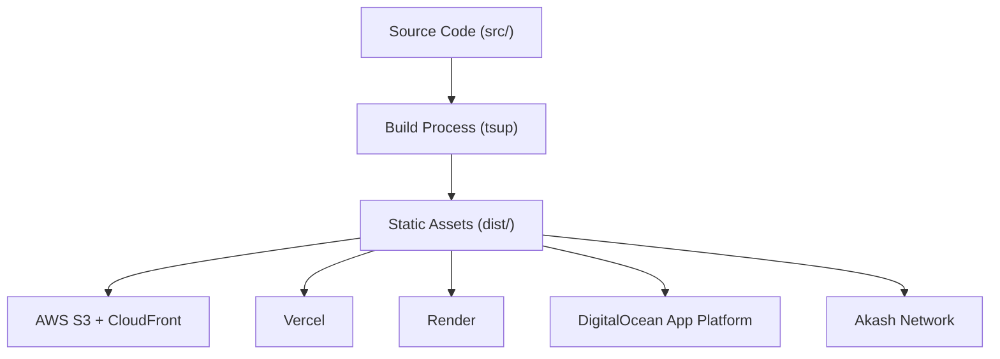
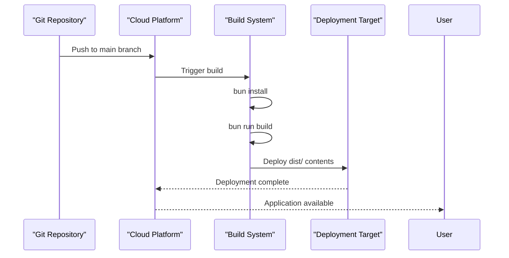

# Alternative Cloud Platforms

<cite>
**Referenced Files in This Document**   
- [package.json](file://package.json)
- [bunfig.toml](file://bunfig.toml)
- [README.md](file://README.md)
- [projectinfo.md](file://projectinfo.md)
- [src/index.html](file://src/index.html)
- [apps/api-gateway/server.ts](file://apps/api-gateway/server.ts)
</cite>

## Table of Contents
1. [Introduction](#introduction)
2. [Project Structure and Build Configuration](#project-structure-and-build-configuration)
3. [Core Deployment Workflow](#core-deployment-workflow)
4. [Platform-Specific Deployment: AWS](#platform-specific-deployment-aws)
5. [Platform-Specific Deployment: Vercel](#platform-specific-deployment-vercel)
6. [Comparison: Akash vs. Traditional Cloud Providers](#comparison-akash-vs-traditional-cloud-providers)
7. [Environment Configuration and Runtime Adaptation](#environment-configuration-and-runtime-adaptation)
8. [Scaling, Domains, and SSL Setup](#scaling-domains-and-ssl-setup)
9. [CI/CD Integration](#cicd-integration)
10. [Troubleshooting Common Deployment Issues](#troubleshooting-common-deployment-issues)
11. [Conclusion](#conclusion)

## Introduction

This document provides comprehensive guidance for deploying the SynchroSource cognitive-aware autonomous agent operating system to alternative cloud platforms such as AWS, Vercel, Render, and DigitalOcean. While the application is currently optimized for Akash Network, this guide details how to adapt the deployment workflow for traditional cloud providers. The focus is on leveraging the existing Bun-based toolchain, reusing build artifacts, and configuring platform-specific settings while maintaining performance and security standards.

**Section sources**
- [projectinfo.md](file://projectinfo.md#L1-L91)
- [README.md](file://README.md#L1-L22)

## Project Structure and Build Configuration

The SynchroSource application follows a monorepo architecture with workspaces for packages and applications. The frontend is built with React 19 and TypeScript, using Bun as the runtime and package manager. The build process is managed through `tsup`, which compiles and bundles the application for production deployment.

The `package.json` defines key scripts:
- `dev`: Starts development server with hot reloading
- `build`: Executes `tsup` to generate production-ready assets
- `lint`: Runs Biome for code quality checks

The `build` script produces static assets in a `dist` directory, which can be served by any static hosting provider or backend server. This artifact is platform-agnostic and forms the foundation for cross-platform deployment.



**Diagram sources**
- [package.json](file://package.json#L12-L18)
- [projectinfo.md](file://projectinfo.md#L68)

**Section sources**
- [package.json](file://package.json#L8-L11)
- [projectinfo.md](file://projectinfo.md#L50-L58)

## Core Deployment Workflow

The deployment workflow across all platforms follows a consistent pattern:

1. **Connect to Git Repository**: Link the cloud platform to the GitHub repository
2. **Configure Build Settings**: Set framework preset to custom, build command to `bun run build`, and output directory to `dist`
3. **Set Environment Variables**: Define `NODE_ENV=production` and any platform-specific variables
4. **Deploy**: Trigger deployment via Git push or manual deploy button

The `bun run build` command leverages `tsup` to create optimized production assets. These build artifacts are identical regardless of target platform, enabling consistent behavior across environments.



**Diagram sources**
- [package.json](file://package.json#L15)
- [README.md](file://README.md#L15-L19)

**Section sources**
- [package.json](file://package.json#L12-L18)
- [README.md](file://README.md#L3-L19)

## Platform-Specific Deployment: AWS

### Configuration Template

To deploy on AWS using Amplify or S3 + CloudFront:

```yaml
# amplify.yml (for AWS Amplify)
version: 1
frontend:
  phases:
    preBuild:
      commands:
        - bun install
    build:
      commands:
        - bun run build
  artifacts:
    baseDirectory: dist
    files:
      - '**/*'
  cache:
    paths:
      - node_modules/**/*
```

### Steps
1. Connect AWS Amplify to your GitHub repository
2. Set build command to `bun run build`
3. Set base directory to `dist`
4. Add environment variable: `NODE_ENV=production`
5. Deploy

For S3 + CloudFront:
- Upload `dist/*` to S3 bucket
- Configure bucket for static website hosting
- Set up CloudFront distribution with SSL

### Verification
- Check CloudFront distribution status
- Verify SSL certificate is issued
- Test application at domain URL
- Confirm API endpoints are accessible

**Section sources**
- [package.json](file://package.json#L15)
- [bunfig.toml](file://bunfig.toml#L15-L17)

## Platform-Specific Deployment: Vercel

### Configuration Template

Create `vercel.json`:

```json
{
  "version": 2,
  "builds": [
    {
      "src": "package.json",
      "use": "@vercel/bun",
      "config": {
        "includeFiles": [
          "bunfig.toml"
        ]
      }
    }
  ],
  "routes": [
    { "src": "/(.*)", "dest": "/dist/$1", "continue": true }
  ],
  "env": {
    "NODE_ENV": "production",
    "RUNTIME": "bun"
  }
}
```

### Steps
1. Import project from GitHub
2. Select framework: "Other"
3. Set build command: `bun run build`
4. Set output directory: `dist`
5. Add environment variables from `bunfig.toml`
6. Deploy

### Verification
- Check deployment logs for build success
- Verify custom domain (if configured)
- Test API routes (`/api/status`, `/api/agents/cto`)
- Confirm static assets are served with correct headers

**Section sources**
- [package.json](file://package.json#L15)
- [bunfig.toml](file://bunfig.toml#L15-L17)
- [apps/api-gateway/server.ts](file://apps/api-gateway/server.ts#L14-L35)

## Comparison: Akash vs. Traditional Cloud Providers

| Aspect | Akash Network | Traditional Cloud (AWS/Vercel) |
|--------|---------------|-------------------------------|
| **Cost** | 97.6% reduction via decentralized marketplace | Higher cost due to centralized infrastructure |
| **Governance** | Blockchain DAO governance | Corporate governance models |
| **Infrastructure Control** | Containerized deployments with manifest files | Managed services with platform-specific configurations |
| **Deployment Model** | Decentralized, peer-to-peer | Centralized data centers |
| **Scalability** | Market-driven resource allocation | Auto-scaling groups and load balancers |
| **Security Model** | Transparent, auditable deployments | Proprietary security implementations |

The Akash deployment leverages blockchain-based coordination and cost optimization, while traditional providers offer more mature tooling and support ecosystems. The application's architecture allows migration between these models by adapting only the deployment layer.

**Section sources**
- [projectinfo.md](file://projectinfo.md#L45-L47)
- [App.tsx](file://src/App.tsx#L148-L157)

## Environment Configuration and Runtime Adaptation

The `bunfig.toml` file contains runtime configuration that should be adapted for production environments:

```toml
[runtime]
env = { NODE_ENV = "production", RUNTIME = "bun" }
```

When deploying to different platforms:
- Set `NODE_ENV=production` in all environments
- Maintain `RUNTIME=bun` for consistency
- Add platform-specific variables (e.g., `VERCEL=1`, `AWS_LAMBDA=1`)
- Ensure environment variables are prefixed appropriately for security

For different runtimes:
- When using Node.js instead of Bun, replace `bun run` with `node` equivalents
- Adjust `tsup` configuration for target runtime
- Update import syntax if not using ES modules

The build artifacts remain identical, but runtime execution differs based on environment configuration.

**Section sources**
- [bunfig.toml](file://bunfig.toml#L15-L17)
- [package.json](file://package.json#L13-L15)

## Scaling, Domains, and SSL Setup

### Scaling Options

| Platform | Scaling Mechanism |
|--------|-------------------|
| AWS | Auto Scaling Groups, Lambda concurrency |
| Vercel | Automatic scaling based on traffic |
| Render | Instance scaling with load balancing |
| DigitalOcean | App Platform auto-scaling |

### Custom Domains and SSL

All platforms support custom domains with automated SSL:
- **AWS**: Route 53 + ACM (free SSL)
- **Vercel**: Built-in Let's Encrypt integration
- **Render**: Automated certificate management
- **DigitalOcean**: Let's Encrypt integration

Configuration steps:
1. Add domain to platform dashboard
2. Update DNS records (CNAME or A records)
3. Platform automatically provisions SSL certificate
4. Verify domain and SSL status

For API gateways, ensure CORS headers accommodate custom domains.

**Section sources**
- [projectinfo.md](file://projectinfo.md#L72-L78)
- [apps/api-gateway/server.ts](file://apps/api-gateway/server.ts#L14-L35)

## CI/CD Integration

Integrate with CI/CD pipelines using platform-native or GitHub Actions:

### GitHub Actions Example

```yaml
name: Deploy to Vercel
on:
  push:
    branches: [ main ]

jobs:
  deploy:
    runs-on: ubuntu-latest
    steps:
      - uses: actions/checkout@v4
      - uses: oven-sh/setup-bun@v1
      - run: bun install
      - run: bun run build
      - uses: amondnet/vercel-action@v2
        with:
          vercel-token: ${{ secrets.VERCEL_TOKEN }}
          project-id: ${{ secrets.VERCEL_PROJECT_ID }}
          org-id: ${{ secrets.VERCEL_ORG_ID }}
          build-command: 'bun run build'
          output-directory: 'dist'
```

All platforms support Git-triggered deployments, with optional pre-deployment checks and post-deployment notifications.

**Section sources**
- [package.json](file://package.json#L15)
- [README.md](file://README.md#L5-L7)

## Troubleshooting Common Deployment Issues

### Cold Starts
- **Issue**: Delayed response on first request
- **Solution**: Use platform-specific keep-alive mechanisms
- **Platforms**: AWS Lambda (provisioned concurrency), Vercel (cron pings)

### Timeout Limits
- **Issue**: Functions timing out
- **Solution**: Optimize build process; split large operations
- **Default Limits**: AWS (15 min), Vercel (60 sec), Render (60 sec)

### Permission Errors
- **Issue**: Build fails due to permission issues
- **Solution**: Ensure `.gitignore` doesn't exclude necessary files
- **Check**: `bunfig.toml` and `package.json` are accessible

### Environment Variable Issues
- **Issue**: Variables not available at runtime
- **Solution**: Verify variable names and prefixes
- **Best Practice**: Use platform-specific prefixes (e.g., `BUN_PUBLIC_`)

### Build Failures
- **Issue**: `bun run build` fails on platform
- **Solution**: Verify Bun version compatibility
- **Check**: Platform supports Bun runtime

**Section sources**
- [bunfig.toml](file://bunfig.toml#L15-L17)
- [package.json](file://package.json#L15)
- [projectinfo.md](file://projectinfo.md#L68)

## Conclusion

The SynchroSource application can be successfully deployed to various cloud platforms beyond Akash Network. The key to cross-platform compatibility lies in the standardized build process using `bun run build` and the generation of platform-agnostic static assets. While Akash offers significant cost advantages through its decentralized model, traditional providers like AWS and Vercel provide robust tooling and support. By adapting environment configurations and deployment settings, the same codebase can operate efficiently across diverse infrastructure models, giving operators flexibility in governance, cost management, and performance optimization.

**Section sources**
- [projectinfo.md](file://projectinfo.md#L45-L47)
- [package.json](file://package.json#L15)
- [bunfig.toml](file://bunfig.toml#L15-L17)