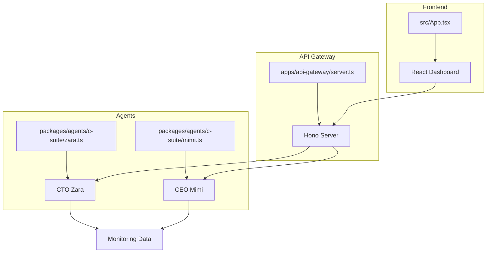
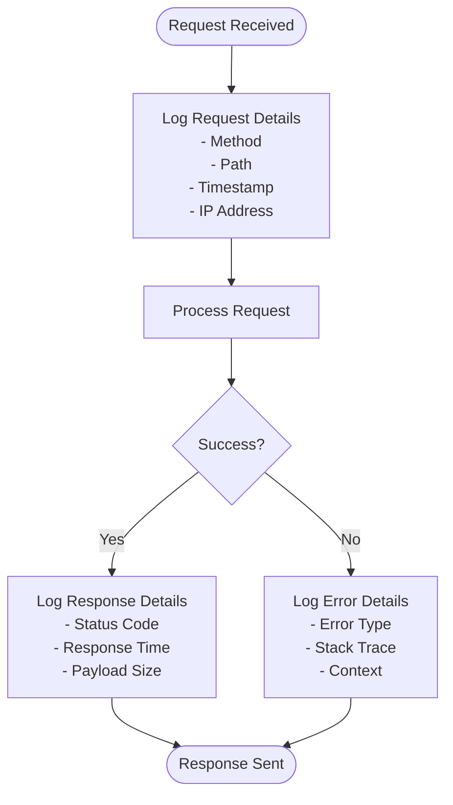
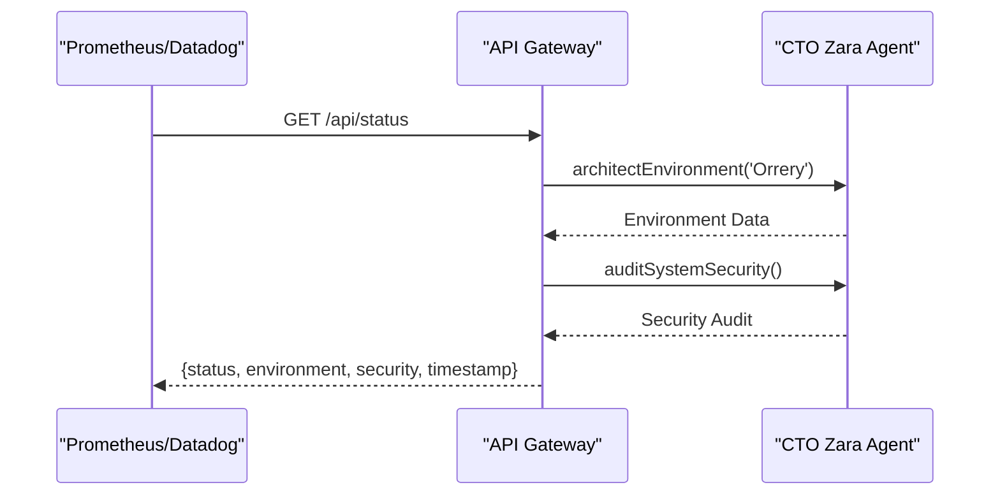
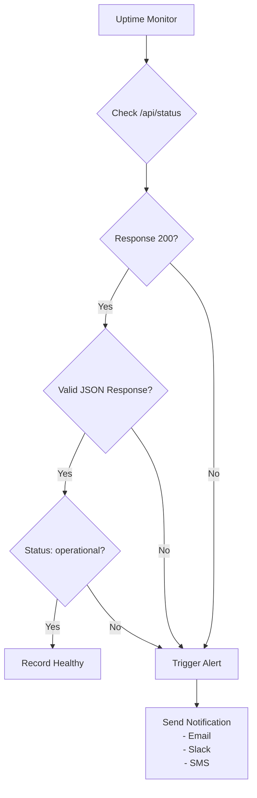
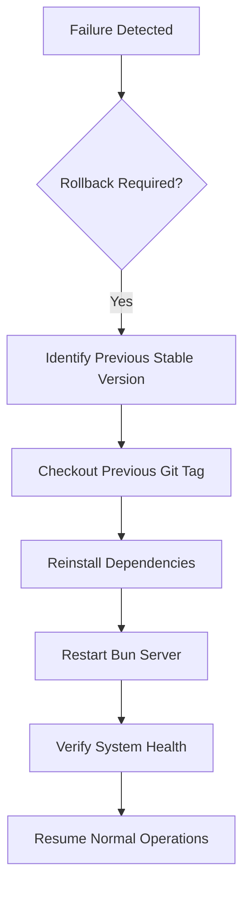
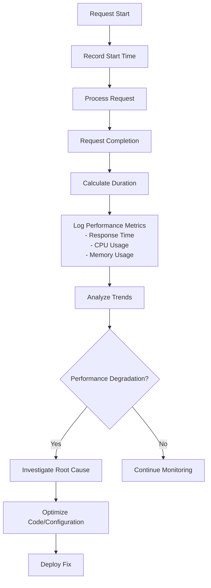

# Monitoring, Logging & Disaster Recovery

<cite>
**Referenced Files in This Document**   
- [src/index.tsx](file://src/index.tsx)
- [bunfig.toml](file://bunfig.toml)
- [apps/api-gateway/server.ts](file://apps/api-gateway/server.ts)
- [packages/agents/c-suite/zara.ts](file://packages/agents/c-suite/zara.ts)
- [packages/agents/c-suite/mimi.ts](file://packages/agents/c-suite/mimi.ts)
- [src/App.tsx](file://src/App.tsx)
- [package.json](file://package.json)
- [projectinfo.md](file://projectinfo.md)
</cite>

## Table of Contents
1. [Introduction](#introduction)
2. [Project Structure and Monitoring Context](#project-structure-and-monitoring-context)
3. [Structured Logging Implementation](#structured-logging-implementation)
4. [External Monitoring Integration](#external-monitoring-integration)
5. [Bun Runtime Configuration for Observability](#bun-runtime-configuration-for-observability)
6. [Health Checks and Uptime Monitoring](#health-checks-and-uptime-monitoring)
7. [Disaster Recovery Procedures](#disaster-recovery-procedures)
8. [Log Retention and Error Tracking](#log-retention-and-error-tracking)
9. [Performance Analysis and Diagnostics](#performance-analysis-and-diagnostics)
10. [Conclusion](#conclusion)

## Introduction
This document provides a comprehensive strategy for monitoring, logging, and disaster recovery in the SynchroSource cognitive-aware autonomous agent operating system. The system, built on the Bun runtime with a React frontend and Hono-based API gateway, requires robust observability to ensure the health and responsiveness of its cognitive agent ecosystem. This guide outlines practical approaches to implement structured logging, integrate with external monitoring tools, configure production observability settings, and establish disaster recovery protocols to maintain system reliability and performance.

## Project Structure and Monitoring Context
The SynchroSource project follows a monorepo architecture with workspaces for applications and packages. The core monitoring components are distributed across the frontend, API gateway, and agent implementations. The system's cognitive agents (CEO Mimi, CTO Zara, etc.) provide built-in diagnostic capabilities that can be leveraged for monitoring.



**Diagram sources**
- [src/App.tsx](file://src/App.tsx#L1-L206)
- [apps/api-gateway/server.ts](file://apps/api-gateway/server.ts#L1-L36)
- [packages/agents/c-suite/zara.ts](file://packages/agents/c-suite/zara.ts#L1-L33)
- [packages/agents/c-suite/mimi.ts](file://packages/agents/c-suite/mimi.ts#L1-L50)

**Section sources**
- [projectinfo.md](file://projectinfo.md#L1-L94)
- [package.json](file://package.json#L1-L30)

## Structured Logging Implementation
The Bun server implementation in `src/index.tsx` currently lacks comprehensive structured logging for request/response cycles, errors, and performance metrics. To enhance observability, structured logging should be implemented to capture key operational data in a consistent, machine-readable format.



**Diagram sources**
- [src/index.tsx](file://src/index.tsx#L1-L42)

**Section sources**
- [src/index.tsx](file://src/index.tsx#L1-L42)
- [packages/agents/c-suite/zara.ts](file://packages/agents/c-suite/zara.ts#L14-L21)
- [packages/agents/c-suite/mimi.ts](file://packages/agents/c-suite/mimi.ts#L14-L20)

## External Monitoring Integration
The cognitive agent system can be integrated with external monitoring tools like Prometheus, Grafana, and Datadog to provide real-time observability. The existing agent implementations already expose diagnostic endpoints that can be leveraged for monitoring.

### API Status Endpoint
The `/api/status` endpoint in the API gateway provides comprehensive system health information by querying the CTO Zara agent for environment architecture and security audit data.



**Diagram sources**
- [apps/api-gateway/server.ts](file://apps/api-gateway/server.ts#L19-L29)
- [packages/agents/c-suite/zara.ts](file://packages/agents/c-suite/zara.ts#L13-L21)

### Metrics Collection Strategy
To enable integration with Prometheus, custom metrics endpoints should be added to expose key performance indicators from the cognitive agents:

- Agent optimization levels (CEO Mimi's ROI evaluation)
- System architecture status (CTO Zara's environment design)
- Request processing rates and error rates
- Memory and CPU utilization (via Bun runtime)

**Section sources**
- [apps/api-gateway/server.ts](file://apps/api-gateway/server.ts#L1-L36)
- [packages/agents/c-suite/mimi.ts](file://packages/agents/c-suite/mimi.ts#L26-L37)
- [packages/agents/c-suite/zara.ts](file://packages/agents/c-suite/zara.ts#L13-L21)

## Bun Runtime Configuration for Observability
The `bunfig.toml` file provides configuration options that can enhance logging and tracing in production environments. While the current configuration focuses on development optimization, it can be extended to support comprehensive observability.

### Enhanced Configuration for Production
```toml
[runtime]
# Environment variables for cognitive engine
env = { NODE_ENV = "production", RUNTIME = "bun" }

# Enable detailed logging in production
logLevel = "info"
structuredLogging = true

# Enable tracing for performance monitoring
tracing = true
traceSampleRate = 0.1

# Health check configuration
healthCheck = { path = "/api/status", interval = "30s", timeout = "5s" }

# Metrics configuration
metrics = { enabled = true, port = 9090, prefix = "synchrosource_" }
```

The current configuration already sets the runtime environment but lacks specific observability settings. These should be added to enable enhanced logging and tracing in production deployments.

**Section sources**
- [bunfig.toml](file://bunfig.toml#L1-L17)
- [package.json](file://package.json#L13-L14)

## Health Checks and Uptime Monitoring
The system should implement comprehensive health checks and uptime monitoring to ensure the cognitive agent ecosystem remains responsive and available.

### Health Check Endpoints
The API gateway already provides a health check endpoint at `/api/status` that returns system operational status, environment configuration, and security audit information. This endpoint can be used by uptime monitoring services to verify system health.



### Proactive Monitoring Strategy
To proactively monitor the cognitive agent system's health and responsiveness:

1. Implement regular polling of the `/api/status` endpoint (every 30 seconds)
2. Monitor response time thresholds (alert if > 1 second)
3. Validate response content includes expected fields
4. Cross-check with agent-specific endpoints like `/api/agents/cto`
5. Implement synthetic transactions that simulate user interactions

**Section sources**
- [apps/api-gateway/server.ts](file://apps/api-gateway/server.ts#L19-L29)
- [src/index.tsx](file://src/index.tsx#L4-L39)

## Disaster Recovery Procedures
The cognitive agent operating system requires robust disaster recovery procedures to maintain continuity in case of failures.

### Backup Strategies
Given the stateless nature of the current implementation, the primary backup focus should be on:

- Configuration files (`bunfig.toml`, `package.json`)
- Agent logic code (`packages/agents/c-suite/*.ts`)
- Deployment manifests and infrastructure as code
- External service credentials and API keys

Regular automated backups should be scheduled and stored in geographically distributed locations.

### Deployment Rollbacks
The monorepo structure with Bun runtime enables rapid deployment rollbacks:

1. Maintain versioned releases in the repository
2. Use Git tags to mark stable production deployments
3. Implement a rollback script that:
   - Reverts to the previous Git tag
   - Reinstalls dependencies
   - Restarts the Bun server



### Failover Mechanisms
For high availability, implement a failover mechanism using multiple instances:

1. Deploy primary and secondary instances in different availability zones
2. Use a load balancer with health checks to route traffic
3. Automatically redirect traffic to the secondary instance if the primary fails
4. Implement data synchronization between instances for stateful components

**Section sources**
- [projectinfo.md](file://projectinfo.md#L44-L47)
- [package.json](file://package.json#L13-L14)
- [bunfig.toml](file://bunfig.toml#L1-L17)

## Log Retention and Error Tracking
Effective log management is critical for diagnosing issues and maintaining system security.

### Log Retention Policies
Implement a tiered log retention strategy:

- **Debug logs**: Retain for 7 days (high volume, detailed information)
- **Info logs**: Retain for 30 days (standard operational data)
- **Warning logs**: Retain for 90 days (potential issues)
- **Error logs**: Retain for 365 days (critical failures)
- **Security logs**: Retain for 730 days (compliance and audit)

Logs should be rotated daily and compressed to optimize storage.

### Error Tracking with Sentry
Integrate Sentry for comprehensive error tracking across the cognitive agent system:

1. Install Sentry SDK for JavaScript/Bun
2. Configure error reporting in `src/index.tsx`:

```typescript
// Initialize Sentry
Sentry.init({
  dsn: "YOUR_SENTRY_DSN",
  environment: process.env.NODE_ENV,
  tracesSampleRate: 0.1,
});

// Wrap request handlers with error monitoring
app.get("/api/hello", Sentry.Handlers.requestHandler());
```

3. Configure Sentry to capture:
   - Unhandled exceptions
   - Promise rejections
   - Performance issues
   - Custom breadcrumbs from agent interactions

4. Set up alerting rules for:
   - High error rates
   - Specific error types
   - Errors in critical paths

**Section sources**
- [src/index.tsx](file://src/index.tsx#L1-L42)
- [apps/api-gateway/server.ts](file://apps/api-gateway/server.ts#L1-L36)
- [packages/agents/c-suite/zara.ts](file://packages/agents/c-suite/zara.ts#L1-L33)

## Performance Analysis and Diagnostics
The cognitive agent system should implement proactive performance monitoring to identify and resolve bottlenecks.

### Analyzing Logs for Performance Bottlenecks
Structured logs should capture performance metrics for each request:



Key metrics to analyze:
- API response times (p50, p95, p99 percentiles)
- Agent processing latency
- Memory consumption patterns
- CPU utilization spikes
- Error rate correlations with performance

### Diagnosing API Failures
When API failures occur, follow this diagnostic process:

1. Check structured logs for the specific request
2. Examine error type and stack trace
3. Review system health at the time of failure
4. Analyze recent deployments or configuration changes
5. Test agent functionality independently
6. Verify external dependencies

Automated recovery scripts can be implemented to restart services or roll back deployments when specific failure patterns are detected.

**Section sources**
- [src/index.tsx](file://src/index.tsx#L1-L42)
- [apps/api-gateway/server.ts](file://apps/api-gateway/server.ts#L19-L29)
- [packages/agents/c-suite/zara.ts](file://packages/agents/c-suite/zara.ts#L13-L21)

## Conclusion
The SynchroSource cognitive-aware autonomous agent operating system requires a comprehensive monitoring, logging, and disaster recovery strategy to ensure reliability and performance. By implementing structured logging in the Bun server, integrating with external monitoring tools like Prometheus and Sentry, configuring `bunfig.toml` for enhanced observability, and establishing robust disaster recovery procedures, the system can maintain high availability and quickly respond to issues. The existing cognitive agent architecture provides a strong foundation for monitoring, with agents like CTO Zara and CEO Mimi already exposing diagnostic endpoints that can be leveraged for system health assessment. Proactive monitoring of the cognitive agent system's health and responsiveness will ensure the platform remains stable and performant as it scales.