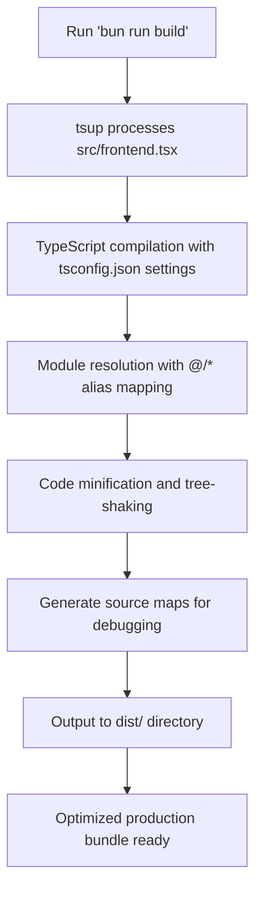

# Production Build Process

<cite>
**Referenced Files in This Document**   
- [package.json](file://package.json)
- [tsconfig.json](file://tsconfig.json)
- [bunfig.toml](file://bunfig.toml)
- [src/frontend.tsx](file://src/frontend.tsx)
- [src/index.html](file://src/index.html)
- [.gitignore](file://.gitignore)
</cite>

## Table of Contents
1. [Build Script Configuration](#build-script-configuration)
2. [TypeScript Configuration and Type Checking](#typescript-configuration-and-type-checking)
3. [Bun Configuration and Optimization](#bun-configuration-and-optimization)
4. [Build Execution and Output Inspection](#build-execution-and-output-inspection)
5. [Common Build Issues and Troubleshooting](#common-build-issues-and-troubleshooting)
6. [Performance Optimization Strategies](#performance-optimization-strategies)
7. [Environment Variables and Build Context](#environment-variables-and-build-context)

## Build Script Configuration

The production build process for the cogintionawarecore application is managed through the `build` script defined in `package.json`, which utilizes `tsup` as the bundler. The script is configured with minimal configuration, relying on tsup's sensible defaults for modern TypeScript applications. By default, tsup outputs the bundled files to the `dist/` directory, applies code minification to reduce bundle size, and generates source maps for debugging purposes in production environments. The build process automatically handles TypeScript compilation, JSX transformation, and module bundling without requiring additional configuration files. The entry point for the frontend application is `src/frontend.tsx`, which is processed along with its dependencies to generate optimized production assets.

**Section sources**
- [package.json](file://package.json#L15)
- [src/frontend.tsx](file://src/frontend.tsx#L1-L27)

## TypeScript Configuration and Type Checking

The `tsconfig.json` file defines the TypeScript compiler options that influence both the build output and type checking process. The configuration targets `ESNext` to leverage the latest JavaScript features while maintaining compatibility with modern runtimes like Bun. The `module` option is set to `Preserve`, allowing the bundler (tsup) to handle module transformation according to its own optimization strategies. Module resolution is configured for `bundler` compatibility, enabling seamless integration with modern build tools. The `paths` configuration establishes a baseUrl alias `@/*` that maps to `./src/*`, enabling cleaner import statements throughout the codebase. Strict type checking is enabled to catch potential bugs during development, while `skipLibCheck` is set to true to improve build performance by skipping type checking of declaration files. The build process excludes the `dist` and `node_modules` directories from type checking to focus on application code.

**Section sources**
- [tsconfig.json](file://tsconfig.json#L1-L17)

## Bun Configuration and Optimization

The `bunfig.toml` file contains configuration settings that optimize dependency resolution and caching during the build process. The `[install]` section enables caching and lockfile generation, which significantly speeds up dependency installation by reusing previously downloaded packages and ensuring consistent dependency versions across environments. The `[runtime]` section defines environment variables that influence the build context, including `NODE_ENV` set to "development" by default and `RUNTIME` set to "bun" to identify the execution environment. These settings allow the application to adapt its behavior based on the runtime context. The configuration also includes settings for testing coverage and development server behavior, contributing to an optimized development and build workflow. The cache settings in bunfig.toml work in conjunction with tsup's internal caching mechanism to minimize rebuild times during development.

**Section sources**
- [bunfig.toml](file://bunfig.toml#L1-L17)

## Build Execution and Output Inspection

To execute the production build, run the command `bun run build` in the project root directory. This command invokes tsup with the default configuration, processing the application code and generating optimized output in the `dist/` directory. After the build completes, the output files can be inspected to validate bundle integrity and structure. The main JavaScript bundle, CSS assets, and static files are organized in the `dist/` directory, with file names hashed for cache busting in production deployments. The generated source maps allow for debugging production issues by mapping minified code back to the original source files. The build process also generates a bundle size report, showing the size of each output file and helping identify potential optimization opportunities. The `.gitignore` file confirms that the `dist/` directory is excluded from version control, as it is intended to be regenerated during deployment.

**Section sources**
- [package.json](file://package.json#L15)
- [.gitignore](file://.gitignore#L5-L6)

## Common Build Issues and Troubleshooting

Common build issues in the cogintionawarecore application typically fall into three categories: missing dependencies, type errors, and module resolution failures. Missing dependencies can occur when packages are used in code but not listed in `package.json`, which can be resolved by running `bun install [package-name]` to add the missing dependency. Type errors may arise from incorrect type annotations or incompatible API usage, which are caught by the strict type checking enabled in `tsconfig.json`. These errors must be addressed before the build can succeed. Module resolution failures can occur when using the `@/*` path alias incorrectly or when file paths are misspelled. Ensuring that import statements follow the correct pattern (`@/path/to/file`) and that files exist at the specified locations resolves these issues. Additionally, clearing the Bun and tsup caches may resolve intermittent build problems caused by corrupted cache entries.

**Section sources**
- [tsconfig.json](file://tsconfig.json#L12-L14)
- [package.json](file://package.json#L19-L29)

## Performance Optimization Strategies

The build process leverages several performance optimization strategies through the integration of Bun and tsup. Bun's native dependency installer provides significantly faster package resolution and installation compared to traditional npm or yarn workflows, reducing initial setup and rebuild times. The caching configuration in `bunfig.toml` ensures that dependencies are only re-downloaded when necessary, further improving build performance. Tsup's zero-configuration approach with sensible defaults minimizes the overhead of build tool configuration while still providing optimized output. Code minification and tree-shaking eliminate unused code from the final bundle, reducing payload size and improving application load times. The use of ESNext as the compilation target allows the generated code to take advantage of modern JavaScript engine optimizations. Additionally, the source map generation enables efficient debugging without sacrificing production performance.

**Diagram sources**
- [package.json](file://package.json#L15)
- [tsconfig.json](file://tsconfig.json#L1-L17)
- [src/frontend.tsx](file://src/frontend.tsx#L1-L27)

## Environment Variables and Build Context

Environment variables defined in `bunfig.toml` play a crucial role in shaping the build context and application behavior. The `NODE_ENV` variable, set to "development" in the runtime configuration, influences how certain libraries and frameworks behave during execution. While this default setting is appropriate for development, the production build process should ensure that `NODE_ENV` is set to "production" to enable production-specific optimizations and disable development-only features. The `RUNTIME` variable, set to "bun", allows the application to detect and optimize for the Bun runtime environment, potentially enabling runtime-specific performance enhancements. These environment variables are accessible throughout the application code via `process.env` and can be used to conditionally enable or disable features based on the deployment environment. During the build process, these variables are embedded into the generated code, ensuring consistent behavior across different deployment targets.

**Section sources**
- [bunfig.toml](file://bunfig.toml#L15-L17)
- [src/index.tsx](file://src/index.tsx#L32-L38)