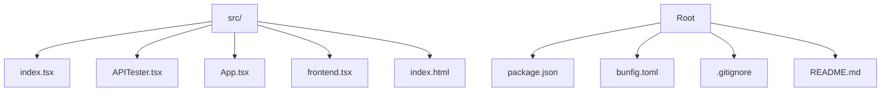
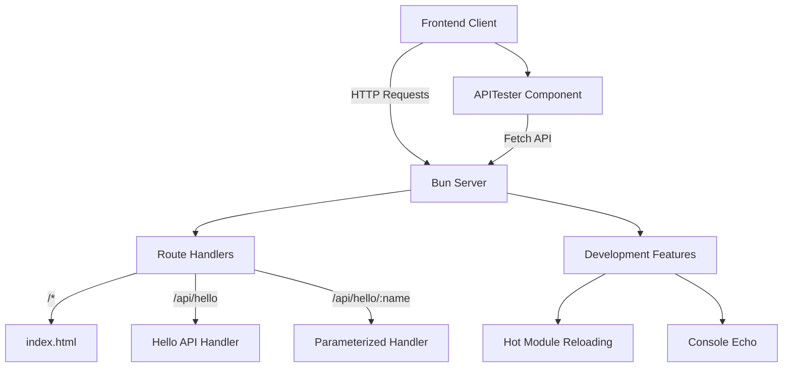
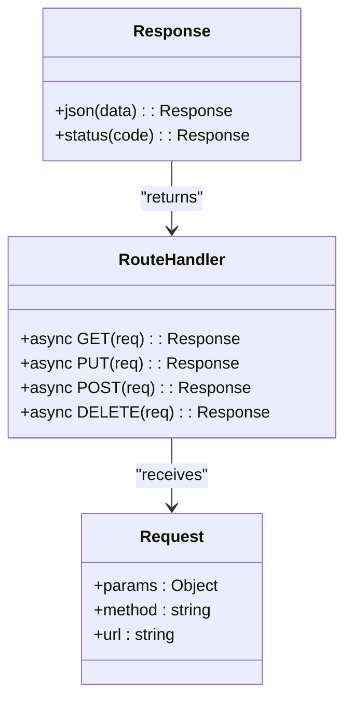
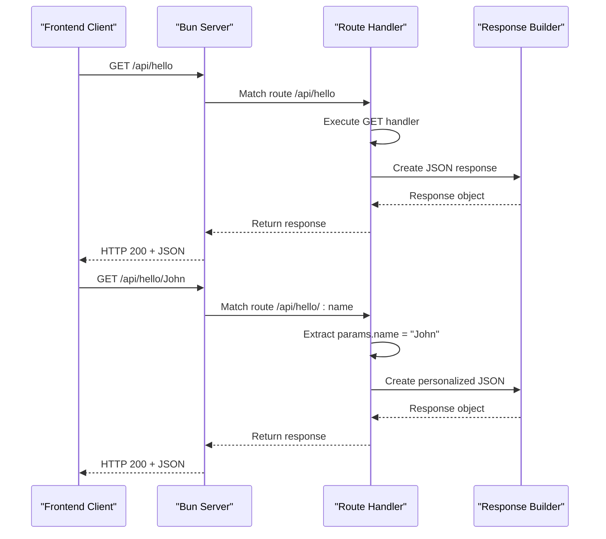
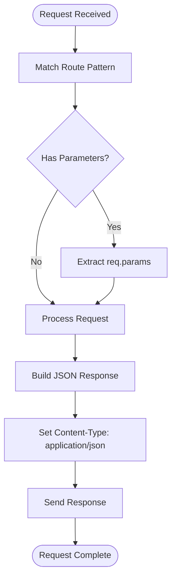
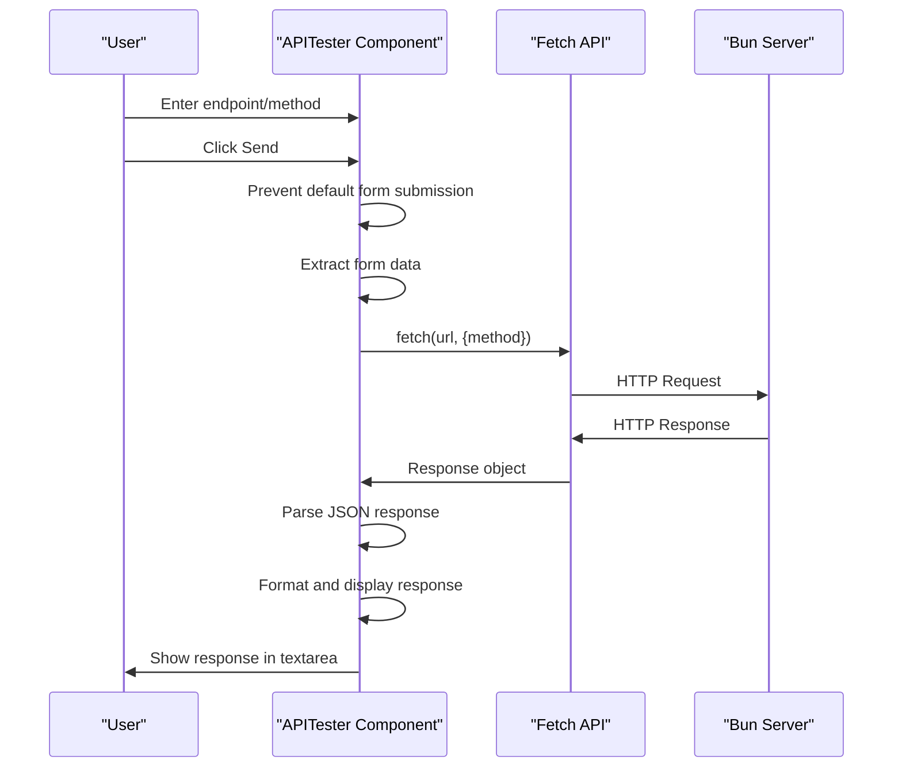
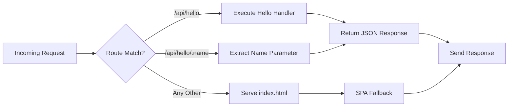

# API Extension

<cite>
**Referenced Files in This Document**   
- [index.tsx](file://src/index.tsx)
- [APITester.tsx](file://src/APITester.tsx)
- [App.tsx](file://src/App.tsx)
- [package.json](file://package.json)
- [bunfig.toml](file://bunfig.toml)
</cite>

## Table of Contents
1. [Introduction](#introduction)
2. [Project Structure](#project-structure)
3. [Core Components](#core-components)
4. [Architecture Overview](#architecture-overview)
5. [Detailed Component Analysis](#detailed-component-analysis)
6. [Dependency Analysis](#dependency-analysis)
7. [Performance Considerations](#performance-considerations)
8. [Troubleshooting Guide](#troubleshooting-guide)
9. [Conclusion](#conclusion)

## Introduction
This document provides comprehensive guidance on extending the RESTful API endpoints of a Bun server using Hono routing. The system is built on Bun's native `serve` function with declarative route definitions, supporting both simple and parameterized endpoints. The existing `/api/hello` and `/api/hello/:name` routes serve as foundational examples for implementing GET, PUT, POST, and DELETE handlers. This documentation details the pattern for defining new routes, integrating them with frontend testing components, and following best practices for validation, error handling, and performance optimization.

## Project Structure



**Diagram sources**
- [src/index.tsx](file://src/index.tsx#L1-L41)
- [package.json](file://package.json#L1-L30)

**Section sources**
- [src/index.tsx](file://src/index.tsx#L1-L41)
- [package.json](file://package.json#L1-L30)

## Core Components

The core API functionality is implemented through Bun's built-in `serve` method with a declarative routing configuration. The `index.tsx` file defines all server routes, including static file serving and RESTful endpoints. The APITester component enables client-side testing of endpoints directly from the UI. The system leverages Hono-style routing patterns within Bun's native server implementation, allowing for clean, readable route definitions with async handler support.

**Section sources**
- [src/index.tsx](file://src/index.tsx#L1-L41)
- [src/APITester.tsx](file://src/APITester.tsx#L1-L40)

## Architecture Overview



**Diagram sources**
- [src/index.tsx](file://src/index.tsx#L4-L39)
- [src/APITester.tsx](file://src/APITester.tsx#L6-L22)

## Detailed Component Analysis

### Route Definition Pattern
The Bun server uses a declarative routing system where endpoints are defined as properties within the `routes` object. Each route can have multiple HTTP method handlers (GET, PUT, etc.) defined as async functions that receive the request object and return a Response.



**Diagram sources**
- [src/index.tsx](file://src/index.tsx#L9-L29)

#### For API/Service Components:


**Diagram sources**
- [src/index.tsx](file://src/index.tsx#L9-L29)
- [src/APITester.tsx](file://src/APITester.tsx#L15-L18)

### Parameter Extraction and Response Formatting
Route parameters are automatically parsed from the URL when using the `:parameter` syntax in route definitions. These parameters are accessible via the `req.params` object in the handler function. All responses should be formatted using `Response.json()` to ensure proper Content-Type headers and JSON serialization.



**Diagram sources**
- [src/index.tsx](file://src/index.tsx#L24-L29)

**Section sources**
- [src/index.tsx](file://src/index.tsx#L24-L29)

### Frontend Integration with APITester
The APITester component provides a user interface for testing API endpoints directly from the browser. It uses the Fetch API to send requests to specified endpoints and displays the JSON response in a formatted textarea. This component is integrated into the main application for convenient development and debugging.



**Diagram sources**
- [src/APITester.tsx](file://src/APITester.tsx#L6-L22)
- [src/index.tsx](file://src/index.tsx#L9-L29)

**Section sources**
- [src/APITester.tsx](file://src/APITester.tsx#L1-L40)

## Dependency Analysis

```mermaid
graph LR
A[Bun Runtime] --> B[serve function]
B --> C[Declarative Routing]
C --> D[Response.json()]
C --> E[req.params]
F[Hono Routing Pattern] --> C
G[React Frontend] --> H[APITester]
H --> I[Fetch API]
I --> C
J[package.json] --> K[hono dependency]
J --> L[zod dependency]
```

**Diagram sources**
- [package.json](file://package.json#L26-L28)
- [src/index.tsx](file://src/index.tsx#L1-L41)
- [src/APITester.tsx](file://src/APITester.tsx#L1-L40)

**Section sources**
- [package.json](file://package.json#L1-L30)
- [bunfig.toml](file://bunfig.toml#L1-L17)

## Performance Considerations

Route ordering follows a longest-prefix match strategy, where more specific routes are matched before generic ones. The wildcard route `/*` serves as a fallback for unmatched requests, ensuring the frontend application remains accessible. Development features like HMR (Hot Module Reloading) and console echoing are enabled conditionally based on the NODE_ENV environment variable. The bunfig.toml configuration optimizes installation and runtime performance with caching and lockfile usage.



**Diagram sources**
- [src/index.tsx](file://src/index.tsx#L5-L30)
- [bunfig.toml](file://bunfig.toml#L1-L17)

**Section sources**
- [src/index.tsx](file://src/index.tsx#L4-L39)
- [bunfig.toml](file://bunfig.toml#L1-L17)

## Troubleshooting Guide

When debugging API endpoints, leverage Bun's native development features including console.log echoing from the browser to the server terminal and hot module reloading. Ensure that route patterns are correctly defined and that parameter names in the route definition (e.g., `:name`) match the property names accessed in `req.params`. Validate that JSON responses are properly formatted using `Response.json()` and that appropriate HTTP status codes are returned for different scenarios. Use the APITester component to verify endpoint behavior during development.

**Section sources**
- [src/index.tsx](file://src/index.tsx#L32-L38)
- [src/APITester.tsx](file://src/APITester.tsx#L19-L21)

## Conclusion
Extending the Bun server's RESTful endpoints follows a clean, declarative pattern using Hono-style routing. New endpoints can be added to the `routes` object in `index.tsx` with support for multiple HTTP methods and parameterized paths. The APITester component provides immediate feedback during development, while Bun's native features enable efficient debugging and hot reloading. By following the established patterns for request handling, parameter extraction, and JSON response formatting, developers can consistently extend the API while maintaining performance and reliability.