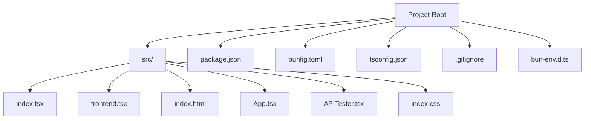
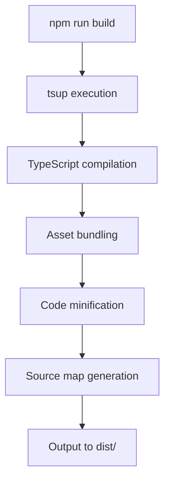
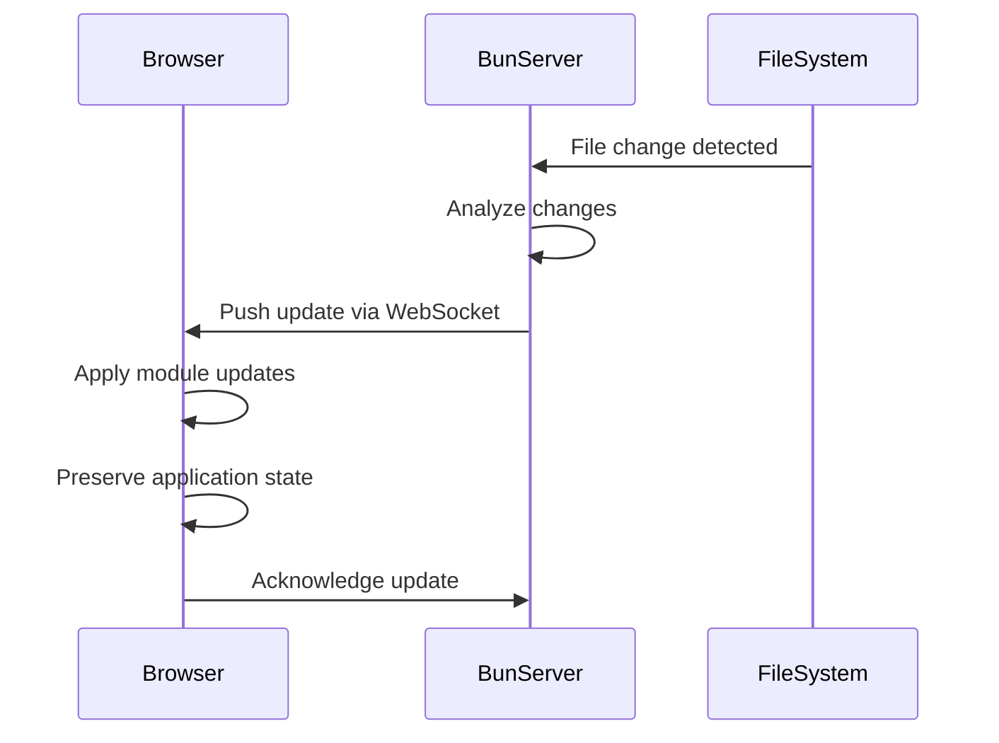
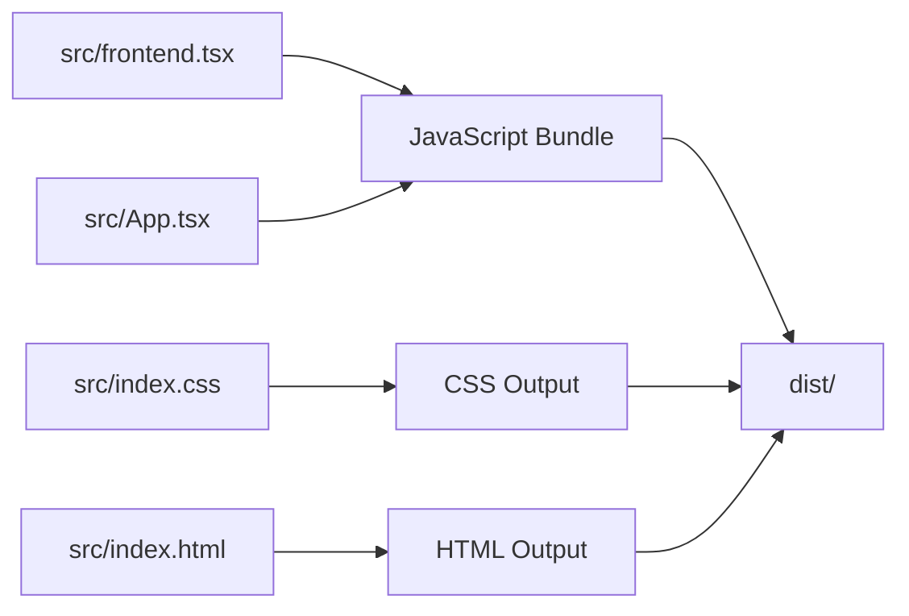

# Build Process

<cite>
**Referenced Files in This Document**   
- [package.json](file://package.json)
- [bunfig.toml](file://bunfig.toml)
- [tsconfig.json](file://tsconfig.json)
- [src/index.tsx](file://src/index.tsx)
- [src/frontend.tsx](file://src/frontend.tsx)
- [src/index.html](file://src/index.html)
- [.gitignore](file://.gitignore)
- [bun-env.d.ts](file://bun-env.d.ts)
</cite>

## Table of Contents
1. [Introduction](#introduction)
2. [Project Structure](#project-structure)
3. [Development Workflow](#development-workflow)
4. [Production Build Process](#production-build-process)
5. [Configuration Files](#configuration-files)
6. [Hot Module Reloading Implementation](#hot-module-reloading-implementation)
7. [Build Optimization Techniques](#build-optimization-techniques)
8. [Asset Bundling and Output Management](#asset-bundling-and-output-management)
9. [Customizing the Build Pipeline](#customizing-the-build-pipeline)
10. [Common Build Issues and Solutions](#common-build-issues-and-solutions)
11. [Performance Optimization for Akash Network](#performance-optimization-for-akash-network)
12. [Conclusion](#conclusion)

## Introduction
This document provides comprehensive documentation for the full-stack build process using Bun and tsup in the SynchroSource project. The system is designed as a cognitive-aware autonomous agent operating system (371-OS) with a focus on performance optimization and developer experience. The build process leverages Bun's native capabilities for development and tsup for production builds, creating an efficient workflow that supports hot module reloading, TypeScript compilation, and optimized asset bundling. This documentation covers the complete development-to-production pipeline, configuration options, and optimization strategies specific to the Akash Network deployment environment.

## Project Structure
The project follows a standard full-stack structure with a focus on modern JavaScript tooling. The source code is organized in the `src` directory, containing all frontend components and entry points. The build process is configured through standard configuration files including `package.json`, `bunfig.toml`, and `tsconfig.json`. The project uses Bun as the primary runtime and package manager, with tsup handling production builds. Dependencies are managed through Bun's package manager with caching enabled for improved performance.

**Diagram sources**
- [package.json](file://package.json#L1-L31)
- [src/index.tsx](file://src/index.tsx#L1-L42)

**Section sources**
- [package.json](file://package.json#L1-L31)
- [project structure](file://projectinfo.md)

## Development Workflow
The development workflow is centered around Bun's native development server, providing a fast and efficient development experience. The workflow begins with dependency installation using `bun install`, which leverages Bun's optimized package manager for rapid dependency resolution. The development server is started using the `bun dev` command, which executes the hot module reloading server defined in the package.json scripts. This workflow provides near-instant startup times and fast refresh capabilities, significantly improving developer productivity. The development environment is configured to automatically detect file changes and reload the application without requiring manual intervention.

**Section sources**
- [package.json](file://package.json#L13-L18)
- [README.md](file://README.md#L1-L22)

## Production Build Process
The production build process is defined in the package.json scripts and executed using tsup. The build process compiles TypeScript code, bundles assets, and optimizes output for production deployment. The `build` script in package.json invokes tsup without additional configuration, indicating that tsup uses its default configuration based on the project's tsconfig.json. This streamlined approach reduces configuration complexity while maintaining production-ready output. The build process generates optimized JavaScript bundles, minifies code, and produces source maps for debugging purposes. Output is directed to the dist directory, which is excluded from version control through the .gitignore file.

**Diagram sources**
- [package.json](file://package.json#L15)
- [.gitignore](file://.gitignore#L6)

**Section sources**
- [package.json](file://package.json#L15)
- [.gitignore](file://.gitignore#L6)

## Configuration Files
The build process is configured through three primary configuration files: bunfig.toml, tsconfig.json, and package.json. These files work together to define the development and production environments, type checking rules, and build scripts. The configuration system is designed to be minimal yet powerful, leveraging defaults where possible while allowing for customization when needed. This approach reduces configuration overhead while maintaining flexibility for optimization and customization.

### bunfig.toml Configuration
The bunfig.toml file contains TOML-formatted configuration for Bun's runtime and package management behavior. It includes settings for installation caching, test coverage, and runtime environment variables. The configuration enables package installation caching and lockfile generation for consistent dependency resolution. The runtime section defines environment variables that are available during execution, including NODE_ENV and RUNTIME. These settings are optimized for development performance and consistency across environments.

**Section sources**
- [bunfig.toml](file://bunfig.toml#L1-L17)

### tsconfig.json Configuration
The tsconfig.json file configures TypeScript compilation behavior for the project. It specifies ESNext as the compilation target, preserving modern JavaScript features while ensuring compatibility with Bun's runtime. The module resolution is set to "bundler" mode, which is optimized for modern build tools. The configuration includes path mapping for the @/* alias, allowing for cleaner import statements from the src directory. Strict type checking is enabled to catch potential issues early in development, while skipLibCheck improves compilation performance by skipping type checking of declaration files.

**Section sources**
- [tsconfig.json](file://tsconfig.json#L1-L17)

### package.json Scripts
The package.json file defines the primary scripts for the build process. The dev script uses Bun's --hot flag to enable hot module reloading for the API gateway server. The build script invokes tsup for production builds, leveraging its zero-configuration defaults. Additional scripts include testing with Bun's native test runner and linting with Biome. The package manager field specifies Bun as the required package manager, ensuring consistent dependency resolution across development environments.

**Section sources**
- [package.json](file://package.json#L12-L18)

## Hot Module Reloading Implementation
Hot Module Reloading (HMR) is implemented through Bun's native server configuration in src/index.tsx. The HMR functionality is enabled by setting the hmr option to true in the development configuration of the serve function. This configuration is conditionally applied based on the NODE_ENV environment variable, ensuring HMR is only active in development. The implementation leverages Bun's built-in HMR capabilities, which detect file changes and update the running application without requiring a full page refresh. The frontend HMR is further configured in src/frontend.tsx, where the import.meta.hot API is used to persist the React root across module updates.

**Diagram sources**
- [src/index.tsx](file://src/index.tsx#L32-L38)
- [src/frontend.tsx](file://src/frontend.tsx#L19-L22)

**Section sources**
- [src/index.tsx](file://src/index.tsx#L32-L38)
- [src/frontend.tsx](file://src/frontend.tsx#L19-L22)

## Build Optimization Techniques
The build process incorporates several optimization techniques to improve performance and reduce bundle size. These optimizations are applied automatically by tsup during the production build process. The configuration leverages Bun's performance advantages, including faster package resolution and execution. The build pipeline includes code minification, tree shaking to eliminate unused code, and efficient module bundling. Source maps are generated to facilitate debugging in production environments while maintaining optimized code delivery.

### Code Minification
Code minification is automatically applied during the production build process by tsup. This process reduces file sizes by removing whitespace, shortening variable names, and optimizing JavaScript expressions. The minification process is configured through tsup's default settings, which are optimized for modern JavaScript runtimes like Bun. Minification significantly reduces the size of JavaScript bundles, improving load times and reducing bandwidth consumption.

**Section sources**
- [package.json](file://package.json#L15)

### Source Map Generation
Source maps are generated during the production build process to enable debugging of minified code. These maps provide a translation between the original source code and the optimized output, allowing developers to debug issues in the context of the original TypeScript files. Source maps are essential for maintaining developer productivity in production environments while still delivering optimized code to end users. The source map generation is handled automatically by tsup based on the TypeScript configuration.

**Section sources**
- [tsconfig.json](file://tsconfig.json#L2-L17)

### Bundle Analysis
While not explicitly configured in the current setup, bundle analysis can be implemented to identify optimization opportunities. Tools like webpack-bundle-analyzer can be integrated with tsup to visualize the composition of output bundles. This analysis helps identify large dependencies, duplicate code, and other opportunities for size reduction. For the Akash Network deployment environment, bundle analysis is particularly important for minimizing resource consumption and optimizing cost efficiency.

**Section sources**
- [package.json](file://package.json#L15)

## Asset Bundling and Output Management
The build process handles asset bundling through tsup's integrated bundler, which processes JavaScript, TypeScript, CSS, and other assets. The output is managed through conventional directory structures, with production builds directed to the dist directory. Static assets referenced in the code are automatically included in the output bundle. The index.html file serves as the entry point for the frontend application, linking to the compiled frontend.tsx module. CSS styles are processed and included in the output, either as separate files or inlined depending on the build configuration.

**Diagram sources**
- [src/index.html](file://src/index.html#L1-L14)
- [src/frontend.tsx](file://src/frontend.tsx#L1-L27)
- [src/index.css](file://src/index.css#L1-L188)

**Section sources**
- [src/index.html](file://src/index.html#L1-L14)
- [src/frontend.tsx](file://src/frontend.tsx#L1-L27)
- [src/index.css](file://src/index.css#L1-L188)

## Customizing the Build Pipeline
The build pipeline can be customized to accommodate additional assets or environment-specific configurations. Customization options include extending the tsup configuration, modifying the bunfig.toml settings, or adding build scripts to package.json. For additional assets such as images, fonts, or data files, the build process can be configured to copy these assets to the output directory. Environment-specific configurations can be implemented using environment variables defined in bunfig.toml or through separate configuration files loaded based on the deployment environment.

### Adding Additional Assets
To include additional assets in the build process, they should be placed in the src directory and referenced in the code. For assets that need to be copied without processing, a custom build script can be added to package.json that runs after the tsup build. Alternatively, tsup configuration can be extended to handle specific asset types through plugins or custom loaders. The bun-env.d.ts file provides TypeScript definitions for SVG assets, demonstrating how type safety can be maintained for non-code assets.

**Section sources**
- [bun-env.d.ts](file://bun-env.d.ts#L1-L17)

### Environment-Specific Configurations
Environment-specific configurations can be implemented using Bun's environment variable system. The bunfig.toml file already defines runtime environment variables, which can be extended to include environment-specific settings. For more complex configuration needs, separate configuration files can be created for different environments (development, staging, production) and loaded based on the NODE_ENV variable. This approach allows for different API endpoints, feature flags, or optimization settings in each environment while maintaining a consistent build process.

**Section sources**
- [bunfig.toml](file://bunfig.toml#L15-L17)

## Common Build Issues and Solutions
Several common build issues may arise during development and production builds. These issues typically relate to module resolution, type checking, or environment configuration. Understanding these common issues and their solutions is essential for maintaining a smooth development workflow and ensuring successful production deployments.

### Module Resolution Errors
Module resolution errors can occur when dependencies are not properly installed or when import paths are incorrect. Since the project specifies Bun as the package manager, using other package managers like npm or yarn may result in resolution issues. To resolve these errors, ensure that `bun install` is used to install dependencies and that the packageManager field in package.json is respected. Clearing the Bun cache with `bun pm cache clean` can also resolve persistent resolution issues.

**Section sources**
- [package.json](file://package.json#L7)

### Type Mismatches
Type mismatches may occur when TypeScript definitions are out of sync with implementation or when third-party libraries have incompatible types. The strict mode enabled in tsconfig.json helps catch these issues early. When type mismatches occur, they can be addressed by updating type definitions, using type assertions cautiously, or configuring skipLibCheck for problematic dependencies. The paths configuration in tsconfig.json helps prevent import-related type issues by ensuring consistent module resolution.

**Section sources**
- [tsconfig.json](file://tsconfig.json#L8)

### Deployment Preparation
Preparing for deployment involves ensuring that all environment variables are properly configured, dependencies are fully installed, and the build process completes successfully. The .gitignore file excludes the node_modules and dist directories, which must be regenerated on the deployment target. Before deployment, run `bun install` to ensure all dependencies are present, then `bun build` to generate the production assets. Verify that the environment variables in bunfig.toml are appropriate for the target environment, particularly the NODE_ENV setting.

**Section sources**
- [.gitignore](file://.gitignore#L2-L6)
- [bunfig.toml](file://bunfig.toml#L15-L17)

## Performance Optimization for Akash Network
The build process includes several performance optimizations specifically beneficial for deployment on the Akash Network. The Akash Network deployment environment emphasizes cost efficiency and resource optimization, making bundle size and startup time critical performance metrics. The current configuration already leverages Bun's performance advantages, but additional optimizations can further improve efficiency in this environment.

### Reducing Bundle Size
Bundle size reduction is crucial for minimizing costs on the Akash Network. The current setup uses tsup's default tree shaking and minification, but additional measures can be implemented. These include code splitting to load only necessary modules, optimizing dependency selection to favor smaller alternatives, and removing unused code paths. Analyzing the bundle composition can identify large dependencies that may be replaced with lighter alternatives. The use of ESNext as the compilation target preserves modern JavaScript features that are more efficiently executed by Bun's runtime.

**Section sources**
- [tsconfig.json](file://tsconfig.json#L3)
- [package.json](file://package.json#L15)

### Improving Startup Time
Startup time optimization focuses on reducing the time from container initialization to service availability. The current configuration benefits from Bun's fast startup characteristics, but further improvements can be made. These include optimizing the module loading order, reducing the number of synchronous operations during startup, and implementing lazy loading for non-essential components. The HMR configuration in development already demonstrates efficient module loading patterns that can inform production optimizations. Minimizing the number of files in the initial load can significantly improve startup performance on the Akash Network.

**Section sources**
- [src/index.tsx](file://src/index.tsx#L4-L42)
- [package.json](file://package.json#L13)

## Conclusion
The full-stack build process using Bun and tsup provides an efficient and optimized workflow for the SynchroSource project. The combination of Bun's native development server with tsup's production build capabilities creates a seamless development-to-production pipeline. The configuration is intentionally minimal, leveraging sensible defaults while providing flexibility for customization when needed. The hot module reloading implementation in src/index.tsx significantly enhances developer experience, while the production build process ensures optimized output for deployment on the Akash Network. By following the documented practices and understanding the configuration options, developers can effectively maintain and extend the build process to meet evolving project requirements.