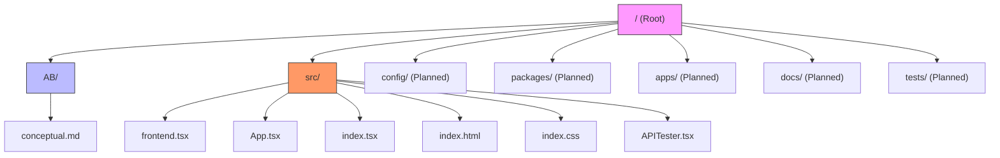
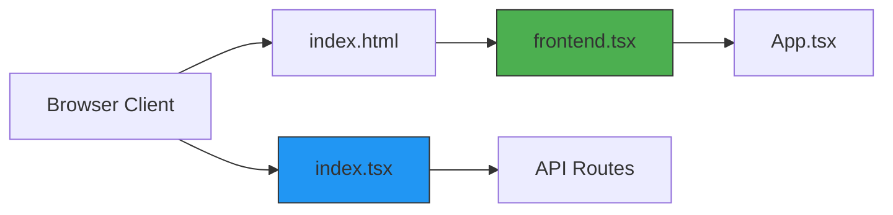

# Code Organization

<cite>
**Referenced Files in This Document**   
- [package.json](file://package.json)
- [src/index.tsx](file://src/index.tsx)
- [src/frontend.tsx](file://src/frontend.tsx)
- [src/App.tsx](file://src/App.tsx)
- [src/index.html](file://src/index.html)
- [AB/conceptual.md](file://AB/conceptual.md)
- [projectinfo.md](file://projectinfo.md)
- [tsconfig.json](file://tsconfig.json)
- [bunfig.toml](file://bunfig.toml)
- [bun-env.d.ts](file://bun-env.d.ts)
- [src/index.css](file://src/index.css)
</cite>

## Table of Contents
1. [Introduction](#introduction)
2. [Project Structure](#project-structure)
3. [Frontend and Backend Separation](#frontend-and-backend-separation)
4. [File Placement and Naming Conventions](#file-placement-and-naming-conventions)
5. [Feature Addition Guidelines](#feature-addition-guidelines)
6. [Workspace Configuration and Scaling](#workspace-configuration-and-scaling)
7. [Dependency Management Strategies](#dependency-management-strategies)
8. [Documentation and Test Organization](#documentation-and-test-organization)
9. [Configuration File Management](#configuration-file-management)
10. [Feature Modularization Patterns](#feature-modularization-patterns)
11. [Preparing for Agent Coordination Expansion](#preparing-for-agent-coordination-expansion)
12. [Conclusion](#conclusion)

## Introduction
This document provides comprehensive guidelines for code organization within the monorepo structure of the cognitive-aware core system, SynchroSource. The system implements a sophisticated dashboard for managing autonomous AI agents across executive, technical, and creative operational modes. The documentation covers the current separation of concerns between frontend and backend components, file organization principles, and best practices for maintaining architectural integrity during feature development. It also addresses workspace configuration, dependency management, and strategies for future expansion of agent coordination protocols.

**Section sources**
- [projectinfo.md](file://projectinfo.md#L1-L94)
- [README.md](file://README.md#L1-L22)

## Project Structure
The project follows a monorepo architecture with a clear separation between frontend and backend concerns. The root directory contains configuration files and documentation, while the `src` directory houses all frontend source code. The `AB` directory serves as a personal workspace for user-to-agent file exchange, containing conceptual design documents. The monorepo is configured to support multiple packages and applications through workspace definitions in package.json, with future expansion planned for `packages/*` and `apps/*` directories.



**Diagram sources**
- [projectinfo.md](file://projectinfo.md#L49-L62)
- [package.json](file://package.json#L8-L11)

**Section sources**
- [projectinfo.md](file://projectinfo.md#L49-L62)
- [package.json](file://package.json#L8-L11)

## Frontend and Backend Separation
The system maintains a clear separation between frontend and backend components. The frontend, located in the `src` directory, consists of React components and UI logic, with `frontend.tsx` serving as the entry point that mounts the React application to the DOM. The backend functionality is implemented in `index.tsx`, which uses Bun's native `serve` function to create an API server with defined routes. This separation allows for independent development of the user interface and API endpoints while maintaining a cohesive application structure.

The frontend components are organized with `App.tsx` containing the main application logic and UI, while `frontend.tsx` handles the React rendering bootstrap process. The backend routes are defined directly in `index.tsx`, with API endpoints such as `/api/hello` and `/api/hello/:name` implemented as route handlers. This architecture enables hot module reloading in development mode and provides a clean interface between the client-side application and server-side API.



**Diagram sources**
- [src/index.html](file://src/index.html#L1-L14)
- [src/frontend.tsx](file://src/frontend.tsx#L1-L27)
- [src/index.tsx](file://src/index.tsx#L1-L42)

**Section sources**
- [src/index.html](file://src/index.html#L1-L14)
- [src/frontend.tsx](file://src/frontend.tsx#L1-L27)
- [src/index.tsx](file://src/index.tsx#L1-L42)

## File Placement and Naming Conventions
The project follows consistent file placement and naming conventions to maintain clarity and predictability. All frontend source files are placed in the `src` directory with a `.tsx` extension to indicate TypeScript React components. Entry points are clearly named: `index.tsx` for the backend server and `frontend.tsx` for the frontend application bootstrap.

Component files follow PascalCase naming convention with descriptive names that reflect their purpose. The `App.tsx` file contains the main application component, while utility components like `APITester.tsx` are named to reflect their functionality. Configuration files use standard names (`package.json`, `tsconfig.json`) or descriptive names with the `bun` prefix (`bunfig.toml`, `bun-env.d.ts`) to indicate their association with the Bun runtime.

Directory structure follows a logical hierarchy with planned expansion for packages and applications. The `AB` directory uses lowercase with no spaces, following common convention for personal workspace directories. CSS files are named `index.css` to correspond with the main entry point, and test files would follow the pattern `*.test.tsx` when implemented.

**Section sources**
- [src/App.tsx](file://src/App.tsx#L1-L206)
- [src/APITester.tsx](file://src/APITester.tsx#L1-L40)
- [tsconfig.json](file://tsconfig.json#L1-L18)
- [bun-env.d.ts](file://bun-env.d.ts#L1-L18)

## Feature Addition Guidelines
When adding new features to the system, developers should follow established patterns for maintaining architectural integrity. New UI components should be placed in the `src` directory and imported into `App.tsx` as needed. Components should be organized by feature or functionality, with related components grouped together in subdirectories when the component count grows.

New API routes should be added to `index.tsx` following the existing routing pattern. Routes should be grouped by resource and follow RESTful conventions where applicable. For complex route handlers, logic should be abstracted into separate modules under a planned `services` directory. Frontend components that interact with APIs should be colocated with their corresponding API clients or hooks.

For new applications or packages, the `apps/*` and `packages/*` directories should be used according to the workspace configuration. Applications represent standalone services or interfaces, while packages contain reusable libraries or shared functionality. This separation ensures that new features can be developed independently while maintaining access to shared resources.

**Section sources**
- [src/index.tsx](file://src/index.tsx#L1-L42)
- [src/App.tsx](file://src/App.tsx#L1-L206)
- [package.json](file://package.json#L8-L11)

## Workspace Configuration and Scaling
The workspace is configured for future scaling through the `workspaces` field in `package.json`, which defines `packages/*` and `apps/*` as workspace directories. This monorepo structure allows for multiple packages and applications to be managed within a single repository while maintaining independent versioning and dependency management.

The `package.json` file specifies Bun as the package manager, enabling fast dependency installation and script execution. Scripts are defined for development (`bun dev`), testing (`bun test`), building (`tsup`), and linting (`biome check`). The build process is configured with `tsup`, a fast TypeScript bundler that supports tree-shaking and code splitting.

The `tsconfig.json` file includes path mapping with `@/*` pointing to `./src/*`, enabling cleaner import statements within the application. This configuration supports scalable import patterns as the codebase grows. The `bunfig.toml` file provides additional configuration for the Bun runtime, including installation caching and environment variable settings.

```mermaid
graph TD
packageJson["package.json"]
workspaces["workspaces: [\"packages/*\", \"apps/*\"]"]
scripts["scripts"]
dependencies["dependencies/devDependencies"]
packageJson --> workspaces
packageJson --> scripts
packageJson --> dependencies
scripts --> dev["dev: bun run --hot"]
scripts --> test["test: bun test"]
scripts --> build["build: tsup"]
scripts --> lint["lint: biome check"]
dependencies --> bun["@biomejs/biome"]
dependencies --> tsup["tsup"]
dependencies --> typescript["typescript"]
dependencies --> hono["hono"]
dependencies --> zod["zod"]
style packageJson fill:#FFC107,stroke:#333
```

**Diagram sources**
- [package.json](file://package.json#L1-L31)
- [tsconfig.json](file://tsconfig.json#L12-L14)
- [bunfig.toml](file://bunfig.toml#L1-L17)

**Section sources**
- [package.json](file://package.json#L1-L31)
- [tsconfig.json](file://tsconfig.json#L12-L14)
- [bunfig.toml](file://bunfig.toml#L1-L17)

## Dependency Management Strategies
The project employs a strategic approach to dependency management to avoid duplication and ensure version compatibility. Dependencies are categorized into `dependencies` and `devDependencies` in `package.json`, with production dependencies including `hono` for the API framework, `zod` for schema validation, and `lucide-react` for icons.

Development dependencies include `@biomejs/biome` for code quality checking, `tsup` for building, and `typescript` for type checking. The use of Bun as the package manager ensures fast dependency resolution and installation, with caching enabled in `bunfig.toml` to improve performance.

The monorepo workspace configuration allows for shared dependencies across packages and applications while enabling version pinning where necessary. This approach minimizes duplication and ensures consistent behavior across the system. For future packages, shared utilities can be extracted into common packages to promote code reuse and reduce dependency bloat.

**Section sources**
- [package.json](file://package.json#L19-L29)
- [bunfig.toml](file://bunfig.toml#L4-L6)

## Documentation and Test Organization
Documentation is organized with project-level information in `projectinfo.md` and `README.md`, while conceptual designs are stored in the `AB` directory. The `AB/conceptual.md` file contains the React component code for the main application interface, serving as both implementation and documentation of the UI design.

Future test files should be organized in a `tests` directory at the root level, following the pattern `*.test.tsx` for unit and integration tests. Tests should be colocated with their corresponding source files when possible, or organized by feature in subdirectories. Documentation for packages and applications should be placed in `docs` directories within each package or application.

The current structure includes `projectinfo.md` which provides comprehensive project documentation, including architecture, technical stack, and future considerations. This centralized documentation approach ensures that all project information is easily accessible and maintainable.

**Section sources**
- [projectinfo.md](file://projectinfo.md#L1-L94)
- [AB/conceptual.md](file://AB/conceptual.md#L1-L205)
- [README.md](file://README.md#L1-L22)

## Configuration File Management
Configuration files are managed at multiple levels to support different environments and development workflows. The `tsconfig.json` file contains TypeScript compiler options, including module resolution, JSX transformation, and path mapping. The `bunfig.toml` file provides Bun-specific configuration for installation, runtime, and testing.

Environment variables are managed through the `env` configuration in `bunfig.toml`, with `NODE_ENV` and `RUNTIME` set for the development environment. The `package.json` file contains script definitions that can accept environment variables, enabling different behaviors for development, testing, and production.

For future expansion, configuration files should be organized in a `config` directory at the root level, with environment-specific configurations separated into files like `config/development.json`, `config/production.json`, etc. This approach allows for easy management of configuration across different deployment environments while maintaining security through environment variable injection.

**Section sources**
- [tsconfig.json](file://tsconfig.json#L1-L18)
- [bunfig.toml](file://bunfig.toml#L1-L17)
- [package.json](file://package.json#L12-L18)

## Feature Modularization Patterns
The system supports feature modularization through its monorepo structure and import path configuration. Features should be organized as self-contained modules with clear interfaces and minimal external dependencies. The `@/*` path mapping in `tsconfig.json` enables clean import statements and promotes modular design.

UI components should follow a component-based architecture with reusable elements extracted into shared components. The current `App.tsx` file demonstrates this pattern with distinct sections for different UI elements (ventures, agents, cognitive interface). As the application grows, these sections can be extracted into separate component files organized by feature.

For backend functionality, route handlers in `index.tsx` should be kept minimal, with business logic extracted into service modules. The planned `packages/*` directory can house shared services and utilities, while `apps/*` can contain application-specific logic. This separation enables code reuse and independent development of features.

**Section sources**
- [tsconfig.json](file://tsconfig.json#L12-L14)
- [src/App.tsx](file://src/App.tsx#L1-L206)
- [src/index.tsx](file://src/index.tsx#L1-L42)

## Preparing for Agent Coordination Expansion
The codebase is structured to support future expansion of agent coordination protocols through its monorepo workspace configuration and modular design. The planned `packages/agents/c-suite` directory indicates a clear path for implementing cognitive agent logic, with each C-suite agent (CEO Mimi, CTO Zara, etc.) potentially implemented as a separate package.

Agent coordination can be implemented through shared state management, message passing, or blockchain-based governance as indicated in the project documentation. The current system already references blockchain DAO governance in the UI, suggesting that coordination protocols will leverage decentralized technologies.

New agent types can be added by creating packages in the `packages/agents` directory, with interfaces defined for standard communication patterns. The Hono framework used in the backend can support WebSocket connections for real-time agent coordination, while Zod provides schema validation for agent communication protocols.

The system's operational modes (Executive, Technical, Creative) provide a framework for agent specialization, with coordination rules potentially varying by mode. Future development should maintain this mode-based specialization while implementing cross-mode coordination protocols for complex tasks requiring multiple agent types.

**Section sources**
- [projectinfo.md](file://projectinfo.md#L20-L27)
- [package.json](file://package.json#L8-L11)
- [AB/conceptual.md](file://AB/conceptual.md#L20-L33)

## Conclusion
The SynchroSource cognitive-aware core system demonstrates a well-organized monorepo structure with clear separation between frontend and backend concerns. The current architecture supports efficient development workflows while providing a foundation for future expansion. By following the documented guidelines for file placement, naming conventions, and feature addition, developers can maintain architectural integrity as the system evolves.

The workspace configuration enables scaling to multiple packages and applications, while dependency management strategies ensure version compatibility and minimize duplication. The system is well-positioned for expansion of agent coordination protocols through its modular design and planned directory structure. Continued adherence to these code organization best practices will ensure the long-term maintainability and scalability of the cognitive-aware core system.