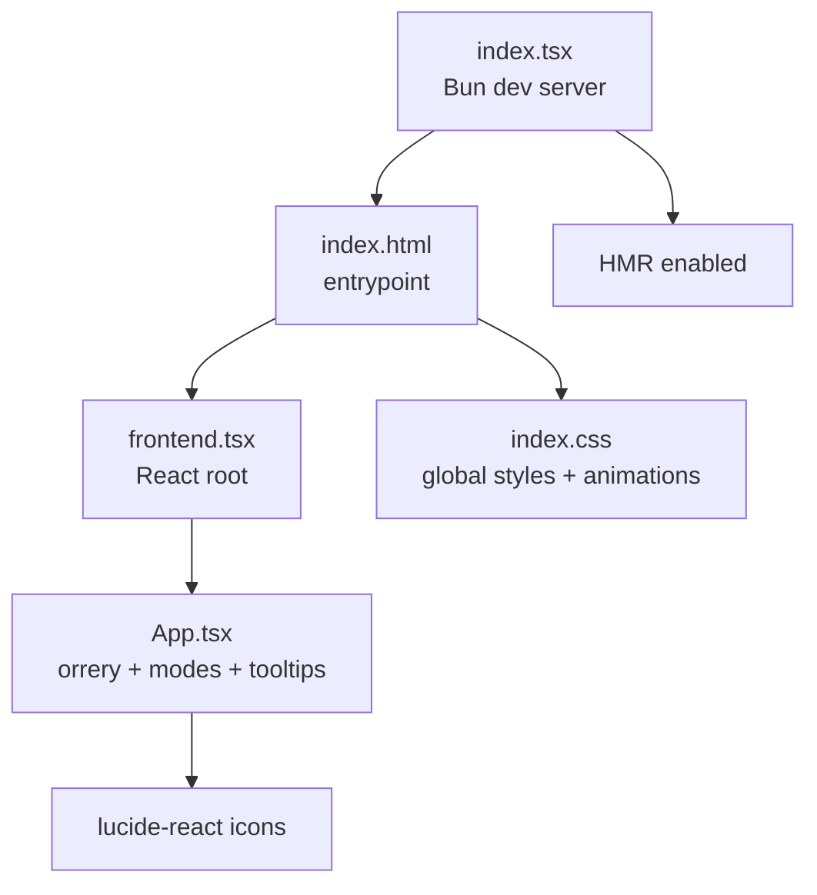
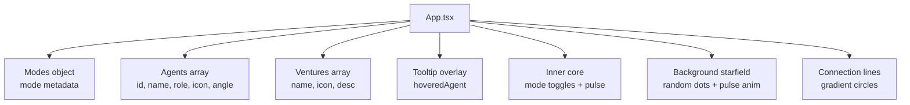
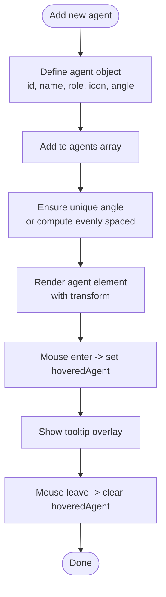
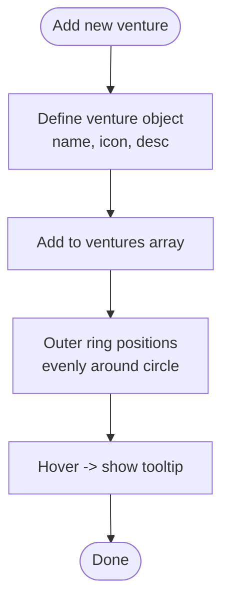
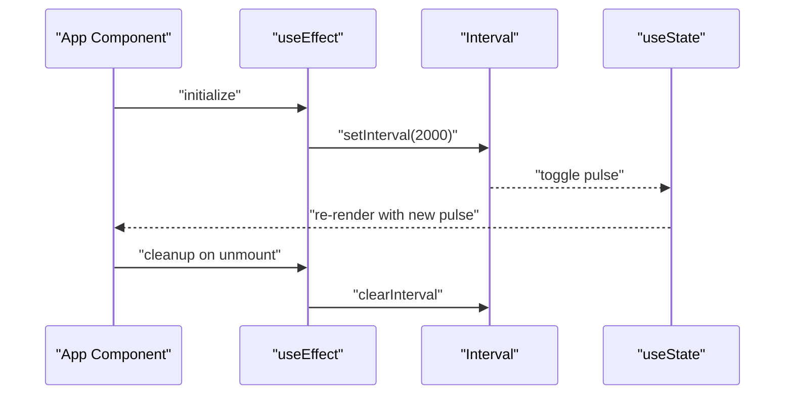
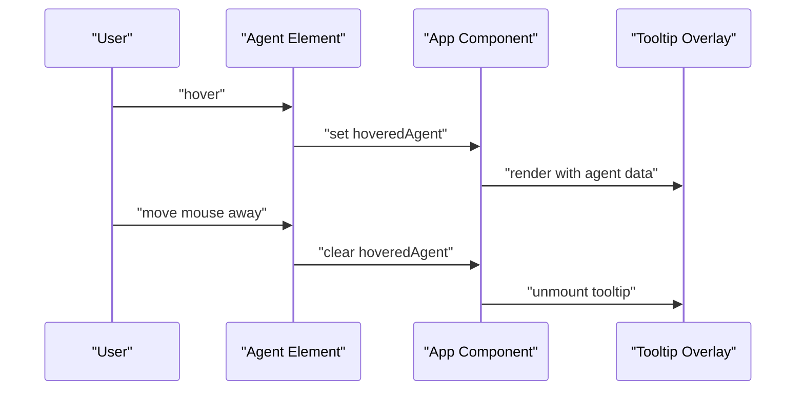
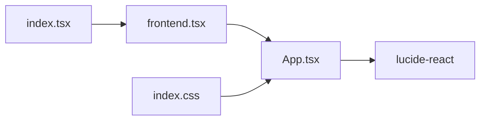

# Component Development

<cite>
**Referenced Files in This Document**
- [AB/conceptual.md](file://AB/conceptual.md)
- [src/App.tsx](file://src/App.tsx)
- [src/frontend.tsx](file://src/frontend.tsx)
- [src/index.tsx](file://src/index.tsx)
- [src/index.css](file://src/index.css)
- [src/APITester.tsx](file://src/APITester.tsx)
- [package.json](file://package.json)
- [README.md](file://README.md)
</cite>

## Table of Contents
1. [Introduction](#introduction)
2. [Project Structure](#project-structure)
3. [Core Components](#core-components)
4. [Architecture Overview](#architecture-overview)
5. [Detailed Component Analysis](#detailed-component-analysis)
6. [Dependency Analysis](#dependency-analysis)
7. [Performance Considerations](#performance-considerations)
8. [Troubleshooting Guide](#troubleshooting-guide)
9. [Conclusion](#conclusion)
10. [Appendices](#appendices)

## Introduction
This document explains how to create and modify UI components for the cognitive-aware agent dashboard, focusing on extending the orrery visualization to include new C-suite agents and ventures. It covers the required data structures, React component hierarchy, React hooks for state and effects, styling with Tailwind CSS, accessibility, composition patterns, and performance optimization for animated elements. It also provides troubleshooting guidance for common issues such as incorrect polar coordinate positioning and hot module reloading.

## Project Structure
The project is a React application served by a Bun-based static server. The primary UI is defined in a single component that renders the orrery visualization, mode toggles, tooltips, and decorative elements. Hot Module Replacement (HMR) is enabled during development.

**Diagram sources**
- [src/frontend.tsx](file://src/frontend.tsx#L1-L27)
- [src/App.tsx](file://src/App.tsx#L1-L206)
- [src/index.tsx](file://src/index.tsx#L1-L42)
- [src/index.css](file://src/index.css#L1-L188)

**Section sources**
- [src/frontend.tsx](file://src/frontend.tsx#L1-L27)
- [src/App.tsx](file://src/App.tsx#L1-L206)
- [src/index.tsx](file://src/index.tsx#L1-L42)
- [src/index.css](file://src/index.css#L1-L188)
- [package.json](file://package.json#L1-L31)
- [README.md](file://README.md#L1-L22)

## Core Components
- App: Central component rendering the orrery visualization, mode toggles, tooltips, and decorative elements. It manages:
  - activeMode: current operational mode (Executive, Technical, Creative)
  - hoveredAgent: currently hovered agent for tooltip
  - pulse: periodic scaling animation for the central brain icon
- APITester: A reusable form component for testing endpoints, demonstrating controlled inputs and state updates.
- frontend.tsx: React root that conditionally enables HMR during development.
- index.tsx: Development server that serves index.html and enables HMR.

Key data structures:
- Modes: An object mapping mode keys to metadata (color, background, border, icon, description).
- Agents: Array of agent objects with id, name, role, icon, and angle.
- Ventures: Array of venture objects with name, icon, and description.

Hooks:
- useState: activeMode, hoveredAgent, pulse
- useEffect: periodic pulse animation

Styling:
- Tailwind utility classes for layout, colors, shadows, transitions, and responsive adjustments.
- Global CSS defines base styles and prefers-reduced-motion support.

Accessibility:
- Semantic HTML and aria-friendly interactions are present; consider adding explicit ARIA roles and labels for interactive elements.

**Section sources**
- [src/App.tsx](file://src/App.tsx#L1-L206)
- [src/APITester.tsx](file://src/APITester.tsx#L1-L40)
- [src/frontend.tsx](file://src/frontend.tsx#L1-L27)
- [src/index.tsx](file://src/index.tsx#L1-L42)
- [src/index.css](file://src/index.css#L1-L188)

## Architecture Overview
The dashboard composes a layered orrery visualization:
- Outer ring: Ventures positioned around the perimeter using polar transforms.
- Middle ring: C-suite agents positioned around a smaller circle.
- Inner core: Cognitive interface with mode-dependent styling and a pulsing brain icon.
- Decorative elements: Starfield background, connection lines, and informational panels.

**Diagram sources**
- [src/App.tsx](file://src/App.tsx#L1-L206)

## Detailed Component Analysis

### Extending the Orrery: Adding New C-Suite Agents
To add a new C-suite agent:
1. Add a new agent object to the agents array with:
   - id: unique identifier
   - name: human-readable name
   - role: job title or function
   - icon: Lucide icon component
   - angle: rotation angle in degrees for polar placement
2. Ensure the angle is unique and distributes evenly around the circle. For n agents, angles can be 360/n * i.
3. Verify the middle ring radius and transform calculations remain consistent.

Positioning logic:
- Agents are placed using a combination of rotate and translateY transforms around the center. The angle determines the rotation around the center; the translateY moves the element outward along the radius.

Tooltip integration:
- The tooltip appears when hoveredAgent is truthy. The tooltip displays the agent’s icon, name, role, and a progress indicator.

Mode switching:
- Mode toggles update activeMode, which controls border, background, and color classes on the inner core.

Pulse animation:
- A periodic effect toggles the pulse state, causing the brain icon to scale and change opacity.

**Diagram sources**
- [src/App.tsx](file://src/App.tsx#L1-L206)

**Section sources**
- [src/App.tsx](file://src/App.tsx#L1-L206)

### Extending the Orrery: Adding New Ventures
To add a new venture:
1. Add a new venture object to the ventures array with:
   - name: unique identifier and label
   - icon: Lucide icon component
   - desc: short description
2. The outer ring computes positions as 360°/n rotations around the circle. Ensure the number of ventures matches the intended spacing.

Tooltip behavior:
- Each venture item includes a group-hover-triggered tooltip with name and description.

**Diagram sources**
- [src/App.tsx](file://src/App.tsx#L1-L206)

**Section sources**
- [src/App.tsx](file://src/App.tsx#L1-L206)

### React Hooks: useState and useEffect
- useState:
  - activeMode: controls mode-dependent styling and description
  - hoveredAgent: drives tooltip visibility and content
  - pulse: toggled periodically for animation
- useEffect:
  - Sets up a recurring interval to toggle pulse, cleaning up on unmount

**Diagram sources**
- [src/App.tsx](file://src/App.tsx#L1-L206)

**Section sources**
- [src/App.tsx](file://src/App.tsx#L1-L206)

### Tooltips and Pulse Animations (from AB/conceptual.md)
- Tooltips:
  - Floating tooltip appears to the right of the orrery when an agent is hovered.
  - Uses group-hover on the agent container to reveal a child tooltip element.
- Pulse animation:
  - Periodic scaling and opacity changes on the brain icon inside the inner core.

**Diagram sources**
- [AB/conceptual.md](file://AB/conceptual.md#L1-L205)
- [src/App.tsx](file://src/App.tsx#L1-L206)

**Section sources**
- [AB/conceptual.md](file://AB/conceptual.md#L1-L205)
- [src/App.tsx](file://src/App.tsx#L1-L206)

### Styling Practices with Tailwind CSS
- Layout and responsiveness:
  - Flexbox and grid utilities for alignment and spacing
  - Relative sizing (e.g., w-[600px], h-[600px]) for the orrery container
  - Responsive adjustments via breakpoint utilities
- State-based visuals:
  - hover variants for scale, border, and text color changes
  - active and focus variants for interactive feedback
- Motion preferences:
  - prefers-reduced-motion media query disables animations for sensitive users
- Composition:
  - Combine utility classes for borders, backgrounds, shadows, and transitions
  - Use z-index to layer elements (tooltip behind core, agents above core)

Best practices:
- Prefer utility-first composition over custom CSS
- Use semantic class names for readability
- Keep animation durations reasonable for performance

**Section sources**
- [src/App.tsx](file://src/App.tsx#L1-L206)
- [src/index.css](file://src/index.css#L1-L188)

### Accessibility Considerations
- Keyboard navigation:
  - Ensure interactive elements are focusable and operable via keyboard
- ARIA attributes:
  - Consider aria-labels for icons and role descriptions for interactive containers
- Contrast and readability:
  - Maintain sufficient contrast for text and tooltips
- Motion sensitivity:
  - Respect prefers-reduced-motion by disabling or minimizing animations

[No sources needed since this section provides general guidance]

### Component Composition Patterns
- Container components:
  - App holds state and passes props downward
- Presentational components:
  - Individual agent and venture items render icon and text
- Reusable utilities:
  - APITester demonstrates controlled form handling and state updates
- Conditional rendering:
  - Tooltip appears only when hoveredAgent is set
- Composition of transforms:
  - Rotate then translate to achieve polar coordinates

**Section sources**
- [src/App.tsx](file://src/App.tsx#L1-L206)
- [src/APITester.tsx](file://src/APITester.tsx#L1-L40)

### Performance Optimization for Animated Elements
- Minimize reflows:
  - Use transform and opacity for animations
  - Avoid layout-affecting properties
- Reduce DOM nodes:
  - Reuse icons and shared tooltip structure
- Efficient intervals:
  - Keep intervals coarse-grained (e.g., 2s) to reduce CPU usage
- Prefer reduced motion:
  - Disable or simplify animations under prefers-reduced-motion
- Virtualization:
  - For large datasets, consider virtualizing lists or limiting rendered items

**Section sources**
- [src/App.tsx](file://src/App.tsx#L1-L206)
- [src/index.css](file://src/index.css#L1-L188)

## Dependency Analysis
External dependencies:
- lucide-react: Iconography used throughout the dashboard
- Development server: Bun-based server with HMR enabled in development

Internal dependencies:
- frontend.tsx renders App
- App composes icons, modes, agents, and ventures
- index.tsx serves index.html and enables HMR

**Diagram sources**
- [src/frontend.tsx](file://src/frontend.tsx#L1-L27)
- [src/App.tsx](file://src/App.tsx#L1-L206)
- [src/index.tsx](file://src/index.tsx#L1-L42)
- [src/index.css](file://src/index.css#L1-L188)

**Section sources**
- [package.json](file://package.json#L1-L31)
- [src/frontend.tsx](file://src/frontend.tsx#L1-L27)
- [src/App.tsx](file://src/App.tsx#L1-L206)
- [src/index.tsx](file://src/index.tsx#L1-L42)
- [src/index.css](file://src/index.css#L1-L188)

## Performance Considerations
- Keep animations lightweight (transform/opacity only)
- Limit the number of animated elements
- Debounce or throttle hover handlers if needed
- Avoid unnecessary re-renders by memoizing derived values
- Use CSS animations where possible for smoother performance

[No sources needed since this section provides general guidance]

## Troubleshooting Guide
Common issues and resolutions:
- Incorrect positioning in polar coordinates:
  - Verify the angle values and ensure they match the intended distribution
  - Confirm the transform order: rotate around center, then translate outward, then reverse rotation
- Broken hot module reloading:
  - Ensure the development server has HMR enabled
  - Check that frontend.tsx uses import.meta.hot to persist the root instance
  - Confirm the server route serves index.html for all unmatched routes
- Tooltip not appearing:
  - Ensure hoveredAgent is set on mouseEnter and cleared on mouseLeave
  - Verify the tooltip condition checks for a truthy hoveredAgent
- Animation not playing:
  - Confirm the interval is set and cleaned up on unmount
  - Check prefers-reduced-motion media query behavior

**Section sources**
- [src/App.tsx](file://src/App.tsx#L1-L206)
- [src/frontend.tsx](file://src/frontend.tsx#L1-L27)
- [src/index.tsx](file://src/index.tsx#L1-L42)
- [src/index.css](file://src/index.css#L1-L188)

## Conclusion
The dashboard’s orrery visualization is built around a clean React component structure with clear state management and Tailwind-driven styling. Extending it involves adding new agent or venture entries with precise polar coordinates, integrating hover-based tooltips, and leveraging mode toggles and periodic animations. Following the outlined patterns ensures maintainability, accessibility, and performance.

[No sources needed since this section summarizes without analyzing specific files]

## Appendices
- Development commands:
  - Install dependencies and start the development server as described in the repository’s README
- API testing:
  - The APITester component demonstrates controlled form handling and response display

**Section sources**
- [README.md](file://README.md#L1-L22)
- [src/APITester.tsx](file://src/APITester.tsx#L1-L40)