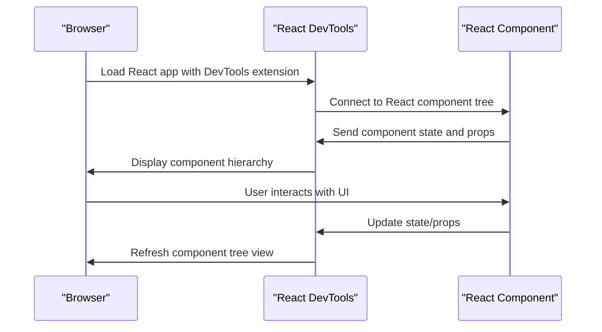
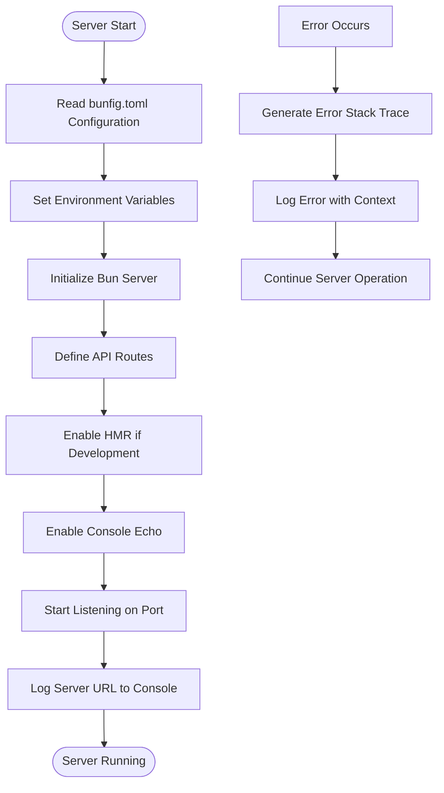
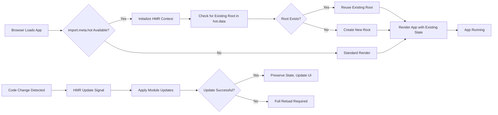
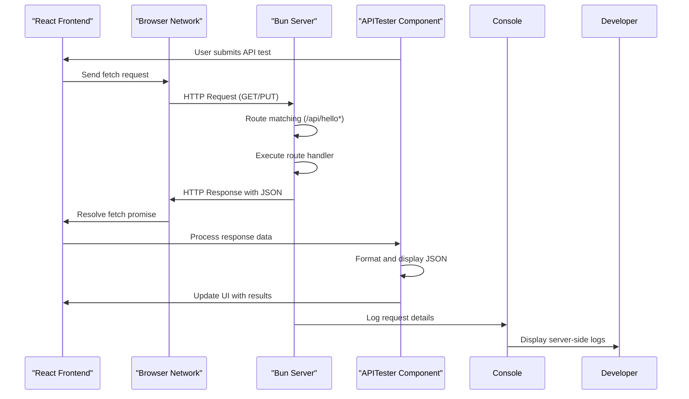
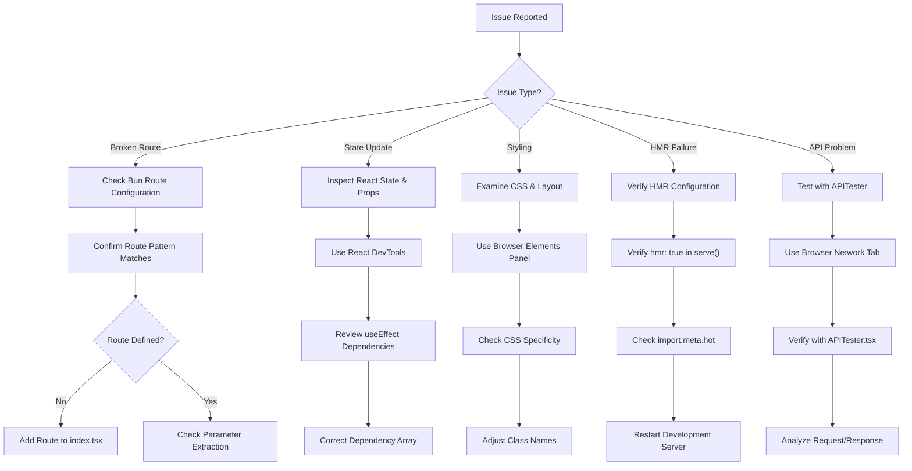
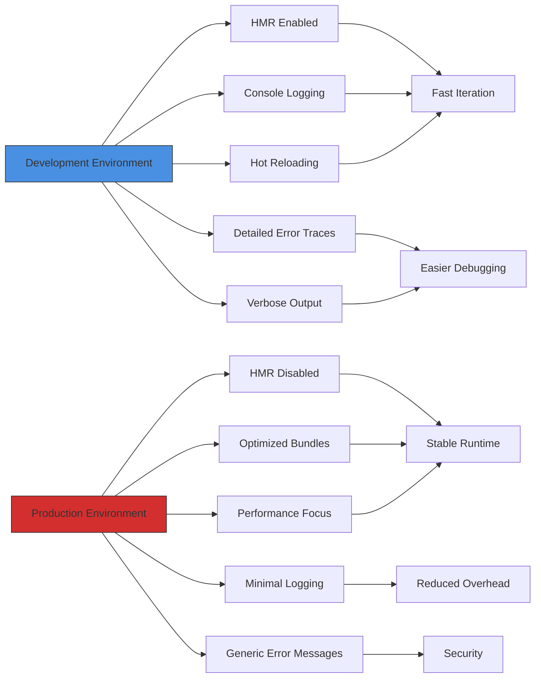
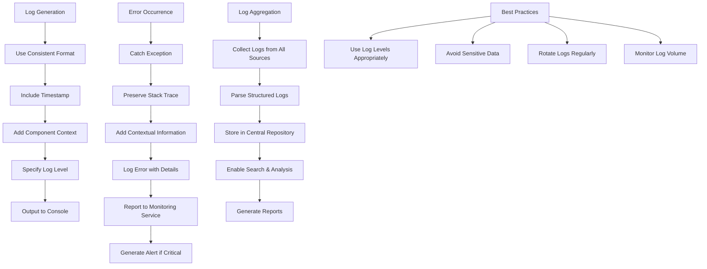

# Debugging Approaches

<cite>
**Referenced Files in This Document**   
- [conceptual.md](file://AB/conceptual.md)
- [index.tsx](file://src/index.tsx)
- [frontend.tsx](file://src/frontend.tsx)
- [App.tsx](file://src/App.tsx)
- [APITester.tsx](file://src/APITester.tsx)
- [bunfig.toml](file://bunfig.toml)
- [package.json](file://package.json)
- [README.md](file://README.md)
</cite>

## Table of Contents
1. [Introduction](#introduction)
2. [Browser-Based Debugging with DevTools](#browser-based-debugging-with-devtools)
3. [Server-Side Debugging with Bun](#server-side-debugging-with-bun)
4. [Hot Module Reloading Diagnostics](#hot-module-reloading-diagnostics)
5. [Frontend-Backend Data Flow Tracing](#frontend-backend-data-flow-tracing)
6. [Common Issues Troubleshooting](#common-issues-troubleshooting)
7. [Development vs Production Debugging](#development-vs-production-debugging)
8. [Logging and Error Monitoring Best Practices](#logging-and-error-monitoring-best-practices)
9. [Conclusion](#conclusion)

## Introduction
This document provides comprehensive guidance on debugging techniques for full-stack development using Bun and React within the cognitive-aware agent system. The focus is on practical approaches for identifying and resolving issues across both frontend and backend components, with specific attention to the unique characteristics of the Bun runtime and React's component-based architecture. The system represents a cognitive-aware autonomous agent operating system with a visually rich React interface and a high-performance Bun server backend.

## Browser-Based Debugging with DevTools
Debugging React applications effectively requires leveraging browser developer tools to inspect component state, props, and UI rendering behavior. The React DevTools extension provides a hierarchical view of the component tree, allowing developers to examine the current state and props of each component in real-time. For the cognitive-aware agent interface, this is particularly useful for monitoring state changes in the App component, such as the activeMode, hoveredAgent, and pulse states that control the visual behavior of the agent orrery.

When investigating UI rendering issues, the browser's Elements panel enables inspection of the DOM structure and CSS styles applied to each element. This is critical for diagnosing styling problems in the complex layered interface with rotating elements and animated transitions. The Console panel captures client-side errors, warnings, and console.log statements from the React application, providing immediate feedback during development. Performance profiling tools can also be used to analyze rendering performance, especially for animations and transitions in the agent visualization.

**Diagram sources**
- [App.tsx](file://src/App.tsx#L19-L206)
- [conceptual.md](file://AB/conceptual.md#L19-L205)

**Section sources**
- [App.tsx](file://src/App.tsx#L19-L206)
- [conceptual.md](file://AB/conceptual.md#L19-L205)

## Server-Side Debugging with Bun
Bun provides built-in debugging capabilities that streamline server-side development and troubleshooting. The server implementation in index.tsx uses Bun's native serve function with integrated console.log support, which echoes browser console logs to the server output when enabled. This bidirectional logging capability allows developers to trace issues across the full stack from a single terminal interface.

Error stack traces in Bun are optimized for clarity and performance, providing detailed information about the source of exceptions in server routes. The development configuration in index.tsx explicitly enables console output, making it easier to debug API endpoints like /api/hello and /api/hello/:name. When an error occurs in a route handler, Bun provides comprehensive stack traces that include the exact line number and file location, facilitating rapid identification and resolution of issues.

**Diagram sources**
- [index.tsx](file://src/index.tsx#L4-L41)
- [bunfig.toml](file://bunfig.toml#L1-L17)

**Section sources**
- [index.tsx](file://src/index.tsx#L4-L41)
- [bunfig.toml](file://bunfig.toml#L1-L17)

## Hot Module Reloading Diagnostics
The import.meta.hot API in frontend.tsx enables Hot Module Reloading (HMR) for a seamless development experience, but issues can arise when HMR fails to update components correctly. The implementation in frontend.tsx uses import.meta.hot.data to persist the React root across module reloads, preventing unnecessary re-renders and state loss. When diagnosing HMR issues, developers should verify that the development server is properly configured with hmr: true in the Bun serve options.

Common HMR problems include stale state persistence, where component state doesn't update as expected after code changes, and module initialization errors, where the hot module replacement process fails to properly initialize updated code. The conditional logic in frontend.tsx checks for import.meta.hot availability, ensuring that the application falls back to standard rendering in production environments where HMR is not available. Monitoring the console for HMR-related messages can help identify connection issues between the development server and browser.

**Diagram sources**
- [frontend.tsx](file://src/frontend.tsx#L19-L26)
- [index.tsx](file://src/index.tsx#L32-L38)

**Section sources**
- [frontend.tsx](file://src/frontend.tsx#L19-L26)
- [index.tsx](file://src/index.tsx#L32-L38)

## Frontend-Backend Data Flow Tracing
Tracing data flow between frontend and backend components is essential for understanding and debugging API interactions. The APITester component provides a built-in tool for testing API endpoints, allowing developers to send requests to /api/hello and /api/hello/:name endpoints and inspect the responses. This component captures both successful responses and error conditions, displaying them in a formatted JSON output for easy analysis.

To trace the complete request/response cycle, developers can use the browser's Network tab to monitor HTTP requests, examining headers, payloads, and timing information. On the server side, Bun's integrated logging captures incoming requests and responses, providing a server-side perspective on the same interactions. By correlating client-side network data with server-side logs, developers can identify bottlenecks, serialization issues, or unexpected behavior in the data flow.

**Diagram sources**
- [APITester.tsx](file://src/APITester.tsx#L3-L39)
- [index.tsx](file://src/index.tsx#L9-L29)

**Section sources**
- [APITester.tsx](file://src/APITester.tsx#L3-L39)
- [index.tsx](file://src/index.tsx#L9-L29)

## Common Issues Troubleshooting
This section addresses systematic approaches to resolving frequent development challenges in the Bun and React stack. For broken routes, verify that the route patterns in the Bun server configuration match the requested URLs, paying attention to parameter syntax like /api/hello/:name. Incorrect state updates in React components can often be traced to improper useEffect dependencies or missing dependency arrays, which can be identified using React DevTools' render profiling features.

Styling issues in the complex UI may result from CSS specificity conflicts or incorrect class name applications. The layered design with absolute positioning and transforms requires careful inspection of computed styles and layout metrics. When troubleshooting HMR failures, check that the development server is running with HMR enabled and that there are no syntax errors preventing module updates. For API connectivity problems, verify that the Bun server is running and that CORS policies are not blocking requests.

**Diagram sources**
- [index.tsx](file://src/index.tsx#L5-L30)
- [App.tsx](file://src/App.tsx#L24-L27)
- [APITester.tsx](file://src/APITester.tsx#L6-L22)

**Section sources**
- [index.tsx](file://src/index.tsx#L5-L30)
- [App.tsx](file://src/App.tsx#L24-L27)
- [APITester.tsx](file://src/APITester.tsx#L6-L22)

## Development vs Production Debugging
Debugging strategies differ significantly between development and production environments due to configuration and optimization differences. In development, Bun enables HMR and console logging by default, providing extensive visibility into application behavior. The bunfig.toml configuration sets NODE_ENV to "development" and enables comprehensive logging, facilitating rapid iteration and issue identification.

In production, these debugging features are typically disabled to optimize performance and security. The server runs with hmr: false and reduced logging, requiring alternative approaches for issue diagnosis. Production debugging relies more heavily on structured logging, error monitoring services, and post-mortem analysis of error reports. The transition between environments should be tested thoroughly, as issues may appear only in production due to different optimization levels or configuration settings.

**Diagram sources**
- [bunfig.toml](file://bunfig.toml#L15-L17)
- [index.tsx](file://src/index.tsx#L32-L38)
- [package.json](file://package.json#L13-L18)

**Section sources**
- [bunfig.toml](file://bunfig.toml#L15-L17)
- [index.tsx](file://src/index.tsx#L32-L38)
- [package.json](file://package.json#L13-L18)

## Logging and Error Monitoring Best Practices
Effective logging and error monitoring are critical for maintaining the reliability of the cognitive-aware agent system. Structured logging with consistent formatting enables easier parsing and analysis of log data. The Bun server's integrated console.log functionality should be used with descriptive messages that include context such as timestamp, component name, and operation type.

For error monitoring, implement comprehensive try-catch blocks around asynchronous operations, particularly in API handlers and data fetching functions. The APITester component demonstrates proper error handling by catching exceptions and displaying them in the UI. In production, integrate with error tracking services that can aggregate and alert on exceptions, providing visibility into issues that may not be immediately apparent to users.

**Diagram sources**
- [index.tsx](file://src/index.tsx#L41)
- [APITester.tsx](file://src/APITester.tsx#L19-L21)
- [package.json](file://package.json#L16-L17)

**Section sources**
- [index.tsx](file://src/index.tsx#L41)
- [APITester.tsx](file://src/APITester.tsx#L19-L21)
- [package.json](file://package.json#L16-L17)

## Conclusion
Effective debugging in the Bun and React full-stack environment requires a comprehensive approach that leverages both browser-based tools and server-side capabilities. By understanding the specific debugging features of Bun, including its integrated console logging and HMR implementation, developers can efficiently diagnose and resolve issues across the entire stack. The combination of React DevTools for frontend inspection, built-in API testing components, and structured logging practices creates a robust debugging ecosystem for the cognitive-aware agent system. Adhering to best practices in logging and error monitoring ensures that issues can be identified and resolved quickly, maintaining the reliability and performance of the application in both development and production environments.