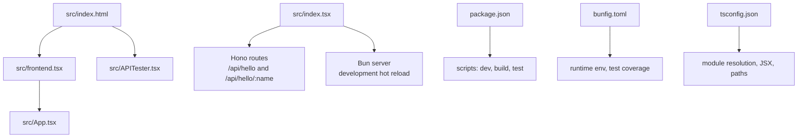
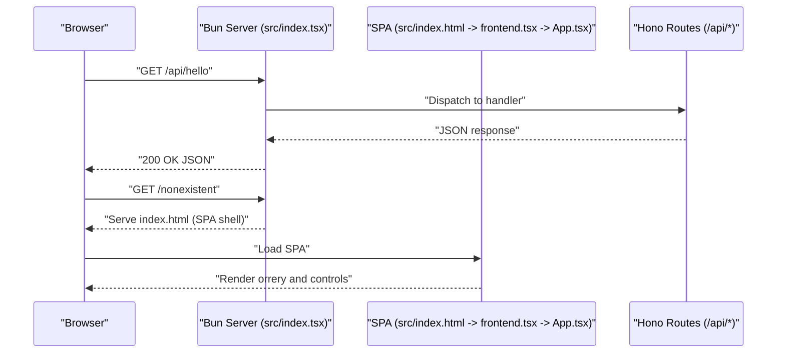
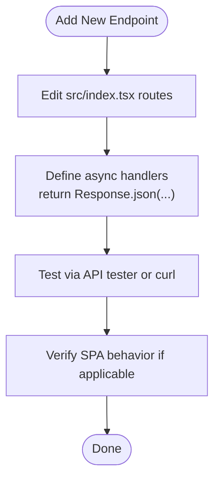
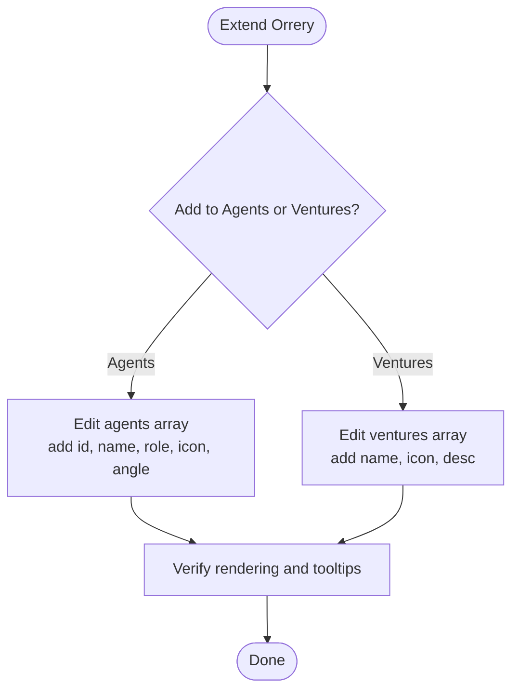
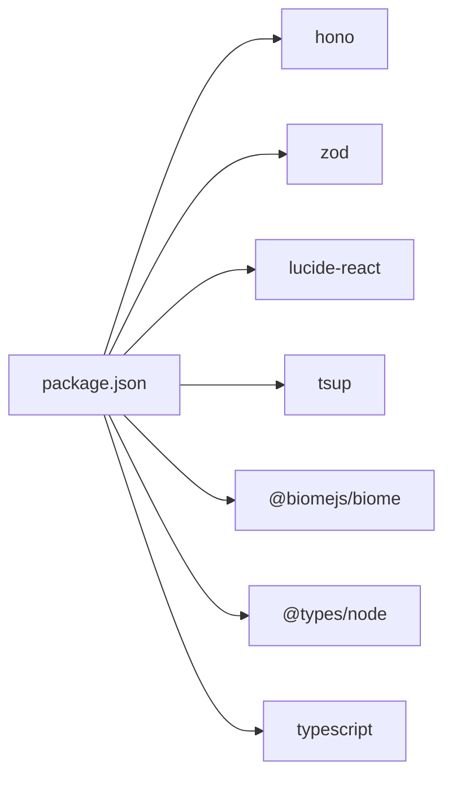

# Development Guide

<cite>
**Referenced Files in This Document**
- [src/index.tsx](file://src/index.tsx)
- [src/App.tsx](file://src/App.tsx)
- [src/frontend.tsx](file://src/frontend.tsx)
- [src/APITester.tsx](file://src/APITester.tsx)
- [src/index.html](file://src/index.html)
- [package.json](file://package.json)
- [bunfig.toml](file://bunfig.toml)
- [tsconfig.json](file://tsconfig.json)
</cite>

## Table of Contents
1. [Introduction](#introduction)
2. [Project Structure](#project-structure)
3. [Core Components](#core-components)
4. [Architecture Overview](#architecture-overview)
5. [Detailed Component Analysis](#detailed-component-analysis)
6. [Dependency Analysis](#dependency-analysis)
7. [Performance Considerations](#performance-considerations)
8. [Troubleshooting Guide](#troubleshooting-guide)
9. [Conclusion](#conclusion)
10. [Appendices](#appendices)

## Introduction
This development guide explains how to extend and modify the codebase, focusing on:
- Developing new components and extending existing features
- Creating additional API endpoints using Hono route definitions
- Adding new C-suite agents or ventures to the orrery visualization
- Testing strategies for frontend components and backend endpoints
- Build process using tsup and Bun’s native bundler
- Debugging approaches for full-stack development
- Best practices for organizing code within the monorepo structure

## Project Structure
The project is a Bun-based full-stack application with a React frontend and a lightweight Hono-based HTTP server. Key files:
- Backend server and routes: src/index.tsx
- Frontend entry and root rendering: src/frontend.tsx
- Application UI and orrery visualization: src/App.tsx
- API tester UI: src/APITester.tsx
- HTML shell: src/index.html
- Build and scripts: package.json
- Bun runtime and test configuration: bunfig.toml
- TypeScript configuration: tsconfig.json

**Diagram sources**
- [src/index.html](file://src/index.html#L1-L14)
- [src/frontend.tsx](file://src/frontend.tsx#L1-L27)
- [src/App.tsx](file://src/App.tsx#L1-L206)
- [src/APITester.tsx](file://src/APITester.tsx#L1-L40)
- [src/index.tsx](file://src/index.tsx#L1-L42)
- [package.json](file://package.json#L1-L31)
- [bunfig.toml](file://bunfig.toml#L1-L17)
- [tsconfig.json](file://tsconfig.json#L1-L18)

**Section sources**
- [src/index.html](file://src/index.html#L1-L14)
- [src/frontend.tsx](file://src/frontend.tsx#L1-L27)
- [src/App.tsx](file://src/App.tsx#L1-L206)
- [src/APITester.tsx](file://src/APITester.tsx#L1-L40)
- [src/index.tsx](file://src/index.tsx#L1-L42)
- [package.json](file://package.json#L1-L31)
- [bunfig.toml](file://bunfig.toml#L1-L17)
- [tsconfig.json](file://tsconfig.json#L1-L18)

## Core Components
- Backend server and routes: Implements a Hono-based HTTP server with static fallback and two example endpoints (/api/hello and /api/hello/:name). Supports development hot module replacement and console bridging.
- Frontend entry: Creates the React root and mounts App; supports hot module reloading.
- App component: Renders the orrery visualization with C-suite agents and ventures, mode toggles, and informational overlays.
- API tester: Provides a simple UI to send GET/PUT requests to endpoints and display responses.
- Build and scripts: Uses tsup for bundling and Bun for dev/test/runtime.

Key responsibilities and entry points:
- Server routes: src/index.tsx
- Root rendering: src/frontend.tsx
- UI composition: src/App.tsx
- API testing UI: src/APITester.tsx
- HTML shell: src/index.html
- Scripts and tooling: package.json, bunfig.toml, tsconfig.json

**Section sources**
- [src/index.tsx](file://src/index.tsx#L1-L42)
- [src/frontend.tsx](file://src/frontend.tsx#L1-L27)
- [src/App.tsx](file://src/App.tsx#L1-L206)
- [src/APITester.tsx](file://src/APITester.tsx#L1-L40)
- [src/index.html](file://src/index.html#L1-L14)
- [package.json](file://package.json#L1-L31)
- [bunfig.toml](file://bunfig.toml#L1-L17)
- [tsconfig.json](file://tsconfig.json#L1-L18)

## Architecture Overview
The system runs a Bun server hosting a SPA. Requests not handled by explicit routes are served the SPA shell, enabling client-side routing. The frontend renders the orrery visualization and includes an API tester.

**Diagram sources**
- [src/index.tsx](file://src/index.tsx#L1-L42)
- [src/index.html](file://src/index.html#L1-L14)
- [src/frontend.tsx](file://src/frontend.tsx#L1-L27)
- [src/App.tsx](file://src/App.tsx#L1-L206)

## Detailed Component Analysis

### Backend API Extension with Hono
- Route definition pattern: Add new endpoints under the routes object in src/index.tsx. Use async handlers returning Response.json(...) for JSON responses.
- Parameterized routes: Use req.params for path parameters (see /api/hello/:name).
- HTTP methods: Define separate handlers for GET, PUT, POST, etc., as needed.
- Development mode: Hot module replacement and console bridging are enabled in development.

Workflow to add a new endpoint:
1. Open src/index.tsx.
2. Under the routes object, define a new path with desired HTTP methods.
3. Implement handler(s) returning Response.json(...) with structured data.
4. Test locally using the API tester UI or curl.

**Diagram sources**
- [src/index.tsx](file://src/index.tsx#L1-L42)
- [src/APITester.tsx](file://src/APITester.tsx#L1-L40)

**Section sources**
- [src/index.tsx](file://src/index.tsx#L1-L42)
- [src/APITester.tsx](file://src/APITester.tsx#L1-L40)

### Extending the Orrery Visualization
The orrery visualization is composed in src/App.tsx. To add new C-suite agents or ventures:
- Agents: Modify the agents array to include new agent entries with id, name, role, icon, and angle.
- Ventures: Modify the ventures array to include new venture entries with name, icon, and description.
- Styling and layout: Adjust CSS classes and transforms if you need different positioning or animations.

Data structure requirements:
- Agents: id (string), name (string), role (string), icon (React component), angle (number in degrees).
- Ventures: name (string), icon (React component), desc (string).

UI integration steps:
1. Open src/App.tsx.
2. Extend the arrays with new entries.
3. Verify rotation and tooltip behavior.
4. Optionally adjust CSS classes for spacing or hover effects.

**Diagram sources**
- [src/App.tsx](file://src/App.tsx#L1-L206)

**Section sources**
- [src/App.tsx](file://src/App.tsx#L1-L206)

### Frontend Component Development
- Root mounting: src/frontend.tsx creates the React root and renders App.
- Hot module replacement: Conditional hot rendering logic persists the root instance during development.
- API tester: src/APITester.tsx provides a form to select HTTP method and endpoint, then fetches and displays the response.

Best practices:
- Keep components declarative and state-driven.
- Use React hooks for lifecycle and state management.
- Leverage lucide-react icons consistently.

**Section sources**
- [src/frontend.tsx](file://src/frontend.tsx#L1-L27)
- [src/APITester.tsx](file://src/APITester.tsx#L1-L40)

### API Tester Workflow
- UI: Select HTTP method (GET/PUT), enter endpoint (default /api/hello), click Send.
- Behavior: Constructs URL from form data, fetches, parses JSON, and writes to textarea.
- Use this to validate new endpoints quickly.

**Section sources**
- [src/APITester.tsx](file://src/APITester.tsx#L1-L40)

## Dependency Analysis
External libraries and tooling:
- Hono: Lightweight web framework for routes and handlers.
- Zod: Schema validation library.
- lucide-react: Iconography for UI.
- Bun: Runtime, package manager, and test runner.
- tsup: Bundler for building the project.
- Biome: Linter/formatter.

**Diagram sources**
- [package.json](file://package.json#L1-L31)

**Section sources**
- [package.json](file://package.json#L1-L31)

## Performance Considerations
Build and optimization:
- tsup: Configure output targets and minification in tsup.config.js if present. Ensure production builds disable development features.
- Bun native bundling: Leverage Bun’s fast bundling and runtime for development and production.
- Source maps: Enable in development for debugging; disable or minimize in production.
- Asset optimization: Keep SVGs small; lazy-load heavy assets if needed.

Runtime and caching:
- Bun install cache and lockfile reduce cold-start times.
- Environment variables configured in bunfig.toml for runtime tuning.

**Section sources**
- [package.json](file://package.json#L1-L31)
- [bunfig.toml](file://bunfig.toml#L1-L17)

## Troubleshooting Guide
Common issues and resolutions:
- Server not starting: Ensure Bun is installed and PATH is configured. Run bun install and bun dev.
- API endpoints not responding: Verify route paths and handlers in src/index.tsx. Confirm development mode enables HMR and console bridging.
- SPA not rendering: Confirm src/index.html includes the script tag pointing to frontend.tsx and that frontend.tsx mounts App.
- Hot reload not working: Check development flag and HMR settings in src/index.tsx and bunfig.toml.
- Lint/format errors: Use biomes scripts defined in package.json.

Debugging approaches:
- Browser DevTools: Inspect network requests, console logs, and React DevTools.
- Bun runtime: Use Bun’s built-in debugging and logging. The server bridges browser console logs to the terminal in development.
- API tester: Use the built-in tester to isolate endpoint issues.

**Section sources**
- [src/index.tsx](file://src/index.tsx#L1-L42)
- [src/index.html](file://src/index.html#L1-L14)
- [src/frontend.tsx](file://src/frontend.tsx#L1-L27)
- [bunfig.toml](file://bunfig.toml#L1-L17)
- [package.json](file://package.json#L1-L31)

## Conclusion
This guide outlined how to extend the backend with new API endpoints, enhance the orrery visualization with new agents and ventures, and improve the developer experience with testing and debugging. By following the patterns shown in src/index.tsx and src/App.tsx, and leveraging Bun, tsup, and Biome, you can iteratively develop and ship features efficiently.

## Appendices

### A. Adding New API Endpoints (Step-by-step)
1. Open src/index.tsx.
2. Add a new route under the routes object.
3. Implement async handler(s) returning Response.json(...).
4. Test with the API tester UI or curl.
5. Commit and iterate.

**Section sources**
- [src/index.tsx](file://src/index.tsx#L1-L42)
- [src/APITester.tsx](file://src/APITester.tsx#L1-L40)

### B. Adding New C-Suite Agents or Ventures
1. Open src/App.tsx.
2. Extend the agents or ventures arrays with new entries.
3. Verify rendering and tooltips.
4. Adjust styles if needed.

**Section sources**
- [src/App.tsx](file://src/App.tsx#L1-L206)

### C. Build and Run Commands
- Install dependencies: bun install
- Development: bun dev
- Production build: bun run build
- Tests: bun test
- Lint: bun run lint
- Lint apply: bun run lint:apply

**Section sources**
- [package.json](file://package.json#L1-L31)

### D. Monorepo Organization Tips
- Keep shared logic in src/ and feature-specific additions in dedicated files.
- Use tsconfig paths for clean imports (baseUrl and paths).
- Group related components and utilities under logical folders if the project grows.

**Section sources**
- [tsconfig.json](file://tsconfig.json#L1-L18)