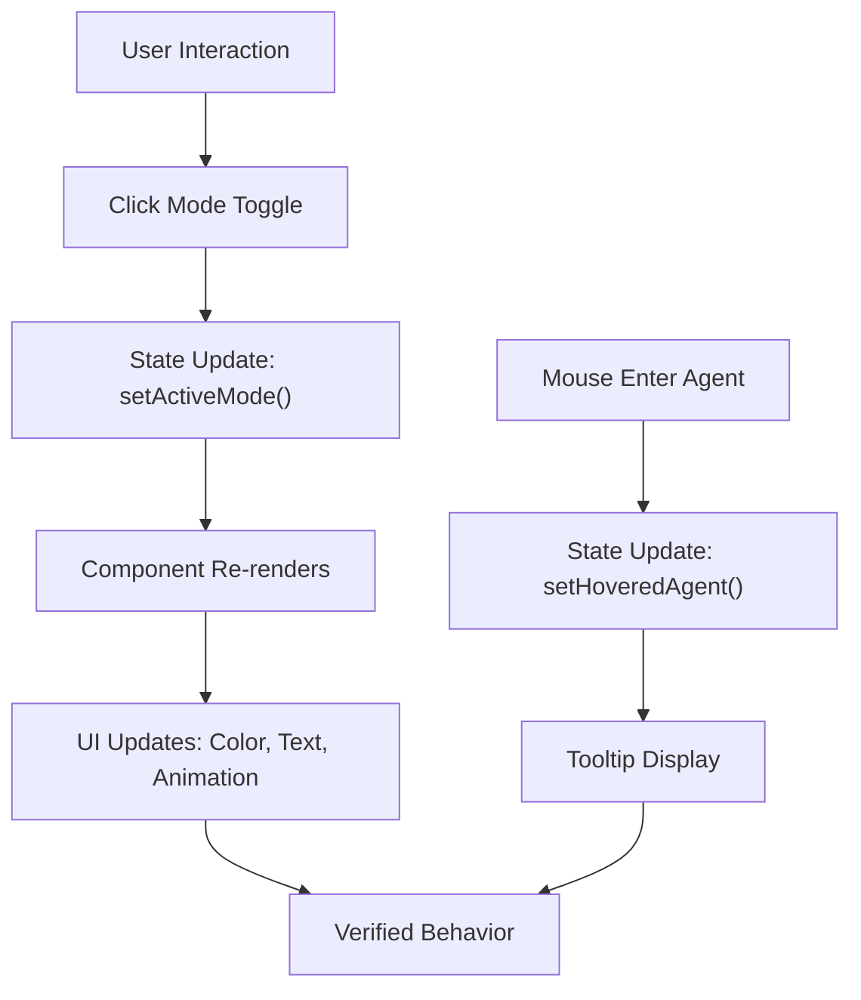
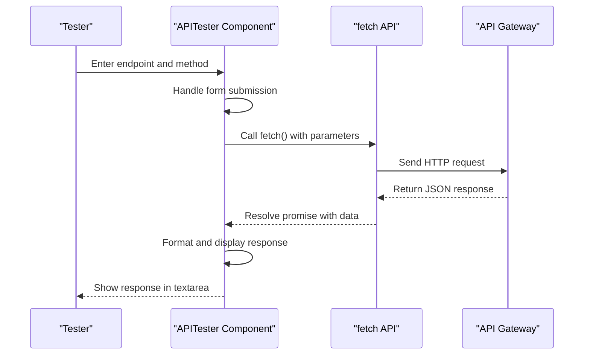
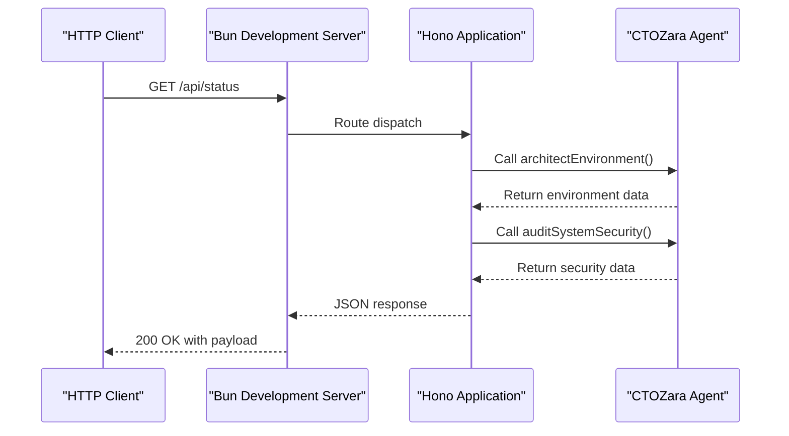
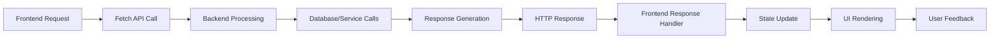

# Testing Strategies

<cite>
**Referenced Files in This Document**   
- [APITester.tsx](file://src/APITester.tsx)
- [App.tsx](file://src/App.tsx)
- [frontend.tsx](file://src/frontend.tsx)
- [server.ts](file://apps/api-gateway/server.ts)
- [zara.ts](file://packages/agents/c-suite/zara.ts)
- [package.json](file://package.json)
- [bunfig.toml](file://bunfig.toml)
- [tsconfig.json](file://tsconfig.json)
</cite>

## Table of Contents
1. [Introduction](#introduction)
2. [Frontend Testing Methodologies](#frontend-testing-methodologies)
3. [Backend Testing Methodologies](#backend-testing-methodologies)
4. [Integration Testing](#integration-testing)
5. [Troubleshooting Common Testing Issues](#troubleshooting-common-testing-issues)
6. [Test Organization and Automation Best Practices](#test-organization-and-automation-best-practices)

## Introduction
This document outlines comprehensive testing strategies for the cognitive-aware core system, covering both frontend and backend components. The system leverages modern React patterns with a Bun-based backend infrastructure, utilizing Hono for API routing and a monorepo structure for component organization. Testing approaches are designed to validate component behavior, API functionality, and integration points across the cognitive interface, including mode switching, agent interactions, and orrery animations.

## Frontend Testing Methodologies

The frontend testing strategy focuses on validating React component behavior, state transitions, and UI interactions within the cognitive-aware interface. The system uses React with TypeScript and leverages Bun's development server for hot module replacement (HMR) and fast refresh capabilities.

### Component Behavior Validation
React component behavior is validated through both automated and manual testing approaches. The `App.tsx` component manages the core cognitive interface with state variables for active mode, hovered agent, and pulsing animations. These state transitions can be tested by simulating user interactions and verifying the resulting UI changes.

**Diagram sources**
- [App.tsx](file://src/App.tsx#L20-L21)
- [App.tsx](file://src/App.tsx#L130-L140)

**Section sources**
- [App.tsx](file://src/App.tsx#L19-L206)

### APITester as a Test Harness
The `APITester.tsx` component serves as a practical test harness for frontend-backend integration testing. It provides a form interface to send HTTP requests to API endpoints and display responses, enabling manual verification of API functionality directly from the UI.

**Diagram sources**
- [APITester.tsx](file://src/APITester.tsx#L6-L22)
- [APITester.tsx](file://src/APITester.tsx#L24-L39)

**Section sources**
- [APITester.tsx](file://src/APITester.tsx#L1-L40)

### Manual Testing of Interactive Elements
Manual testing procedures are essential for validating complex UI interactions that are difficult to automate completely. Key interactive elements include:

- **Mode Switching**: Verify that clicking mode buttons (Executive, Technical, Creative) updates the active mode state and corresponding visual elements (colors, text, descriptions)
- **Agent Hover Effects**: Test that mouse enter/leave events on C-suite agent elements trigger tooltip displays and visual feedback (scaling, border color changes)
- **Orrery Animations**: Confirm that the rotating venture and agent rings maintain smooth animation performance and respond appropriately to system state changes

These manual tests should be performed across different browsers and screen sizes to ensure consistent behavior.

## Backend Testing Methodologies

Backend testing focuses on validating API endpoint functionality, route parameter handling, method-specific handlers, and error conditions using Bun's development server capabilities.

### API Endpoint Verification
API endpoints can be tested through direct HTTP requests using tools like curl, Postman, or the built-in APITester component. The Hono framework in `server.ts` defines routes that should be validated for correct response codes, headers, and payload structure.

**Diagram sources**
- [server.ts](file://apps/api-gateway/server.ts#L14-L27)
- [zara.ts](file://packages/agents/c-suite/zara.ts#L13-L20)

**Section sources**
- [server.ts](file://apps/api-gateway/server.ts#L1-L35)
- [zara.ts](file://packages/agents/c-suite/zara.ts#L1-L33)

### Route Parameter and Method Testing
Testing should verify that route parameters are correctly parsed and that method-specific handlers respond appropriately to different HTTP methods. The current implementation supports GET requests, but the testing framework should be prepared to validate other methods (PUT, POST, DELETE) as they are implemented.

Key test cases include:
- Validating that `/api/status` returns operational status with timestamp
- Confirming that `/api/agents/cto` returns security audit information
- Testing error conditions by requesting non-existent endpoints
- Verifying query parameter handling when implemented

### Error Condition Testing
Error handling should be tested by creating scenarios that trigger exception paths:
- Requesting invalid endpoints to verify 404 handling
- Sending malformed requests to test input validation
- Simulating agent service failures to ensure graceful degradation
- Testing timeout conditions and network interruptions

## Integration Testing

Integration testing ensures seamless interaction between frontend and backend components, with a focus on data flow and UI representation of API responses.

### Frontend-Backend Data Flow
The integration testing strategy validates that API responses are correctly processed and displayed in the UI components. This includes:

- Verifying that JSON responses from `/api/status` are properly formatted and displayed in the APITester component
- Ensuring error messages are captured and displayed when API requests fail
- Testing data transformation and formatting logic in the frontend
- Validating that loading states are properly represented during request processing

**Diagram sources**
- [APITester.tsx](file://src/APITester.tsx#L6-L22)
- [server.ts](file://apps/api-gateway/server.ts#L14-L27)

**Section sources**
- [APITester.tsx](file://src/APITester.tsx#L1-L40)
- [server.ts](file://apps/api-gateway/server.ts#L1-L35)

### State Synchronization Testing
Test cases should verify that application state remains synchronized across components:
- When API data updates, ensure relevant UI components re-render with new data
- Validate that error states are communicated consistently across the interface
- Test concurrent requests to ensure race conditions are properly handled
- Verify that loading states prevent duplicate submissions

## Troubleshooting Common Testing Issues

### CORS Issues
Cross-Origin Resource Sharing (CORS) issues may occur when testing APIs from the frontend. Solutions include:
- Configuring proper CORS headers in the Hono application
- Using Bun's development server proxy settings to avoid cross-origin requests
- Implementing CORS middleware in `server.ts` for development environments
- Setting appropriate origin headers during testing

### HMR Conflicts
Hot Module Replacement conflicts can interfere with testing:
- Clear browser cache and reload when HMR fails to update components
- Restart the Bun development server if HMR becomes unresponsive
- Verify that `import.meta.hot` is properly handled in `frontend.tsx`
- Check for syntax errors that prevent module replacement

### Stale Test Data
Stale data issues can lead to false test results:
- Implement proper cache invalidation strategies
- Use unique request identifiers for testing
- Clear local storage and session data between test runs
- Verify that API responses include current timestamps
- Refresh the APITester component state between requests

## Test Organization and Automation Best Practices

### Monorepo Test Structure
In the monorepo structure, tests should be organized by domain:
- Frontend tests in `src/__tests__` or co-located with components
- Backend tests in `apps/api-gateway/__tests__`
- Shared utility tests in `packages/` directories
- Integration tests in a dedicated `tests/integration` directory

### Automation Strategies
Leverage Bun's testing capabilities for automated test execution:
- Use `bun test` command for running test suites
- Configure test coverage in `bunfig.toml`
- Implement unit tests for isolated functions and components
- Create integration tests for critical user journeys
- Set up continuous testing in development workflow

### Testing Recommendations
- Write tests for all new features before implementation (test-driven development)
- Maintain a balance between unit, integration, and end-to-end tests
- Use the APITester component as a living documentation of API capabilities
- Regularly review and update tests as the system evolves
- Implement performance testing for critical animations and data processing
- Document test cases and expected outcomes for manual testing procedures