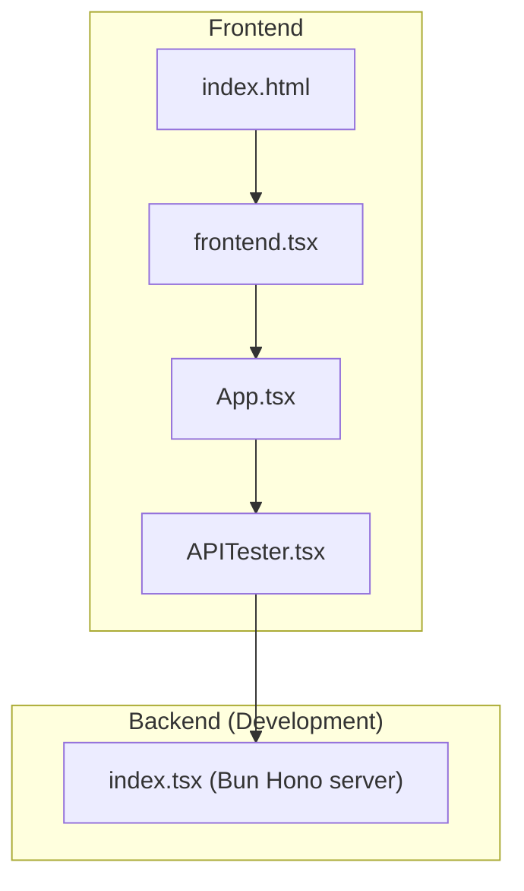
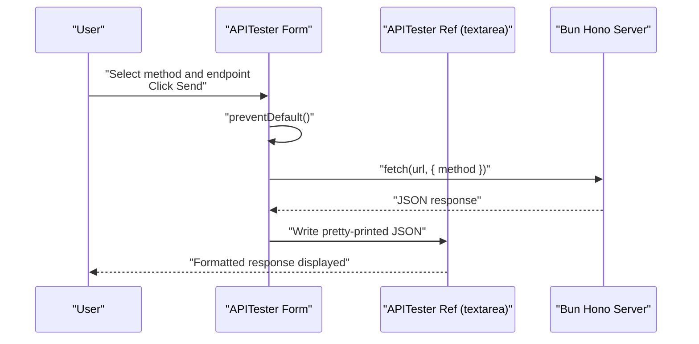
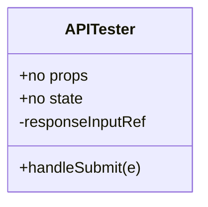
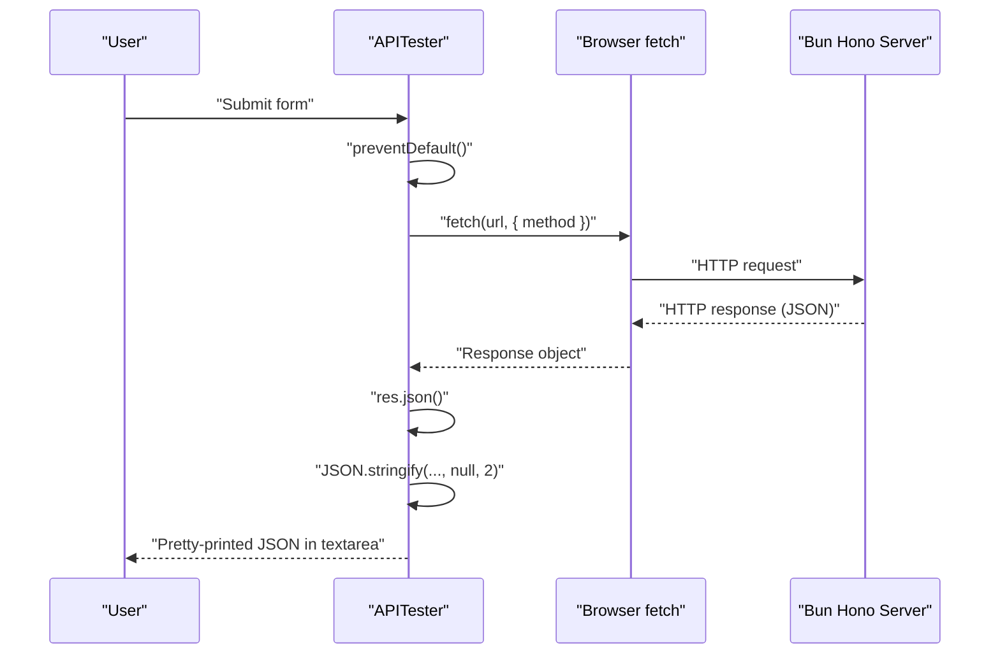
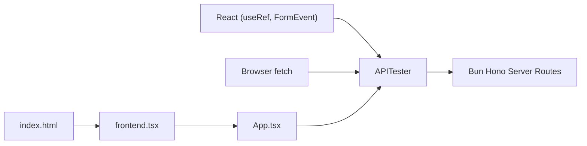

# API Tester Component

<cite>
**Referenced Files in This Document**
- [APITester.tsx](file://src/APITester.tsx)
- [index.tsx](file://src/index.tsx)
- [index.html](file://src/index.html)
- [frontend.tsx](file://src/frontend.tsx)
- [App.tsx](file://src/App.tsx)
- [package.json](file://package.json)
</cite>

## Table of Contents
1. [Introduction](#introduction)
2. [Project Structure](#project-structure)
3. [Core Components](#core-components)
4. [Architecture Overview](#architecture-overview)
5. [Detailed Component Analysis](#detailed-component-analysis)
6. [Dependency Analysis](#dependency-analysis)
7. [Performance Considerations](#performance-considerations)
8. [Security and CORS Considerations](#security-and-cors-considerations)
9. [Troubleshooting Guide](#troubleshooting-guide)
10. [Conclusion](#conclusion)

## Introduction
This document explains the APITester component that enables interactive testing of backend API endpoints. It focuses on how the component uses React refs to manage the response textarea, how form submission is handled with preventDefault behavior, and how asynchronous fetch operations are performed. It also documents the component’s props and state (none required as it is stateless), its integration with the browser’s fetch API, and the error handling strategy. Finally, it provides examples of testing different HTTP methods (GET, PUT) against endpoints such as /api/hello and /api/hello/:name, and explains how responses are formatted as pretty-printed JSON. Security considerations around cross-origin requests and CORS are addressed for different environments.

## Project Structure
The APITester component resides in the frontend React application and integrates with a local development server that exposes the API routes used for testing.

**Diagram sources**
- [index.html](file://src/index.html#L1-L14)
- [frontend.tsx](file://src/frontend.tsx#L1-L27)
- [App.tsx](file://src/App.tsx#L1-L206)
- [APITester.tsx](file://src/APITester.tsx#L1-L40)
- [index.tsx](file://src/index.tsx#L1-L42)

**Section sources**
- [index.html](file://src/index.html#L1-L14)
- [frontend.tsx](file://src/frontend.tsx#L1-L27)
- [App.tsx](file://src/App.tsx#L1-L206)
- [APITester.tsx](file://src/APITester.tsx#L1-L40)
- [index.tsx](file://src/index.tsx#L1-L42)

## Core Components
- APITester: A stateless React component that renders a small form to select an HTTP method and enter an endpoint, submits the form to trigger a fetch, and displays the response in a textarea. It uses a React ref to write the response text and relies on preventDefault to avoid page reloads during submission.
- Backend routes: A development server built with Bun and Hono that exposes two endpoints: /api/hello (with GET and PUT handlers) and /api/hello/:name (dynamic route).

Key characteristics:
- Stateless component with no internal state.
- Uses a ref to manage the response textarea element.
- Handles form submission with preventDefault.
- Performs asynchronous fetch operations against the development server.
- Displays responses as pretty-printed JSON.

**Section sources**
- [APITester.tsx](file://src/APITester.tsx#L1-L40)
- [index.tsx](file://src/index.tsx#L1-L42)

## Architecture Overview
The APITester component communicates with the development server using the browser’s fetch API. The server responds to predefined routes and methods, returning JSON payloads that the client formats and displays.

**Diagram sources**
- [APITester.tsx](file://src/APITester.tsx#L6-L22)
- [index.tsx](file://src/index.tsx#L9-L22)

## Detailed Component Analysis

### APITester Implementation
- Ref usage: A ref is attached to the textarea to programmatically update its value after a successful fetch.
- Form submission handling: The submit handler prevents the default form submission behavior to keep the page interactive.
- Asynchronous fetch: The handler constructs a URL from the endpoint field and the current location, then performs a fetch with the selected method.
- Response formatting: On success, the response body is parsed as JSON and written to the textarea as a pretty-printed string.
- Error handling: Any errors thrown during fetch or JSON parsing are caught and displayed as plain text in the textarea.

Props and state:
- Props: None.
- State: None (stateless).

Integration with fetch:
- The component uses the browser’s fetch API to communicate with the development server.
- The URL is constructed using the endpoint input and the current location, ensuring relative routing works correctly.

Endpoints and methods:
- GET /api/hello
- PUT /api/hello
- GET /api/hello/:name (dynamic route)

Pretty-printed JSON:
- Responses are formatted with indentation for readability.

**Section sources**
- [APITester.tsx](file://src/APITester.tsx#L1-L40)
- [index.tsx](file://src/index.tsx#L9-L29)

### Component Class Diagram

**Diagram sources**
- [APITester.tsx](file://src/APITester.tsx#L1-L40)

### API Workflow Sequence

**Diagram sources**
- [APITester.tsx](file://src/APITester.tsx#L6-L22)
- [index.tsx](file://src/index.tsx#L9-L22)

### Example Test Scenarios
- Method: GET, Endpoint: /api/hello
  - Expected behavior: The server returns a JSON payload with a message and method. The APITester displays the JSON formatted with indentation.
  - Reference: [index.tsx](file://src/index.tsx#L9-L16)
- Method: PUT, Endpoint: /api/hello
  - Expected behavior: The server returns a JSON payload with a message and method. The APITester displays the JSON formatted with indentation.
  - Reference: [index.tsx](file://src/index.tsx#L16-L21)
- Method: GET, Endpoint: /api/hello/:name
  - Expected behavior: The server returns a JSON payload with a greeting that includes the dynamic name parameter. The APITester displays the JSON formatted with indentation.
  - Reference: [index.tsx](file://src/index.tsx#L24-L29)

**Section sources**
- [index.tsx](file://src/index.tsx#L9-L29)
- [APITester.tsx](file://src/APITester.tsx#L6-L22)

## Dependency Analysis
- APITester depends on:
  - React (useRef, FormEvent)
  - Browser fetch API
  - The development server routes defined in index.tsx
- The frontend entry points (index.html, frontend.tsx, App.tsx) render the APITester component within the application shell.

**Diagram sources**
- [APITester.tsx](file://src/APITester.tsx#L1-L40)
- [index.tsx](file://src/index.tsx#L1-L42)
- [index.html](file://src/index.html#L1-L14)
- [frontend.tsx](file://src/frontend.tsx#L1-L27)
- [App.tsx](file://src/App.tsx#L1-L206)

**Section sources**
- [APITester.tsx](file://src/APITester.tsx#L1-L40)
- [index.tsx](file://src/index.tsx#L1-L42)
- [index.html](file://src/index.html#L1-L14)
- [frontend.tsx](file://src/frontend.tsx#L1-L27)
- [App.tsx](file://src/App.tsx#L1-L206)

## Performance Considerations
- Fetch latency: Network round-trip time affects perceived responsiveness. Keep endpoints lightweight for quick feedback.
- JSON parsing cost: Parsing large responses can be CPU-intensive. Consider streaming or pagination for very large datasets.
- UI updates: Writing to a textarea is generally inexpensive, but avoid frequent re-renders elsewhere in the app while testing.
- Development vs production: In development, the server runs locally; in production, network conditions and server capacity may differ.

[No sources needed since this section provides general guidance]

## Security and CORS Considerations
- Same-origin policy: When the APITester sends requests to the development server, they are same-origin because the frontend and backend share the same host/port during local development. No CORS headers are required.
- Cross-origin requests: If you deploy the frontend to a different origin than the backend, the backend must set appropriate CORS headers to allow the browser to accept responses. Without proper headers, browsers will block the request.
- Environment differences:
  - Local development: Likely same-origin; no CORS concerns.
  - Staging/Production: Configure the backend to include Access-Control-Allow-Origin and related headers as needed.
- Best practices:
  - Always validate and sanitize endpoint inputs on the backend.
  - Avoid exposing sensitive endpoints publicly.
  - Use HTTPS in production to protect credentials and payloads.

[No sources needed since this section provides general guidance]

## Troubleshooting Guide
Common issues and resolutions:
- Blank response or error text:
  - Cause: The fetch failed or JSON parsing threw an error.
  - Resolution: Check the endpoint path and method. Verify the server is running and reachable. Inspect the browser console for network errors.
  - Reference: [APITester.tsx](file://src/APITester.tsx#L16-L22)
- Unexpected CORS error:
  - Cause: Cross-origin request blocked by browser.
  - Resolution: Ensure the frontend and backend share the same origin during development, or configure CORS headers on the backend for production.
  - Reference: [index.tsx](file://src/index.tsx#L1-L42)
- Dynamic route not working:
  - Cause: Incorrect parameter usage or missing parameter in the URL.
  - Resolution: Confirm the endpoint follows the pattern /api/hello/:name and that the parameter is present.
  - Reference: [index.tsx](file://src/index.tsx#L24-L29)
- Server not running:
  - Cause: Development server not started or port changed.
  - Resolution: Start the development server using the configured script and ensure the routes are exposed.
  - Reference: [package.json](file://package.json#L12-L18)

**Section sources**
- [APITester.tsx](file://src/APITester.tsx#L16-L22)
- [index.tsx](file://src/index.tsx#L1-L42)
- [package.json](file://package.json#L12-L18)

## Conclusion
The APITester component provides a simple, interactive way to test backend endpoints using React and the browser’s fetch API. It is intentionally stateless, relying on a ref to manage the response display and preventDefault to keep the UI responsive. The development server exposes predictable endpoints for GET and PUT requests, enabling quick verification of API behavior. When deploying to production, pay close attention to CORS configuration to ensure cross-origin requests succeed. For best results, keep endpoints lightweight and validate inputs on the backend.

[No sources needed since this section summarizes without analyzing specific files]