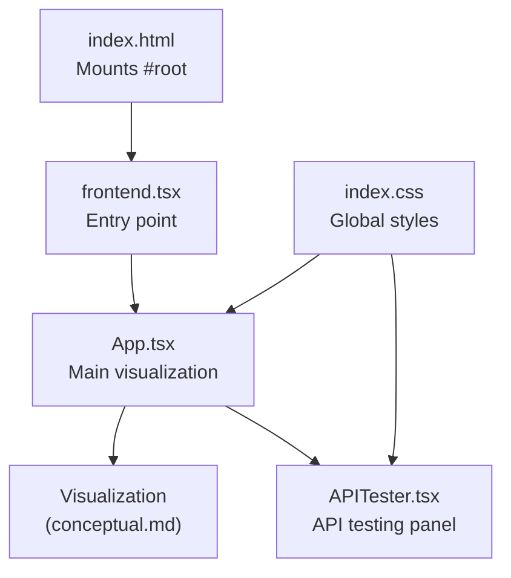
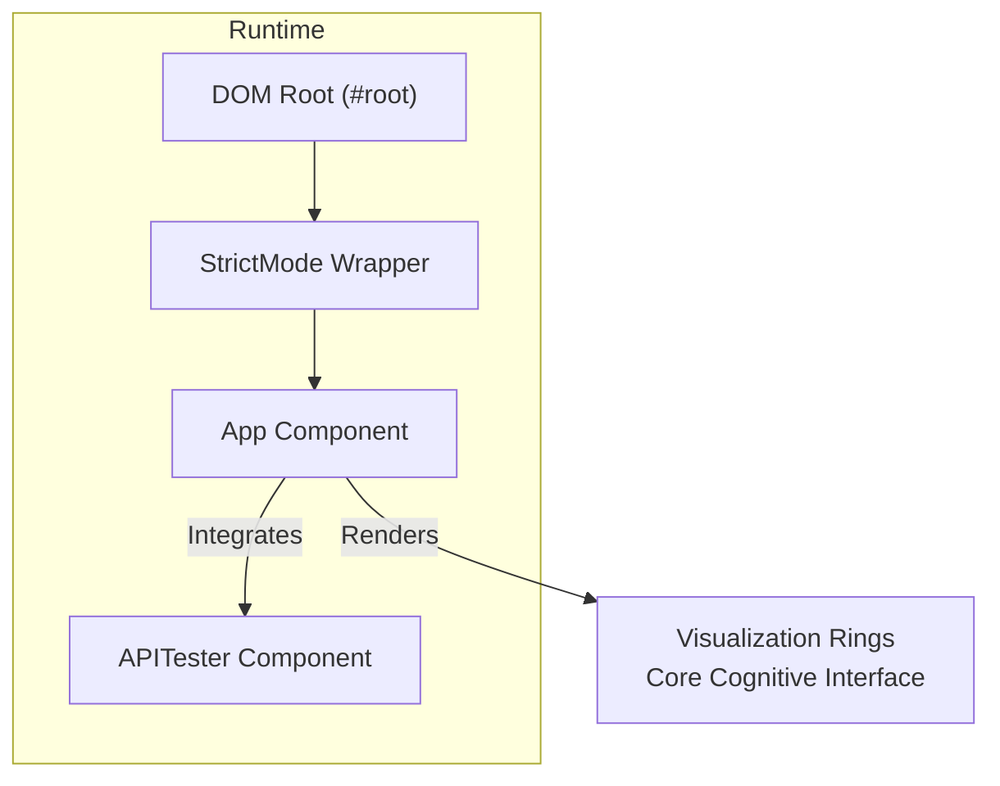
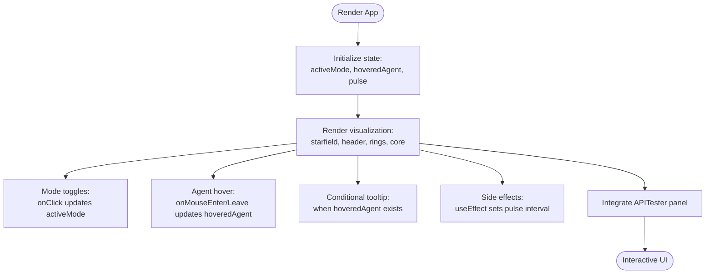
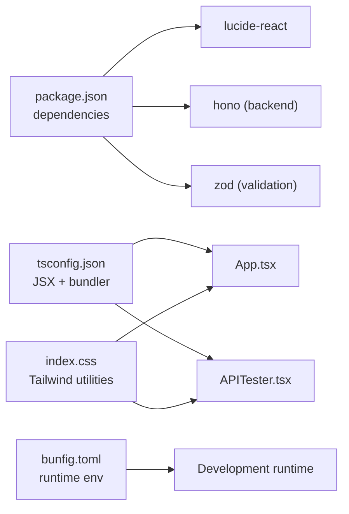

# Frontend Architecture

<cite>
**Referenced Files in This Document**
- [frontend.tsx](file://src/frontend.tsx)
- [App.tsx](file://src/App.tsx)
- [APITester.tsx](file://src/APITester.tsx)
- [index.html](file://src/index.html)
- [index.css](file://src/index.css)
- [conceptual.md](file://AB/conceptual.md)
- [package.json](file://package.json)
- [tsconfig.json](file://tsconfig.json)
- [bunfig.toml](file://bunfig.toml)
</cite>

## Table of Contents
1. [Introduction](#introduction)
2. [Project Structure](#project-structure)
3. [Core Components](#core-components)
4. [Architecture Overview](#architecture-overview)
5. [Detailed Component Analysis](#detailed-component-analysis)
6. [Dependency Analysis](#dependency-analysis)
7. [Performance Considerations](#performance-considerations)
8. [Troubleshooting Guide](#troubleshooting-guide)
9. [Conclusion](#conclusion)
10. [Appendices](#appendices)

## Introduction
This document describes the React frontend architecture for the 371-OS Universe application. The entry point mounts the App component, which orchestrates a central visualization and integrates an API testing panel. The architecture emphasizes:
- Component-based composition with App as the primary container
- State management using React hooks for mode selection and UI feedback
- Styling via Tailwind CSS utility classes for responsive design and visual effects
- Iconography using Lucide React for agent representations
- Accessibility and responsive design considerations

## Project Structure
The frontend is organized around a minimal entry point and two primary React components:
- Entry point: mounts the App component into the DOM
- App: hosts the main visualization and mode controls
- APITester: a lightweight API testing panel integrated alongside the visualization

**Diagram sources**
- [index.html](file://src/index.html#L1-L14)
- [frontend.tsx](file://src/frontend.tsx#L1-L27)
- [App.tsx](file://src/App.tsx#L1-L206)
- [APITester.tsx](file://src/APITester.tsx#L1-L40)
- [index.css](file://src/index.css#L1-L188)

**Section sources**
- [index.html](file://src/index.html#L1-L14)
- [frontend.tsx](file://src/frontend.tsx#L1-L27)
- [App.tsx](file://src/App.tsx#L1-L206)
- [APITester.tsx](file://src/APITester.tsx#L1-L40)
- [index.css](file://src/index.css#L1-L188)

## Core Components
- Entry point: Creates the root and renders the App component inside a strict mode wrapper. Hot module replacement is supported for development.
- App: Central component managing:
  - Mode selection state (Executive, Technical, Creative)
  - Hover state for agent tooltips
  - Pulse animation effect via a timer
  - Rendering of the visualization rings, core cognitive interface, and informational overlays
- APITester: Provides a simple form to send HTTP requests and display responses in a textarea.

Key implementation patterns:
- useState for reactive UI updates
- useEffect for side effects (interval-based pulse animation)
- Tailwind utility classes for layout, responsiveness, and visual effects
- Lucide React icons for agent representations and decorative elements

**Section sources**
- [frontend.tsx](file://src/frontend.tsx#L1-L27)
- [App.tsx](file://src/App.tsx#L1-L206)
- [APITester.tsx](file://src/APITester.tsx#L1-L40)

## Architecture Overview
The runtime architecture centers on mounting the App component and composing the visualization with the API tester. The App component encapsulates the visualization logic and state, while the API tester remains a separate, reusable panel.

**Diagram sources**
- [frontend.tsx](file://src/frontend.tsx#L1-L27)
- [App.tsx](file://src/App.tsx#L1-L206)
- [APITester.tsx](file://src/APITester.tsx#L1-L40)

## Detailed Component Analysis

### Entry Point: frontend.tsx
Responsibilities:
- Locates the DOM root element
- Renders the App component within StrictMode
- Supports hot module replacement during development

Behavior highlights:
- Uses createRoot to mount the application
- Persists root instance in hot data for HMR continuity
- Imports App from src/App.tsx

Accessibility and responsiveness:
- No explicit accessibility attributes here; relies on downstream components to manage focus and semantics.

**Section sources**
- [frontend.tsx](file://src/frontend.tsx#L1-L27)
- [index.html](file://src/index.html#L1-L14)

### Main Visualization: App.tsx
Composition pattern:
- App composes the visualization described in conceptual.md and integrates the API tester panel.
- The visualization includes:
  - Background starfield effect
  - Header and tagline
  - Outer ring for ventures
  - Middle ring for C-suite agents
  - Inner core cognitive interface with mode toggles
  - Infrastructure labels and floating agent tooltip
  - Conceptual connection lines rendered via SVG
  - Footer economics note

State management:
- activeMode: selected mode driving color, background, border, and description
- hoveredAgent: floating tooltip data
- pulse: periodic scaling/opacity animation for the brain icon

Side effects:
- useEffect sets up an interval to toggle pulse every 2 seconds; cleanup clears the interval on unmount.

Styling approach:
- Tailwind utility classes define layout, spacing, colors, shadows, transitions, and animations
- Responsive design achieved through utility classes and viewport meta in index.html
- Animations include spinning rings, pulsing stars, and brain icon pulse

Lucide React icons:
- Used extensively for agent representations and decorative elements (Brain, Cpu, ShieldCheck, BarChart3, Users, etc.)

Integration with APITester:
- The API tester is integrated inline within the App component’s render tree. While the current App.tsx focuses on the visualization, the conceptual.md file demonstrates the same composition pattern.

Props and event handling:
- Mode toggles: button onClick handlers update activeMode
- Agent hover: mouse enter/leave handlers update hoveredAgent
- Floating tooltip: conditionally rendered when hoveredAgent is truthy

Responsive design considerations:
- The visualization uses fixed dimensions for rings and core; responsiveness is primarily handled by global styles and viewport meta
- Utility classes provide spacing and alignment adjustments across screen sizes

Accessibility compliance:
- Semantic HTML structure within the visualization
- Focusable interactive elements (buttons, inputs) benefit from default browser focus styles
- Consider adding aria-labels and roles for interactive elements to improve assistive technology support

**Section sources**
- [App.tsx](file://src/App.tsx#L1-L206)
- [conceptual.md](file://AB/conceptual.md#L1-L205)

### API Testing Panel: APITester.tsx
Purpose:
- Provides a lightweight form to select HTTP method and endpoint, submit the request, and display the response in a textarea.

Implementation patterns:
- useRef to access the response textarea programmatically
- Form submission handler prevents default, constructs a URL from endpoint and current location, performs fetch, parses JSON, and writes formatted output to the textarea
- Error handling writes the error message to the textarea

Props and event handling:
- Method selection via select element
- Endpoint input via text field
- Submit button triggers testEndpoint
- Response area is read-only and preformatted

Styling:
- Tailwind utility classes define layout, spacing, colors, and focus states
- Monospace font for endpoint and response areas

Accessibility:
- Inputs and buttons are keyboard accessible
- Consider adding labels and aria-live regions for dynamic response updates

**Section sources**
- [APITester.tsx](file://src/APITester.tsx#L1-L40)
- [index.css](file://src/index.css#L90-L180)

### Visualization Composition Pattern
The App component composes the visualization from conceptual.md and integrates the API tester panel. The conceptual.md file defines the same visualization structure, demonstrating how the visualization is built from rings, core interface, and informational overlays.

**Diagram sources**
- [App.tsx](file://src/App.tsx#L1-L206)
- [APITester.tsx](file://src/APITester.tsx#L1-L40)
- [conceptual.md](file://AB/conceptual.md#L1-L205)

**Section sources**
- [App.tsx](file://src/App.tsx#L1-L206)
- [APITester.tsx](file://src/APITester.tsx#L1-L40)
- [conceptual.md](file://AB/conceptual.md#L1-L205)

## Dependency Analysis
External dependencies and configuration:
- lucide-react: icon library used for agent and decorative icons
- Tailwind CSS utilities: styling framework for responsive design
- Bun runtime: environment configured for development

Build and tooling:
- TypeScript configuration enables JSX with react-jsx
- Bun configuration optimizes installation and runtime behavior

**Diagram sources**
- [package.json](file://package.json#L1-L31)
- [tsconfig.json](file://tsconfig.json#L1-L18)
- [bunfig.toml](file://bunfig.toml#L1-L17)
- [index.css](file://src/index.css#L1-L188)

**Section sources**
- [package.json](file://package.json#L1-L31)
- [tsconfig.json](file://tsconfig.json#L1-L18)
- [bunfig.toml](file://bunfig.toml#L1-L17)
- [index.css](file://src/index.css#L1-L188)

## Performance Considerations
- Animation performance: The visualization uses CSS animations and transitions; keep the number of animated elements reasonable to avoid layout thrashing.
- Interval usage: The pulse interval runs continuously; ensure cleanup occurs on unmount (already handled).
- Rendering cost: The starfield effect creates many DOM nodes; consider virtualization or limiting density for very large screens.
- Fetch performance: APITester performs network requests; cache responses when appropriate and avoid unnecessary re-renders.

[No sources needed since this section provides general guidance]

## Troubleshooting Guide
Common issues and resolutions:
- Icons not rendering: Ensure lucide-react is installed and available in the bundle.
- API tester errors: Verify endpoint URLs and CORS policies; the tester writes errors to the response area.
- Visual glitches: Check Tailwind utility class combinations and ensure CSS is loaded.
- Hot reload issues: Confirm HMR is enabled and the root instance persists across updates.

**Section sources**
- [package.json](file://package.json#L25-L31)
- [APITester.tsx](file://src/APITester.tsx#L1-L40)
- [index.css](file://src/index.css#L1-L188)
- [frontend.tsx](file://src/frontend.tsx#L1-L27)

## Conclusion
The frontend architecture follows a clean component-based design with App as the central orchestrator. It leverages React hooks for state and side effects, Tailwind CSS for styling, and Lucide React for visual representation. The visualization integrates seamlessly with the API testing panel, enabling both exploratory and operational workflows. The design balances responsiveness, accessibility, and performance considerations.

[No sources needed since this section summarizes without analyzing specific files]

## Appendices

### Responsive Design Notes
- The visualization uses fixed dimensions for rings and core; responsiveness is primarily handled by global styles and viewport meta in index.html.
- Utility classes provide spacing and alignment adjustments across screen sizes.

**Section sources**
- [index.html](file://src/index.html#L1-L14)
- [App.tsx](file://src/App.tsx#L1-L206)

### Accessibility Recommendations
- Add aria-labels and roles to interactive elements
- Ensure sufficient color contrast for text and backgrounds
- Provide keyboard navigation support for all interactive controls
- Consider aria-live regions for dynamic content updates

[No sources needed since this section provides general guidance]