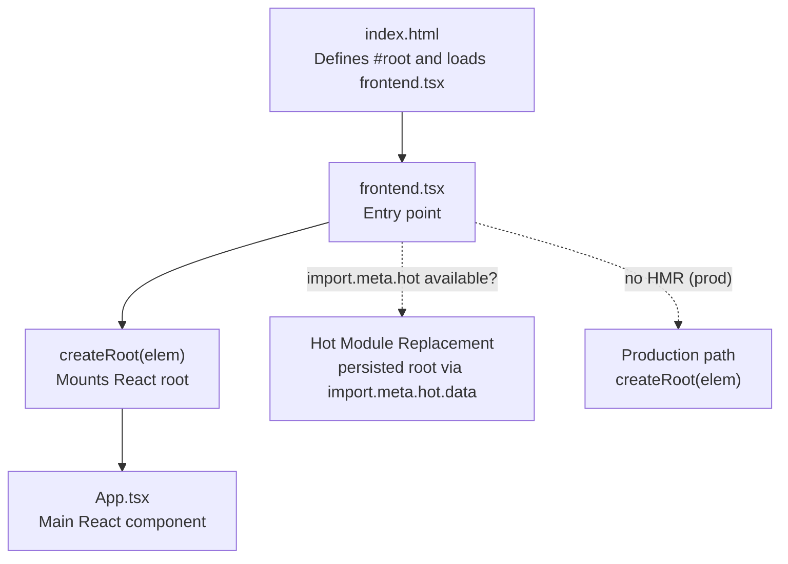
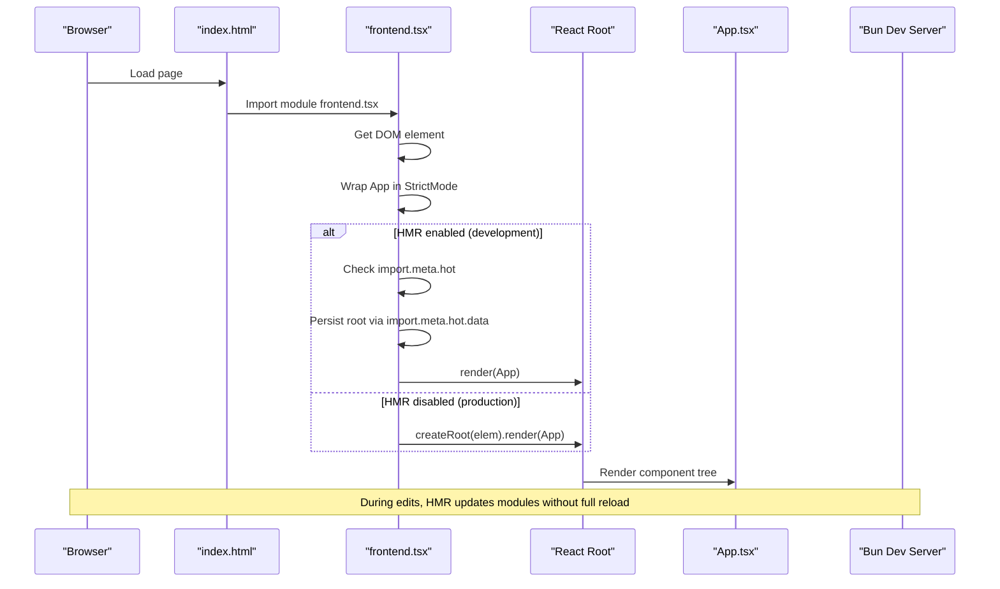
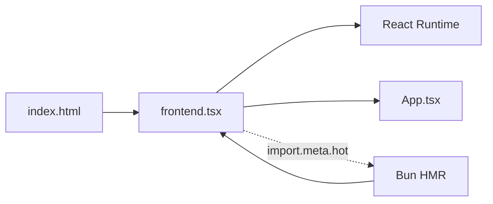

# Frontend Entry Point

<cite>
**Referenced Files in This Document**
- [frontend.tsx](file://src/frontend.tsx)
- [App.tsx](file://src/App.tsx)
- [index.html](file://src/index.html)
- [index.tsx](file://src/index.tsx)
- [bunfig.toml](file://bunfig.toml)
- [package.json](file://package.json)
- [tsconfig.json](file://tsconfig.json)
</cite>

## Table of Contents
1. [Introduction](#introduction)
2. [Project Structure](#project-structure)
3. [Core Components](#core-components)
4. [Architecture Overview](#architecture-overview)
5. [Detailed Component Analysis](#detailed-component-analysis)
6. [Dependency Analysis](#dependency-analysis)
7. [Performance Considerations](#performance-considerations)
8. [Troubleshooting Guide](#troubleshooting-guide)
9. [Conclusion](#conclusion)

## Introduction
This document explains the frontend entry point defined in src/frontend.tsx and how it bootstraps the React application. It covers mounting the App component to the DOM element with id root, the use of React’s StrictMode for development safety checks, and integration with Bun’s hot module replacement (HMR) system via import.meta.hot. It also describes how the root instance persists during HMR to maintain state, contrasts this behavior with production where HMR is not available, and provides best practices and common pitfalls for modifying the entry point.

## Project Structure
The frontend entry point is part of a minimal React application served by Bun. The HTML page defines the mount target, the entry script initializes the React root, and the server enables HMR in development.

**Diagram sources**
- [index.html](file://src/index.html#L9-L12)
- [frontend.tsx](file://src/frontend.tsx#L12-L26)
- [App.tsx](file://src/App.tsx#L1-L206)
- [index.tsx](file://src/index.tsx#L32-L38)

**Section sources**
- [index.html](file://src/index.html#L9-L12)
- [frontend.tsx](file://src/frontend.tsx#L12-L26)
- [index.tsx](file://src/index.tsx#L32-L38)

## Core Components
- Entry point: src/frontend.tsx
  - Selects the DOM element with id root.
  - Wraps the App component in React.StrictMode for development safety checks.
  - Uses createRoot to render the App component.
  - Integrates with Bun’s HMR via import.meta.hot to persist the root instance across edits.
- Application shell: src/App.tsx
  - Provides the main UI and stateful logic for the application.
- HTML scaffold: src/index.html
  - Contains the #root element and loads the module script frontend.tsx.
- Development server: src/index.tsx
  - Enables HMR in development via Bun’s runtime configuration.
- Build/runtime configuration:
  - bunfig.toml sets NODE_ENV to development and RUNTIME to bun.
  - package.json defines scripts and Bun runtime.
  - tsconfig.json configures JSX and module resolution for bundler environments.

**Section sources**
- [frontend.tsx](file://src/frontend.tsx#L12-L26)
- [App.tsx](file://src/App.tsx#L1-L206)
- [index.html](file://src/index.html#L9-L12)
- [index.tsx](file://src/index.tsx#L32-L38)
- [bunfig.toml](file://bunfig.toml#L15-L17)
- [package.json](file://package.json#L12-L18)
- [tsconfig.json](file://tsconfig.json#L1-L18)

## Architecture Overview
The entry point orchestrates React rendering and HMR persistence. In development, import.meta.hot is present and used to keep the root alive across module updates. In production, HMR is not available, so a fresh root is created each time.

**Diagram sources**
- [index.html](file://src/index.html#L9-L12)
- [frontend.tsx](file://src/frontend.tsx#L12-L26)
- [App.tsx](file://src/App.tsx#L1-L206)
- [index.tsx](file://src/index.tsx#L32-L38)

## Detailed Component Analysis

### Entry Point: frontend.tsx
Responsibilities:
- Selects the DOM element with id root.
- Creates a StrictMode wrapper around the App component.
- Renders the App component using createRoot.
- Integrates with Bun’s HMR by persisting the root instance in import.meta.hot.data.

Key behaviors:
- StrictMode usage: Ensures development-time checks for potential issues in the component tree.
- HMR persistence: import.meta.hot.data.root stores the root instance across module updates, preventing full remounts and preserving state.
- Production fallback: When import.meta.hot is not available, a new root is created and rendered.

Best practices:
- Keep the #root element present in index.html.
- Avoid changing the StrictMode wrapper unless necessary.
- Do not mutate import.meta.hot.data directly in application code; rely on Bun’s HMR lifecycle.
- Ensure App is pure or manages state in a way that survives re-renders.

Common issues:
- Missing #root element: The entry point throws if getElementById returns null. Verify index.html includes the #root div.
- Hydration mismatches: Occur when server-rendered markup differs from client-rendered markup. Since this project serves static HTML and mounts React on top, ensure the HTML content does not conflict with the App’s initial render.
- HMR not triggering: Confirm development mode and that the dev server enables HMR.

**Section sources**
- [frontend.tsx](file://src/frontend.tsx#L12-L26)
- [index.html](file://src/index.html#L9-L12)
- [index.tsx](file://src/index.tsx#L32-L38)

### App Component: App.tsx
Responsibilities:
- Defines the main UI layout and state.
- Manages modes, agent interactions, and visual effects.
- Uses React hooks for state and side effects.

Impact on entry point:
- The App component is mounted under the StrictMode wrapper in the entry point.
- Its internal state persists across HMR updates because the root is reused.

**Section sources**
- [App.tsx](file://src/App.tsx#L1-L206)

### HTML Scaffold: index.html
Responsibilities:
- Declares the #root element where React mounts.
- Loads the module script frontend.tsx.

Guidelines:
- Do not remove or rename the #root element.
- Keep the module script tag pointing to frontend.tsx.

**Section sources**
- [index.html](file://src/index.html#L9-L12)

### Development Server: index.tsx
Responsibilities:
- Serves the HTML and API routes.
- Enables HMR in development via Bun’s runtime configuration.

Implications:
- HMR is active when NODE_ENV is not production and hmr is enabled.
- Console logging is echoed to the server for debugging.

**Section sources**
- [index.tsx](file://src/index.tsx#L32-L38)
- [bunfig.toml](file://bunfig.toml#L15-L17)

### Build/Runtime Configuration
- bunfig.toml sets NODE_ENV to development and RUNTIME to bun.
- package.json defines scripts and Bun runtime.
- tsconfig.json configures JSX and module resolution for bundler environments.

**Section sources**
- [bunfig.toml](file://bunfig.toml#L15-L17)
- [package.json](file://package.json#L12-L18)
- [tsconfig.json](file://tsconfig.json#L1-L18)

## Dependency Analysis
The entry point depends on:
- DOM availability (index.html).
- React runtime (createRoot).
- App component.
- Bun’s HMR API (import.meta.hot) in development.

**Diagram sources**
- [index.html](file://src/index.html#L9-L12)
- [frontend.tsx](file://src/frontend.tsx#L12-L26)
- [App.tsx](file://src/App.tsx#L1-L206)
- [index.tsx](file://src/index.tsx#L32-L38)

**Section sources**
- [frontend.tsx](file://src/frontend.tsx#L12-L26)
- [index.html](file://src/index.html#L9-L12)
- [index.tsx](file://src/index.tsx#L32-L38)

## Performance Considerations
- HMR persistence: Reusing the root instance avoids full remounts and preserves component state, reducing reload overhead during development.
- StrictMode overhead: Development-only checks add minor overhead; disable StrictMode only for targeted diagnostics.
- Minimal entry logic: Keeping the entry point thin reduces initialization cost and improves reliability.

[No sources needed since this section provides general guidance]

## Troubleshooting Guide
Common issues and resolutions:
- Root element missing:
  - Symptom: Entry point fails to select #root.
  - Fix: Ensure index.html contains the #root element and the module script loads after it.
  - Section sources
    - [index.html](file://src/index.html#L9-L12)
    - [frontend.tsx](file://src/frontend.tsx#L12-L13)
- Hydration mismatch:
  - Symptom: React warnings about mismatched markup.
  - Cause: Server-rendered content conflicts with client-rendered content.
  - Fix: Avoid injecting dynamic content into index.html that differs from App’s initial render.
  - Section sources
    - [index.html](file://src/index.html#L9-L12)
    - [App.tsx](file://src/App.tsx#L50-L70)
- HMR not working:
  - Symptom: Changes do not trigger hot updates.
  - Checks:
    - Confirm development mode and that the dev server enables HMR.
    - Verify import.meta.hot is available in the browser context.
  - Section sources
    - [index.tsx](file://src/index.tsx#L32-L38)
    - [bunfig.toml](file://bunfig.toml#L15-L17)
- State resets unexpectedly:
  - Symptom: Component state resets after edits.
  - Cause: Root not persisted across HMR updates.
  - Fix: Ensure import.meta.hot is available and that the root is stored in import.meta.hot.data.
  - Section sources
    - [frontend.tsx](file://src/frontend.tsx#L19-L23)

## Conclusion
The frontend entry point in src/frontend.tsx is intentionally minimal yet powerful. It mounts the App component under React.StrictMode and integrates with Bun’s HMR to preserve the root instance across edits, maintaining state during development. In production, where HMR is unavailable, it falls back to creating a fresh root. Following the best practices and troubleshooting steps outlined here ensures a smooth development experience and reliable production builds.