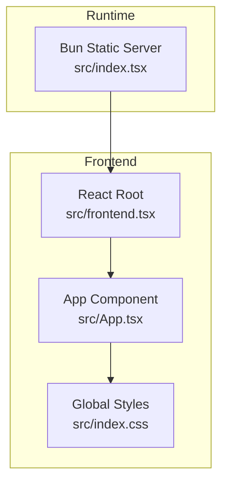
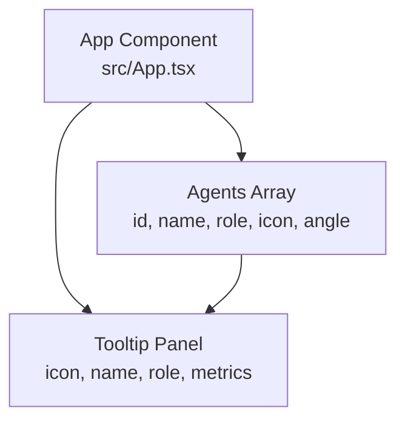
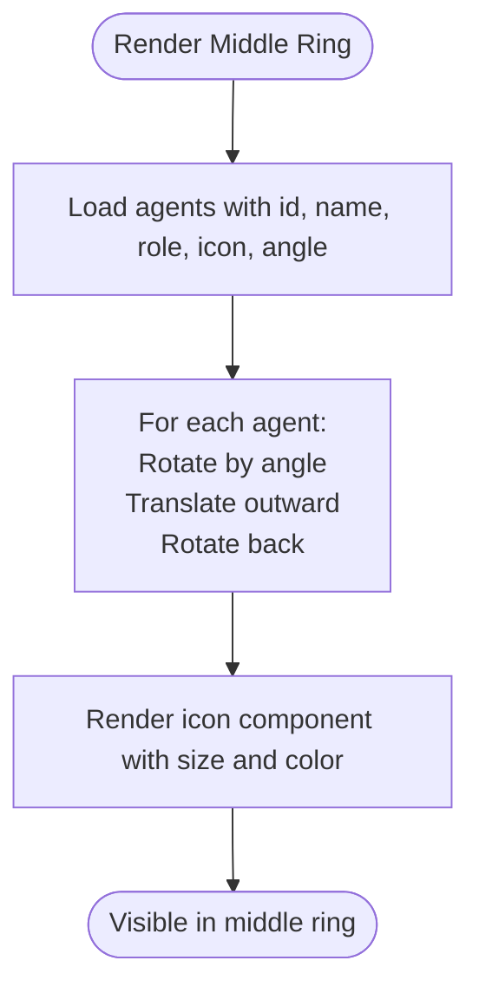
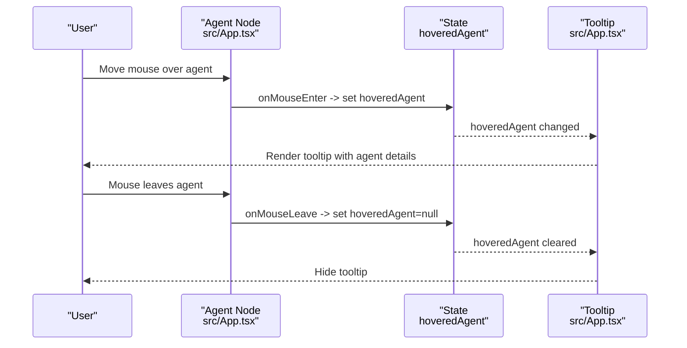
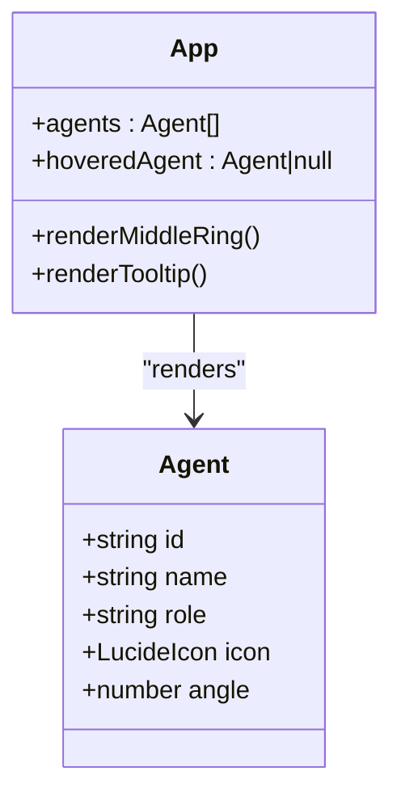
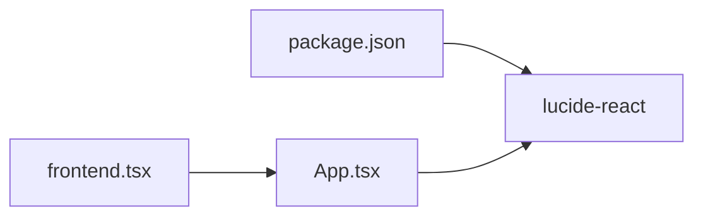

# Agent Management

<cite>
**Referenced Files in This Document**
- [App.tsx](file://src/App.tsx)
- [frontend.tsx](file://src/frontend.tsx)
- [index.tsx](file://src/index.tsx)
- [index.css](file://src/index.css)
- [package.json](file://package.json)
</cite>

## Table of Contents
1. [Introduction](#introduction)
2. [Project Structure](#project-structure)
3. [Core Components](#core-components)
4. [Architecture Overview](#architecture-overview)
5. [Detailed Component Analysis](#detailed-component-analysis)
6. [Dependency Analysis](#dependency-analysis)
7. [Performance Considerations](#performance-considerations)
8. [Troubleshooting Guide](#troubleshooting-guide)
9. [Conclusion](#conclusion)

## Introduction
This document explains the C-suite agent management system implemented in the application. It focuses on the data model for agents, how they are positioned and rendered in the middle ring of the orrery visualization, and the interactive hover experience that reveals a floating tooltip with agent details and optimization metrics. It also covers how agent icons are dynamically rendered using Lucide React components and how tooltip positioning is handled.

## Project Structure
The application is a React front-end served by a Bun-based static server. The primary UI logic resides in a single component that renders the orrery visualization, including the middle ring of C-suite agents, a central cognitive interface, and a floating tooltip for agent details.

**Diagram sources**
- [index.tsx](file://src/index.tsx#L1-L42)
- [frontend.tsx](file://src/frontend.tsx#L1-L27)
- [App.tsx](file://src/App.tsx#L1-L206)
- [index.css](file://src/index.css#L1-L188)

**Section sources**
- [frontend.tsx](file://src/frontend.tsx#L1-L27)
- [App.tsx](file://src/App.tsx#L1-L206)
- [index.tsx](file://src/index.tsx#L1-L42)
- [index.css](file://src/index.css#L1-L188)

## Core Components
- Agent data model: Each agent has an identifier, display name, role, Lucide icon component, and angular position for placement around the middle ring.
- Middle ring rendering: Agents are placed in a circular layout using rotation transforms to achieve even spacing.
- Hover interaction: Mouse enter/leave handlers update a hovered agent state, enabling a floating tooltip to render with agent details and metrics.
- Floating tooltip: A positioned panel displaying agent icon, name, role, and a progress bar with an optimization metric.

Key implementation references:
- Agent data and middle ring rendering: [App.tsx](file://src/App.tsx#L35-L114)
- Hover state and tooltip rendering: [App.tsx](file://src/App.tsx#L20-L23), [App.tsx](file://src/App.tsx#L101-L114), [App.tsx](file://src/App.tsx#L161-L179)
- Icon rendering with Lucide React: [App.tsx](file://src/App.tsx#L1-L18), [App.tsx](file://src/App.tsx#L111-L112), [App.tsx](file://src/App.tsx#L165-L166)

**Section sources**
- [App.tsx](file://src/App.tsx#L20-L23)
- [App.tsx](file://src/App.tsx#L35-L114)
- [App.tsx](file://src/App.tsx#L161-L179)

## Architecture Overview
The agent management UI is a self-contained React component that composes:
- A central cognitive interface with mode toggles
- An outer ring of ventures
- A middle ring of C-suite agents
- A floating tooltip bound to the hovered agent

**Diagram sources**
- [App.tsx](file://src/App.tsx#L35-L114)
- [App.tsx](file://src/App.tsx#L161-L179)

## Detailed Component Analysis

### Agent Data Model and Rendering
- Data fields:
  - id: Unique identifier for the agent
  - name: Human-readable display name
  - role: Job or functional role
  - icon: Lucide React component used for rendering
  - angle: Angular position in degrees for ring placement
- Rendering:
  - The middle ring is a circle with a fixed radius; each agent is rotated around the center and translated outward to the ring’s circumference.
  - The transform sequence applies rotation by the agent’s angle, moves along the Y-axis to reach the ring radius, and rotates back to keep the icon upright.

Implementation references:
- Agent definition and angles: [App.tsx](file://src/App.tsx#L35-L41)
- Middle ring container and agent placement: [App.tsx](file://src/App.tsx#L99-L114)
- Icon rendering inside agent nodes: [App.tsx](file://src/App.tsx#L111-L112)

**Diagram sources**
- [App.tsx](file://src/App.tsx#L35-L41)
- [App.tsx](file://src/App.tsx#L99-L114)
- [App.tsx](file://src/App.tsx#L111-L112)

**Section sources**
- [App.tsx](file://src/App.tsx#L35-L41)
- [App.tsx](file://src/App.tsx#L99-L114)
- [App.tsx](file://src/App.tsx#L111-L112)

### Hover Interaction and Tooltip Behavior
- State management:
  - A hovered agent state tracks which agent is currently under the pointer.
  - onMouseEnter sets the hovered agent; onMouseLeave clears it.
- Tooltip rendering:
  - When an agent is hovered, a floating panel appears to the right of the orrery, containing the agent’s icon, name, role, and an optimization progress bar with a fixed percentage.
- Tooltip positioning:
  - Absolute positioning places the tooltip to the right of the main orrery container; transitions animate its appearance.

Implementation references:
- Hover state initialization and lifecycle: [App.tsx](file://src/App.tsx#L20-L23)
- Event handlers and agent node composition: [App.tsx](file://src/App.tsx#L101-L114)
- Tooltip content and layout: [App.tsx](file://src/App.tsx#L161-L179)
- Icon usage inside tooltip: [App.tsx](file://src/App.tsx#L165-L166)

**Diagram sources**
- [App.tsx](file://src/App.tsx#L20-L23)
- [App.tsx](file://src/App.tsx#L101-L114)
- [App.tsx](file://src/App.tsx#L161-L179)

**Section sources**
- [App.tsx](file://src/App.tsx#L20-L23)
- [App.tsx](file://src/App.tsx#L101-L114)
- [App.tsx](file://src/App.tsx#L161-L179)

### Dynamic Icon Rendering with Lucide React
- Icons are imported from lucide-react and assigned as values in the agent data.
- At render time, each agent’s icon component is invoked with size and color props.
- The tooltip also uses the same icon component to visually represent the agent.

Implementation references:
- Icon imports: [App.tsx](file://src/App.tsx#L1-L18)
- Agent icon rendering: [App.tsx](file://src/App.tsx#L111-L112)
- Tooltip icon rendering: [App.tsx](file://src/App.tsx#L165-L166)

**Diagram sources**
- [App.tsx](file://src/App.tsx#L35-L41)
- [App.tsx](file://src/App.tsx#L101-L114)
- [App.tsx](file://src/App.tsx#L161-L179)

**Section sources**
- [App.tsx](file://src/App.tsx#L1-L18)
- [App.tsx](file://src/App.tsx#L111-L112)
- [App.tsx](file://src/App.tsx#L165-L166)

### Tooltip Details and Metrics
- Content:
  - Agent icon and name
  - Role text
  - Optimization progress bar with a fixed percentage indicator
- Positioning:
  - Positioned absolutely to the right of the orrery container
  - Uses Tailwind utility classes for layout, borders, and shadows
  - Animated entrance for smooth reveal

Implementation references:
- Tooltip markup and content: [App.tsx](file://src/App.tsx#L161-L179)

**Section sources**
- [App.tsx](file://src/App.tsx#L161-L179)

## Dependency Analysis
- External library:
  - lucide-react: Provides SVG icon components used for agent avatars and decorative icons.
- Internal composition:
  - The App component composes the orrery visualization and tooltip.
  - The root renderer mounts the App component into the DOM.

**Diagram sources**
- [package.json](file://package.json#L25-L30)
- [App.tsx](file://src/App.tsx#L1-L18)
- [frontend.tsx](file://src/frontend.tsx#L1-L27)

**Section sources**
- [package.json](file://package.json#L25-L30)
- [App.tsx](file://src/App.tsx#L1-L18)
- [frontend.tsx](file://src/frontend.tsx#L1-L27)

## Performance Considerations
- Event handlers:
  - onMouseEnter/onMouseLeave are lightweight and only update a state reference; they do not trigger heavy computations.
- Tooltip visibility:
  - The tooltip is conditionally rendered when hoveredAgent is truthy, minimizing DOM overhead when idle.
- Transforms and animations:
  - Agent nodes rely on CSS transforms for rotation and translation, which are GPU-accelerated and efficient for repeated updates.
- Reduced motion:
  - Global reduced motion media query disables animations for accessibility, preventing unnecessary reflows.

Implementation references:
- Hover state updates: [App.tsx](file://src/App.tsx#L20-L23)
- Conditional tooltip rendering: [App.tsx](file://src/App.tsx#L161-L179)
- Transform-based layout: [App.tsx](file://src/App.tsx#L99-L114)
- Reduced motion handling: [index.css](file://src/index.css#L181-L188)

**Section sources**
- [App.tsx](file://src/App.tsx#L20-L23)
- [App.tsx](file://src/App.tsx#L99-L114)
- [App.tsx](file://src/App.tsx#L161-L179)
- [index.css](file://src/index.css#L181-L188)

## Troubleshooting Guide
- Tooltip not appearing:
  - Verify that onMouseEnter and onMouseLeave are attached to the agent nodes and that hoveredAgent is being set/cleared.
  - Confirm the conditional rendering block for the tooltip is present and active.
  - References: [App.tsx](file://src/App.tsx#L101-L114), [App.tsx](file://src/App.tsx#L161-L179)
- Incorrect agent positions:
  - Check the angle values and ensure the transform sequence applies rotation, translation, and inverse rotation consistently.
  - References: [App.tsx](file://src/App.tsx#L99-L114)
- Icon not visible:
  - Ensure the icon component is imported and passed into the agent data; confirm the icon is rendered with appropriate size and color.
  - References: [App.tsx](file://src/App.tsx#L1-L18), [App.tsx](file://src/App.tsx#L111-L112), [App.tsx](file://src/App.tsx#L165-L166)
- Accessibility concerns:
  - If animations cause discomfort, enable reduced motion in the system settings; global styles disable animations accordingly.
  - Reference: [index.css](file://src/index.css#L181-L188)

**Section sources**
- [App.tsx](file://src/App.tsx#L101-L114)
- [App.tsx](file://src/App.tsx#L161-L179)
- [App.tsx](file://src/App.tsx#L1-L18)
- [App.tsx](file://src/App.tsx#L111-L112)
- [App.tsx](file://src/App.tsx#L165-L166)
- [index.css](file://src/index.css#L181-L188)

## Conclusion
The C-suite agent management system centers on a clean data model for agents and a performant, visually coherent middle ring layout. Hover interactions are implemented with minimal overhead, and the floating tooltip provides contextual information with dynamic iconography. The design balances interactivity with accessibility and performance, leveraging CSS transforms and conditional rendering to keep the experience smooth.