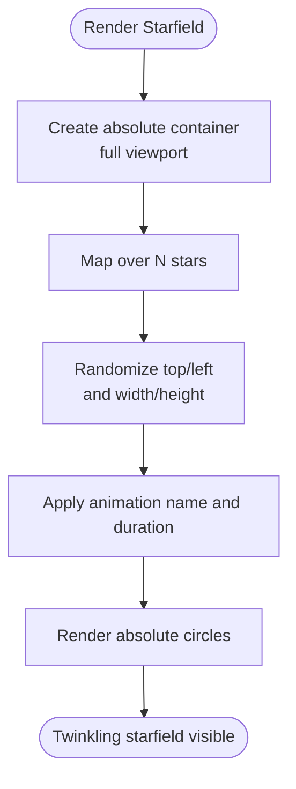

# Dashboard Interface

<cite>
**Referenced Files in This Document**
- [App.tsx](file://src/App.tsx)
- [index.css](file://src/index.css)
- [index.html](file://src/index.html)
- [frontend.tsx](file://src/frontend.tsx)
</cite>

## Table of Contents
1. [Introduction](#introduction)
2. [Project Structure](#project-structure)
3. [Core Components](#core-components)
4. [Architecture Overview](#architecture-overview)
5. [Detailed Component Analysis](#detailed-component-analysis)
6. [Dependency Analysis](#dependency-analysis)
7. [Performance Considerations](#performance-considerations)
8. [Troubleshooting Guide](#troubleshooting-guide)
9. [Conclusion](#conclusion)

## Introduction
This document explains the dashboard interface of the cognitive-aware agent system. It focuses on the header with gradient text and the starfield background effect, the responsive layout using Flexbox, accessibility considerations, and visual design principles. It also documents how the starfield effect is created with absolute positioning and randomized styles, and how the header text uses gradient clipping for visual impact. Finally, it addresses common styling issues and performance optimization for animation rendering.

## Project Structure
The dashboard is implemented as a single-page React application with Tailwind-like utility classes and minimal global CSS. The entry point mounts the App component into the DOM, which renders the dashboard layout and interactive elements.

**Diagram sources**
- [index.html](file://src/index.html#L1-L14)
- [frontend.tsx](file://src/frontend.tsx#L1-L27)
- [App.tsx](file://src/App.tsx#L50-L201)
- [index.css](file://src/index.css#L1-L188)

**Section sources**
- [index.html](file://src/index.html#L1-L14)
- [frontend.tsx](file://src/frontend.tsx#L1-L27)
- [App.tsx](file://src/App.tsx#L50-L201)
- [index.css](file://src/index.css#L1-L188)

## Core Components
- Dashboard container with a dark theme and centered layout using Flexbox.
- Starfield background created by dynamically rendering many small absolute-positioned elements with randomized positions and sizes, and animated pulsing.
- Header with gradient text using background-clip to reveal a gradient-colored text effect.
- Central cognitive interface with mode toggles and animated pulse.
- Interactive tooltip for agent details.
- Conceptual connection lines rendered via inline SVG.

Key implementation references:
- Starfield background creation and animation: [App.tsx](file://src/App.tsx#L52-L67)
- Gradient header text: [App.tsx](file://src/App.tsx#L70-L77)
- Responsive Flexbox layout: [App.tsx](file://src/App.tsx#L50-L51)
- Reduced motion support: [index.css](file://src/index.css#L181-L188)

**Section sources**
- [App.tsx](file://src/App.tsx#L50-L114)
- [index.css](file://src/index.css#L181-L188)

## Architecture Overview
The dashboard composes several visual layers:
- Background starfield: generated via React’s array mapping and absolute positioning.
- Header: gradient text overlay on the page background.
- Central orbital rings: static borders with CSS animations for rotation.
- Cognitive core: interactive mode selector with animated pulse.
- Floating tooltip: contextual agent information.
- Conceptual lines: inline SVG gradients and dashed strokes.

**Diagram sources**
- [App.tsx](file://src/App.tsx#L50-L192)

## Detailed Component Analysis

### Starfield Background Effect
The starfield is implemented by:
- Rendering a container with absolute positioning and full viewport coverage.
- Using React’s array mapping to generate many small circles.
- Randomizing top/left positions and sizes via inline styles.
- Applying a CSS animation named pulse to each star to create a twinkling effect.

Implementation highlights:
- Container and star generation: [App.tsx](file://src/App.tsx#L52-L67)
- Inline randomized styles for star placement and size: [App.tsx](file://src/App.tsx#L58-L63)
- Pointer events disabled to avoid interfering with interactive elements below: [App.tsx](file://src/App.tsx#L53-L67)

**Diagram sources**
- [App.tsx](file://src/App.tsx#L52-L67)

**Section sources**
- [App.tsx](file://src/App.tsx#L52-L67)

### Gradient Text in Header
The header text uses a gradient background with background-clip applied to the text, revealing a colorful gradient-colored text effect. This technique requires a background image or gradient behind the text and uses the text clipping property to show only the gradient within the text bounds.

Implementation highlights:
- Gradient text class on the heading: [App.tsx](file://src/App.tsx#L70-L77)

**Diagram sources**
- [App.tsx](file://src/App.tsx#L70-L77)

**Section sources**
- [App.tsx](file://src/App.tsx#L70-L77)

### Responsive Layout with Flexbox
The dashboard uses Flexbox to center content vertically and horizontally while maintaining a responsive layout:
- The root container uses a flex column, centering items both vertically and horizontally.
- The starfield container is absolutely positioned and covers the viewport.
- The central orbital area is a fixed-size square with relative positioning for child elements.

Implementation highlights:
- Flexbox centering on the root: [App.tsx](file://src/App.tsx#L50-L51)
- Absolute starfield container: [App.tsx](file://src/App.tsx#L52-L67)
- Central orbital area sizing: [App.tsx](file://src/App.tsx#L80-L80)

**Diagram sources**
- [App.tsx](file://src/App.tsx#L50-L80)

**Section sources**
- [App.tsx](file://src/App.tsx#L50-L80)

### Accessibility Considerations
- Reduced motion support: The global CSS disables animations for users who prefer reduced motion, ensuring the interface remains usable and respectful of preferences.
- Focus and hover states: Interactive elements rely on hover and focus states for feedback; ensure sufficient contrast and keyboard navigability where applicable.
- Semantic structure: The header uses a heading element for the main title, aiding screen reader navigation.

Implementation highlights:
- Reduced motion media query: [index.css](file://src/index.css#L181-L188)
- Header semantic element: [App.tsx](file://src/App.tsx#L70-L77)

**Section sources**
- [index.css](file://src/index.css#L181-L188)
- [App.tsx](file://src/App.tsx#L70-L77)

### Visual Design Principles
- Dark theme palette: The dashboard uses a dark background with accent colors for highlights and interactive elements.
- Layering and depth: Z-index stacking is used to separate the starfield, header, orbital rings, and tooltips.
- Motion design: Subtle animations (spinning rings, pulsing core, tooltip transitions) enhance engagement without being distracting.
- Typography: Large, bold typography for the header with gradient text creates strong visual emphasis.

Implementation highlights:
- Dark theme and accents: [App.tsx](file://src/App.tsx#L50-L51)
- Z-index stacking for layers: [App.tsx](file://src/App.tsx#L50-L192)

**Section sources**
- [App.tsx](file://src/App.tsx#L50-L192)

### Interactive Elements and Tooltips
- Agent hover tooltips: On mouse enter/leave, a floating panel displays agent details with progress indicators.
- Mode toggles: Buttons switch the cognitive interface mode, updating colors, borders, and descriptions.

Implementation highlights:
- Tooltip rendering and positioning: [App.tsx](file://src/App.tsx#L161-L179)
- Mode toggle buttons and state updates: [App.tsx](file://src/App.tsx#L129-L140)

**Diagram sources**
- [App.tsx](file://src/App.tsx#L101-L114)
- [App.tsx](file://src/App.tsx#L161-L179)

**Section sources**
- [App.tsx](file://src/App.tsx#L101-L114)
- [App.tsx](file://src/App.tsx#L161-L179)

## Dependency Analysis
The dashboard relies on:
- React for component rendering and state management.
- Utility classes for layout and theming (applied directly in JSX).
- Global CSS for reduced-motion support and base layout.

**Diagram sources**
- [App.tsx](file://src/App.tsx#L1-L20)
- [frontend.tsx](file://src/frontend.tsx#L1-L27)
- [index.html](file://src/index.html#L1-L14)
- [index.css](file://src/index.css#L1-L188)

**Section sources**
- [App.tsx](file://src/App.tsx#L1-L20)
- [frontend.tsx](file://src/frontend.tsx#L1-L27)
- [index.html](file://src/index.html#L1-L14)
- [index.css](file://src/index.css#L1-L188)

## Performance Considerations
- Starfield optimization:
  - Limit the number of stars to a reasonable count to balance visual richness and performance.
  - Prefer hardware-accelerated properties (transform/opacity) for animations.
  - Avoid frequent reflows by batching style updates and minimizing DOM thrashing.
- Animation rendering:
  - Use CSS transforms and opacity for smooth animations.
  - Disable animations for users who prefer reduced motion to improve accessibility and reduce CPU/GPU load.
- Layout stability:
  - Keep fixed-size containers for orbital areas to prevent layout shifts.
  - Use absolute positioning for background elements to avoid affecting the main layout flow.

[No sources needed since this section provides general guidance]

## Troubleshooting Guide
- Gradient text not visible:
  - Ensure a background gradient is present and the text clipping property is applied.
  - Verify the text color is transparent so the gradient background shows through.
  - Reference: [App.tsx](file://src/App.tsx#L70-L77)
- Starfield not animating:
  - Confirm the animation name is correctly applied to each star element.
  - Check that the animation is defined in CSS and that the star elements are not blocked by pointer-events.
  - Reference: [App.tsx](file://src/App.tsx#L52-L67)
- Tooltip not appearing:
  - Verify the hover state is set and the tooltip conditionally renders.
  - Ensure the tooltip is positioned relatively to the hovered item and not clipped by overflow.
  - Reference: [App.tsx](file://src/App.tsx#L161-L179)
- Accessibility issues:
  - Respect reduced motion preferences by disabling animations for affected users.
  - Reference: [index.css](file://src/index.css#L181-L188)

**Section sources**
- [App.tsx](file://src/App.tsx#L52-L67)
- [App.tsx](file://src/App.tsx#L70-L77)
- [App.tsx](file://src/App.tsx#L161-L179)
- [index.css](file://src/index.css#L181-L188)

## Conclusion
The dashboard integrates a visually striking starfield background and gradient header text with a responsive Flexbox layout. Interactive elements, such as agent tooltips and mode toggles, provide meaningful engagement while maintaining accessibility through reduced-motion support. By following the outlined performance tips and troubleshooting steps, developers can refine the interface for optimal rendering and user experience.