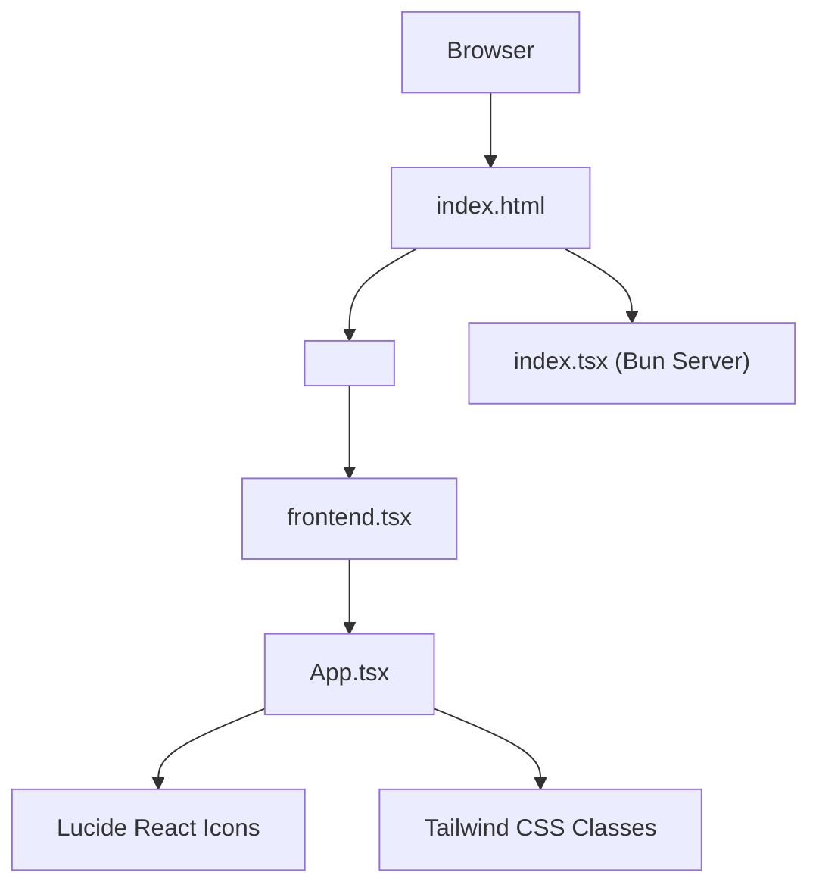
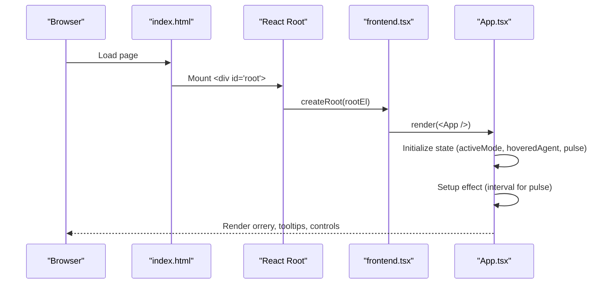
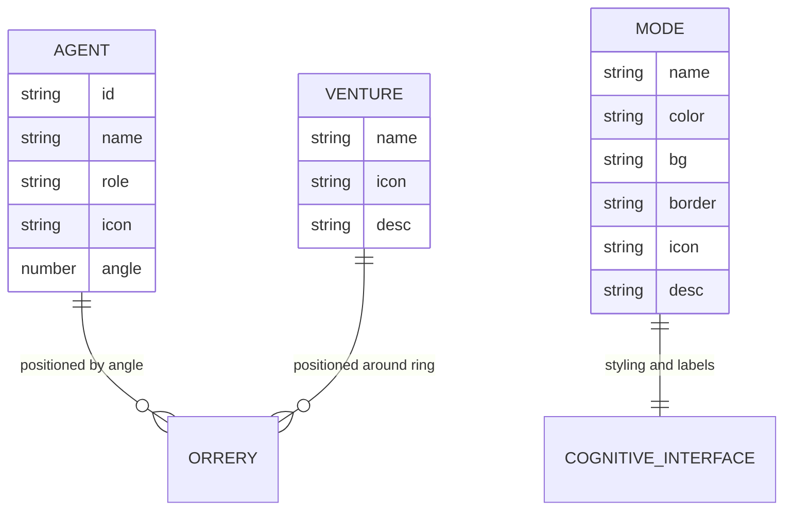
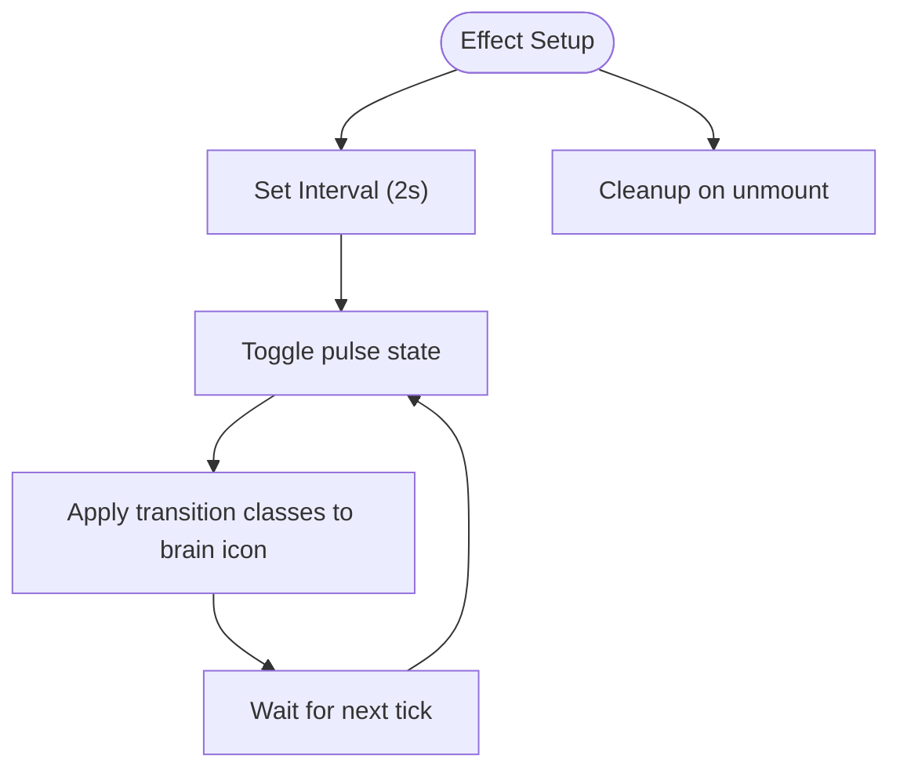
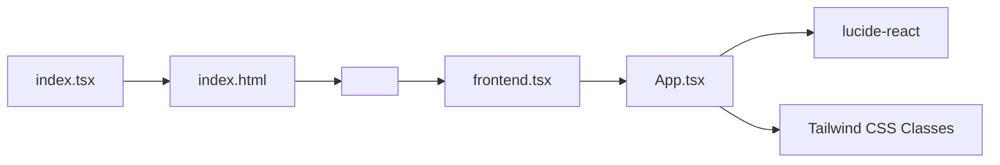

# Main Application Component

<cite>
**Referenced Files in This Document**
- [App.tsx](file://src/App.tsx)
- [frontend.tsx](file://src/frontend.tsx)
- [index.html](file://src/index.html)
- [index.css](file://src/index.css)
- [index.tsx](file://src/index.tsx)
- [package.json](file://package.json)
- [projectinfo.md](file://projectinfo.md)
</cite>

## Table of Contents
1. [Introduction](#introduction)
2. [Project Structure](#project-structure)
3. [Core Components](#core-components)
4. [Architecture Overview](#architecture-overview)
5. [Detailed Component Analysis](#detailed-component-analysis)
6. [Dependency Analysis](#dependency-analysis)
7. [Performance Considerations](#performance-considerations)
8. [Troubleshooting Guide](#troubleshooting-guide)
9. [Conclusion](#conclusion)

## Introduction
This document describes the main App component that powers the cognitive-aware agent dashboard. The component is a React function component that orchestrates a dynamic, animated orrery-style visualization of agents and ventures, with mode switching and interactive tooltips. It uses React hooks for state and side effects, Tailwind CSS for styling, and Lucide React icons for visual semantics. The App integrates with a Bun-based development server and renders into a minimal HTML root element.

## Project Structure
The application is organized around a small set of focused files:
- The React entry point creates a root and renders the App component.
- The App component defines the UI, state, and animations.
- The HTML root element provides a container for the React app.
- Global styles define base layout and reduced-motion preferences.
- A Bun server serves the HTML and exposes API endpoints for testing.

**Diagram sources**
- [index.html](file://src/index.html#L1-L14)
- [frontend.tsx](file://src/frontend.tsx#L1-L27)
- [App.tsx](file://src/App.tsx#L1-L206)
- [index.tsx](file://src/index.tsx#L1-L42)

**Section sources**
- [index.html](file://src/index.html#L1-L14)
- [frontend.tsx](file://src/frontend.tsx#L1-L27)
- [App.tsx](file://src/App.tsx#L1-L206)
- [index.tsx](file://src/index.tsx#L1-L42)

## Core Components
- App component
  - State: activeMode, hoveredAgent, pulse
  - Effects: periodic pulse animation
  - Visual structure:
    - Header with gradient title and description
    - Orrery visualization with three concentric rings:
      - Outer ring: ventures
      - Middle ring: C-suite agents
      - Inner core: cognitive interface with mode toggle buttons
    - Interactive tooltip for agents
    - Decorative starfield background and connection lines
    - Footer note with wallet and runtime metadata
  - Styling: Tailwind utility classes for layout, colors, shadows, transitions, and responsiveness
  - Accessibility: semantic structure, hover-triggered tooltips, reduced-motion support via global CSS

**Section sources**
- [App.tsx](file://src/App.tsx#L1-L206)
- [index.css](file://src/index.css#L1-L188)
- [projectinfo.md](file://projectinfo.md#L1-L91)

## Architecture Overview
The App component composes the dashboard UI and coordinates state-driven rendering. The Bun server serves the HTML and enables hot module replacement during development. The React root mounts the App component into the DOM.

**Diagram sources**
- [index.html](file://src/index.html#L1-L14)
- [frontend.tsx](file://src/frontend.tsx#L1-L27)
- [App.tsx](file://src/App.tsx#L1-L206)

## Detailed Component Analysis

### State Management and Side Effects
- activeMode: Tracks the current operational mode (Executive, Technical, Creative). Used to compute color, background, border, and icon for the cognitive interface and mode toggles.
- hoveredAgent: Stores the currently hovered agent to render a floating tooltip with role and metrics.
- pulse: Boolean flag toggled by an interval effect to drive subtle scaling and opacity animation on the brain icon in the cognitive interface.

State changes trigger UI updates:
- Clicking a mode button updates activeMode, which recomputes the cognitive interface styling and label text.
- Hovering over an agent updates hoveredAgent, which conditionally renders the tooltip.
- The effect toggles pulse every 2 seconds, causing the brain icon to scale and adjust opacity.

**Section sources**
- [App.tsx](file://src/App.tsx#L19-L27)
- [App.tsx](file://src/App.tsx#L129-L140)
- [App.tsx](file://src/App.tsx#L162-L179)

### Visual Structure and Layout
- Header: Centered title and description with gradient text.
- Orrery visualization:
  - Outer ring: Ventures positioned around a spinning ring with hover tooltips.
  - Middle ring: C-suite agents positioned around a counter-rotating ring.
  - Inner core: Cognitive interface displaying the current mode’s icon, label, and description, plus mode toggles.
- Decorative elements:
  - Starfield background generated with randomized positions and pulsing animations.
  - SVG-based connection lines with gradient strokes.
  - Footer note with wallet address and runtime information.

Responsive design:
- The main orrery container uses fixed dimensions with relative positioning and transforms.
- The layout centers content and uses flex utilities for alignment.
- Global reduced-motion preference is respected via a media query in the stylesheet.

Accessibility:
- Semantic headings and paragraphs.
- Tooltips are triggered by hover; a help cursor is indicated for venture items.
- Reduced-motion media query disables animations for users who prefer reduced motion.

**Section sources**
- [App.tsx](file://src/App.tsx#L50-L201)
- [index.css](file://src/index.css#L181-L188)

### Interactive Elements
- Mode toggles: Buttons that switch activeMode and update the cognitive interface styling and label.
- Agent tooltips: Floating panel with agent name, role, and a progress indicator.
- Ventures: Hoverable items with descriptive tooltips.

Dynamic icon rendering:
- Lucide React icons are selected per mode and per agent role and rendered with size and color classes derived from activeMode.

**Section sources**
- [App.tsx](file://src/App.tsx#L29-L41)
- [App.tsx](file://src/App.tsx#L129-L140)
- [App.tsx](file://src/App.tsx#L162-L179)

### Styling and Theming
- Tailwind classes control layout, colors, borders, shadows, transitions, and animations.
- Mode-dependent classes are computed from activeMode to unify styling across the cognitive interface.
- Pulsing animation is applied to the brain icon via a transition class and the pulse state.

**Section sources**
- [App.tsx](file://src/App.tsx#L116-L140)
- [App.tsx](file://src/App.tsx#L118-L121)

### Data Models and Relationships
The component defines two data arrays:
- agents: List of C-suite agents with id, name, role, icon, and angle for positioning.
- ventures: List of ventures with name, icon, and description for outer ring items.

These structures are mapped to DOM nodes with calculated transforms to achieve the orrery layout.

**Diagram sources**
- [App.tsx](file://src/App.tsx#L35-L48)
- [App.tsx](file://src/App.tsx#L29-L33)

**Section sources**
- [App.tsx](file://src/App.tsx#L29-L48)

### Animation Flow
The pulse effect is implemented as a periodic toggle controlled by a cleanup effect. The brain icon scales and fades slightly to indicate cognitive activity.

**Diagram sources**
- [App.tsx](file://src/App.tsx#L24-L27)
- [App.tsx](file://src/App.tsx#L118-L121)

**Section sources**
- [App.tsx](file://src/App.tsx#L24-L27)
- [App.tsx](file://src/App.tsx#L118-L121)

## Dependency Analysis
External dependencies and integrations:
- Lucide React: Icons are imported and rendered dynamically based on mode and agent role.
- Bun runtime and server: Serves the HTML and enables hot module replacement in development.
- React and ReactDOM: Root creation and rendering of the App component.

**Diagram sources**
- [App.tsx](file://src/App.tsx#L1-L20)
- [frontend.tsx](file://src/frontend.tsx#L1-L27)
- [index.tsx](file://src/index.tsx#L1-L42)
- [index.html](file://src/index.html#L1-L14)

**Section sources**
- [package.json](file://package.json#L25-L30)
- [App.tsx](file://src/App.tsx#L1-L20)
- [frontend.tsx](file://src/frontend.tsx#L1-L27)
- [index.tsx](file://src/index.tsx#L1-L42)

## Performance Considerations
- Rendering cost:
  - Fixed number of agents and ventures ensures predictable DOM nodes.
  - Transforms and rotations are GPU-friendly; animations are lightweight.
- State updates:
  - Mode toggles and hover events are simple state changes; minimal re-rendering overhead.
- Animations:
  - Pulse interval runs at a moderate cadence; consider throttling if needed in heavy environments.
- Accessibility:
  - Reduced-motion media query prevents unnecessary motion for sensitive users.

[No sources needed since this section provides general guidance]

## Troubleshooting Guide
- Icons not rendering:
  - Verify lucide-react is installed and available in dependencies.
- Styles not applying:
  - Ensure Tailwind is configured and classes match the component’s intended design.
- Hot reload issues:
  - Confirm the Bun server is running and serving the HTML root.
- Tooltip not appearing:
  - Check mouse enter/leave handlers and conditional rendering logic for hoveredAgent.
- Pulse animation not working:
  - Confirm the effect is mounted and intervals are cleared on unmount.

**Section sources**
- [package.json](file://package.json#L25-L30)
- [App.tsx](file://src/App.tsx#L100-L115)
- [App.tsx](file://src/App.tsx#L162-L179)
- [App.tsx](file://src/App.tsx#L24-L27)
- [index.tsx](file://src/index.tsx#L32-L41)

## Conclusion
The App component delivers a cohesive, animated dashboard for a cognitive-aware agent system. It combines React hooks for state and effects, Tailwind CSS for styling, and Lucide React icons for meaningful visuals. The orrery layout communicates relationships among agents and ventures while mode toggles enable contextual control. The design emphasizes clarity, interactivity, and accessibility, with performance-conscious rendering and animation choices.