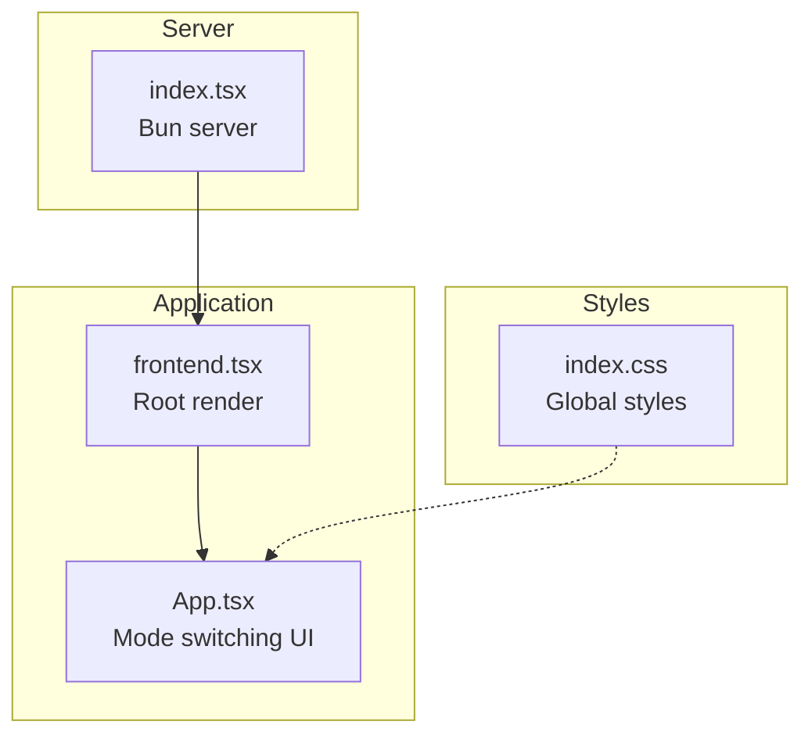
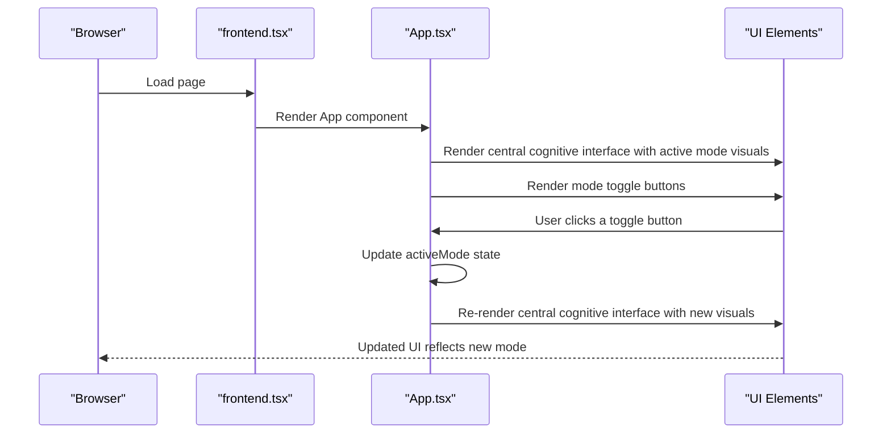
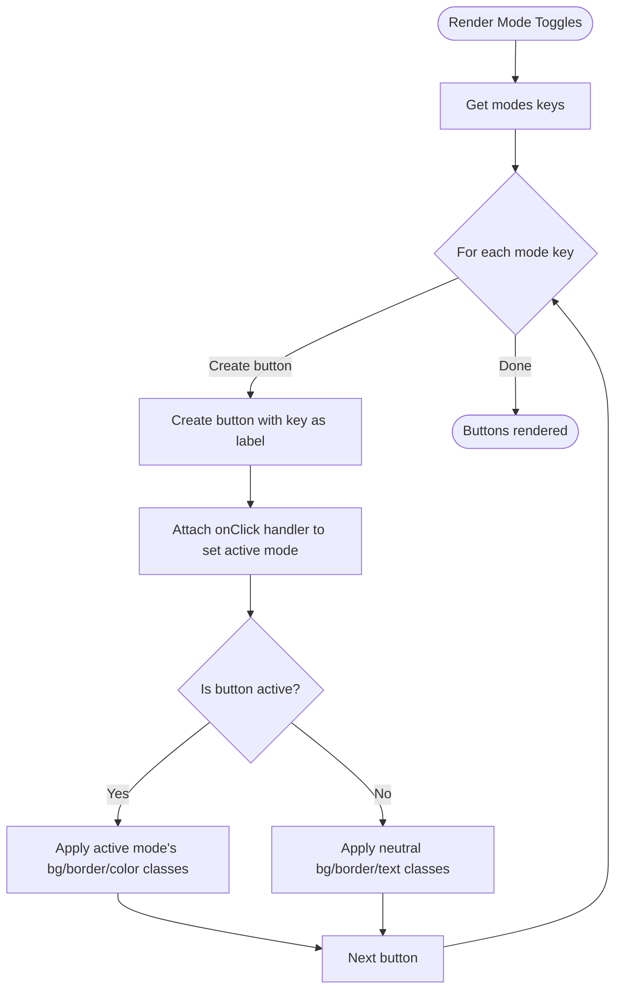
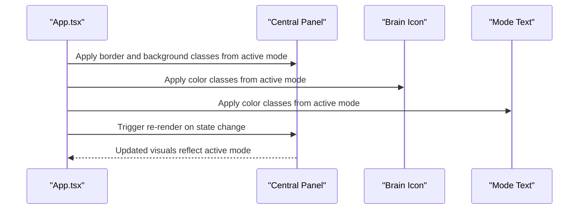
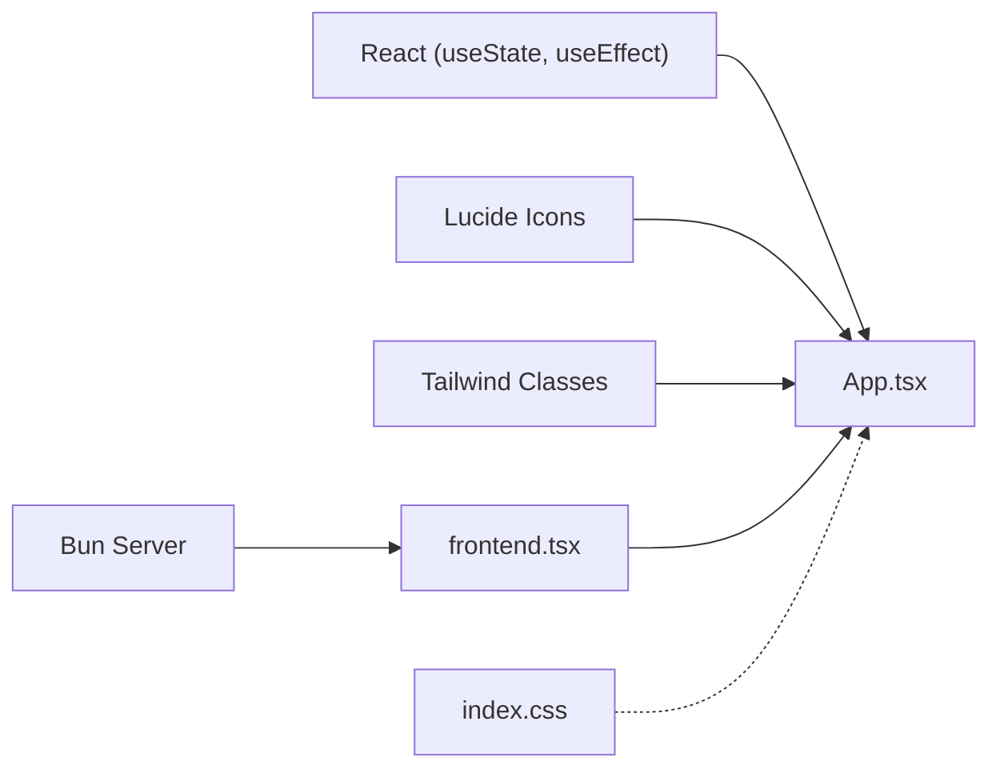

# Mode Switching

<cite>
**Referenced Files in This Document**
- [App.tsx](file://src/App.tsx)
- [frontend.tsx](file://src/frontend.tsx)
- [index.tsx](file://src/index.tsx)
- [index.css](file://src/index.css)
- [README.md](file://README.md)
</cite>

## Table of Contents
1. [Introduction](#introduction)
2. [Project Structure](#project-structure)
3. [Core Components](#core-components)
4. [Architecture Overview](#architecture-overview)
5. [Detailed Component Analysis](#detailed-component-analysis)
6. [Dependency Analysis](#dependency-analysis)
7. [Performance Considerations](#performance-considerations)
8. [Troubleshooting Guide](#troubleshooting-guide)
9. [Conclusion](#conclusion)

## Introduction
This document explains the mode switching functionality that allows users to toggle between Executive, Technical, and Creative modes. It covers React state management using useState for the active mode, how the modes object defines visual properties and behavioral descriptions, the implementation of mode toggle buttons, conditional styling based on the active state, and how mode changes propagate to update the UI. It also addresses state persistence considerations and accessibility best practices for mode selection.

## Project Structure
The mode switching feature is implemented in a single React component file and rendered by the application entry point. The server setup and global styles are separate concerns.

**Diagram sources**
- [frontend.tsx](file://src/frontend.tsx#L1-L27)
- [App.tsx](file://src/App.tsx#L1-L206)
- [index.tsx](file://src/index.tsx#L1-L42)
- [index.css](file://src/index.css#L1-L188)

**Section sources**
- [frontend.tsx](file://src/frontend.tsx#L1-L27)
- [App.tsx](file://src/App.tsx#L1-L206)
- [index.tsx](file://src/index.tsx#L1-L42)
- [index.css](file://src/index.css#L1-L188)

## Core Components
- Active mode state: managed with useState initialized to the Executive mode.
- Modes object: defines color, background, border, icon, and description for each mode.
- Toggle buttons: dynamically generated from the modes keys with onClick handlers that update the active mode.
- Conditional styling: the active mode’s visual properties are applied to the central cognitive interface and the toggle buttons.

Key implementation references:
- State initialization and modes definition: [App.tsx](file://src/App.tsx#L19-L33)
- Central cognitive interface applying active mode visuals: [App.tsx](file://src/App.tsx#L116-L128)
- Toggle buttons rendering and onClick handler: [App.tsx](file://src/App.tsx#L129-L140)

**Section sources**
- [App.tsx](file://src/App.tsx#L19-L33)
- [App.tsx](file://src/App.tsx#L116-L140)

## Architecture Overview
The mode switching architecture centers on a single functional component that manages local state and derives UI updates from that state. The server serves static HTML and routes, while the client-side React app handles interactive behavior.

**Diagram sources**
- [frontend.tsx](file://src/frontend.tsx#L1-L27)
- [App.tsx](file://src/App.tsx#L1-L206)

## Detailed Component Analysis

### State Management and Modes Definition
- The active mode is stored in a React state variable initialized to the Executive mode.
- The modes object enumerates the three modes and associates each with:
  - Color classes for text and icons
  - Background classes for the central panel
  - Border classes for the central panel
  - An icon component
  - A short description

Implementation references:
- State initialization: [App.tsx](file://src/App.tsx#L19-L23)
- Modes definition: [App.tsx](file://src/App.tsx#L29-L33)

**Section sources**
- [App.tsx](file://src/App.tsx#L19-L33)

### Toggle Buttons Implementation
- The toggle buttons are dynamically generated from the modes keys.
- Each button has an onClick handler that sets the active mode to the clicked value.
- The active button receives the active mode’s background, border, and color classes; inactive buttons use neutral styling.

Implementation references:
- Dynamic button generation and onClick handler: [App.tsx](file://src/App.tsx#L129-L140)

**Diagram sources**
- [App.tsx](file://src/App.tsx#L129-L140)

**Section sources**
- [App.tsx](file://src/App.tsx#L129-L140)

### Conditional Styling and UI Updates
- The central cognitive interface applies the active mode’s border and background classes.
- The brain icon and mode text apply the active mode’s color classes.
- The pulse effect is independent of mode but contributes to the animated visual feedback.

Implementation references:
- Central panel styling with active mode classes: [App.tsx](file://src/App.tsx#L116-L128)

**Diagram sources**
- [App.tsx](file://src/App.tsx#L116-L128)

**Section sources**
- [App.tsx](file://src/App.tsx#L116-L128)

### Accessibility Best Practices for Mode Selection
- Keyboard navigation: ensure toggle buttons are focusable and operable via Enter/Space.
- ARIA attributes: add aria-pressed to indicate active state for screen readers.
- Label clarity: keep labels concise and meaningful; the current labels are the mode names.
- Focus indicators: ensure visible focus styles for keyboard users.
- Reduced motion: respect reduced motion preferences; animations are already designed to be subtle.

[No sources needed since this section provides general guidance]

### State Persistence Considerations
- Current behavior: active mode is stored in component state and resets on reload.
- Recommended approaches:
  - Persist to localStorage/sessionStorage keyed by a unique identifier.
  - On mount, read the persisted value and initialize state accordingly.
  - Update persistence whenever the active mode changes.
- Considerations:
  - Respect user preference across sessions.
  - Clear stale data if the modes object changes.

[No sources needed since this section provides general guidance]

## Dependency Analysis
The mode switching feature depends on:
- React for state and rendering
- Tailwind-like CSS classes for styling
- Lucide icons for visual representation

**Diagram sources**
- [App.tsx](file://src/App.tsx#L1-L206)
- [frontend.tsx](file://src/frontend.tsx#L1-L27)
- [index.tsx](file://src/index.tsx#L1-L42)
- [index.css](file://src/index.css#L1-L188)

**Section sources**
- [App.tsx](file://src/App.tsx#L1-L206)
- [frontend.tsx](file://src/frontend.tsx#L1-L27)
- [index.tsx](file://src/index.tsx#L1-L42)
- [index.css](file://src/index.css#L1-L188)

## Performance Considerations
- Rendering cost: The modes object is small and toggles are O(n) over the number of modes (constant).
- Re-renders: Updating activeMode triggers a re-render of the central panel and buttons; this is efficient for the given component size.
- Animations: Pulse effect and transitions are lightweight; consider disabling for reduced motion users.

[No sources needed since this section provides general guidance]

## Troubleshooting Guide
- Toggle buttons not updating visuals:
  - Verify the active mode state is changing on click.
  - Confirm the central panel and buttons bind to the active mode classes.
- Incorrect mode labels:
  - Ensure the modes keys match the intended labels.
- Styling conflicts:
  - Check Tailwind classes precedence and avoid overriding active mode classes unintentionally.
- Server-side rendering:
  - The server serves static HTML; mode switching is purely client-side.

**Section sources**
- [App.tsx](file://src/App.tsx#L116-L140)
- [index.tsx](file://src/index.tsx#L1-L42)

## Conclusion
The mode switching feature is implemented cleanly with React state and Tailwind classes. The modes object centralizes visual and descriptive metadata, enabling easy updates and consistent UI behavior. The toggle buttons provide immediate feedback, and the central panel adapts its visuals dynamically. For production readiness, consider persisting the active mode and enhancing accessibility with ARIA attributes and keyboard support.