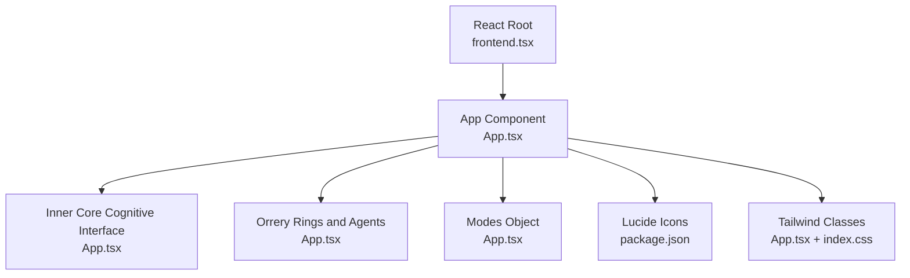
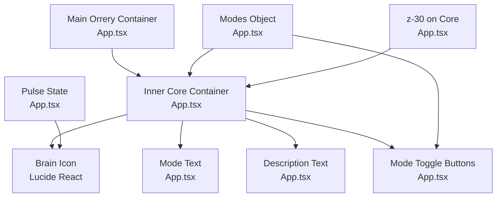
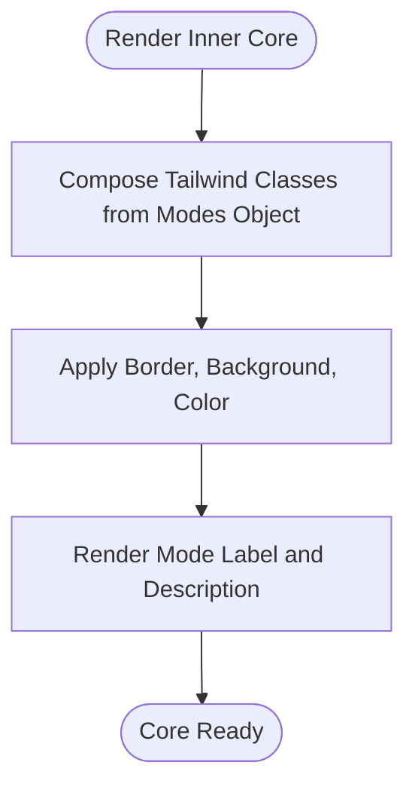
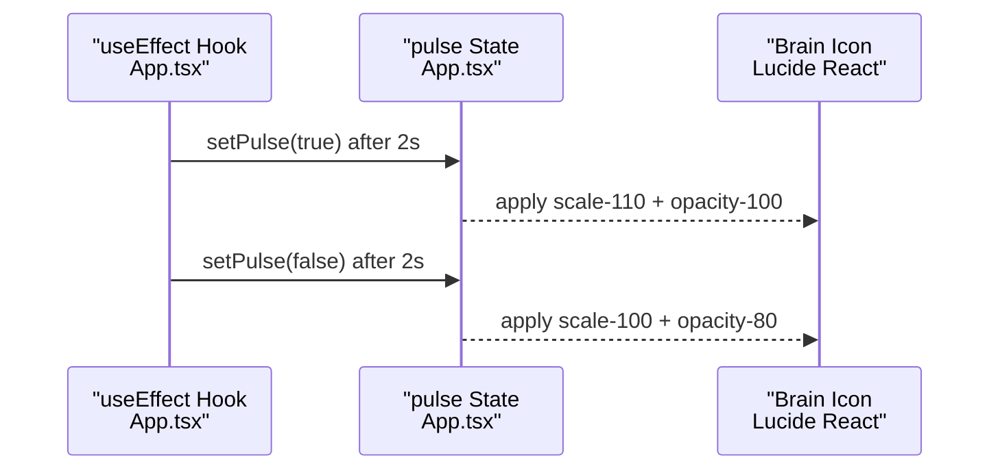
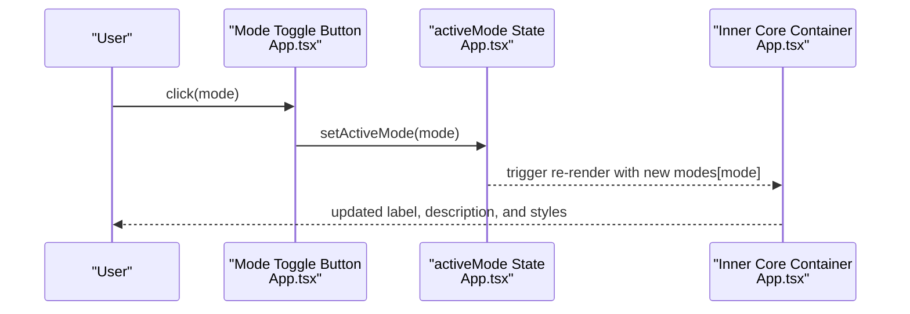
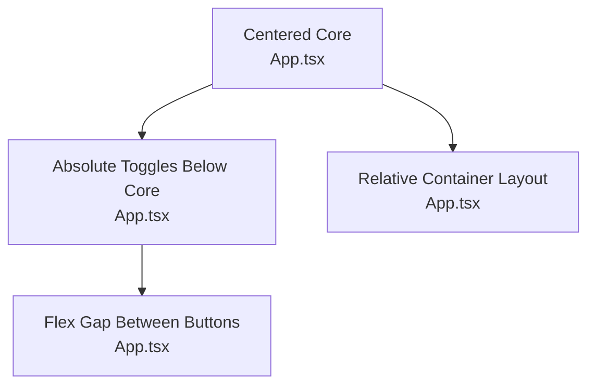
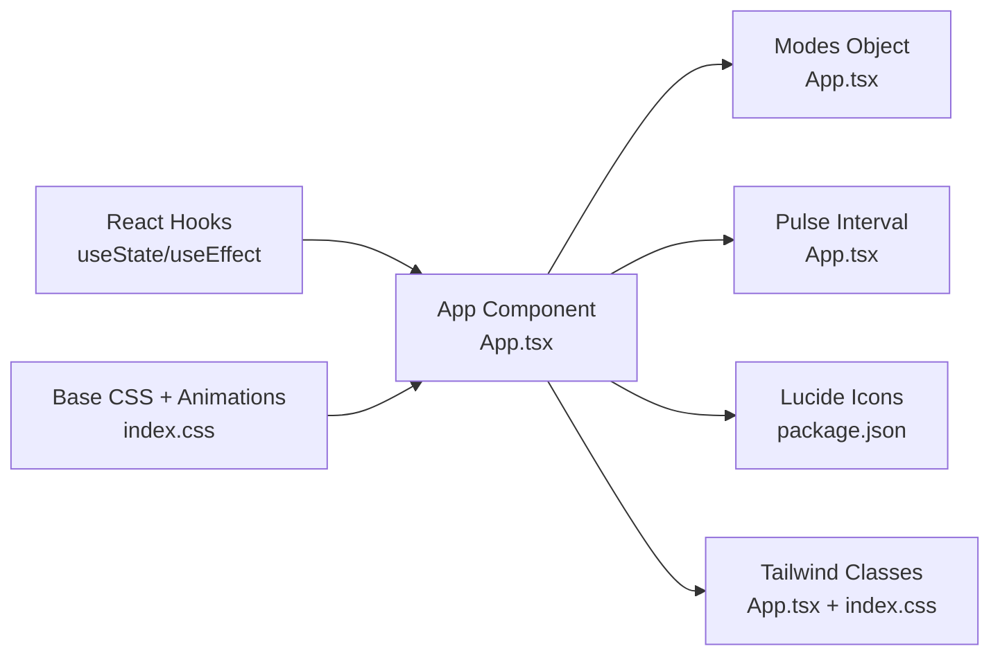

# Inner Core: Cognitive Interface

<cite>
**Referenced Files in This Document**
- [App.tsx](file://src/App.tsx)
- [conceptual.md](file://AB/conceptual.md)
- [frontend.tsx](file://src/frontend.tsx)
- [package.json](file://package.json)
- [index.css](file://src/index.css)
</cite>

## Table of Contents
1. [Introduction](#introduction)
2. [Project Structure](#project-structure)
3. [Core Components](#core-components)
4. [Architecture Overview](#architecture-overview)
5. [Detailed Component Analysis](#detailed-component-analysis)
6. [Dependency Analysis](#dependency-analysis)
7. [Performance Considerations](#performance-considerations)
8. [Troubleshooting Guide](#troubleshooting-guide)
9. [Conclusion](#conclusion)

## Introduction
This document explains the inner core cognitive interface that serves as the central control panel of the orrery visualization. It focuses on:
- Displaying the active mode (Executive, Technical, Creative) with dynamic styling driven by the modes object.
- The pulsing brain icon animation that toggles every two seconds using React’s state and lifecycle hooks.
- Mode toggle buttons that switch between operational modes with conditional styling highlighting the active mode.
- Responsive layout using absolute positioning for the mode toggles beneath the core.
- Tailwind classes enabling smooth transitions between states.
- The Brain icon from Lucide React and how the pulse state affects its scale and opacity.
- The z-index hierarchy that places the core above other orrery components.
- The design rationale behind the centralized cognitive interface concept.

## Project Structure
The cognitive interface lives within the main application component and is embedded in the orrery visualization. The surrounding orrery rings and agents demonstrate the broader system context, while the inner core is the focal point for mode selection and awareness.

**Diagram sources**
- [frontend.tsx](file://src/frontend.tsx#L8-L26)
- [App.tsx](file://src/App.tsx#L1-L206)
- [package.json](file://package.json#L25-L30)
- [index.css](file://src/index.css#L1-L188)

**Section sources**
- [frontend.tsx](file://src/frontend.tsx#L8-L26)
- [App.tsx](file://src/App.tsx#L1-L206)
- [package.json](file://package.json#L25-L30)
- [index.css](file://src/index.css#L1-L188)

## Core Components
- Active mode state: A single state variable tracks the current mode among Executive, Technical, and Creative.
- Modes object: Defines color, background, border, icon, and description for each mode.
- Pulse state: Boolean toggled every two seconds to drive the brain icon’s breathing effect.
- Mode toggles: Buttons that update the active mode and conditionally highlight the active button.

Key implementation references:
- Active mode and pulse state initialization: [App.tsx](file://src/App.tsx#L19-L27)
- Modes object definition: [App.tsx](file://src/App.tsx#L29-L33)
- Pulse interval setup: [App.tsx](file://src/App.tsx#L24-L27)
- Inner core container and dynamic classes: [App.tsx](file://src/App.tsx#L116-L127)
- Brain icon with pulse-driven scale/opacity: [App.tsx](file://src/App.tsx#L118-L121)
- Mode toggle buttons and active highlighting: [App.tsx](file://src/App.tsx#L129-L140)

**Section sources**
- [App.tsx](file://src/App.tsx#L19-L27)
- [App.tsx](file://src/App.tsx#L29-L33)
- [App.tsx](file://src/App.tsx#L116-L140)

## Architecture Overview
The inner core is positioned absolutely within the main orrery container and layered above the outer and middle rings. The z-index ensures it remains visually dominant. The modes object drives all visual styling for the core, while the pulse state animates the brain icon.

**Diagram sources**
- [App.tsx](file://src/App.tsx#L80-L141)
- [App.tsx](file://src/App.tsx#L116-L140)

**Section sources**
- [App.tsx](file://src/App.tsx#L80-L141)

## Detailed Component Analysis

### Inner Core Container and Dynamic Styling
- The core container is a circular panel with rounded borders, padding, and shadow. Its classes are dynamically composed from the active mode’s border, background, and text color.
- Transition durations and z-index ensure smooth visual updates and proper stacking order.
- The description text uses a muted color scheme to de-emphasize secondary information while keeping contrast readable.

Implementation references:
- Dynamic border/background/text classes: [App.tsx](file://src/App.tsx#L116-L127)
- Transition and z-index classes: [App.tsx](file://src/App.tsx#L116-L117)
- Description text styling: [App.tsx](file://src/App.tsx#L125-L127)

**Diagram sources**
- [App.tsx](file://src/App.tsx#L116-L127)

**Section sources**
- [App.tsx](file://src/App.tsx#L116-L127)

### Pulsing Brain Icon Animation
- A two-second interval toggles the pulse state, driving the brain icon’s scale and opacity transitions.
- The icon’s size is fixed, but its scale and opacity vary based on the pulse state, creating a subtle breathing effect.
- The pulse state is initialized off and toggled automatically, with cleanup in the effect’s return.

Implementation references:
- Pulse state and interval: [App.tsx](file://src/App.tsx#L21-L27)
- Pulse-driven icon classes: [App.tsx](file://src/App.tsx#L118-L121)

**Diagram sources**
- [App.tsx](file://src/App.tsx#L21-L27)
- [App.tsx](file://src/App.tsx#L118-L121)

**Section sources**
- [App.tsx](file://src/App.tsx#L21-L27)
- [App.tsx](file://src/App.tsx#L118-L121)

### Mode Toggle Buttons and Conditional Highlighting
- The toggle buttons render for each mode in the modes object.
- Clicking a button updates the active mode state, which recomposes the core’s styles and updates the label and description.
- The active button is highlighted using the mode’s background, border, and text color; inactive buttons use neutral tones with hover effects.

Implementation references:
- Button rendering loop: [App.tsx](file://src/App.tsx#L129-L140)
- Active button highlighting logic: [App.tsx](file://src/App.tsx#L132-L139)
- Modes object used for styling: [App.tsx](file://src/App.tsx#L29-L33)

**Diagram sources**
- [App.tsx](file://src/App.tsx#L129-L140)
- [App.tsx](file://src/App.tsx#L116-L127)

**Section sources**
- [App.tsx](file://src/App.tsx#L129-L140)
- [App.tsx](file://src/App.tsx#L29-L33)

### Responsive Layout and Absolute Positioning
- The mode toggles are positioned absolutely below the core using negative bottom offsets and a flex container.
- The core itself is centered within the main orrery container, ensuring consistent placement regardless of screen size.
- Tailwind spacing utilities and absolute positioning keep the toggles aligned beneath the core.

Implementation references:
- Absolute positioning of toggles: [App.tsx](file://src/App.tsx#L129-L131)
- Core container sizing and centering: [App.tsx](file://src/App.tsx#L116-L117)
- Main orrery container: [App.tsx](file://src/App.tsx#L80-L141)

**Diagram sources**
- [App.tsx](file://src/App.tsx#L116-L141)

**Section sources**
- [App.tsx](file://src/App.tsx#L116-L141)

### Tailwind Transitions and Smooth State Changes
- The core’s container applies transition classes to animate border, background, and text color changes when the active mode switches.
- The brain icon’s scale and opacity transitions are animated via Tailwind utilities controlled by the pulse state.
- Duration and timing are configured to feel responsive yet smooth.

Implementation references:
- Transition classes on core: [App.tsx](file://src/App.tsx#L116-L117)
- Transition classes on icon: [App.tsx](file://src/App.tsx#L118-L121)

**Section sources**
- [App.tsx](file://src/App.tsx#L116-L121)

### Lucide React Brain Icon Integration
- The Brain icon is imported from lucide-react and rendered inside the core container.
- Its size is fixed, while scale and opacity are dynamically controlled by the pulse state and mode color classes.
- The icon’s color inherits from the active mode’s color class, ensuring consistent theming.

Implementation references:
- Import and usage: [App.tsx](file://src/App.tsx#L2-L17)
- Icon rendering and dynamic classes: [App.tsx](file://src/App.tsx#L118-L121)

**Section sources**
- [App.tsx](file://src/App.tsx#L2-L17)
- [App.tsx](file://src/App.tsx#L118-L121)

### Z-Index Hierarchy and Layering
- The core container uses a high z-index to appear above the outer and middle rings and other orrery elements.
- The tooltip for agent details and the starfield background are layered beneath the core, ensuring readability and focus.

Implementation references:
- z-index on core: [App.tsx](file://src/App.tsx#L116-L117)
- Tooltip and background layers: [App.tsx](file://src/App.tsx#L161-L179), [App.tsx](file://src/App.tsx#L52-L67)

**Section sources**
- [App.tsx](file://src/App.tsx#L116-L117)
- [App.tsx](file://src/App.tsx#L161-L179)
- [App.tsx](file://src/App.tsx#L52-L67)

### Design Rationale: Centralized Cognitive Interface
- The inner core acts as the system’s cognitive center, reflecting the current operational mode and providing immediate feedback through dynamic visuals and animation.
- The pulsing brain reinforces the metaphor of cognitive awareness, subtly drawing attention without overwhelming the orrery’s orbital dynamics.
- The mode toggles offer quick, low-friction switching, enabling operators to shift focus between strategic oversight, technical architecture, and creative design.

Conceptual references:
- Conceptual overview and motivation: [conceptual.md](file://AB/conceptual.md#L1-L205)

**Section sources**
- [conceptual.md](file://AB/conceptual.md#L1-L205)

## Dependency Analysis
- React state and lifecycle: useState and useEffect manage active mode and pulse intervals.
- Lucide icons: Imported from lucide-react for consistent iconography.
- Tailwind classes: Used extensively for dynamic theming and transitions.
- CSS base styles: Global styles and animations support the starfield background and reduced-motion preferences.

**Diagram sources**
- [App.tsx](file://src/App.tsx#L19-L27)
- [App.tsx](file://src/App.tsx#L29-L33)
- [App.tsx](file://src/App.tsx#L116-L140)
- [package.json](file://package.json#L25-L30)
- [index.css](file://src/index.css#L1-L188)

**Section sources**
- [App.tsx](file://src/App.tsx#L19-L27)
- [App.tsx](file://src/App.tsx#L29-L33)
- [package.json](file://package.json#L25-L30)
- [index.css](file://src/index.css#L1-L188)

## Performance Considerations
- The pulse interval runs at a fixed cadence; ensure it remains lightweight and does not trigger unnecessary re-renders beyond the icon and core container.
- Use Tailwind’s transition utilities to minimize custom CSS and reduce layout thrashing.
- Keep the modes object small and static to avoid recomputation costs during renders.
- Consider disabling animations for users who prefer reduced motion, leveraging the existing reduced-motion media query in the base CSS.

[No sources needed since this section provides general guidance]

## Troubleshooting Guide
- If the brain icon does not pulse:
  - Verify the interval effect is mounted and not cleared prematurely.
  - Confirm the pulse state toggles between true and false.
  - Check that the icon receives the correct Tailwind classes for scale and opacity.
  - Reference: [App.tsx](file://src/App.tsx#L21-L27), [App.tsx](file://src/App.tsx#L118-L121)

- If mode toggles do not change the core:
  - Ensure the onClick handlers call the setter with the correct mode key.
  - Confirm the modes object keys match the button keys.
  - Reference: [App.tsx](file://src/App.tsx#L129-L140), [App.tsx](file://src/App.tsx#L29-L33)

- If styling does not update:
  - Verify Tailwind classes are concatenated correctly from the modes object.
  - Confirm the core container applies the dynamic border, background, and color classes.
  - Reference: [App.tsx](file://src/App.tsx#L116-L127)

- If animations feel janky:
  - Reduce transition duration or simplify the number of animated properties.
  - Reference: [index.css](file://src/index.css#L181-L188)

**Section sources**
- [App.tsx](file://src/App.tsx#L21-L27)
- [App.tsx](file://src/App.tsx#L116-L140)
- [App.tsx](file://src/App.tsx#L29-L33)
- [App.tsx](file://src/App.tsx#L116-L127)
- [index.css](file://src/index.css#L181-L188)

## Conclusion
The inner core cognitive interface is the visual and interactive heart of the orrery. Through dynamic theming, a subtle pulsing animation, and intuitive mode toggles, it communicates the system’s current operational mode while maintaining a strong focus on the broader orrery ecosystem. The z-index hierarchy and responsive layout ensure the core remains prominent, while Tailwind classes provide smooth transitions and consistent styling across states.