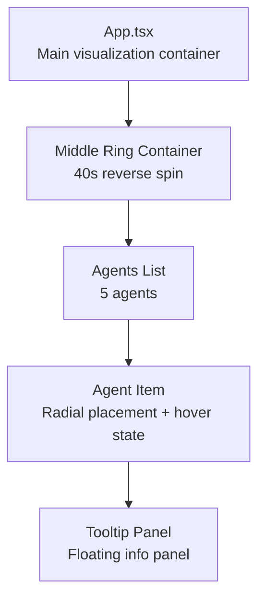
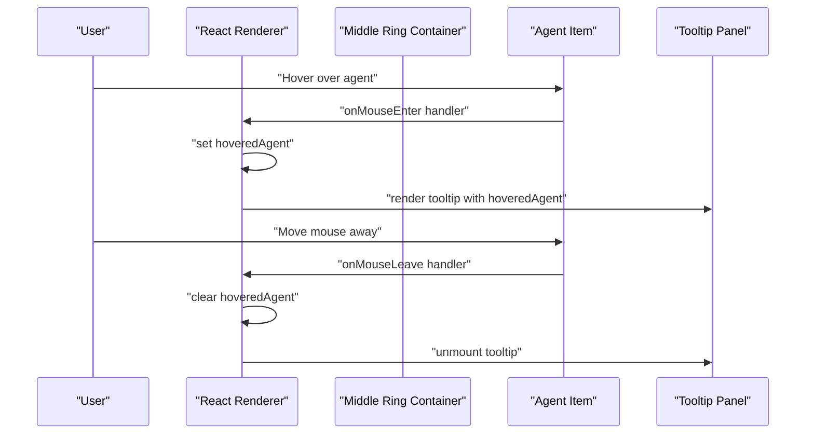
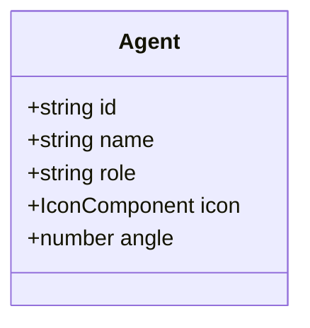
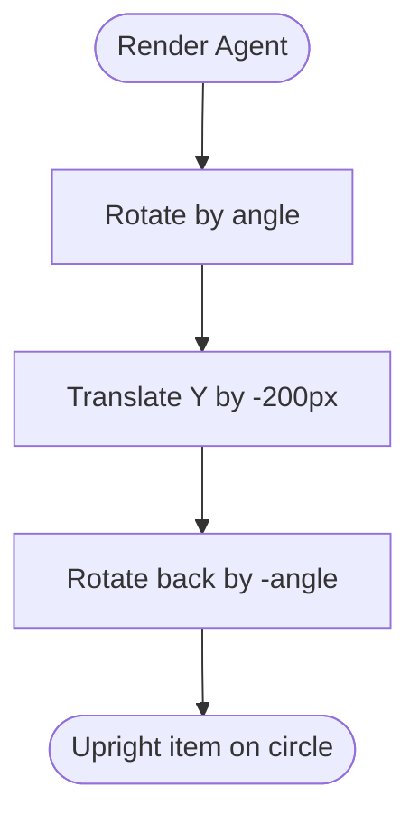
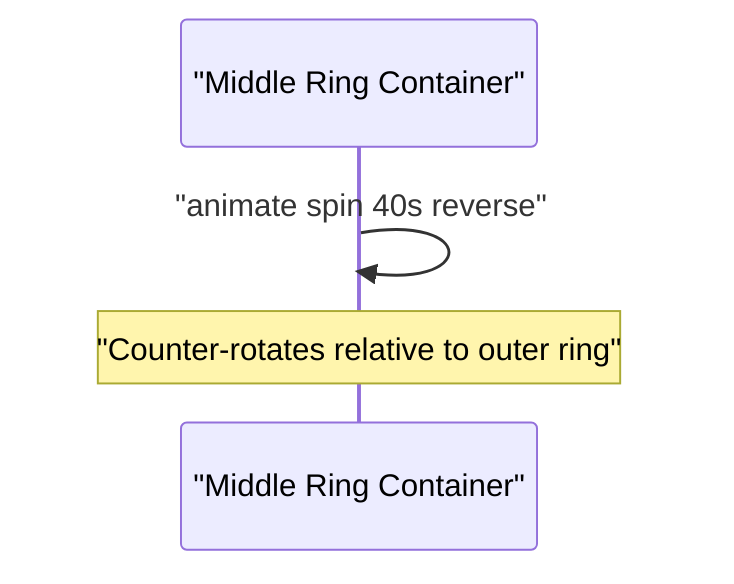
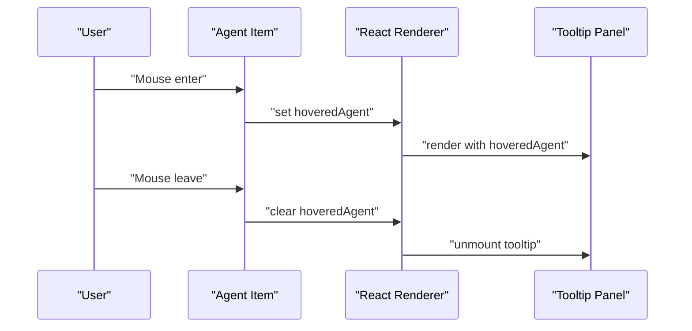
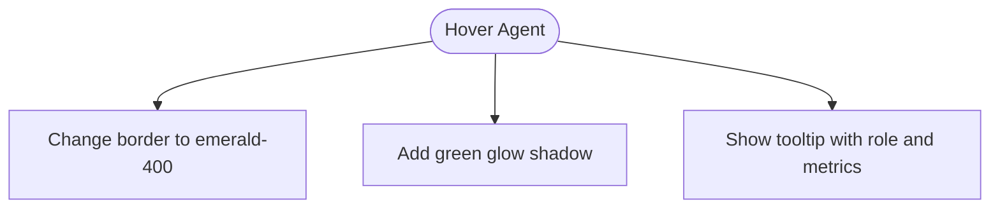
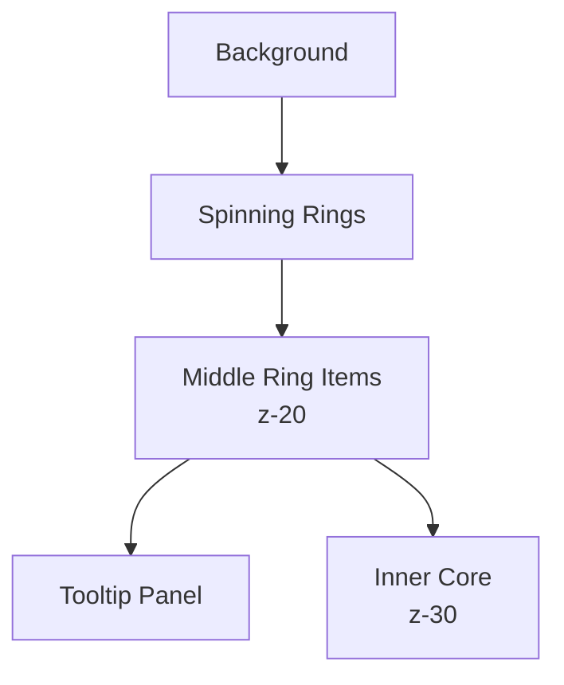
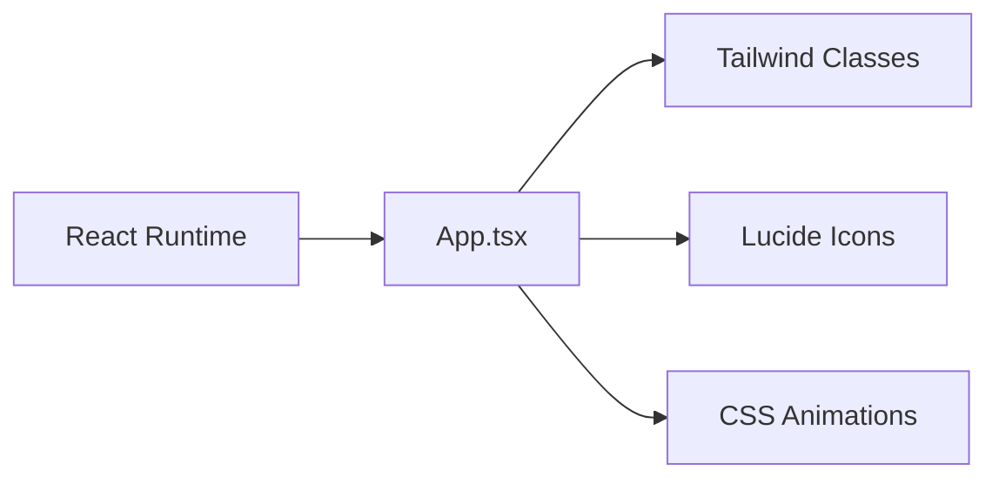

# Middle Ring: C-Suite Agents

<cite>
**Referenced Files in This Document**
- [App.tsx](file://src/App.tsx)
- [frontend.tsx](file://src/frontend.tsx)
- [index.css](file://src/index.css)
- [package.json](file://package.json)
</cite>

## Table of Contents
1. [Introduction](#introduction)
2. [Project Structure](#project-structure)
3. [Core Components](#core-components)
4. [Architecture Overview](#architecture-overview)
5. [Detailed Component Analysis](#detailed-component-analysis)
6. [Dependency Analysis](#dependency-analysis)
7. [Performance Considerations](#performance-considerations)
8. [Troubleshooting Guide](#troubleshooting-guide)
9. [Conclusion](#conclusion)

## Introduction
This document explains the middle ring of the orrery visualization that displays C-suite AI agents in a counter-rotating circular arrangement. It covers the agents data model, how angles create equal 72-degree spacing for five agents, the React rendering pipeline with precise radial positioning using CSS transforms, the reverse animation, hover interactions and tooltip behavior, visual feedback (borders and shadows), Lucide icon usage for roles, name abbreviation extraction, accessibility considerations, and z-index stacking for proper layering.

## Project Structure
The middle ring is implemented within the main application component. The visualization is composed of:
- An outer ring (not the focus here)
- A middle ring containing five C-suite agents
- An inner core (also not the focus here)
- Floating tooltip for agent details

**Diagram sources**
- [App.tsx](file://src/App.tsx#L79-L114)
- [App.tsx](file://src/App.tsx#L161-L179)

**Section sources**
- [App.tsx](file://src/App.tsx#L79-L114)
- [App.tsx](file://src/App.tsx#L161-L179)

## Core Components
- Agents data structure: Each agent has id, name, role, icon, and angle properties. The angle values (0, 72, 144, 216, 288) produce equal 72-degree spacing around the circle.
- Rendering: The middle ring container spins in reverse direction at a 40-second period. Each agent is positioned using a two-stage transform chain to achieve radial placement while maintaining upright orientation.
- Interaction: Hovering an agent updates a floating tooltip with agent details and triggers visual feedback (border color change and glow shadow).
- Icons and names: Lucide icons visually represent roles; agent names are abbreviated to a short form derived from the second token of the full name string.

**Section sources**
- [App.tsx](file://src/App.tsx#L35-L41)
- [App.tsx](file://src/App.tsx#L100-L114)
- [App.tsx](file://src/App.tsx#L161-L179)

## Architecture Overview
The middle ring is a self-contained React component that composes:
- A spinning container with reverse animation
- A list of agent items rendered with precise transforms
- A floating tooltip bound to the hovered agent

**Diagram sources**
- [App.tsx](file://src/App.tsx#L101-L114)
- [App.tsx](file://src/App.tsx#L161-L179)

## Detailed Component Analysis

### Agents Data Model
- Properties: id, name, role, icon, angle
- Angle spacing: 0°, 72°, 144°, 216°, 288° evenly divide 360° into five segments
- Icon mapping: Each role is represented by a Lucide icon

**Diagram sources**
- [App.tsx](file://src/App.tsx#L35-L41)

**Section sources**
- [App.tsx](file://src/App.tsx#L35-L41)

### Radial Positioning with CSS Transforms
Each agent item is placed using a two-stage transform:
- Rotate by agent.angle
- Translate along Y-axis by -200px (radius)
- Rotate back by -agent.angle

This keeps the agent upright while placing it on the circle’s circumference.

**Diagram sources**
- [App.tsx](file://src/App.tsx#L107-L109)

**Section sources**
- [App.tsx](file://src/App.tsx#L107-L109)

### Reverse Animation and Spinning Container
- The middle ring container rotates in reverse direction at a 40-second period.
- This creates a counter-rotation effect relative to the outer ring.

**Diagram sources**
- [App.tsx](file://src/App.tsx#L100-L100)

**Section sources**
- [App.tsx](file://src/App.tsx#L100-L100)

### Hover Interactions and Tooltip Behavior
- Mouse enter/leave handlers update the hovered agent state.
- A floating tooltip appears to the right of the visualization, displaying the agent’s name, role, and a progress indicator.

**Diagram sources**
- [App.tsx](file://src/App.tsx#L101-L114)
- [App.tsx](file://src/App.tsx#L161-L179)

**Section sources**
- [App.tsx](file://src/App.tsx#L101-L114)
- [App.tsx](file://src/App.tsx#L161-L179)

### Visual Feedback on Hover
- Border color transitions to emerald-400
- Shadow expands to a soft green glow
- Tooltip highlights the agent’s icon and role

**Diagram sources**
- [App.tsx](file://src/App.tsx#L106-L106)
- [App.tsx](file://src/App.tsx#L161-L179)

**Section sources**
- [App.tsx](file://src/App.tsx#L106-L106)
- [App.tsx](file://src/App.tsx#L161-L179)

### Lucide Icons and Role Representation
- Each agent role is mapped to a Lucide icon component.
- The icon is rendered inside the agent item with a consistent size and color.

Examples of icon-role mappings:
- Strategic leadership: shield-like icon
- Technical architecture: CPU icon
- Financial optimization: chart icon
- Legal & governance: shield-like icon
- Admin excellence: users icon

**Section sources**
- [App.tsx](file://src/App.tsx#L35-L41)
- [App.tsx](file://src/App.tsx#L111-L111)

### Name Abbreviation Extraction
- The agent’s full name is split by spaces.
- The second token (index 1) is used as the abbreviated display name.
- Example: “CEO Mimi” becomes “Mimi”.

**Section sources**
- [App.tsx](file://src/App.tsx#L112-L112)

### Accessibility Considerations
- Interactive elements are focusable and keyboard-accessible by default in browsers.
- No explicit aria-* attributes are present in the middle ring code.
- Ensure that the tooltip remains accessible and does not trap focus.
- Consider adding aria-labels or aria-describedby for screen reader support if needed.

[No sources needed since this section provides general guidance]

### Z-Index Stacking and Layering
- Middle ring agent items use z-20 to appear above the spinning rings and below the inner core.
- The tooltip uses a floating layout and appears to the right of the visualization.
- The inner core uses z-30 to remain above the middle ring.

**Diagram sources**
- [App.tsx](file://src/App.tsx#L106-L106)
- [App.tsx](file://src/App.tsx#L116-L141)

**Section sources**
- [App.tsx](file://src/App.tsx#L106-L106)
- [App.tsx](file://src/App.tsx#L116-L141)

## Dependency Analysis
- The middle ring relies on:
  - React state for hover handling
  - Tailwind classes for styling and animations
  - Lucide icons for role representation
  - CSS animations for reverse rotation

**Diagram sources**
- [App.tsx](file://src/App.tsx#L1-L18)
- [App.tsx](file://src/App.tsx#L100-L114)
- [App.tsx](file://src/App.tsx#L161-L179)
- [package.json](file://package.json#L25-L30)

**Section sources**
- [App.tsx](file://src/App.tsx#L1-L18)
- [App.tsx](file://src/App.tsx#L100-L114)
- [App.tsx](file://src/App.tsx#L161-L179)
- [package.json](file://package.json#L25-L30)

## Performance Considerations
- CSS transforms and opacity changes are hardware-accelerated, minimizing layout thrashing.
- The reverse 40-second spin animation is lightweight and runs smoothly.
- Tooltip rendering is conditional and unmounted when not needed.
- Consider batching hover updates if many agents are added later.

[No sources needed since this section provides general guidance]

## Troubleshooting Guide
- If agents overlap or misalign:
  - Verify the radius value (-200px) matches the middle ring’s radius.
  - Confirm angle values are correct and evenly spaced.
- If tooltip does not show:
  - Ensure the hoveredAgent state is being set on mouse enter and cleared on mouse leave.
  - Check that the tooltip is rendered conditionally based on hoveredAgent.
- If hover visuals do not appear:
  - Verify Tailwind hover variants are enabled and classes are applied.
  - Confirm z-index stacking prevents clipping behind other elements.

**Section sources**
- [App.tsx](file://src/App.tsx#L101-L114)
- [App.tsx](file://src/App.tsx#L161-L179)

## Conclusion
The middle ring of the orrery presents C-suite agents in a visually coherent, counter-rotating arrangement. Its design centers on precise radial positioning via CSS transforms, a reverse 40-second spin, responsive hover feedback, and a floating tooltip. The agents’ roles are visually represented by Lucide icons, and names are abbreviated for concise labeling. Proper z-index stacking ensures layered depth with surrounding rings and the inner core. The implementation balances performance and clarity, offering an accessible and engaging interface.