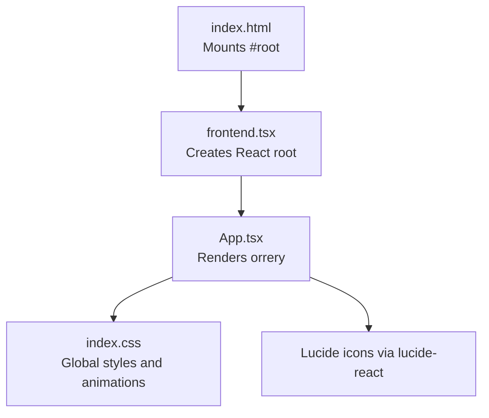
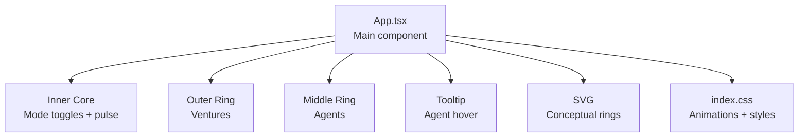
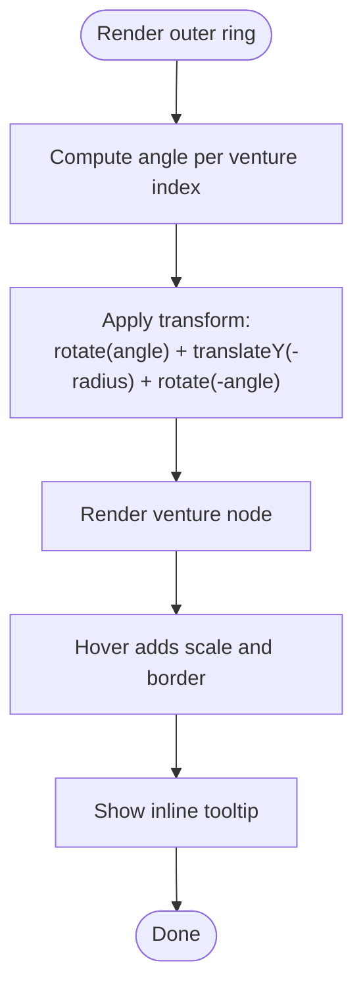
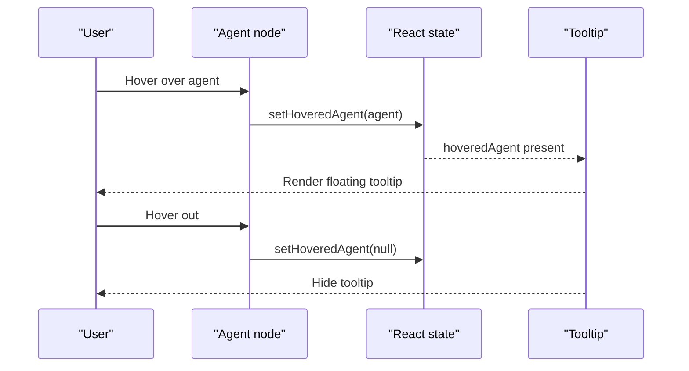
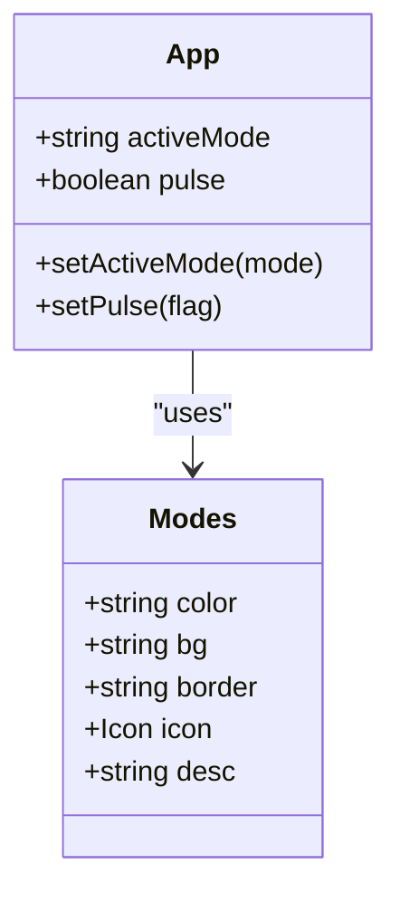
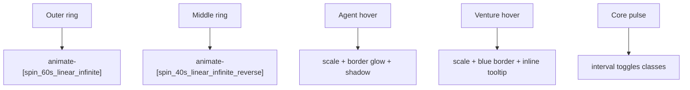
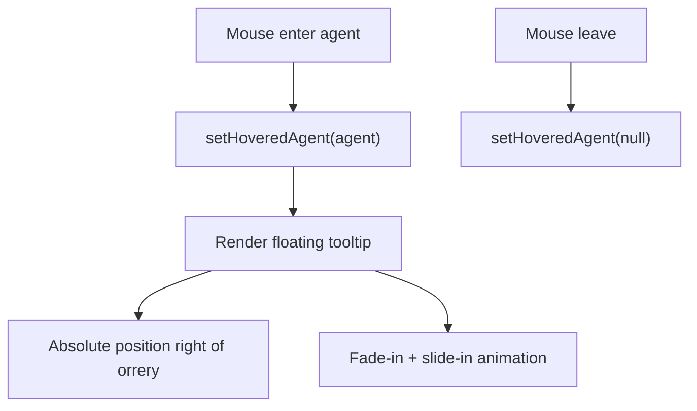
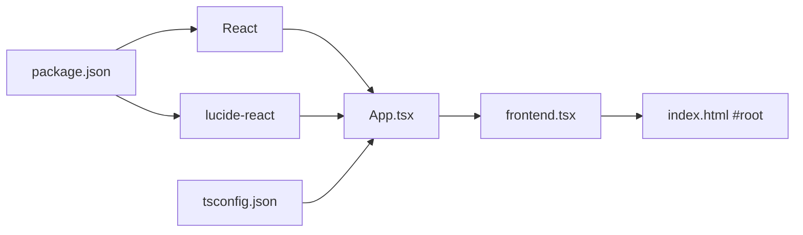
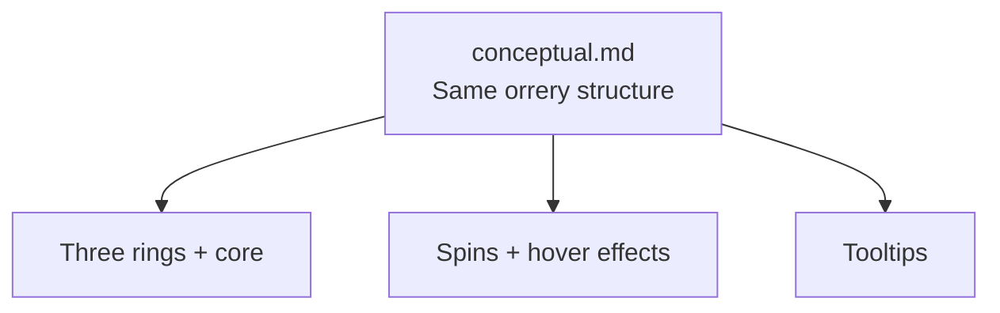

# Orrery Visualization

<cite>
**Referenced Files in This Document**
- [App.tsx](file://src/App.tsx)
- [frontend.tsx](file://src/frontend.tsx)
- [index.html](file://src/index.html)
- [index.css](file://src/index.css)
- [conceptual.md](file://AB/conceptual.md)
- [package.json](file://package.json)
- [tsconfig.json](file://tsconfig.json)
</cite>

## Table of Contents
1. [Introduction](#introduction)
2. [Project Structure](#project-structure)
3. [Core Components](#core-components)
4. [Architecture Overview](#architecture-overview)
5. [Detailed Component Analysis](#detailed-component-analysis)
6. [Dependency Analysis](#dependency-analysis)
7. [Performance Considerations](#performance-considerations)
8. [Troubleshooting Guide](#troubleshooting-guide)
9. [Conclusion](#conclusion)
10. [Appendices](#appendices)

## Introduction
This document explains the orrery visualization system that displays AI agents and ventures arranged in concentric rings around a central cognitive interface. The visualization uses CSS transforms to position elements radially, React rendering loops to map over data arrays, and Tailwind classes for styling. It covers:
- Three rings: outer (ventures), middle (C-suite agents), and inner core (cognitive interface)
- Radial positioning via rotate and translateY transforms
- Infinite spinning animations in both directions
- Hover effects and tooltip positioning
- Responsive layout considerations for circular arrangements

## Project Structure
The orrery lives in a minimal React + Bun setup. The main application component defines the rings and interactions, while the entry script mounts the React root.

**Diagram sources**
- [index.html](file://src/index.html#L1-L14)
- [frontend.tsx](file://src/frontend.tsx#L1-L27)
- [App.tsx](file://src/App.tsx#L1-L206)
- [index.css](file://src/index.css#L1-L188)
- [package.json](file://package.json#L1-L31)

**Section sources**
- [index.html](file://src/index.html#L1-L14)
- [frontend.tsx](file://src/frontend.tsx#L1-L27)
- [App.tsx](file://src/App.tsx#L1-L206)
- [index.css](file://src/index.css#L1-L188)
- [package.json](file://package.json#L1-L31)
- [tsconfig.json](file://tsconfig.json#L1-L18)

## Core Components
- Outer ring (ventures): Renders venture nodes around the largest circle with equal angular spacing.
- Middle ring (C-suite agents): Renders agent nodes around a medium circle with explicit angles.
- Inner core (cognitive interface): Central hub with mode toggles and pulsing effect.
- Animations: Outer ring spins clockwise, middle ring spins counterclockwise, and the core pulses.
- Tooltips: Hovering agents shows a floating tooltip; hoverable venture tooltips appear inline.

Key implementation references:
- Outer ring rendering and transforms: [Outer ring loop and transforms](file://src/App.tsx#L82-L97)
- Middle ring rendering and transforms: [Middle ring loop and transforms](file://src/App.tsx#L99-L114)
- Inner core rendering and pulsing: [Inner core and mode toggles](file://src/App.tsx#L116-L141)
- Agent hover state: [Agent hover handlers](file://src/App.tsx#L101-L114)
- Floating tooltip: [Agent tooltip](file://src/App.tsx#L161-L179)

**Section sources**
- [App.tsx](file://src/App.tsx#L82-L141)
- [App.tsx](file://src/App.tsx#L161-L179)

## Architecture Overview
The orrery is a single-page React component that composes:
- A central cognitive interface with mode toggles
- Two rotating rings around it
- Static decorative elements and conceptual connection lines

**Diagram sources**
- [App.tsx](file://src/App.tsx#L79-L141)
- [App.tsx](file://src/App.tsx#L161-L179)
- [index.css](file://src/index.css#L1-L188)

## Detailed Component Analysis

### Outer Ring: Ventures
- Purpose: Display ventures around the outermost circle.
- Spacing: Evenly spaced by computing angles for each venture index.
- Positioning: Uses rotate and translateY to place items along a circular path, then rotates them back to upright orientation.
- Hover: Inline tooltip appears below the node.

Implementation highlights:
- Loop over ventures and compute angle per item: [Venture loop](file://src/App.tsx#L84-L97)
- Transform calculation: [Rotate + translateY + inverse rotate](file://src/App.tsx#L88-L90)
- Tooltip placement: [Tooltip container](file://src/App.tsx#L93-L95)

**Diagram sources**
- [App.tsx](file://src/App.tsx#L84-L97)
- [App.tsx](file://src/App.tsx#L88-L90)

**Section sources**
- [App.tsx](file://src/App.tsx#L82-L97)

### Middle Ring: C-Suite Agents
- Purpose: Display C-suite agents around the middle circle.
- Angles: Explicit angles per agent define positions.
- Positioning: Same transform pattern as outer ring.
- Interaction: Mouse enter/leave updates hovered agent state; floating tooltip appears to the left.

Implementation highlights:
- Agent data with angles: [Agent list with angles](file://src/App.tsx#L35-L41)
- Loop and transform: [Agent loop and transform](file://src/App.tsx#L101-L114)
- Hover handlers: [setHoveredAgent](file://src/App.tsx#L104-L105)
- Tooltip: [Floating tooltip](file://src/App.tsx#L161-L179)

**Diagram sources**
- [App.tsx](file://src/App.tsx#L101-L114)
- [App.tsx](file://src/App.tsx#L161-L179)

**Section sources**
- [App.tsx](file://src/App.tsx#L35-L41)
- [App.tsx](file://src/App.tsx#L101-L114)
- [App.tsx](file://src/App.tsx#L161-L179)

### Inner Core: Cognitive Interface
- Purpose: Central hub representing the cognitive interface.
- Modes: Three operational modes selectable via buttons; each mode changes colors, borders, and description.
- Pulsing: Periodic scaling and opacity change for visual emphasis.
- Responsiveness: Uses relative units and Tailwind utilities to keep proportions.

Implementation highlights:
- Modes definition: [Modes object](file://src/App.tsx#L29-L33)
- Mode toggles: [Mode buttons](file://src/App.tsx#L130-L140)
- Pulse effect: [Pulse interval and class toggling](file://src/App.tsx#L24-L27)
- Core rendering: [Core container](file://src/App.tsx#L116-L128)

**Diagram sources**
- [App.tsx](file://src/App.tsx#L29-L33)
- [App.tsx](file://src/App.tsx#L116-L140)

**Section sources**
- [App.tsx](file://src/App.tsx#L29-L33)
- [App.tsx](file://src/App.tsx#L116-L140)
- [App.tsx](file://src/App.tsx#L24-L27)

### Animations and Transforms
- Infinite spinning:
  - Outer ring spins clockwise: [Outer ring spin](file://src/App.tsx#L83-L83)
  - Middle ring spins counterclockwise: [Middle ring spin](file://src/App.tsx#L100-L100)
- Hover effects:
  - Venture nodes scale and change border on hover: [Venture hover](file://src/App.tsx#L87-L87)
  - Agent nodes scale, border glow, and shadow on hover: [Agent hover](file://src/App.tsx#L106-L106)
  - Core pulsing via state-driven class changes: [Core pulse](file://src/App.tsx#L118-L121)
- Tooltip positioning:
  - Inline tooltip under venture nodes: [Inline tooltip](file://src/App.tsx#L93-L95)
  - Floating tooltip to the left of the viewport: [Floating tooltip](file://src/App.tsx#L161-L179)

**Diagram sources**
- [App.tsx](file://src/App.tsx#L83-L83)
- [App.tsx](file://src/App.tsx#L100-L100)
- [App.tsx](file://src/App.tsx#L87-L87)
- [App.tsx](file://src/App.tsx#L106-L106)
- [App.tsx](file://src/App.tsx#L118-L121)
- [App.tsx](file://src/App.tsx#L93-L95)
- [App.tsx](file://src/App.tsx#L161-L179)

**Section sources**
- [App.tsx](file://src/App.tsx#L83-L83)
- [App.tsx](file://src/App.tsx#L100-L100)
- [App.tsx](file://src/App.tsx#L87-L87)
- [App.tsx](file://src/App.tsx#L106-L106)
- [App.tsx](file://src/App.tsx#L118-L121)
- [App.tsx](file://src/App.tsx#L93-L95)
- [App.tsx](file://src/App.tsx#L161-L179)

### Tooltip Positioning
- Inline tooltip under ventures:
  - Absolute positioned near the node with opacity transitions on hover: [Venture tooltip](file://src/App.tsx#L93-L95)
- Floating tooltip for agents:
  - Positioned to the right of the main orrery area and animated on show: [Agent tooltip](file://src/App.tsx#L161-L179)

**Diagram sources**
- [App.tsx](file://src/App.tsx#L101-L114)
- [App.tsx](file://src/App.tsx#L161-L179)

**Section sources**
- [App.tsx](file://src/App.tsx#L101-L114)
- [App.tsx](file://src/App.tsx#L161-L179)

## Dependency Analysis
- React and Lucide icons:
  - App imports Lucide icons for rendering nodes and the brain icon: [Imports](file://src/App.tsx#L2-L17)
  - Dependencies declared in package.json: [Dependencies](file://package.json#L25-L30)
- Build and bundling:
  - TypeScript configuration enables JSX and module resolution for React: [TSConfig](file://tsconfig.json#L1-L18)
- Runtime mounting:
  - frontend.tsx creates the React root and renders App: [Mounting](file://src/frontend.tsx#L8-L26)
  - index.html provides the DOM mount point: [HTML](file://src/index.html#L1-L14)

**Diagram sources**
- [App.tsx](file://src/App.tsx#L1-L206)
- [frontend.tsx](file://src/frontend.tsx#L1-L27)
- [index.html](file://src/index.html#L1-L14)
- [package.json](file://package.json#L1-L31)
- [tsconfig.json](file://tsconfig.json#L1-L18)

**Section sources**
- [App.tsx](file://src/App.tsx#L1-L206)
- [frontend.tsx](file://src/frontend.tsx#L1-L27)
- [index.html](file://src/index.html#L1-L14)
- [package.json](file://package.json#L1-L31)
- [tsconfig.json](file://tsconfig.json#L1-L18)

## Performance Considerations
- Transform-based layout:
  - Using rotate and translateY avoids reflow-heavy calculations and leverages GPU-accelerated transforms for smooth animation.
- Animation direction:
  - Reverse direction on the middle ring balances perceived motion and reduces visual dominance.
- Hover effects:
  - Minimal DOM changes on hover reduce layout thrashing.
- Sizing:
  - Fixed pixel sizes for orrery container and nodes ensure predictable geometry; consider percentage-based sizing for extreme responsiveness.

[No sources needed since this section provides general guidance]

## Troubleshooting Guide
- Tooltip not appearing:
  - Verify hover handlers are attached to agent nodes and hoveredAgent state is set: [Hover handlers](file://src/App.tsx#L101-L114)
  - Confirm floating tooltip condition renders when hoveredAgent is truthy: [Tooltip condition](file://src/App.tsx#L161-L179)
- Nodes misaligned:
  - Check transform calculations for both rings match radius and angle logic: [Outer transform](file://src/App.tsx#L88-L90), [Middle transform](file://src/App.tsx#L107-L109)
- Animation not playing:
  - Ensure Tailwind animation utilities are available and not disabled by reduced-motion preferences: [Animation utilities](file://src/index.css#L181-L188)
- Icon rendering issues:
  - Confirm lucide-react is installed and icons are imported correctly: [Imports](file://src/App.tsx#L2-L17), [Package deps](file://package.json#L25-L30)

**Section sources**
- [App.tsx](file://src/App.tsx#L101-L114)
- [App.tsx](file://src/App.tsx#L161-L179)
- [App.tsx](file://src/App.tsx#L88-L90)
- [App.tsx](file://src/App.tsx#L107-L109)
- [index.css](file://src/index.css#L181-L188)
- [package.json](file://package.json#L25-L30)

## Conclusion
The orrery visualization demonstrates a clean separation of concerns: React manages data and state, Tailwind provides styling, and CSS transforms handle precise radial positioning. The three-ring design communicates hierarchy and relationships, while animations and hover feedback enhance interactivity. The implementation is modular and extensible—adding new agents or ventures requires updating data arrays and ensuring correct angles/radii.

[No sources needed since this section summarizes without analyzing specific files]

## Appendices

### Radial Positioning Reference
- Outer ring:
  - Angle per venture: computed from index
  - Transform: rotate(angle) + translateY(-outerRadius) + rotate(-angle)
  - Reference: [Outer ring loop and transform](file://src/App.tsx#L84-L97), [Transform](file://src/App.tsx#L88-L90)
- Middle ring:
  - Angle per agent: explicit per agent
  - Transform: rotate(angle) + translateY(-middleRadius) + rotate(-angle)
  - Reference: [Agent loop and transform](file://src/App.tsx#L101-L114), [Transform](file://src/App.tsx#L107-L109)

**Section sources**
- [App.tsx](file://src/App.tsx#L84-L97)
- [App.tsx](file://src/App.tsx#L101-L114)

### Conceptual Overview
This conceptual file mirrors the same orrery structure and serves as a reference for the intended layout and interactions.

**Diagram sources**
- [conceptual.md](file://AB/conceptual.md#L79-L141)
- [conceptual.md](file://AB/conceptual.md#L161-L179)

**Section sources**
- [conceptual.md](file://AB/conceptual.md#L79-L141)
- [conceptual.md](file://AB/conceptual.md#L161-L179)