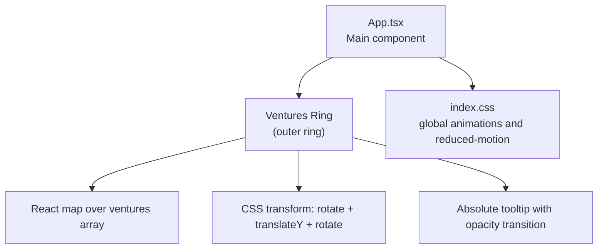
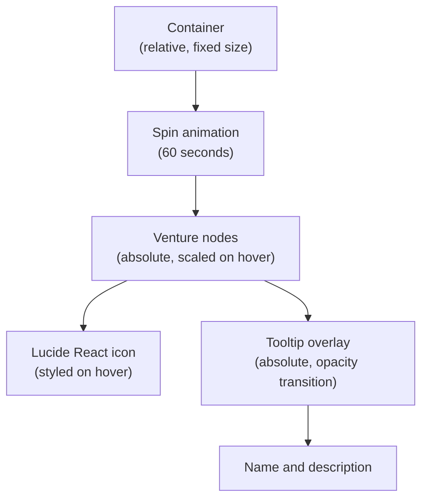
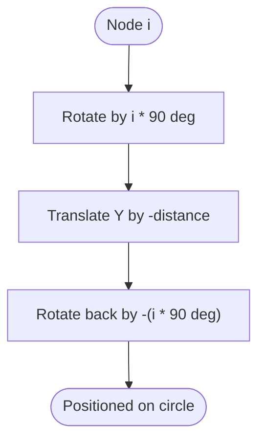
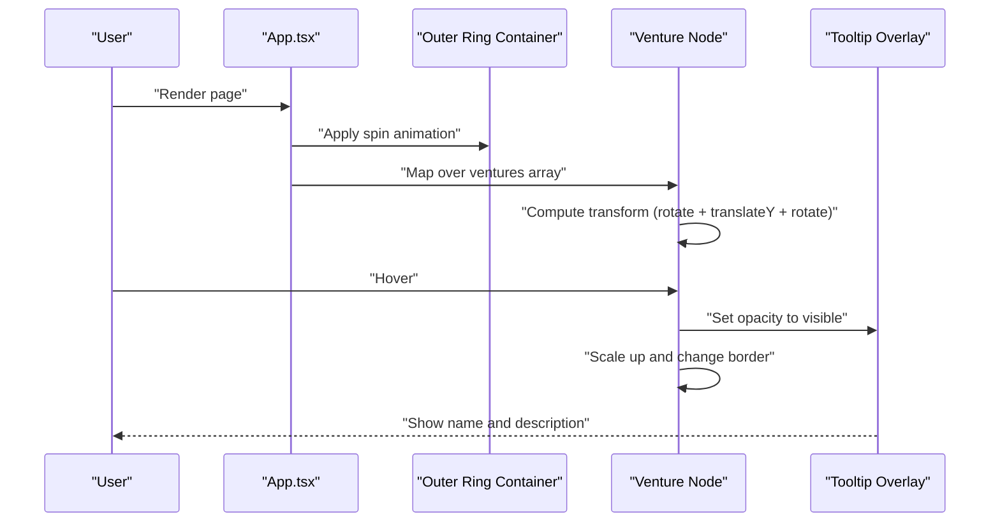
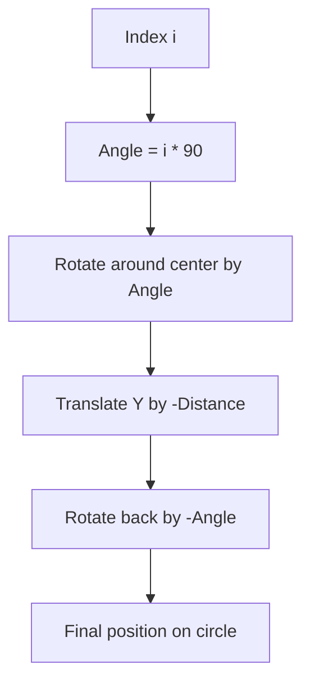
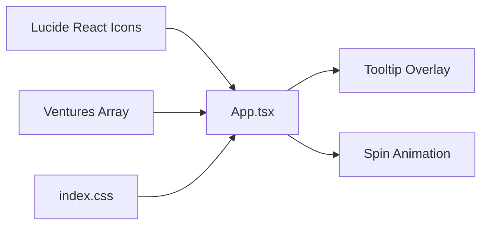

# Outer Ring: Ventures

<cite>
**Referenced Files in This Document**
- [App.tsx](file://src/App.tsx)
- [index.css](file://src/index.css)
</cite>

## Table of Contents
1. [Introduction](#introduction)
2. [Project Structure](#project-structure)
3. [Core Components](#core-components)
4. [Architecture Overview](#architecture-overview)
5. [Detailed Component Analysis](#detailed-component-analysis)
6. [Dependency Analysis](#dependency-analysis)
7. [Performance Considerations](#performance-considerations)
8. [Troubleshooting Guide](#troubleshooting-guide)
9. [Conclusion](#conclusion)

## Introduction
This document explains the outer ring visualization that displays AI ventures in a rotating circular layout. It covers how the ventures array is defined with name, icon, and description properties, how React’s map function renders each venture as an absolutely positioned element, and how CSS transforms are used to position items in a circle. It also documents the 60-second infinite spin animation, hover effects that scale the element and reveal tooltips, and the styling of venture icons using Lucide React components. Finally, it explains the transform calculation and how 90-degree increments position four ventures evenly, along with responsive design considerations and tooltip positioning.

## Project Structure
The outer ring is implemented within the main application component. The relevant HTML structure and styles are defined inline in the component, while global animations and reduced-motion preferences are handled in the stylesheet.

**Diagram sources**
- [App.tsx](file://src/App.tsx#L79-L97)
- [index.css](file://src/index.css#L181-L187)

**Section sources**
- [App.tsx](file://src/App.tsx#L79-L97)
- [index.css](file://src/index.css#L181-L187)

## Core Components
- Ventures array definition: Each venture object contains a name, an icon component, and a description. These properties are used to render the icon and tooltip content.
- Rendering loop: The component maps over the ventures array to render a circular ring of venture nodes.
- Positioning: CSS transforms compute each node’s position around a circle using rotate and translateY, with a compensating rotation to keep text upright.
- Animation: The entire ring rotates continuously at a fixed speed.
- Hover effects: On hover, nodes scale slightly and tooltips fade in.
- Tooltips: Absolute-positioned tooltips appear below each node with a smooth opacity transition.

**Section sources**
- [App.tsx](file://src/App.tsx#L43-L48)
- [App.tsx](file://src/App.tsx#L84-L96)

## Architecture Overview
The outer ring is composed of:
- A container that hosts the ring and applies a continuous spin animation.
- A series of child elements representing ventures, absolutely positioned and transformed to lie on a circular path.
- Tooltip overlays that appear on hover, using absolute positioning and opacity transitions.

**Diagram sources**
- [App.tsx](file://src/App.tsx#L79-L97)
- [App.tsx](file://src/App.tsx#L84-L96)

## Detailed Component Analysis

### Ventures Array Definition
- Purpose: Defines the set of AI ventures to display in the outer ring.
- Properties:
  - name: Used as the tooltip title and for accessibility.
  - icon: A Lucide React component used as the visual representation.
  - desc: A short description shown in the tooltip.
- Usage: Rendered via React’s map function to produce a list of nodes arranged in a circle.

**Section sources**
- [App.tsx](file://src/App.tsx#L43-L48)

### Rendering with React map
- The component iterates over the ventures array and renders a node for each item.
- Each node is absolutely positioned and styled with hover scaling and border changes.
- The tooltip is rendered as an absolute sibling element inside the node.

**Section sources**
- [App.tsx](file://src/App.tsx#L84-L96)

### CSS Transform Technique
- Calculation: The transform combines three steps to place each node on a circle:
  - Rotate around the center by i * 90 degrees.
  - Translate upward by a fixed distance along the Y-axis.
  - Rotate back by the same angle to keep the icon upright.
- Result: Four nodes are placed at 90-degree intervals around the circle, evenly spaced.

**Diagram sources**
- [App.tsx](file://src/App.tsx#L88-L90)

**Section sources**
- [App.tsx](file://src/App.tsx#L88-L90)

### Tooltip Positioning and Opacity Transition
- Absolute placement: The tooltip is absolutely positioned relative to its parent node and appears below it.
- Opacity transition: The tooltip starts invisible and fades in on hover using a class selector.
- Pointer events: The tooltip disables pointer events so hover interactions remain focused on the node.

**Section sources**
- [App.tsx](file://src/App.tsx#L86-L96)

### Hover Effects and Scaling
- Scale effect: On hover, the node scales slightly to emphasize selection.
- Border highlight: The border color changes to indicate interactivity.
- Icon color change: The Lucide icon color shifts on hover for visual feedback.

**Section sources**
- [App.tsx](file://src/App.tsx#L86-L92)

### Lucide React Icons
- Each venture’s icon is a Lucide React component passed from the imports.
- The icon is sized appropriately and recolored on hover for emphasis.

**Section sources**
- [App.tsx](file://src/App.tsx#L1-L17)
- [App.tsx](file://src/App.tsx#L91-L92)

### Animation: 60-Second Infinite Spin
- The outer ring container receives a continuous spin animation with a fixed duration.
- The animation runs infinitely and linearly, creating a smooth rotation effect.

**Section sources**
- [App.tsx](file://src/App.tsx#L82-L84)

### Responsive Design Considerations
- Fixed container size: The main container uses fixed width and height values, which keeps the circular layout consistent at a specific viewport size.
- Reduced motion: Global reduced-motion preference is respected via a media query that disables animations.

**Section sources**
- [App.tsx](file://src/App.tsx#L79-L84)
- [index.css](file://src/index.css#L181-L187)

## Architecture Overview

**Diagram sources**
- [App.tsx](file://src/App.tsx#L79-L97)
- [App.tsx](file://src/App.tsx#L84-L96)

## Detailed Component Analysis

### Transform Calculation Breakdown
- Inputs:
  - i: index of the current venture in the array.
  - Distance: Fixed vertical distance used to move nodes outward along the Y-axis.
- Steps:
  - Rotate around the center by i * 90 degrees.
  - Translate upward by the negative distance.
  - Rotate back by the same angle to maintain upright orientation.
- Outcome:
  - Four nodes are placed at 90-degree increments around the circle.

**Diagram sources**
- [App.tsx](file://src/App.tsx#L88-L90)

**Section sources**
- [App.tsx](file://src/App.tsx#L88-L90)

### Tooltip Behavior
- Absolute positioning ensures the tooltip does not affect the layout of surrounding nodes.
- Opacity transition provides a smooth fade-in/out effect on hover.
- Pointer events disabled on the tooltip prevent accidental hover loss.

**Section sources**
- [App.tsx](file://src/App.tsx#L92-L96)

### Hover Interaction Flow
- Hover triggers:
  - Node scale increase.
  - Border color change.
  - Tooltip opacity transition.
- Icon color changes to reinforce interactive state.

**Section sources**
- [App.tsx](file://src/App.tsx#L86-L92)

### Animation and Reduced Motion
- Continuous spin animation runs at a fixed speed for the outer ring.
- Reduced-motion preference disables animations globally to improve accessibility.

**Section sources**
- [App.tsx](file://src/App.tsx#L82-L84)
- [index.css](file://src/index.css#L181-L187)

## Dependency Analysis
- Component dependencies:
  - App.tsx depends on Lucide React icons for rendering venture visuals.
  - App.tsx defines the ventures array and uses it to drive rendering.
  - index.css provides global reduced-motion support and animation resets.
- Coupling:
  - The outer ring relies on fixed container dimensions and transform calculations.
  - Tooltip visibility is controlled by hover state on the node.

**Diagram sources**
- [App.tsx](file://src/App.tsx#L1-L17)
- [App.tsx](file://src/App.tsx#L43-L48)
- [App.tsx](file://src/App.tsx#L82-L96)
- [index.css](file://src/index.css#L181-L187)

**Section sources**
- [App.tsx](file://src/App.tsx#L1-L17)
- [App.tsx](file://src/App.tsx#L43-L48)
- [App.tsx](file://src/App.tsx#L82-L96)
- [index.css](file://src/index.css#L181-L187)

## Performance Considerations
- CSS transforms are hardware-accelerated and efficient for rotation and translation.
- Using a fixed container size avoids expensive recalculations during animation.
- Reduced-motion support prevents unnecessary animations for users who prefer minimal motion.

[No sources needed since this section provides general guidance]

## Troubleshooting Guide
- Tooltip not visible:
  - Ensure the parent node is hovered so the opacity transition activates.
  - Verify the tooltip is absolutely positioned and pointer-events are disabled.
- Icons not changing color:
  - Confirm the hover class is applied to the icon element.
- Nodes misaligned:
  - Check the transform calculation and ensure the vertical distance and angles match expectations.
- Animation not playing:
  - Verify the spin animation class is applied to the ring container.
  - Confirm reduced-motion preferences are not enabled.

**Section sources**
- [App.tsx](file://src/App.tsx#L86-L96)
- [App.tsx](file://src/App.tsx#L82-L84)
- [index.css](file://src/index.css#L181-L187)

## Conclusion
The outer ring visualization uses a clean combination of React rendering and CSS transforms to position AI ventures in a circular layout. The 60-second spin animation, hover scaling, and tooltip opacity transitions provide an engaging and accessible user experience. The Lucide React icons deliver consistent visual identity, and the reduced-motion support ensures inclusivity. The transform calculation positions four ventures evenly around the circle, while the absolute tooltip overlay maintains precise placement and readability.