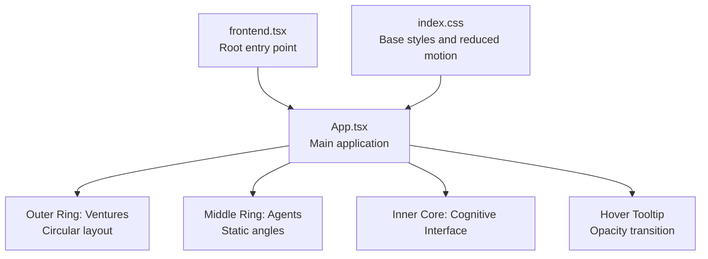
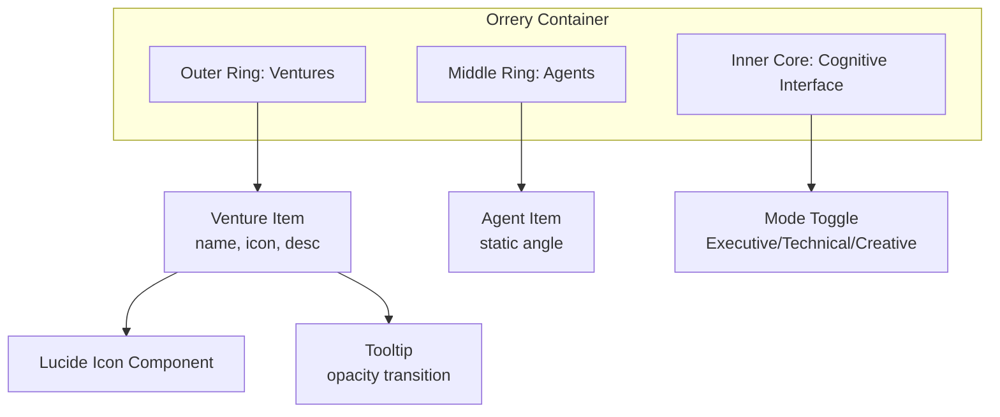
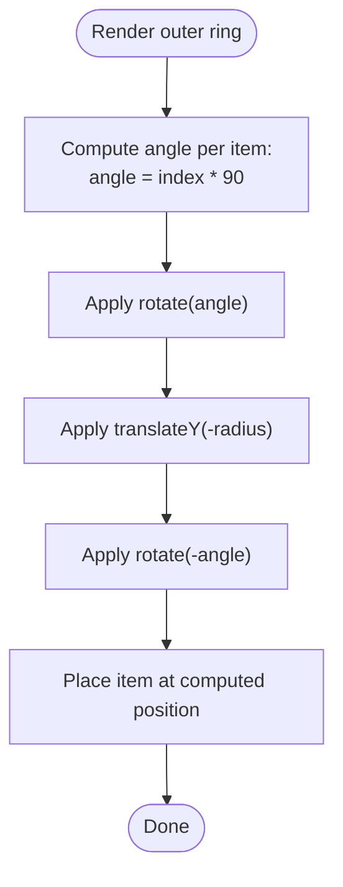
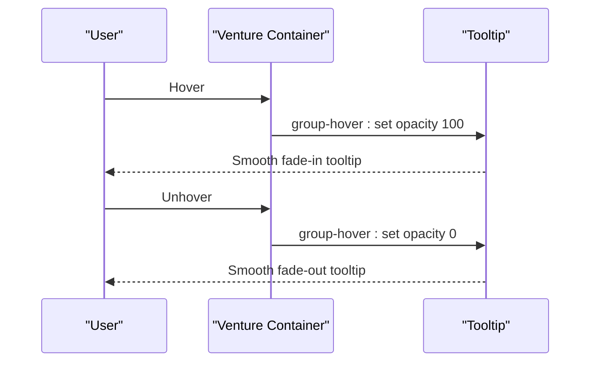
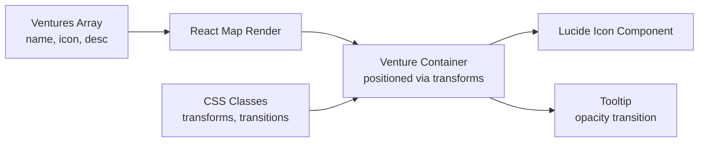

# Venture Management

<cite>
**Referenced Files in This Document**
- [App.tsx](file://src/App.tsx)
- [frontend.tsx](file://src/frontend.tsx)
- [index.css](file://src/index.css)
- [conceptual.md](file://AB/conceptual.md)
</cite>

## Table of Contents
1. [Introduction](#introduction)
2. [Project Structure](#project-structure)
3. [Core Components](#core-components)
4. [Architecture Overview](#architecture-overview)
5. [Detailed Component Analysis](#detailed-component-analysis)
6. [Dependency Analysis](#dependency-analysis)
7. [Performance Considerations](#performance-considerations)
8. [Troubleshooting Guide](#troubleshooting-guide)
9. [Conclusion](#conclusion)

## Introduction
This document explains the venture management system displayed in the outer ring of the orrery visualization. It covers the data model for ventures, how React’s map function renders them, the circular layout mechanics using CSS transforms, and the hover tooltip behavior with smooth opacity transitions. It also documents how Lucide icons are dynamically rendered based on venture data and outlines layout and responsive considerations for the outer ring elements.

## Project Structure
The venture management system resides in the main application component and is rendered alongside other orrery rings (middle ring for C-suite agents and inner core for cognitive interface). The application entry point wires the root element to the App component.

**Diagram sources**
- [frontend.tsx](file://src/frontend.tsx#L8-L26)
- [App.tsx](file://src/App.tsx#L50-L180)
- [index.css](file://src/index.css#L1-L40)

**Section sources**
- [frontend.tsx](file://src/frontend.tsx#L8-L26)
- [App.tsx](file://src/App.tsx#L50-L180)
- [index.css](file://src/index.css#L1-L40)

## Core Components
- Ventures data model: An array of objects with fields for name, icon, and desc. These define the outer ring items and their tooltips.
- Rendering with React map: The outer ring iterates over the ventures array to render a container per venture.
- Circular layout with CSS transforms: Each venture container is positioned using rotate and translateY transforms around a central axis.
- Hover tooltip: A sibling element inside each venture container shows the tooltip with opacity transitions.
- Dynamic Lucide icons: The icon field is a Lucide component type, which is invoked as a React component during rendering.

**Section sources**
- [App.tsx](file://src/App.tsx#L43-L48)
- [App.tsx](file://src/App.tsx#L84-L96)
- [App.tsx](file://src/App.tsx#L92-L95)

## Architecture Overview
The orrery visualization is composed of concentric rings. The outer ring displays ventures, the middle ring displays agents, and the inner core is the cognitive interface. The outer ring rotates independently to create a dynamic effect while maintaining fixed angular positions for each venture.

**Diagram sources**
- [App.tsx](file://src/App.tsx#L80-L141)
- [App.tsx](file://src/App.tsx#L43-L48)
- [App.tsx](file://src/App.tsx#L116-L141)

## Detailed Component Analysis

### Ventures Data Model and Rendering
- Data structure: Each venture object contains:
  - name: Used as the key and for display in the tooltip.
  - icon: A Lucide component type used to render the icon.
  - desc: Description shown in the tooltip.
- Rendering: The outer ring uses React’s map function to iterate over the ventures array and produce a container for each item. The key is derived from the venture’s name.

Implementation references:
- Ventures array definition: [App.tsx](file://src/App.tsx#L43-L48)
- Outer ring rendering loop: [App.tsx](file://src/App.tsx#L84-L96)

**Section sources**
- [App.tsx](file://src/App.tsx#L43-L48)
- [App.tsx](file://src/App.tsx#L84-L96)

### Circular Layout Mechanics with CSS Transforms
- Angular spacing: The outer ring places four ventures evenly around the circle at 90-degree intervals (360° / 4).
- Transform chain: Each venture container applies a composite transform:
  - Rotate by index times 90 degrees.
  - Translate along the Y-axis by a negative radius to move outward.
  - Rotate back by index times 90 degrees to keep the icon upright.
- Radius: The distance from the center is controlled by the translateY value, which determines how far the venture sits on the outer ring.

Transform calculation references:
- Index-based rotation: [App.tsx](file://src/App.tsx#L89)
- Composite transform: [App.tsx](file://src/App.tsx#L88-L90)

**Diagram sources**
- [App.tsx](file://src/App.tsx#L88-L90)

**Section sources**
- [App.tsx](file://src/App.tsx#L88-L90)

### Hover Tooltips with Smooth Opacity Transitions
- Trigger: The tooltip appears on hover of the venture container using a group hover selector.
- Behavior: The tooltip starts with opacity 0 and smoothly fades to 1 on hover.
- Positioning: The tooltip is absolutely positioned below the venture container and uses a transition for opacity.

Tooltip references:
- Tooltip container and opacity transition: [App.tsx](file://src/App.tsx#L92-L95)

**Diagram sources**
- [App.tsx](file://src/App.tsx#L87-L95)

**Section sources**
- [App.tsx](file://src/App.tsx#L87-L95)

### Dynamic Lucide Icons Based on Venture Data
- Icon resolution: The icon field holds a Lucide component type. During rendering, the component is invoked as a React element with size and color props.
- Rendering: The icon is placed inside the venture container and reacts to hover by changing color.

Icon rendering references:
- Icon component invocation: [App.tsx](file://src/App.tsx#L91)
- Hover color change: [App.tsx](file://src/App.tsx#L91)

**Section sources**
- [App.tsx](file://src/App.tsx#L91-L92)

### Layout Challenges and Responsive Behavior for the Outer Ring
- Fixed sizing: The orrery container uses fixed width and height values, which can cause overflow on smaller screens.
- Centering: The container is centered within the page, but the fixed dimensions may push content off-screen on narrow viewports.
- Motion preferences: Reduced motion media queries disable animations, which affects the spinning rings and tooltip transitions.

Responsive considerations:
- Fixed container size: [App.tsx](file://src/App.tsx#L80)
- Body-level min-width and centering: [index.css](file://src/index.css#L9-L15)
- Reduced motion handling: [index.css](file://src/index.css#L181-L188)

Recommended adjustments:
- Use viewport-relative units (vw/vh) for the orrery container to scale with screen size.
- Add media queries to adjust the container size and font/text sizes for small screens.
- Consider percentage-based margins and paddings to prevent overflow.
- Respect reduced motion by disabling or simplifying animations and transitions.

**Section sources**
- [App.tsx](file://src/App.tsx#L80)
- [index.css](file://src/index.css#L9-L15)
- [index.css](file://src/index.css#L181-L188)

## Dependency Analysis
The outer ring depends on:
- The ventures array for data.
- Lucide icons for rendering.
- Tailwind-like CSS classes for styling and transitions.
- CSS transforms for positioning.

**Diagram sources**
- [App.tsx](file://src/App.tsx#L43-L48)
- [App.tsx](file://src/App.tsx#L84-L96)
- [App.tsx](file://src/App.tsx#L91-L95)

**Section sources**
- [App.tsx](file://src/App.tsx#L43-L48)
- [App.tsx](file://src/App.tsx#L84-L96)
- [App.tsx](file://src/App.tsx#L91-L95)

## Performance Considerations
- Transform-based layout: Using CSS transforms for positioning avoids layout thrashing and is GPU-accelerated.
- Minimal reflows: The tooltip uses opacity transitions, which are generally performant.
- Animation toggles: Reduced motion media queries can disable animations to improve accessibility and performance on constrained devices.

[No sources needed since this section provides general guidance]

## Troubleshooting Guide
- Tooltip not appearing: Verify the group hover selector is applied to the parent container and the tooltip uses the matching hover class.
- Incorrect positioning: Confirm the transform order and radius value match the intended orbital radius.
- Icon not rendering: Ensure the icon field is a valid Lucide component type and passed as a React component during render.
- Overflow on small screens: Adjust the container size to viewport units and add media queries to prevent clipping.

**Section sources**
- [App.tsx](file://src/App.tsx#L87-L95)
- [App.tsx](file://src/App.tsx#L88-L90)
- [App.tsx](file://src/App.tsx#L91-L92)
- [index.css](file://src/index.css#L9-L15)

## Conclusion
The venture management system in the outer ring leverages a clean data model, React’s map function, and CSS transforms to achieve precise circular placement. Hover tooltips provide contextual information with smooth opacity transitions, and Lucide icons are dynamically rendered from the data. For broader compatibility, consider responsive sizing and reduced motion support to ensure the visualization remains accessible and visually coherent across devices.